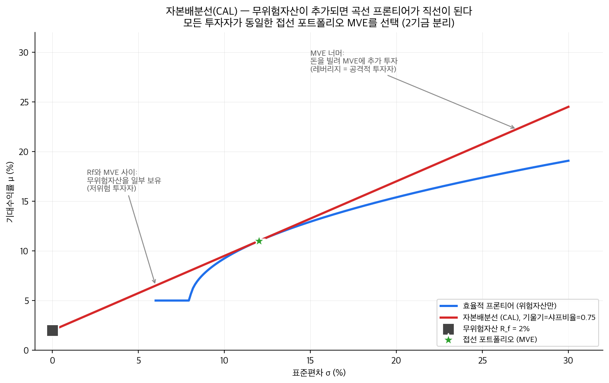

# 4단원: 무위험자산, 자본배분선(CAL), 샤프비율

---

## 1. 왜? — 이 단원을 배우는 이유

3단원에서 우리는 다음을 배웠다:
- 효용함수로 투자자의 행복(utility)을 수치화할 수 있다
- **효율적 프론티어**(주어진 위험 수준에서 최대 수익을 주는 포트폴리오들의 곡선; 가로축이 변동성($\sigma$), 세로축이 기대수익률($E[R]$)인 그래프에서 효율적 프론티어의 **상반부**는 위로 볼록한(concave) 곡선) 위의 무수한 포트폴리오 중, **무차별곡선**(같은 만족도를 주는 수익률-변동성 조합을 이은 곡선)과 효율적 프론티어의 접점이 그 투자자의 최적 포트폴리오다

하지만 3단원의 분석에는 전제가 하나 있었다:

> **"모든 자산이 위험자산(risky asset)이라고 가정했다."**

현실은 다르다. 현실에는 **국채(treasury bond)**처럼 수익률이 사실상 확정된 자산이 존재한다. 이런 자산을 **무위험자산(risk-free asset)**이라 부른다.

그렇다면 질문이 생긴다:

> **"무위험자산이 존재하면, 최적 포트폴리오를 찾는 방법이 어떻게 달라지는가?"**

결론부터 말하면 — 게임의 규칙이 근본적으로 바뀐다. 효율적 프론티어라는 "곡선"이 하나의 "직선"으로 대체되고, 모든 투자자가 동일한 위험자산 포트폴리오를 선택하게 된다. 어떻게 그런 일이 벌어지는지, 이 단원에서 단계별로 보겠다.

### 이 단원의 논리 흐름

```
┌─────────────────┐     ┌───────────────────┐     ┌──────────────────┐
│ 무위험자산의     │     │ 무위험+위험 조합의 │     │ 직선의 기울기    │
│ 변동성 σ = 0    │────→│ 투자가능집합 = 직선│────→│ = 샤프비율       │
└─────────────────┘     └───────────────────┘     └──────────────────┘
                                                          │
                                                          ▼
┌─────────────────┐     ┌───────────────────┐     ┌──────────────────┐
│ 2기금 분리:     │     │ 접선 포트폴리오   │     │ 기울기 최대화    │
│ 모든 투자자 동일│◀────│ = 샤프비율 최대   │◀────│ = 프론티어에     │
│ 위험자산 포트폴리오    │     └───────────────────┘     │   접하는 직선    │
└─────────────────┘                                └──────────────────┘
```

### 이 단원의 가정 (숨겨진 전제들)

이 단원의 모든 유도는 다음 가정 위에 성립한다. 각 가정이 깨지면 결론이 달라질 수 있다:

| # | 가정 | 의미 |
|---|------|------|
| 1 | 차입 이자율 = 대출 이자율 = $R_f$ | 돈을 빌리든 빌려주든 같은 이자율 |
| 2 | 무제한 차입 가능 | 얼마든지 돈을 빌릴 수 있다 |
| 3 | 공매도 허용 | 효율적 프론티어 자체가 공매도를 허용한 결과 |
| 4 | 평균-분산 프레임워크 | 투자자가 기대수익률과 분산만으로 판단 (이차효용함수 또는 수익률이 정규분포) |
| 5 | 단일 기간 모형 | 한 기간만 투자, 세금과 거래비용 없음 |

---

## 2. 핵심 개념

> **왜 이 개념들을 먼저 정의하는가?** — 수식 유도에 들어가기 전에, 등장하는 재료들의 정체를 명확히 해두어야 유도 과정이 자연스럽게 읽힌다. 여기서 정의하는 세 가지(무위험자산, 위험자산, 초과수익률)가 이 단원 전체의 기본 재료다.

### 2-1. 무위험자산(Risk-free Asset)이란?

> **수익률이 확정되어 있어서, 변동성(표준편차, $\sigma$ = 수익률이 평균에서 얼마나 흔들리는지 나타내는 수치)이 0인 자산**

| 속성 | 의미 |
|------|------|
| 손실 확률 = 0 | 투자하면 약속된 수익률을 반드시 받는다 |
| 변동성 = 0 | 수익률이 흔들리지 않는다. 내일도, 다음 달도 같은 수익률 |

> "Risk-free means probability of loss is zero."
> [강의 3/6, 31:49]

**왜 국채가 무위험인가?**

국채는 정부가 발행하는 **채권(bond)** — 쉽게 말해 "돈을 빌려주고 이자를 받는 증서"다. 예를 들어 미국 국채(US Treasury)를 사면, 미국 정부가 "**만기**(약속한 상환 기한)에 원금 + 이자를 돌려주겠다"고 약속한 것이다. 미국 정부가 파산할 확률은 사실상 0이므로, 이 약속은 거의 확실하게 지켜진다.

> "There is really essentially zero chance that solid governments go default."
> [강의 3/6, 32:35]

**일상 비유:** 무위험자산은 **원금보장 정기예금**과 비슷하다. 은행에 100만 원을 넣으면 1년 뒤에 101만 원(이자율 1%)을 확정적으로 받는다. 수익률이 흔들리지 않으니 "변동성 = 0"이다. 물론 엄밀히 말하면 은행도 파산할 수 있지만, 정부는 은행보다 훨씬 안전하다.

**그래프에서 무위험자산의 위치:**

무위험자산의 변동성은 0이므로, 수익률-변동성 그래프에서 **y축 위의 한 점**에 위치한다.

```
기대수익률(E[R])
    |
    |
 rf x ← 무위험자산 (변동성 = 0이므로 y축 위)
    |
    +---------------------------→ 변동성(σ)
```

여기서 $R_f$는 **무위험이자율(risk-free rate)**이다. 예를 들어 미국 국채 수익률이 연 1%라면 $R_f = 0.01$이다.

### 2-2. 위험자산(Risky Asset)

무위험자산의 반대다. 주식, 회사채, 부동산 — 수익률이 확정되지 않은 모든 자산이 위험자산이다. 수익률이 출렁이므로 변동성 > 0이다.

> "Any stock, any asset is by definition risky."
> [강의 3/6, 31:49]

### 2-3. 초과수익률(Excess Return)

위험자산의 기대수익률에서 무위험이자율을 뺀 값이다.

$$\text{초과수익률} = E[R] - R_f$$

**왜 초과수익률을 따로 정의하는가?** 투자자는 "아무것도 안 해도 $R_f$만큼은 벌 수 있다." 국채를 사면 되니까. 그러니 위험자산에 투자할 가치가 있으려면, $R_f$보다 **더 많이** 벌어야 한다. 그 "더 많이"가 초과수익률이다. 위험을 감수한 대가로 받는 추가 보상이다.

---

> **[2→3 전환]** 재료(무위험자산, 위험자산, 초과수익률)를 알았으니, 이제 이 둘을 수식으로 결합하면 어떤 일이 벌어지는지 보자.

## 3. 수식 유도 — 무위험 + 위험 조합이 직선이 되는 이유

> **왜 이 유도를 하는가?** — "무위험자산과 위험자산을 섞으면 투자 가능 집합이 곡선이 아니라 직선이 된다"는 이 단원의 핵심 결론을 수학적으로 증명하기 위해서다.

> 이 절의 수식은 **고등학교 1차함수($y = a + bx$) 수준**이다. 겁먹지 마시라. 분산 공식에 0을 대입하고 정리하면 직선이 나온다는 것이 전부다.

### 수식 유도 흐름

```
┌──────────────┐    ┌──────────────────┐    ┌───────────────────┐    ┌────────────────┐
│ 3-1. 설정    │───→│ 3-2. 기대수익률  │───→│ 3-3. 변동성 계산  │───→│ 3-4. 직선 도출 │
│ 두 자산 비율 │    │ = rf + y(E[Rp]-rf)│    │ σc = y·σp        │    │ y를 σc로 대체  │
└──────────────┘    └──────────────────┘    └───────────────────┘    └────────────────┘
```

### 3-1. 설정

투자자가 다음 두 자산에 투자한다고 하자:
- **무위험자산:** 수익률 $R_f$, 변동성 $\sigma_f = 0$
- **위험 포트폴리오 P:** 기대수익률 $E[R_P]$, 변동성 $\sigma_P > 0$

투자자는 자신의 돈 중 비율 $y$를 위험 포트폴리오 P에, 나머지 $(1-y)$를 무위험자산에 투자한다.

| 비율 | 투자처 |
|------|--------|
| $y$ | 위험 포트폴리오 P |
| $1 - y$ | 무위험자산 |

### 3-2. 조합 포트폴리오의 기대수익률

$$E[R_C] = (1 - y) \cdot R_f + y \cdot E[R_P]$$

정리하면:

$$E[R_C] = R_f + y \cdot (E[R_P] - R_f)$$

| 기호 | 의미 |
|------|------|
| $E[R_C]$ | 조합 포트폴리오 C의 기대수익률 |
| $R_f$ | 무위험이자율 (기본으로 받는 수익) |
| $y$ | 위험 포트폴리오에 넣는 비율 |
| $E[R_P] - R_f$ | 위험 포트폴리오의 초과수익률 |

**해석:** 기본적으로 $R_f$를 받고, 위험 포트폴리오에 넣는 비율 $y$만큼 초과수익률의 혜택을 추가로 받는다.

### 3-3. 조합 포트폴리오의 변동성

1단원에서 배운 포트폴리오 **분산**(전체 위험 = 각자의 위험 + 서로의 영향) 공식을 적용한다:

$$\sigma_C^2 = (1-y)^2 \cdot \sigma_f^2 + y^2 \cdot \sigma_P^2 + 2(1-y) \cdot y \cdot \text{Cov}(R_f, R_P)$$

여기서 $\text{Cov}$는 **공분산**(두 변수가 함께 움직이는 정도; 1단원 참조)이다.

여기서 핵심: **무위험자산의 변동성은 0**이다. $\sigma_f = 0$이므로:
- 첫 번째 항: $(1-y)^2 \cdot 0 = 0$ → 사라짐
- 세 번째 항의 공분산: $\text{Cov}(R_f, R_P) = 0$ → 사라짐

**$\text{Cov}(R_f, R_P) = 0$의 수학적 유도:**

공분산의 정의는 $\text{Cov}(X, Y) = E[(X - E[X])(Y - E[Y])]$이다. $R_f$는 **상수**(확정된 값)이므로 $R_f - E[R_f] = R_f - R_f = 0$이다. 따라서:

$$\text{Cov}(R_f, R_P) = E[(R_f - R_f)(R_P - E[R_P])] = E[0 \cdot (R_P - E[R_P])] = 0$$

상수는 흔들리지 않으므로, 다른 어떤 것과도 "함께 움직일" 수 없다.

따라서:

$$\sigma_C^2 = y^2 \cdot \sigma_P^2$$

양변에 제곱근을 취하면:

$$\sigma_C = \sqrt{y^2} \cdot \sigma_P = |y| \cdot \sigma_P$$

여기서 $|y|$는 절댓값이다. $y \geq 0$(위험자산에 양의 비율을 투자)인 경우 $|y| = y$이므로:

$$\sigma_C = y \cdot \sigma_P \quad (y \geq 0 \text{일 때})$$

> **참고:** $y < 0$이면 위험자산을 공매도하는 경우인데, 이때도 $\sigma_C = |y| \cdot \sigma_P$이므로 변동성은 항상 양수다. CAL이 $R_f$ 아래로도 연장되는 셈이다(각주 수준의 상황이므로 섹션 8에서 다시 언급한다).

**이 결과의 의미:** 조합 포트폴리오의 변동성은 위험 포트폴리오의 변동성에 비율 $y$를 곱한 것이다. $y = 0.5$면 변동성이 절반, $y = 1$이면 변동성이 그대로.

### 3-4. 직선 방정식 도출 — 핵심 단계

3-3에서 $\sigma_C = y \cdot \sigma_P$이므로, $y$를 $\sigma_C$로 표현할 수 있다:

$$y = \frac{\sigma_C}{\sigma_P}$$

이것을 3-2의 기대수익률 식에 대입한다:

$$E[R_C] = R_f + \frac{\sigma_C}{\sigma_P} \cdot (E[R_P] - R_f)$$

정리하면:

$$\boxed{E[R_C] = R_f + \frac{E[R_P] - R_f}{\sigma_P} \cdot \sigma_C}$$

> 핵심 결과이므로 박스로 강조했다.

**한 문장으로:** 위험을 한 단위($\sigma_C$를 1만큼) 늘릴 때마다, $\frac{E[R_P] - R_f}{\sigma_P}$만큼 추가 수익을 얻는다.

**이것은 $\sigma_C$에 대한 1차 함수(직선)다.** 중학교 때 배운 $y = b + mx$ 꼴과 정확히 같다.

| 직선의 요소 | 대응 |
|------------|------|
| y절편 | $R_f$ (무위험이자율) |
| 기울기 | $\dfrac{E[R_P] - R_f}{\sigma_P}$ |
| x변수 | $\sigma_C$ (조합 포트폴리오의 변동성) |

**왜 직선인가? — 직관적 이해:**

위험자산끼리 섞으면 상관계수 때문에 곡선이 된다. 하지만 무위험자산은 어떤 자산과도 상관계수가 0이고 변동성도 0이다. 이 특수한 성질 때문에 분산 공식의 교차항과 무위험 항이 전부 사라져서, 변동성이 $y$에 비례하는 단순한 관계만 남는다. 기대수익률도 $y$에 비례하고, 변동성도 $y$에 비례하므로, 두 관계를 결합하면 직선이 된다.

---

> **[3→4 전환]** 유도가 끝났다. 이제 이 직선에 이름을 붙이고, 직선의 기울기가 왜 중요한지를 짚어보자.

## 4. 자본배분선(Capital Allocation Line, CAL)

> **왜 CAL이라는 개념이 필요한가?** — 지금까지 유도한 직선이 투자자의 "선택지 메뉴"라는 의미를 담아 이름을 붙이는 것이다. CAL이라는 이름이 있어야 이후 논의("어떤 CAL이 최선인가?")가 가능해진다.

### 4-1. 정의

> **자본배분선(CAL)은 무위험자산과 하나의 위험 포트폴리오를 연결하는 직선으로, 이 조합으로 달성할 수 있는 모든 기대수익률-변동성 쌍을 나타낸다.**

방금 유도한 직선 $E[R_C] = R_f + \frac{E[R_P] - R_f}{\sigma_P} \cdot \sigma_C$가 바로 CAL이다.

**일상 비유:** CAL은 **물과 원액을 섞어 만들 수 있는 모든 농도의 음료**와 같다. 물(무위험자산)을 많이 넣으면 연하고(저위험·저수익), 원액(위험 포트폴리오)을 많이 넣으면 진하다(고위험·고수익). 물과 원액의 비율을 바꾸면 모든 중간 농도를 만들 수 있는데, 그 가능한 농도들의 집합이 CAL이다.



> **그림 읽는 법** — 곡선 프론티어(파랑)에 무위험자산($R_f$, σ=0인 검은 사각형)을 추가하면 효율 영역이 **빨간 직선(CAL)** 으로 바뀐다.
> - **초록 별 (MVE/접선 포트폴리오)**: CAL이 효율 프론티어에 정확히 접하는 점. 모든 투자자가 공통으로 선택하는 위험자산 묶음 (2기금 분리)
> - **CAL 위 Rf~MVE 구간**: 위험자산과 무위험자산을 섞은 저위험 투자
> - **CAL 위 MVE 너머**: 무위험이자율로 돈을 빌려 MVE에 추가 투자한 레버리지 영역
> - **CAL의 기울기 = 샤프비율**. 모든 투자자가 같은 직선을 따라가지만 점의 위치만 다르다

> "The set is defined by what's called capital allocation line."
> [강의 3/6, 32:35]

### 4-2. CAL이 의미하는 것

효율적 프론티어 위의 어떤 위험 포트폴리오 P를 하나 고르면, 무위험자산과 P를 잇는 직선(CAL)이 생긴다. 이 직선 위의 모든 점은 투자 가능한 포트폴리오다.

- $y = 0$: 돈 전부를 무위험자산에 → 수익률 $R_f$, 변동성 0
- $0 < y < 1$: 일부를 위험자산에, 나머지를 무위험자산에
- $y = 1$: 돈 전부를 위험 포트폴리오 P에 → 수익률 $E[R_P]$, 변동성 $\sigma_P$
- $y > 1$: **레버리지** — 돈을 빌려서 추가 투자 (섹션 8에서 설명)

---

> **[4→5 전환]** CAL은 직선이다. 직선에는 기울기가 있다. 이 기울기가 왜 중요한가? 기울기가 클수록 같은 위험에서 더 높은 수익을 주기 때문이다. 이 기울기에 이름이 있다 — 샤프비율이다.

## 5. 샤프비율(Sharpe Ratio) = CAL의 기울기

### 5-1. 정의

$$\boxed{\text{Sharpe Ratio} = \frac{E[R_P] - R_f}{\sigma_P}}$$

> 핵심 공식이므로 박스로 강조했다.

**한 문장으로:** 위험 한 단위당 얼마의 초과수익을 얻는가 — 이것이 샤프비율이다.

| 기호 | 의미 |
|------|------|
| $E[R_P] - R_f$ | 초과수익률 — 무위험 대비 얼마나 더 버는가 |
| $\sigma_P$ | 변동성 — 그 추가 수익을 얻기 위해 감수하는 위험 |

> "This is the risk-adjusted return. You have the return in excess of risk-free rate in the numerator divided by the volatility. So this is a measure that you want to maximize."
> [강의 3/6, 33:35]

**일상 비유:** 샤프비율은 **가성비**와 같다. 음식점에서 "맛(수익) 대비 가격(위험)"이 좋은 곳을 찾듯, 투자에서는 "초과수익 대비 위험"이 좋은 포트폴리오를 찾는다. 샤프비율이 높을수록 가성비가 좋다.

### 5-2. 왜 CAL의 기울기가 샤프비율인가?

3-4에서 유도한 CAL의 방정식을 다시 보자:

$$E[R_C] = R_f + \underbrace{\frac{E[R_P] - R_f}{\sigma_P}}_{\text{이 부분이 기울기}} \cdot \sigma_C$$

> (위 수식에서 중괄호 아래 표기는 "이 부분이 직선의 기울기"라는 뜻이다.)

이 직선의 기울기가 정확히 $\frac{E[R_P] - R_f}{\sigma_P}$, 즉 샤프비율이다.

> "Its slope is the Sharpe ratio."
> [강의 3/6, 34:40]

### 5-3. CAL 위의 모든 점은 동일한 샤프비율을 가진다 — 증명

이 성질은 매우 중요하다. CAL 위의 임의의 점 C(조합 포트폴리오)의 샤프비율을 계산해보자:

$$\frac{E[R_C] - R_f}{\sigma_C} = \frac{y(E[R_P] - R_f)}{y \cdot \sigma_P}$$

3-2에서 $E[R_C] - R_f = y(E[R_P] - R_f)$이고, 3-3에서 $\sigma_C = y \cdot \sigma_P$이므로, 위 식에서 **$y$가 약분**된다:

$$\frac{E[R_C] - R_f}{\sigma_C} = \frac{E[R_P] - R_f}{\sigma_P} = \text{(상수)}$$

따라서 $y$가 0.2든 0.5든 1.5든, CAL 위의 모든 점은 동일한 샤프비율을 가진다. 레버리지를 걸어도 샤프비율은 변하지 않는다. 변하는 것은 수익률과 변동성의 **절대 크기**뿐이다.

> **주의 — 흔한 오해 해소:** 강의 [3/6, 43:32]에서 "achieve higher Sharpe ratio"라는 표현이 나온다. 이것은 "레버리지로 샤프비율이 올라간다"는 뜻이 **아니다**. 문맥상 "다른 위험 포트폴리오(프론티어 위의 다른 점) 대비 접선 포트폴리오의 샤프비율이 높다"는 의미다. 같은 CAL 위에서 $y$를 바꿔도 샤프비율은 불변이다.

### 5-4. 왜 샤프비율을 최대화하는가?

여러 위험 포트폴리오 P 중 어떤 것을 골라 무위험자산과 조합할지가 문제다. 포트폴리오마다 다른 CAL(직선)이 만들어지는데, **기울기가 큰 직선일수록 같은 변동성에서 더 높은 수익률을 준다.**

```
기대수익률(E[R])
    |          / CAL₁ (기울기 큼 = 샤프비율 높음)
    |         /
    |        /  / CAL₂ (기울기 작음)
    |       / /
    |      //
    |     /
 rf x---+
    |
    +---------------------------→ 변동성(σ)
```

같은 변동성 수준에서 CAL₁이 CAL₂보다 위에 있다. 즉 같은 위험을 감수하면 더 많이 번다. 따라서 **기울기(= 샤프비율)가 최대인 CAL을 선택해야 한다.**

### 5-5. 구체적 숫자로 확인

$R_f = 1\%$, $E[R_P] = 8\%$, $\sigma_P = 15\%$일 때, 샤프비율 = $(8-1)/15 = 7/15 \approx 0.467$

$y$ 값을 바꿔가며 조합 포트폴리오를 계산해보자:

| $y$ | $E[R_C] = 1 + y \times 7$ | $\sigma_C = y \times 15$ | 샤프비율 = $(E[R_C]-1)/\sigma_C$ |
|-----|---------------------------|--------------------------|----------------------------------|
| 0 | 1.0% | 0% | — (무위험) |
| 0.5 | 4.5% | 7.5% | 3.5/7.5 = **0.467** |
| 1.0 | 8.0% | 15.0% | 7.0/15.0 = **0.467** |
| 1.5 | 11.5% | 22.5% | 10.5/22.5 = **0.467** |

**확인:** $y$가 달라져도 샤프비율은 0.467로 일정하다. 이것이 "CAL 위 모든 점의 샤프비율이 동일하다"는 의미다.

---

## 6. 접선 포트폴리오(Tangency Portfolio) — CAL이 효율적 프론티어에 접하는 점

### 6-1. 샤프비율 최대화 = 접선

무위험자산 점($R_f$, 0)에서 효율적 프론티어로 직선을 그을 수 있다. 직선이 프론티어를 관통하면 프론티어 바깥으로 나가게 되는데, 프론티어 바깥은 **달성 불가능한 포트폴리오**다(효율적 프론티어의 정의상, 그 위나 왼쪽에 있는 포트폴리오는 존재하지 않는다). 따라서 **프론티어에 딱 접하는 직선**이 가능한 직선 중 기울기가 가장 크다.

왜? 프론티어는 **위로 볼록한** 곡선이다(볼록의 의미: 곡선이 위를 향해 둥글게 휜 형태. "아래에서 보면 오목하다"와 같은 모양이다. 이 학습서에서는 "위로 볼록"으로 통일한다). 무위험자산 점에서 이 곡선으로 직선을 긋되 기울기를 점점 키우면, 어느 순간 곡선과 딱 한 점에서만 만나는 접선이 된다. 그 이상으로 기울기를 키우면 곡선과 만나지 않는다(도달 불가능). 따라서 접선이 **달성 가능한 최대 기울기**, 즉 **최대 샤프비율**을 준다.

> **기하학적 논증:** $R_f$ 점에서 출발하는 직선의 기울기를 $s$라 하자. $s$가 작으면 직선이 프론티어와 두 점에서 만나고, $s$를 키울수록 두 교점이 가까워지다가, $s = s^*$일 때 한 점에서만 접한다. $s > s^*$이면 교점이 없다(프론티어 바깥). 따라서 $s^* = \max s$ = 접선의 기울기 = 최대 샤프비율이다. (엄밀한 최적화 증명은 교재 Andrew Ang, *Asset Management* 참조.)

> "Of all the lines that intersect with this efficient frontier, the line that is tangent to this curve would maximize Sharpe ratio."
> [강의 3/6, 34:40]

### 6-2. 접선 포트폴리오란?

> **접선 포트폴리오(Tangency Portfolio)란, CAL이 효율적 프론티어에 접하는 그 점에 해당하는 위험자산 포트폴리오다.**

이 포트폴리오는 모든 위험자산 포트폴리오 중에서 **샤프비율이 최대**인 포트폴리오다.

**일상 비유:** 접선 포트폴리오는 **가성비 최고의 원액 레시피**다. 여러 종류의 원액(위험 포트폴리오) 중에서 물과 섞었을 때 가장 맛있는(= 가성비가 좋은) 원액이 바로 접선 포트폴리오다. 원액을 정했으면, 물과의 비율만 입맛에 맞게 조절하면 된다.

### 6-3. ASCII 그래프 — 전체 그림

```
기대수익률(E[R])
    |                          .
    |                       . ·  (레버리지 영역: y > 1)
    |                    .· ·
    |                 .·  ·
    |              .· ·          ← CAL (직선)
    |           .·  ·
    |         · T ← 접선 포트폴리오 (Tangency Portfolio)
    |        ·╱
    |      ·╱    ╲
    |     ╱        ╲
    |   ╱            ╲ ← 효율적 프론티어 (위로 볼록한 곡선)
    | ╱                ╲
 rf x                    ╲
    |
    +---------------------------→ 변동성(σ)
```

| 구성 요소 | 설명 |
|-----------|------|
| $R_f$ (y축 위의 점) | 무위험자산. 변동성 0, 수익률 $R_f$ |
| 곡선 | 효율적 프론티어. 위험자산만으로 달성 가능한 최선의 조합들 |
| 직선 (CAL) | 무위험자산과 접선 포트폴리오를 잇는 직선 |
| T (접점) | 접선 포트폴리오. 샤프비율이 최대인 위험자산 포트폴리오 |
| 접점 왼쪽 직선 | 무위험자산 + 위험자산 혼합 ($0 \leq y \leq 1$) |
| 접점 오른쪽 직선 | 레버리지 투자 ($y > 1$) |

**핵심 관찰:** CAL(직선)은 접점 T 부근에서 효율적 프론티어(곡선) **위에** 있다. 즉, 무위험자산이 존재하면, 효율적 프론티어 위의 대부분의 포트폴리오보다 CAL 위의 포트폴리오가 **더 좋다**(같은 위험에서 더 높은 수익). 직선이 곡선을 이긴다.

---

## 7. 2기금 분리(Two-Fund Separation)

### 7-1. 핵심 결론

> **무위험자산이 존재하면, 위험 선호도가 다른 모든 투자자가 동일한 위험자산 포트폴리오(접선 포트폴리오)를 선택한다.**

> "There's this famous two-fund separation here. So you can isolate the two and then combine and still get the best optimal portfolio."
> [강의 3/6, 31:49]

투자자마다 다른 것은 오직 **무위험자산과 접선 포트폴리오 사이의 배분 비율 $y$**뿐이다.

| 투자자 유형 | 위험회피계수 $\gamma$ (클수록 위험을 싫어함) | 배분 ($y$) | 위치 |
|------------|---------------------|-----------|------|
| 매우 보수적 | 큼 (예: $\gamma=10$) | $y$ 작음 (예: 0.2) | CAL의 왼쪽 아래 |
| 보통 | 중간 (예: $\gamma=5$) | $y$ 중간 (예: 0.6) | CAL의 중간 |
| 공격적 | 작음 (예: $\gamma=3$) | $y$ 큼 (예: 1.0) | 접선 포트폴리오 T |
| 매우 공격적 | 매우 작음 (예: $\gamma=2$) | $y > 1$ | CAL의 T 오른쪽 위 (레버리지) |

### 7-2. 왜 모든 투자자가 같은 위험자산 포트폴리오를 선택하는가?

3단원에서는 무위험자산이 없었다. 그때는 투자자마다 **효율적 프론티어 위의 서로 다른 점**을 최적 포트폴리오로 선택했다. 위험회피계수 $\gamma$가 다르면 무차별곡선(같은 만족도를 주는 (수익률, 변동성) 조합의 곡선)의 모양이 달라지고, 프론티어와의 접점도 달라지기 때문이다.

하지만 무위험자산이 생기면 상황이 바뀐다:
1. 최적의 CAL은 단 하나 — 효율적 프론티어에 접하는 직선
2. 이 CAL 위의 위험자산 포트폴리오는 단 하나 — 접선 포트폴리오 T
3. 투자자의 무차별곡선은 이 CAL과 접한다. 3단원에서 "투자가능집합과 무차별곡선의 접점 = 최적"이라고 배웠는데, 그 원리가 그대로 적용된다. 다만 투자가능집합이 곡선에서 **직선으로 바뀌었을 뿐**이다.
4. $\gamma$가 다르면 무차별곡선과 CAL의 접점 위치가 달라지지만, **모두 같은 직선(CAL) 위의 점**이다
5. CAL 위의 모든 점은 무위험자산과 접선 포트폴리오 T의 조합이다
6. 따라서 모든 투자자가 **같은 T**를 선택하고, $y$만 다르게 조절한다

### 7-3. γ별 최적점 — CAL 위의 위치

```
기대수익률(E[R])
    |
    |                              · γ=2 (가장 공격적, y>1, 레버리지)
    |                           ·
    |                        · γ=3 (공격적, y≈1.0)
    |                     ·
    |                  T ← 접선 포트폴리오
    |               ·
    |            · γ=5 (중간, y≈0.6)
    |         ·
    |      · γ=10 (보수적, y≈0.2)
    |   ·
 rf x
    |
    +---------------------------→ 변동성(σ)
```

$\gamma$가 작을수록(위험을 덜 싫어할수록) CAL 위에서 오른쪽 위로 가고, $\gamma$가 클수록 왼쪽 아래(안전한 쪽)에 위치한다. 하지만 **모두 같은 직선 위**다.

### 7-4. 3단원 vs 4단원 비교

```
[3단원: 무위험자산 없음]              [4단원: 무위험자산 있음]

기대수익률                            기대수익률
    |      γ=2                            |              · γ=2
    |     ·                               |           ·
    |    T₁  ← 각자 다른 접점             |        · γ=3
    |   ·                                 |     · T ← 모두 같은 접선
    |  T₂ ← γ=5의 접점                   |  ·  γ=5
    | ·                                   |· γ=10
    |╱  효율적 프론티어                rf x
    |                                     |   CAL (직선)
    +------------→ σ                      +------------→ σ

투자자마다 서로 다른 위험자산             모든 투자자가 동일한 위험자산
포트폴리오(T₁≠T₂) 선택                  포트폴리오(T) 선택, y만 다름
```

### 7-5. "2기금"이란?

이름의 의미: 투자자가 보유해야 할 "기금(fund)"이 딱 **2개**라는 뜻이다.
1. **기금 1:** 무위험자산 (국채)
2. **기금 2:** 접선 포트폴리오 T (최적 위험자산 포트폴리오)

이 두 기금만 있으면 어떤 위험 선호도의 투자자든 자신의 최적 포트폴리오를 구성할 수 있다.

**일상 비유:** 2기금 분리는 **요리 레시피**와 같다. 모든 사람이 같은 카레(접선 포트폴리오)를 만들되, 매운 정도(위험 노출)만 다르게 조절한다. 매운 걸 좋아하면 카레를 많이 넣고(높은 $y$), 싫어하면 밥(무위험자산)을 많이 넣는다($y$ 작음). 하지만 카레 레시피 자체는 누구에게나 동일하다.

---

### 7-6. 최적 $y^*$ 유도

CAL 위에서 효용을 최대화하는 문제를 풀자. 투자자의 효용은:

$$U(y) = R_f + y(E[R_P] - R_f) - \frac{\gamma}{2} y^2 \sigma_P^2$$

이것을 $y$에 대해 최대화한다.

**FOC(1계 조건):** $y$에 대해 미분하여 0으로 놓으면:

$$(E[R_P] - R_f) - \gamma y \sigma_P^2 = 0$$

$$\therefore \; y^* = \frac{E[R_P] - R_f}{\gamma \sigma_P^2}$$

**숫자 예시:** $R_f = 1\%$, $E[R_P] = 8\%$, $\sigma_P = 15\%$, $\gamma = 3$이라면:

$$y^* = \frac{0.08 - 0.01}{3 \times 0.15^2} = \frac{0.07}{3 \times 0.0225} = \frac{0.07}{0.0675} \approx 1.04$$

$y^* > 1$이므로 약간의 레버리지를 사용한다는 뜻이다. 즉, 이 투자자는 가진 돈의 104%를 위험 포트폴리오에 넣고, 4%만큼 무위험이자율로 빌린다.

---

> **[7→8 전환]** 지금까지 $y$는 0과 1 사이였다. 그런데 $y > 1$이면 어떻게 되는가? 즉, 가진 돈보다 더 많이 투자하면? 이것이 레버리지다.

## 8. 레버리지(Leverage)의 현실적 한계

> **왜 레버리지를 여기서 다루는가?** — CAL은 $y > 1$인 영역으로도 연장된다. 이론적으로 접선 포트폴리오를 넘어서 더 높은 수익-위험 조합을 달성할 수 있다. 하지만 현실에서는 제약이 있으므로, 이론과 현실의 간극을 짚어두어야 한다.

### 8-1. 레버리지란?

> **가진 돈보다 더 많이 투자하는 것. 돈을 빌려서 투자하는 것이다.**

$y > 1$이면 레버리지다. 예를 들어 $y = 1.5$라면:
- 내 돈의 150%를 위험 포트폴리오에 투자
- 부족한 50%는 무위험이자율($R_f$)로 돈을 빌림
- 무위험자산 비중: $1 - y = 1 - 1.5 = -0.5$ (음수 = 빌린 것)

**일상 비유:** 1억 원이 있는데, 은행에서 5천만 원을 추가로 빌려서 총 1억 5천만 원을 주식에 넣는 것이다. 주식이 오르면 이익이 1.5배로 커지지만, 떨어지면 손실도 1.5배가 된다. 게다가 빌린 돈에 대한 이자($R_f$)를 갚아야 한다.

### 8-2. 레버리지의 효과

레버리지($y > 1$)를 걸면:

$$E[R_C] = R_f + y \cdot (E[R_P] - R_f) \quad \text{→ } y\text{가 클수록 기대수익률 증가}$$
$$\sigma_C = y \cdot \sigma_P \quad \text{→ } y\text{가 클수록 변동성도 증가}$$

기대수익률과 변동성이 동시에 커지지만, **샤프비율은 변하지 않는다.** (5-3에서 증명했다.) CAL 위의 모든 점은 같은 샤프비율을 가진다.

> "To invest in points that are to the right of this point, what you do is you use leverage. You lever up."
> [강의 3/6, 35:36]

### 8-3. 레버리지 전후 포트폴리오 위치

```
기대수익률(E[R])
    |
    |                          L ← 레버리지 포트폴리오 (y=1.5)
    |                        ·
    |                      ·
    |                    ·
    |                  T ← 접선 포트폴리오 (y=1.0)
    |                ·
    |              ·
    |            ·
    |          B ← 균형 포트폴리오 (y=0.5)
    |        ·
    |      ·
    |    ·
 rf x  A ← 보수적 (y=0.2)
    |
    +---A---B-------T-------L---→ 변동성(σ)
```

| 포트폴리오 | $y$ | 설명 |
|-----------|-----|------|
| A | 0.2 | 돈의 20%만 위험자산에, 80%는 국채에 |
| B | 0.5 | 반반 |
| T | 1.0 | 전부 위험자산에 (접선 포트폴리오 그 자체) |
| L | 1.5 | 50% 빌려서 추가 투자 (레버리지) |

### 8-4. 현실적 한계

**차입 이자율 문제:** CAL이 접선 포트폴리오를 넘어서 오른쪽으로 연장되려면, 무위험이자율($R_f$)로 돈을 빌릴 수 있어야 한다. 현실에서는 개인이 무위험이자율로 빌리기 어렵고, 빌린 돈에는 더 높은 이자가 붙는다. 따라서 현실의 레버리지 CAL은 이론보다 기울기가 약간 낮을 수 있다. (이 단원의 가정 1번 "차입 이자율 = 대출 이자율"이 깨지는 것이다.)

**$y < 0$의 경우 (참고):** $y < 0$은 위험자산을 공매도(빌려서 파는 것)하는 경우다. 이때 $\sigma_C = |y| \cdot \sigma_P$이므로 변동성은 여전히 양수이지만, $E[R_C] = R_f + y(E[R_P] - R_f)$에서 $y < 0$이면 기대수익률이 $R_f$보다 **낮아진다**. 그래프에서 CAL이 $R_f$ 점 아래쪽으로 연장되는 셈이다. 현실에서는 공매도 제약이 있으므로 이 영역은 제한적이다.

---

## 9. 실증 근거 — 5개국 프론티어 + 무위험이자율 1% 예시

> **왜 실증이 필요한가?** — 지금까지는 이론이었다. 실제 데이터로 구성한 효율적 프론티어에 CAL을 적용하면 어떤 모습인지, 그리고 특정 $\gamma$ 값을 가진 투자자의 최적점이 어디인지를 확인해야 이론이 살아있는 의미를 갖는다.

강의에서는 미국, 일본, 영국, 독일, 프랑스 5개국 주식으로 구성한 효율적 프론티어를 사용했다.

> "So suppose this is the efficient frontier of the five countries. And the risk-free rate is maybe around 1%."
> [강의 3/6, 40:28]

```
기대수익률(E[R])
    |
    |                       .·
    |                    .·   ← CAL
    |                 .·
    |              .· T ← 접선 포트폴리오
    |           .·╱
    |        .·╱     ╲
    |      .╱          ╲
    |    ╱               ╲  ← 5개국 효율적 프론티어
    |  ╱                   ╲
 1% x                        ╲
    |
    +---------------------------→ 변동성(σ)
```

- **무위험이자율 1%**에서 출발하는 직선(CAL)이 5개국 프론티어에 접한다
- 접점 T가 최적 위험자산 포트폴리오
- 위험회피계수 $\gamma = 3$인 투자자의 무차별곡선(같은 만족도를 주는 (수익률, 변동성) 조합의 곡선)이 이 CAL과 접하는 점이 해당 투자자의 최적 포트폴리오

> "So this indifference curve shows one where gamma is equal to three. If your gamma risk aversion coefficient is three, and if you were to invest in those five countries, this theory tells you to construct a portfolio at this point."
> [강의 3/6, 42:31]

강의에서 $\gamma = 3$인 투자자의 최적점은 접선 포트폴리오 T의 오른쪽에 위치했다. 이는 **레버리지를 사용하는 것이 최적**이라는 뜻이다.

> "Note that this point does not lie on the efficient frontier. So as I said before, you lever up. You invest more than what you have. You borrow money and invest more to achieve higher Sharpe ratio."
> [강의 3/6, 43:32]

위 인용에서 "achieve higher Sharpe ratio"는 "프론티어 위의 다른 포트폴리오보다 접선 포트폴리오(와 그 CAL)의 샤프비율이 높다"는 뜻이다. 레버리지로 $y$를 키워도 같은 CAL 위이므로 샤프비율 자체는 변하지 않는다(5-3 참조).

---

## 10. 무위험자산 있음 vs 없음 — 비교 정리

| 항목 | 무위험자산 **없음** (3단원) | 무위험자산 **있음** (4단원) |
|------|--------------------------|--------------------------|
| 투자가능집합 형태 | 위로 볼록한 **곡선** (효율적 프론티어) | **직선** (CAL) |
| 최적 위험자산 포트폴리오 | 투자자마다 **다름** ($\gamma$에 따라 프론티어 위 다른 점) | 모든 투자자에게 **동일** (접선 포트폴리오 T) |
| 위험 조절 방법 | 프론티어 위에서 다른 점 선택 (자산 비중 변경) | CAL 위에서 $y$ 조절 (무위험자산과의 혼합 비율) |
| 레버리지 | 해당 없음 | $y > 1$로 가능 (차입 투자) |
| 핵심 지표 | 효용 극대화 | 샤프비율 극대화 → 효용 극대화 |

---

## 11. 전체 논리 요약 — "왜?" 연쇄

이 단원의 논리 흐름을 하나의 연쇄로 정리한다:

1. **왜 무위험자산이 중요한가?**
   → 변동성이 0이므로, 위험자산과 조합하면 분산 공식의 교차항이 사라져 직선이 된다.

2. **왜 직선인가?**
   → 무위험자산의 $\sigma_f = 0$과 $\text{Cov}(R_f, R_P) = 0$ 때문에 $\sigma_C = y \cdot \sigma_P$가 되고, $E[R_C]$도 $y$에 비례하므로, $y$를 소거하면 $\sigma_C$에 대한 1차식(직선)이 된다.

3. **왜 기울기가 샤프비율인가?**
   → 직선의 기울기 = $\frac{E[R_P] - R_f}{\sigma_P}$인데, 이것이 정확히 샤프비율의 정의이다.

4. **왜 기울기를 최대화하면 접선이 되는가?**
   → 무위험자산 점에서 효율적 프론티어(위로 볼록한 곡선)로 직선을 그을 때, 기울기를 최대한 키우면 곡선과 딱 한 점에서 만나는 접선이 된다. 더 키우면 만나지 않으므로, 접선이 도달 가능한 최대 기울기다.

5. **왜 모든 사람이 같은 접선 포트폴리오를 쓰는가?**
   → 최적 CAL(접선)은 단 하나이고, 그 위의 위험 포트폴리오도 단 하나(접선 포트폴리오 T)이다. 투자자마다 CAL 위에서 서로 다른 점을 고르지만, T 자체는 동일하다. 위험 선호도의 차이는 무위험자산과 T의 혼합 비율 $y$로만 반영된다. (2기금 분리)

---

## 12. 한 장 요약표

| 개념 | 핵심 수식 | 한 줄 직관 |
|------|-----------|-----------|
| 무위험자산 | $\sigma_f = 0$ | 수익률이 확정된 자산 (국채) |
| CAL (자본배분선) | $E[R_C] = R_f + \frac{E[R_P]-R_f}{\sigma_P} \cdot \sigma_C$ | 무위험 + 위험을 섞어 만드는 모든 조합의 직선 |
| 샤프비율 | $\frac{E[R_P]-R_f}{\sigma_P}$ | 위험 한 단위당 추가 수익 (= 가성비) |
| 접선 포트폴리오 | $\max \frac{E[R_P]-R_f}{\sigma_P}$ | 가성비 최고의 위험자산 조합 |
| 2기금 분리 | 기금1: $R_f$, 기금2: $T$ | 모든 투자자가 같은 위험자산을 쓰고 비율만 다름 |
| 레버리지 | $y > 1$ (차입 투자) | 빌려서 더 투자하면 수익·위험 모두 커지지만 샤프비율은 불변 |

---

## 13. 그래서? — 다음 단원으로의 연결

이 단원에서 우리는 다음을 알게 되었다:
- 무위험자산이 있으면 효율적 프론티어 대신 **CAL(직선)**이 투자 가능 집합의 상한이 된다
- 최적의 CAL은 효율적 프론티어에 **접하는 직선**이고, 그 기울기가 **샤프비율**이다
- 접선 포트폴리오가 **모든 투자자에게 동일한 최적 위험자산 포트폴리오**다 (2기금 분리)
- 레버리지를 통해 접선 포트폴리오 너머의 수익-위험 조합도 달성 가능하다

하지만 이 이론에는 큰 전제가 있다:

> **"평균과 공분산 행렬을 정확히 알고 있어야 한다."**

현실에서는 과거 데이터로 추정할 수밖에 없고, 추정 오차에 최적화 결과가 극히 민감하다. [강의 3/6, 49:44]

> **"접선 포트폴리오가 최적이라는 건 알겠다. 그런데 실제로 평균과 분산을 정확히 추정하기 어렵다면? 추정 오차에 덜 민감한 다른 전략은 없을까?"**

이 질문이 **5단원: 포트폴리오 전략들 (동일가중, 최소분산, 리스크패리티, 최대분산)**의 출발점이다. 이론적 최적해 대신, 현실에서 더 견고하게 작동하는 실용적 전략들을 살펴본다.

---

## 14. 셀프체크

1. **무위험자산과 위험자산의 조합이 곡선이 아닌 직선이 되는 이유는?** 수식의 어느 성질 때문인지 설명해보라. (힌트: $\sigma_f$와 $\text{Cov}(R_f, R_P)$)

2. **샤프비율이 0.5인 포트폴리오 A와 0.8인 포트폴리오 B가 있다. 무위험이자율이 2%일 때, 변동성 10%에서 각각의 CAL이 제공하는 기대수익률은?** (직접 계산해보라: $E[R] = R_f + \text{Sharpe} \times \sigma$)

3. **2기금 분리가 성립하려면 어떤 조건이 필요한가?** 무위험자산이 없으면 어떻게 되는가?

4. **레버리지($y > 1$)를 사용하면 샤프비율은 어떻게 변하는가?** 변하는가, 변하지 않는가? 왜? (힌트: 5-3의 증명을 떠올려보라)

5. **접선 포트폴리오가 이론적으로 최적인데, 현실에서 그대로 쓰기 어려운 이유는?** 강의에서 언급된 핵심 한계를 설명해보라.

6. **(계산) 위험회피계수 $\gamma = 5$이고, $R_f = 1\%$, $E[R_P] = 8\%$, $\sigma_P = 15\%$일 때 최적 $y^*$를 계산하라.** 이 투자자는 레버리지를 사용하는가? $\gamma = 3$인 경우와 비교하여 해석해보라.

---

## 출처 종합

| 내용 | 출처 |
|------|------|
| 무위험자산의 정의 | [강의 3/6, 31:49] |
| 국채가 무위험인 이유 | [강의 3/6, 32:35] |
| 자본배분선(CAL) 정의 | [강의 3/6, 32:35] |
| 샤프비율 = 위험조정수익률 | [강의 3/6, 33:35] |
| 접선 = 샤프비율 최대화 | [강의 3/6, 34:40] |
| 레버리지로 접선 포트폴리오 너머 달성 | [강의 3/6, 35:36] |
| CAL 방정식 | [강의 3/6, 39:31] |
| 5개국 프론티어 + 무위험이자율 1% 예시 | [강의 3/6, 40:28] |
| γ=3 투자자의 최적점 (레버리지 사용) | [강의 3/6, 42:31-43:32] |
| 2기금 분리 | [강의 3/6, 31:49] |
| 추정 오차에 대한 민감성 | [강의 3/6, 49:44] |
| 무위험자산 없는 경우의 최적 포트폴리오 | [강의 3/6, 27:20] |
| 교재 | Andrew Ang, *Asset Management* |
