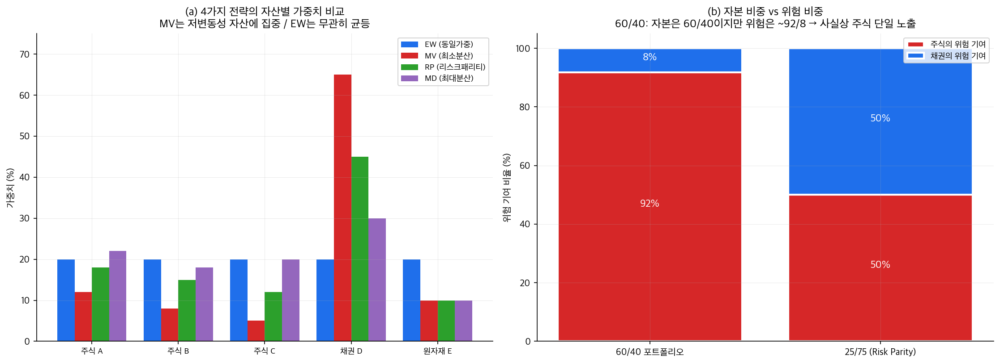
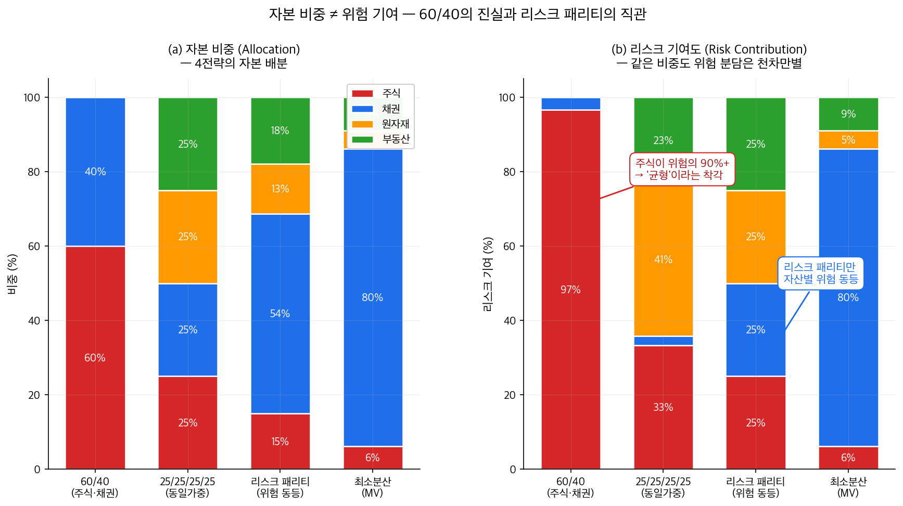

# 5단원: 포트폴리오 전략 — 동일가중, 최소분산, 리스크패리티, 최대분산

---

## 1. 왜? — 이 단원을 배우는 이유

4단원에서 우리는 다음을 배웠다:
- 무위험자산이 있으면 **자본배분선(CAL)**이라는 직선이 투자 가능 집합의 상한이 된다
- 효율적 프론티어에 접하는 **접선 포트폴리오**가 모든 투자자에게 동일한 최적 위험자산 포트폴리오다 (2기금 분리)
- 레버리지를 통해 접선 포트폴리오 너머의 수익-위험 조합도 달성 가능하다

이 접선 포트폴리오를 실제로 구성하려면, 최적화 문제의 **입력값** — 기대수익률 벡터 $\mu$와 공분산 행렬 $\Sigma$ — 을 알아야 한다. 문제는 이것이다:

> **"기대수익률과 공분산 행렬을 정확히 추정하기 극히 어렵고, 추정 오차에 결과가 극히 민감하다."**
> [강의 3/6, 49:44]

특히 **기대수익률 추정이 더 위험하다.** 기대수익률의 작은 오차가 최적 가중치를 극단적으로 바꿔버린다. [강의 3/6, 50:38]

> "The output of the optimization problem is extremely sensitive to input variations, the mean and the covariance matrix."
> [강의 3/6, 49:44]

그렇다면:

> **"추정 오차에 덜 민감한, 현실에서 더 견고하게 작동하는 실용적 전략은 없을까?"**

이것이 이 단원의 출발점이다. 이 단원에서는 실무에서 널리 사용되는 **4가지 포트폴리오 전략**을 살펴본다. 각각은 "무엇을 추정하고 무엇을 포기하는가"에서 차이가 난다.

---

## 2. 단원 흐름도

```
┌──────────────────┐     ┌──────────────────┐     ┌──────────────────┐
│ 4단원의 한계:    │     │ 전략 1:          │     │ 전략 2:          │
│ 평균·분산 추정이 │────→│ 동일가중         │────→│ 최소분산         │
│ 어렵고 민감하다  │     │ (아무것도 추정   │     │ (평균 추정을     │
│                  │     │  하지 않는다)    │     │  포기한다)       │
└──────────────────┘     └──────────────────┘     └──────────────────┘
                                                         │
                                                         ▼
┌──────────────────┐     ┌──────────────────┐     ┌──────────────────┐
│ 4전략 비교와     │     │ 전략 4:          │     │ 전략 3:          │
│ 실증 근거        │◀────│ 최대분산         │◀────│ 리스크패리티     │
│                  │     │ (분산비율을      │     │ (위험 기여도를   │
│                  │     │  최대화한다)     │     │  균등 배분한다)  │
└──────────────────┘     └──────────────────┘     └──────────────────┘
```

---

## 3. 이 단원의 숨겨진 가정들

이 단원의 4가지 전략은 다음 가정들 위에서 작동한다. 현실에서는 이 가정들이 완벽히 성립하지 않으므로, 실무에서는 추가적인 보정이 필요하다.

| 번호 | 가정 | 현실에서의 의미 |
|------|------|--------------|
| A1 | **거래비용 무시** | 리밸런싱이나 가중치 변경 시 발생하는 수수료, 매수-매도 스프레드를 0으로 가정한다. 실제로는 잦은 리밸런싱이 비용을 높인다 |
| A2 | **세금 무시** | 자산을 매도할 때 발생하는 양도소득세 등을 고려하지 않는다 |
| A3 | **$\Sigma$ 역행렬 존재** | 공분산 행렬이 역행렬을 갖는다고 가정한다. 이것은 데이터 기간(T)이 자산 수(N)보다 커야($T > N$) 보장된다. 자산 수가 매우 많으면 이 가정이 깨질 수 있다 |
| A4 | **$\Sigma$ 시간 불변** | 공분산 행렬이 시간에 따라 변하지 않는다고 가정한다. 현실에서는 시장 상황에 따라 상관관계가 바뀐다 (위기 시 상관관계가 일제히 높아지는 현상 등) |
| A5 | **레버리지 비용 = 무위험 이자율($R_f$)** | 돈을 빌릴 때 무위험 이자율로 빌릴 수 있다고 가정한다. 현실에서는 더 높은 이자를 지불해야 한다 |
| A6 | **리밸런싱 빈도 영향 무시** | 이론에서는 연속 리밸런싱을 가정하지만, 실무에서는 월별·분기별로 하며 빈도에 따라 성과가 달라진다 |
| A7 | **2자산 상관계수 무관 성질은 N>2에서 비성립** | 7-6절에서 두 자산의 리스크패리티 가중치가 상관계수에 무관하다는 결과를 보겠지만, 이 성질은 3개 이상 자산에서는 성립하지 않는다 |

---

## 4. 사전 준비 — 기호 정리

수식에 들어가기 전에, 이 단원에서 반복적으로 등장하는 기호들을 정리한다. 이 표를 옆에 두고 참조하면 된다.

> **기호 안내:** 이 단원에서는 가중치를 $\mathbf{x}$로 표기한다 (이전 단원의 $\mathbf{w}$에 해당).

| 기호 | 읽는 법 | 의미 |
|------|---------|------|
| $N$ | "엔" | 투자 가능한 자산의 총 개수 |
| $\sigma_i$ | "시그마 아이" | 자산 $i$의 변동성(표준편차; 수익률이 평균에서 얼마나 흔들리는지 나타내는 수치) |
| $\boldsymbol{\sigma}$ | "시그마 벡터" | 모든 자산의 변동성을 한 줄로 나열한 벡터: $(\sigma_1, \sigma_2, \ldots, \sigma_N)$ |
| $\Sigma$ | "대문자 시그마" | 공분산 행렬(자산들 사이의 함께-움직임 정보를 담은 표) |
| $\sigma_{ij}$ | "시그마 아이제이" | 자산 $i$와 자산 $j$의 공분산 = $\rho_{ij} \sigma_i \sigma_j$ |
| $\rho_{ij}$ | "로 아이제이" | 자산 $i$와 $j$의 상관계수($-1$과 $1$ 사이; 1이면 완전히 같은 방향으로 움직임) |
| $x_i$ | "엑스 아이" | 포트폴리오에서 자산 $i$에 투자하는 비율(가중치) |
| $\mathbf{x}$ | "엑스 벡터" | 가중치 벡터: $(x_1, x_2, \ldots, x_N)$ |
| $\sigma(\mathbf{x})$ | "시그마 오브 엑스" | 가중치 $\mathbf{x}$를 사용한 포트폴리오의 변동성 = $\sqrt{\mathbf{x}^T \Sigma \mathbf{x}}$ |
| $\mathbf{1}$ | "일 벡터" | 모든 원소가 1인 벡터: $(1, 1, \ldots, 1)$ |

> **포트폴리오 분산 공식 복습:** 포트폴리오 수익률의 분산(전체 위험의 제곱)은 다음과 같다:
>
> $$\text{Var}(\mathbf{x}^T \mathbf{r}) = \mathbf{x}^T \Sigma \mathbf{x} = \sum_{i=1}^{N} \sum_{j=1}^{N} x_i x_j \sigma_{ij}$$
>
> 이것은 "모든 자산 쌍 $(i, j)$에 대해, 두 자산의 가중치를 곱하고($x_i x_j$), 공분산을 곱한 것($\sigma_{ij}$)을 전부 더한 값"이다. 포트폴리오 변동성은 이것의 제곱근이다:
>
> $$\sigma(\mathbf{x}) = \sqrt{\mathbf{x}^T \Sigma \mathbf{x}}$$
>
> [강의 3/11, 02:50–03:35]

### 핵심 용어 미리 정의

이 단원에서 반복적으로 등장하는 핵심 용어들을 먼저 정의한다. 각 절에서 다시 설명하겠지만, 처음 만날 때 당황하지 않도록 여기서 한번 훑어두자.

> **편미분(partial derivative)이란?** 여러 변수가 있는 함수에서 **하나의 변수만 변화시키고 나머지는 고정한 채** 변화율을 구하는 것이다. 비유하면, 오디오 믹서에 음량·저음·고음 손잡이가 여러 개 있을 때, **다른 손잡이는 그대로 두고 하나만 돌려보면서** "이 손잡이를 돌리면 소리가 얼마나 변하는가?"를 측정하는 것이다. 수식으로는 $\frac{\partial f}{\partial x_i}$라고 쓰며, "$f$를 $x_i$에 대해 편미분한다"고 읽는다.

> **역행렬(inverse matrix, $\Sigma^{-1}$)이란?** 일반적인 숫자에서 $5$의 역수가 $1/5$인 것처럼, 행렬에도 "나눗셈에 해당하는 역할"을 하는 행렬이 있다. $\Sigma \mathbf{x} = \mathbf{b}$라는 방정식의 양변에 $\Sigma^{-1}$을 곱하면 $\mathbf{x} = \Sigma^{-1} \mathbf{b}$처럼 $\mathbf{x}$만 깔끔하게 남는다. 즉, **"나눗셈의 행렬 버전"**이다.

> **샤프비율(Sharpe ratio)이란?** 위험 한 단위당 얼마나 많은 초과수익(무위험 이자율을 뺀 수익)을 얻는지를 나타내는 비율이다. 수식으로는:
>
> $$\text{Sharpe ratio} = \frac{E[R_p] - R_f}{\sigma_p}$$
>
> 여기서 $E[R_p]$는 포트폴리오 기대수익률, $R_f$는 무위험 이자율, $\sigma_p$는 포트폴리오 변동성이다. 비유하면, "연비"와 같다. 같은 양의 기름(위험)으로 더 먼 거리(수익)를 달릴수록 연비가 좋듯이, 같은 위험으로 더 많은 수익을 낼수록 샤프비율이 높다. [강의 3/6, 33:35]

> **한계위험기여도(MRC, Marginal Risk Contribution)란?** 어떤 자산의 가중치를 아주 조금 늘렸을 때, 포트폴리오 전체 변동성이 얼마나 변하는지를 나타내는 값이다. 비유하면, **수도꼭지를 한 바퀴 더 틀었을 때 물줄기의 세기가 얼마나 변하는지**와 같다. 수식은 7-5절에서 유도한다.

> **총 위험기여도(RC, Risk Contribution)란?** 한계위험기여도(MRC)에 현재 가중치를 곱한 것으로, **해당 자산이 포트폴리오 전체 위험에 실제로 기여하는 양**이다. 수도꼭지 비유를 이어가면, MRC가 "한 바퀴 더 틀 때의 변화"라면, RC는 **"이 꼭지가 현재 열려 있는 만큼이 전체 수압에 기여하는 양"**이다.

> **효율적 프론티어(efficient frontier) 리마인드:** 2단원에서 배운 개념이다. 주어진 위험 수준에서 최대 수익률을 주는 포트폴리오들을 이은 곡선이다. 이 곡선 아래에 있는 포트폴리오는 "같은 위험으로 더 높은 수익을 얻을 수 있으므로 비효율적"이다. 이 단원의 4가지 전략은 모두 효율적 프론티어 위 또는 그 근처에 위치한다.

> **합성함수의 미분(chain rule)이란?** "함수 속에 함수가 있을 때" 바깥 함수와 안쪽 함수를 각각 미분해서 곱하는 규칙이다. 예를 들어 $y = \sqrt{f(x)}$를 미분하려면: (1) 바깥 함수 $\sqrt{\cdot}$를 미분 → $\frac{1}{2\sqrt{f(x)}}$, (2) 안쪽 함수 $f(x)$를 미분 → $f'(x)$, (3) 둘을 곱한다 → $\frac{f'(x)}{2\sqrt{f(x)}}$. 이 규칙은 7-5절에서 포트폴리오 변동성을 편미분할 때 사용한다.

---

## 5. 전략 1: 동일가중 포트폴리오 (Equal-Weighted, EW)

### 5-1. 비유와 직관

> **왜 이 전략을 먼저 다루는가?** — 4가지 전략 중 가장 단순하기 때문이다. "어떤 추정도 하지 않는다"는 극단적 선택이 의외로 잘 작동하는 이유를 먼저 이해하면, 나머지 전략이 "무엇을 추정하고 무엇을 포기하는지"를 더 명확히 볼 수 있다.

**비유:** 뷔페에 10가지 음식이 있는데, 어떤 음식이 맛있을지 전혀 모른다고 하자. 이때 "각 음식을 1/10씩 골고루 담는" 전략이 동일가중 포트폴리오다. 어떤 음식이 맛없을 수 있지만, 최소한 "한 가지에 몰빵했는데 그게 최악"이라는 상황은 피할 수 있다.

### 5-2. 수식

$$x_i = \frac{1}{N} \quad \text{모든 } i = 1, 2, \ldots, N$$

$N$개의 자산에 $1/N$씩 동일하게 투자한다. 끝이다. 기대수익률도, 공분산도, 아무것도 추정할 필요가 없다.

### 5-3. 왜 이것이 의외로 잘 작동하는가?

> "It turns out that this outperforms most of the sophisticated portfolio strategies because other strategies they have to estimate something and that will probably be incorrect."
> [강의 3/11, 05:01]

다른 전략들은 기대수익률이나 공분산 행렬을 추정해야 한다. 그런데 추정이 틀리면, 아무리 정교한 최적화라도 결과가 엉뚱해진다. 동일가중 포트폴리오는 추정 자체를 하지 않으므로, "잘못된 추정에서 오는 오류", 즉 **추정 오류(estimation error)**가 원천적으로 없다.

> **단서:** 여기서 "추정 오류가 없다"는 것은 $\mu$나 $\Sigma$의 추정에서 비롯되는 오류가 없다는 뜻이다. 그러나 **모형 오류(model error)** — 예를 들어 "위험이 다른 자산에 같은 가중치를 주는 것이 과연 최적인가?"라는 모형 자체의 한계 — 는 여전히 존재한다. 추정을 안 해서 추정 오류는 없지만, 모형이 현실을 완벽히 반영하지는 않는다.

이것은 마치 **날씨를 예측하지 못할 때, 우산과 선글라스를 둘 다 챙기는 것**과 같다. 최적은 아닐 수 있지만, 어떤 날씨에도 완전히 무방비는 아니다.

### 5-4. 장단점

| 장점 | 단점 |
|------|------|
| 추정 오류 없음 — 입력값이 없으므로 | 자산별 위험 차이를 무시 — 위험한 자산에도 같은 비중 |
| 구현이 극히 단순 | 변동성 축소 효과가 가장 작음 |
| 가중치 분산(weight diversification)이 최대 | 기대수익률 정보를 전혀 활용하지 못함 |

> **가중치 분산(weight diversification)이란?** 가중치가 얼마나 골고루 퍼져 있는지를 나타내는 척도다. 모든 자산에 동일한 가중치를 주면 가중치 분산이 최대(= 1.0)가 된다. [강의 3/11, 01:05:39]

---

> **[5→6 전환]** 동일가중은 아무것도 추정하지 않는다. 반대쪽 극단은 어떨까? "기대수익률 추정은 포기하되, 공분산만으로 분산을 줄이자"는 전략이 바로 최소분산이다.

---

## 6. 전략 2: 최소분산 포트폴리오 (Minimum Variance, MV)

### 6-1. 비유와 직관

**비유:** 내일 날씨가 좋을지 나쁠지 모르겠다(기대수익률을 모른다). 하지만 "일기예보의 흔들림 정도"(분산)는 대략 알 수 있다. 그렇다면 기대 날씨를 예측하려는 시도를 포기하고, 그냥 **기온 변화가 가장 적은 지역**으로 여행하자는 전략이다.

### 6-2. 왜 평균 추정을 포기하는가?

4단원 끝에서 보았듯이, 최적화 결과는 기대수익률($\mu$) 추정 오차에 **더** 민감하고, 공분산($\Sigma$) 추정 오차에는 **상대적으로 덜** 민감하다.

> "The effect of incorrect sigma has less effect on the portfolio performance than the mis-estimation of the mean."
> [강의 3/11, 06:01]

그래서 많은 실무자들이 "차라리 기대수익률을 아예 빼버리고, 분산만 최소화하자"라고 판단한다. 이것이 최소분산 포트폴리오다.

### 6-3. 2단원의 평균-분산 최적화와 무엇이 다른가?

2단원에서 효율적 프론티어를 구할 때는 **두 개의 제약**이 있었다:
1. 가중치 합 = 1 ($\mathbf{x}^T \mathbf{1} = 1$)
2. 기대수익률이 목표치 이상 ($\mathbf{x}^T \mu \geq \mu_{\text{target}}$)

최소분산 포트폴리오에서는 **두 번째 제약(기대수익률 목표)을 완전히 제거**한다. 제약이 하나뿐이므로, 효율적 프론티어 위의 특정 한 점이 아니라 **프론티어의 가장 왼쪽 끝**(변동성이 가장 작은 점)을 바로 찾는 것이다.

### 6-4. 수식 유도 — 왜 이 수식인가?

> 겁먹지 마시라. 이 유도의 핵심은 "분산을 가중치로 미분해서 0으로 놓으면 최적 가중치가 나온다"는 것이다. 미분이 낯설면, "내리막길의 가장 낮은 점을 찾는 것"이라고 생각하면 된다.

**목표:** 포트폴리오 분산을 최소화하는 가중치 $\mathbf{x}$를 찾는다.

**최적화 문제:**

$$\min_{\mathbf{x}} \quad \mathbf{x}^T \Sigma \mathbf{x}$$
$$\text{s.t.} \quad \mathbf{x}^T \mathbf{1} = 1 \quad (\text{가중치 합} = 1)$$

| 기호 | 의미 |
|------|------|
| $\mathbf{x}^T \Sigma \mathbf{x}$ | 포트폴리오 분산 (최소화할 대상) |
| $\mathbf{x}^T \mathbf{1} = 1$ | 모든 가중치의 합이 1 (돈을 전부 투자) |

**왜 기대수익률 제약이 없는가?** 평균-분산 최적화에서는 "기대수익률이 최소 얼마 이상"이라는 제약이 있었다. 여기서는 그 제약을 **완전히 제거**했다. 기대수익률에 대한 "완벽한 무시(perfect disregard for the mean)"이다. [강의 3/6, 50:38]

**유도의 전체 흐름을 먼저 보자:**

```
┌─────────────────────────┐
│ 단계 1: 라그랑주 함수   │
│ 제약을 목적함수에 녹인다│
└───────────┬─────────────┘
            ▼
┌─────────────────────────┐
│ 단계 2: 편미분 = 0      │
│ 최솟값 조건을 세운다    │
└───────────┬─────────────┘
            ▼
┌─────────────────────────┐
│ 단계 3: 정리            │
│ Σx = 상수 × 1 벡터     │
│ → 모든 자산의 정규화된  │
│   MRC가 동일하다!       │
└───────────┬─────────────┘
            ▼
┌─────────────────────────┐
│ 단계 4: 역행렬로 x 분리 │
│ x = (λ/2) Σ⁻¹ 1        │
└───────────┬─────────────┘
            ▼
┌─────────────────────────┐
│ 단계 5: 제약으로 λ 결정 │
│ 가중치 합 = 1 대입      │
└───────────┬─────────────┘
            ▼
┌─────────────────────────┐
│ 단계 6: 최종 해         │
│ x^MV = Σ⁻¹1 / 1'Σ⁻¹1  │
└─────────────────────────┘
```

**풀이 — 라그랑주 승수법:**

> **라그랑주 승수법(Lagrangian method)이란?** "제약 조건이 있는 최적화 문제"를 "제약 조건이 없는 문제"로 바꿔주는 수학적 기법이다. 제약 조건에 "벌금 계수" $\lambda$(람다, 라그랑주 승수)를 곱해서 목적 함수에 더한다. 비유하면, **다이어트 중 칼로리 제한을 넘기면 벌금을 매기는 것**과 같다. 벌금이 있으면 자연스럽게 제한을 지키게 되듯이, $\lambda$가 제약 조건을 자동으로 만족하도록 유도한다. [강의 3/11, 58:14]

**단계 1:** 라그랑주 함수를 세운다.

$$L = \mathbf{x}^T \Sigma \mathbf{x} - \lambda (\mathbf{x}^T \mathbf{1} - 1)$$

여기서 $\lambda$는 라그랑주 승수다. $\mathbf{x}^T \mathbf{1} - 1 = 0$이라는 제약을 "목적 함수에 녹여넣은" 형태다.

**단계 2:** $\mathbf{x}$에 대해 편미분하고 0으로 놓는다. (4절에서 정의했듯이, 편미분이란 **다른 변수는 고정하고 하나만 변화시키는 미분**이다. 여기서는 여러 가중치 $x_1, x_2, \ldots$ 중 각각을 하나씩 변화시키며 미분한다.)

$$\frac{\partial L}{\partial \mathbf{x}} = 2 \Sigma \mathbf{x} - \lambda \mathbf{1} = \mathbf{0}$$

**왜 $2 \Sigma \mathbf{x}$인가?** $\mathbf{x}^T \Sigma \mathbf{x}$를 $\mathbf{x}$로 미분하면 $2 \Sigma \mathbf{x}$가 된다. 이것은 일변수에서 $ax^2$을 $x$로 미분하면 $2ax$가 되는 것과 같은 원리다.

**단계 3:** 정리하면:

$$2 \Sigma \mathbf{x} = \lambda \mathbf{1}$$

$$\Sigma \mathbf{x} = \frac{\lambda}{2} \mathbf{1}$$

이 식의 의미를 뜯어보자. 왼쪽 $\Sigma \mathbf{x}$는 벡터인데, 그 $i$번째 원소를 적어보면:

$$(\Sigma \mathbf{x})_i = \sum_{j=1}^{N} \sigma_{ij} x_j$$

이것은 자산 $i$가 포트폴리오 전체 위험에 기여하는 정도와 관련이 깊다. (이 값을 포트폴리오 변동성 $\sigma(\mathbf{x})$로 나누면 7-5절에서 정의할 **한계위험기여도(MRC)**가 된다.)

> **여기까지 정리하면:** $(\Sigma \mathbf{x})_i$는 "$x_i$가 들어 있는 공분산 항들을 모두 합친 것"이다. 이 값이 크면 자산 $i$가 전체 위험에 많이 기여하고, 작으면 적게 기여한다.

그런데 오른쪽이 $\frac{\lambda}{2} \mathbf{1}$, 즉 모든 원소가 같은 상수 $\frac{\lambda}{2}$인 벡터다. 이것은:

> **최소분산 포트폴리오에서는 모든 자산의 (정규화된) 한계위험기여도가 동일하다.**
> [강의 3/11, 59:14–01:00:08]

**단계 4:** $\mathbf{x}$를 구한다. $\Sigma$가 역행렬을 가지면(가정 A3 참고):

$$\mathbf{x} = \frac{\lambda}{2} \Sigma^{-1} \mathbf{1}$$

여기서 $\Sigma^{-1}$은 공분산 행렬의 **역행렬**이다 (4절 정의 참고: "나눗셈의 행렬 버전"). 양변에 $\Sigma^{-1}$을 곱하면 왼쪽의 $\Sigma$가 소거되어 $\mathbf{x}$만 남는다.

**단계 5:** 제약 조건 $\mathbf{x}^T \mathbf{1} = 1$을 적용하여 $\lambda$를 결정한다:

$$\frac{\lambda}{2} \mathbf{1}^T \Sigma^{-1} \mathbf{1} = 1 \quad \Rightarrow \quad \frac{\lambda}{2} = \frac{1}{\mathbf{1}^T \Sigma^{-1} \mathbf{1}}$$

**단계 6:** $\lambda$를 대입하면 최종 해:

$$\mathbf{x}^{\text{MV}} = \frac{\Sigma^{-1} \mathbf{1}}{\mathbf{1}^T \Sigma^{-1} \mathbf{1}}$$

> **한 문장으로:** 최소분산 해는 "공분산 행렬의 역행렬에 1벡터를 곱한 뒤, 가중치 합이 1이 되도록 정규화한 것"이다.

**해석:** 공분산이 작은(= 위험이 낮고, 다른 자산과 덜 함께 움직이는) 자산에 더 큰 가중치가 배정된다.

> **참고:** 이 닫힌 형태(closed-form) 해는 **공매도 제약이 없을 때**만 성립한다. 공매도 금지($x_i \geq 0$)나 가중치 상한/하한 같은 추가 제약이 있으면 닫힌 해가 존재하지 않으므로, 수치 최적화(numerical optimization) 프로그램을 사용해야 한다. [강의 3/11, 07:36–08:28]

### 6-5. 장단점

| 장점 | 단점 |
|------|------|
| 기대수익률 추정 불필요 — 오류 원인 절반 제거 | 공분산 추정은 여전히 필요 |
| 변동성 축소 효과가 4전략 중 최대 | 가중치 분산이 매우 낮음 — 소수 자산에 집중될 수 있음 |
| 닫힌 형태 해 존재 (제약 없는 경우) | 기대수익률 정보를 완전히 무시 |

### 6-6. 핵심 성질: 한계위험기여도 균등

최소분산 포트폴리오의 핵심 성질을 다시 강조한다:

> **최소분산 포트폴리오에서는 모든 자산의 한계위험기여도(MRC)가 동일하다.**

**한계위험기여도(MRC)란?** 4절에서 미리 정의했듯이, 어떤 자산의 가중치를 아주 조금 늘렸을 때 포트폴리오 전체 변동성이 얼마나 변하는지를 나타내는 값이다. 수도꼭지 비유로 돌아가면, "수도꼭지를 한 바퀴 더 틀었을 때 물 세기가 얼마나 변하는가"다. 수식으로는:

$$\text{MRC}_i = \frac{\partial \sigma(\mathbf{x})}{\partial x_i} = \frac{(\Sigma \mathbf{x})_i}{\sigma(\mathbf{x})}$$

> **한 문장으로:** MRC는 "자산 $i$의 비중을 한 단위 늘릴 때 포트폴리오 전체 위험이 변하는 정도"이다.

최소분산에서 이 값이 모든 자산에 대해 같다는 것은, "어떤 자산의 비중을 조금 늘려도 전체 위험 변화가 같다" — 즉 더 이상 특정 자산의 비중을 조절해서 위험을 줄일 여지가 없는 상태다.

이것을 리스크패리티와 비교하면 차이가 명확해진다. 리스크패리티에서는 한계위험기여도가 아닌 **총 위험기여도(total risk contribution)**가 균등하다. 이 차이를 다음 절에서 살펴본다.

---

> **[6→7 전환]** 최소분산은 분산을 최소화하지만, 가중치가 소수 자산에 쏠릴 수 있다. "각 자산이 포트폴리오 전체 위험에 기여하는 양을 균등하게 만들면 어떨까?" 이것이 리스크패리티의 아이디어다.

---

## 7. 전략 3: 리스크패리티 포트폴리오 (Risk Parity, RP)

### 7-1. 비유와 직관

**비유:** 축구팀에서 수비수 3명이 수비를 맡는데, 한 명이 수비 부담의 92%를 지고 있다면? 그 한 명이 부상당하면 팀 전체가 무너진다. 리스크패리티는 **수비 부담을 균등하게 나누자**는 전략이다.

> "Risk parity means the risk is... we have equal risk across all assets."
> [강의 3/11, 22:41]

리스크패리티는 **올웨더 포트폴리오(All-Weather Portfolio)**라고도 불린다. 세계 최대 헤지펀드 **브릿지워터(Bridgewater)**의 핵심 전략이며, 인플레이션, 경기침체 등 어떤 경제 환경에서도 수익을 추구한다는 의미에서 "올웨더(전천후)"라는 이름이 붙었다. [강의 3/11, 01:06:33]

### 7-2. 리밸런싱 — 왜 위험 분산이 수익을 만드는가?

리스크패리티를 이해하려면 먼저 **리밸런싱(rebalancing)**을 이해해야 한다.

> **리밸런싱(rebalancing)이란?** 일정 기간마다 포트폴리오의 자산 비중을 원래 목표 비율로 되돌리는 것이다. 예를 들어 50:50으로 시작했는데, 한 자산이 올라서 비중이 70:30이 되었다면, 다시 50:50으로 맞추는 것이다. 비유하면, **옷장 정리: 늘어난 옷(비중이 커진 자산)은 줄이고, 줄어든 옷(비중이 작아진 자산)은 채워서 원래 균형을 맞추는 것**이다. [강의 3/13, 01:04]

#### 리밸런싱이 수익을 만드는 원리 — 숫자로 따라가기

> 겁먹지 마시라. 아래 계산은 초등학교 산수(곱하기, 더하기)로 충분하다.

**상황:** 자산 A와 자산 B, 두 자산이 있다. 투자 원금은 2원이다.

| | 시작 | 1년 후 | 2년 후 |
|------|------|--------|--------|
| 자산 A의 가격 변화 | 1 | 2 (2배) | 1 (절반) |
| 자산 B의 가격 변화 | 1 | 0.5 (절반) | 1 (2배) |

두 자산 모두 2년 뒤 원래 가격으로 돌아온다. 개별적으로는 수익이 0이다.

**리밸런싱 없이 보유하면:**

| 시점 | 자산 A | 자산 B | 합계 |
|------|--------|--------|------|
| 시작 | 1원 | 1원 | 2원 |
| 1년 후 | 2원 | 0.5원 | 2.5원 |
| 2년 후 | 1원 | 1원 | **2원** |

**수익률 = 0%.** 각 자산이 원래대로 돌아왔으니 당연하다.

**리밸런싱하면:**

| 시점 | 자산 A | 자산 B | 합계 | 조치 |
|------|--------|--------|------|------|
| 시작 | 1원 | 1원 | 2원 | 50:50 배분 |
| 1년 후 (리밸런싱 전) | 2원 | 0.5원 | 2.5원 | — |
| 1년 후 (리밸런싱 후) | **1.25원** | **1.25원** | 2.5원 | 다시 50:50으로! |
| 2년 후 | 0.625원 | 2.5원 | **3.125원** | — |

> **1년 후 리밸런싱:** 합계 2.5원의 절반씩, 즉 1.25원을 각 자산에 배분한다. 자산 A에서 0.75원을 빼서 자산 B에 넣는다.

> **2년 후:** 자산 A는 절반이 되어 $1.25 \times 0.5 = 0.625$원. 자산 B는 2배가 되어 $1.25 \times 2 = 2.5$원. 합계 $3.125$원.

$$\text{수익률} = \frac{3.125 - 2}{2} = 56.25\%$$

**왜?** 리밸런싱은 "비싸진 자산(A)을 팔고, 싸진 자산(B)을 산다"는 행위다. 두 자산이 **반대 방향으로 움직였기 때문에**(상관관계가 음수), 리밸런싱이 자연스럽게 "싸게 사서 비싸게 파는" 효과를 낸다.

> [강의 3/11, 09:41–12:36], [강의 3/13, 01:04–04:45]

#### 리밸런싱의 수학적 근거 — 분산 잡아먹기(variance drain)

리밸런싱이 수익을 만드는 원리를 수학적으로 더 정확히 이해할 수 있다. 핵심은 **기하 평균 수익률(geometric mean return)**과 **산술 평균 수익률(arithmetic mean return)**의 차이에 있다.

어떤 자산의 산술 평균 수익률이 $\mu$이고, 변동성이 $\sigma$일 때, **장기적으로 실제 부가 성장하는 속도**(기하 성장률)는 대략:

$$g \approx \mu - \frac{\sigma^2}{2}$$

> **한 문장으로:** 변동성이 클수록 장기 성장률이 깎인다 — 이것이 분산 잡아먹기(variance drain)다.

이 공식은 "변동성이 클수록 장기 성장률이 깎인다"는 뜻이다. 이것을 **분산 잡아먹기(variance drain)** 또는 **변동성 손실(volatility drag)**이라 한다.

(이 근사는 로그정규분포 또는 연속복리 가정 하에서 성립한다)

**리밸런싱이 이 문제를 완화한다:** 리밸런싱은 포트폴리오 전체의 변동성($\sigma^2$)을 줄여준다. 위의 공식에서 $\sigma^2$이 작아지면 $g$가 커진다. 즉, **리밸런싱은 변동성을 줄여서 기하 성장률을 높이는 행위**다.

앞의 숫자 예시에서: 각 자산은 개별적으로 $+100\%$와 $-50\%$를 오갔다(산술 평균 $+25\%$, 기하 평균 $0\%$). 리밸런싱은 이 극단적 변동을 줄여서 포트폴리오의 기하 성장률을 양(+)으로 만든 것이다.

#### 변동성이 다른 경우 — 위험 분산의 필요성

이번에는 자산 B가 덜 변동적인 경우를 보자.

| | 시작 | 1년 후 | 2년 후 |
|------|------|--------|--------|
| 자산 A | 1 | 2 (2배) | 1 (절반) |
| 자산 B | 1 | 0.8 (20% 하락) | 1 (25% 상승) |

50:50으로 리밸런싱하면 수익률은 22.5%이다. [강의 3/11, 13:43]

**22.5%는 어떻게 나오는가? 계산 과정을 따라가 보자:**

| 시점 | 자산 A | 자산 B | 합계 | 조치 |
|------|--------|--------|------|------|
| 시작 | 1원 | 1원 | 2원 | 50:50 배분 |
| 1년 후 (리밸런싱 전) | 2원 | 0.8원 | 2.8원 | — |
| 1년 후 (리밸런싱 후) | **1.4원** | **1.4원** | 2.8원 | 다시 50:50! |
| 2년 후 | $1.4 \times 0.5 = 0.7$원 | $1.4 \times 1.25 = 1.75$원 | **2.45원** | — |

$$\text{수익률} = \frac{2.45 - 2}{2} = 22.5\%$$

앞의 56.25%보다 낮다.

**왜 수익률이 줄었는가?** 자산 B의 변동성이 작아져서, 리밸런싱의 "싸게 사서 비싸게 파는" 효과가 줄었기 때문이다. (variance drain 공식으로 보면, 자산 B의 $\sigma^2$이 작아져서 리밸런싱으로 줄일 수 있는 변동성 자체가 적다.)

하지만 여기서 핵심은: 50:50 가중치가 최선이 아니라는 것이다. 자산 A가 훨씬 더 변동적이므로, **위험이 한쪽에 쏠려 있다.** 위험을 균등 배분하려면 변동적인 자산 A의 비중을 줄여야 한다.

> "If you want to diversify risk of the overall portfolio, you want to assign smaller weight to the first asset so that risk is diversified."
> [강의 3/11, 14:40]

#### 리밸런싱은 상관관계가 -1이 아닌 현실에서도 효과가 있는가?

위의 극단적 예시에서는 두 자산이 완벽하게 반대로 움직였다(상관관계 = -1). 그러나 **현실에서 상관관계가 정확히 -1인 자산 쌍은 거의 없다.** 그래도 리밸런싱은 효과가 있다.

핵심은 **상관관계가 1보다 작기만 하면** 분산 효과가 존재하고, 리밸런싱이 이 분산 효과를 반복적으로 포착한다는 점이다. variance drain 공식 $g \approx \mu - \sigma^2/2$에서, 리밸런싱은 포트폴리오의 $\sigma^2$을 개별 자산의 $\sigma^2$보다 작게 만들어 준다. 상관관계가 1이 아닌 한, 이 효과는 (크기는 다르지만) 항상 존재한다. 상관관계가 낮을수록 효과가 크고, 높을수록 효과가 작을 뿐이다.

> "Variance always decrease if the assets do not have perfect correlation, do not have correlation less than one."
> [강의 3/6, 13:42]

#### 25:75 배분의 근거 — 샤프비율이 더 높은 이유

예를 들어 25:75으로 배분하면 수익률은 17%로 더 낮아지지만, **샤프비율은 더 높아진다.** 즉, 위험 한 단위당 받는 보상은 더 크다. [강의 3/11, 15:34]

**왜 그런가?** 50:50에서 25:75로 바꾸면:
- 수익률은 줄어든다 (변동성이 큰 자산 A의 비중을 줄였으므로)
- 그러나 변동성은 **훨씬 더 크게** 줄어든다 (위험의 92%를 차지하던 자산의 비중을 줄였으므로)
- 샤프비율 = (수익 - 무위험이자율) / 위험 이므로, 분모가 분자보다 더 많이 줄면 비율은 올라간다

실제로 강의에서 보여준 그래프에서, 가로축을 변동성, 세로축을 샤프비율로 놓으면 25:75 지점이 샤프비율의 꼭대기에 해당한다. [강의 3/11, 20:38–21:35]

### 7-3. 위험기여도(RC) 정의 — 60/40 예시보다 먼저 알아야 할 것

60/40 포트폴리오의 위험 쏠림을 분석하려면, 먼저 "위험기여도"를 정확히 정의해야 한다.

자산 $i$의 **총 위험기여도(RC, Risk Contribution)**는:

$$\text{RC}_i = x_i \times \frac{\partial \sigma(\mathbf{x})}{\partial x_i} = x_i \times \frac{(\Sigma \mathbf{x})_i}{\sigma(\mathbf{x})}$$

| 기호 | 의미 |
|------|------|
| $x_i$ | 자산 $i$의 가중치 |
| $\frac{\partial \sigma(\mathbf{x})}{\partial x_i}$ | 한계위험기여도(MRC): 자산 $i$의 가중치를 아주 조금 늘렸을 때 전체 변동성의 변화량. 수도꼭지 비유로는 "한 바퀴 더 틀면 물 세기가 얼마나 변하는가" |
| $\text{RC}_i$ | 총 위험기여도: MRC $\times$ 가중치. "이 꼭지가 현재 열려 있는 만큼이 전체 수압에 기여하는 양" |

> **한 문장으로:** RC는 "이 자산이 현재 보유량에서 전체 위험에 실제로 기여하는 양"이다.

**왜 한계위험기여도에 가중치를 곱하는가?** 한계위험기여도(MRC)는 "1단위 증가당 위험 변화"이고, 현재 가중치 $x_i$만큼 보유하고 있으니, 둘을 곱하면 "실제로 보유 중인 양에서 오는 위험 기여"가 된다. [강의 3/11, 30:23]

MRC의 유도 과정은 7-5절에서 자세히 다룬다. 지금은 이 정의를 사용하여 60/40 포트폴리오를 분석해 보자.

### 7-4. 60/40 포트폴리오의 진실 — 위험 기준으로는 92/8

전통적으로 기관 투자자들은 **주식 60%, 채권 40%** 포트폴리오(60/40 포트폴리오)를 사용한다.

**설정:**
- 주식 변동성: $\sigma_1 = 15\%$
- 채권 변동성: $\sigma_2 = 5\%$
- 상관계수: $\rho_{12} = 0.2$
- 가중치: $x_1 = 0.6$ (주식), $x_2 = 0.4$ (채권)

**포트폴리오 전체 위험 계산:**

$$\sigma(\mathbf{x}) = \sqrt{x_1^2 \sigma_1^2 + x_2^2 \sigma_2^2 + 2 x_1 x_2 \rho_{12} \sigma_1 \sigma_2}$$

$$= \sqrt{0.6^2 \times 0.15^2 + 0.4^2 \times 0.05^2 + 2 \times 0.6 \times 0.4 \times 0.2 \times 0.15 \times 0.05}$$

$$= \sqrt{0.0081 + 0.0004 + 0.00072} = \sqrt{0.00922} = 0.096 = 9.6\%$$

[강의 3/11, 17:38–18:39]

**주식의 위험 기여도(risk contribution)는 얼마인가?**

7-3절에서 정의한 RC 공식을 사용하여 계산한다.

**주식($i=1$)의 위험 기여도 비율:**

분자(주식이 기여하는 위험):

$$x_1^2 \sigma_1^2 + x_1 x_2 \rho_{12} \sigma_1 \sigma_2 = 0.6^2 \times 0.15^2 + 0.6 \times 0.4 \times 0.2 \times 0.15 \times 0.05$$
$$= 0.0081 + 0.00036 = 0.00846$$

분모(포트폴리오 전체 분산):

$$\sigma(\mathbf{x})^2 = 0.00922$$

$$\text{주식의 위험 기여 비율} = \frac{0.00846}{0.00922} \approx 92\%$$

| 자산 | 가중치 | 위험 기여 비율 |
|------|--------|--------------|
| 주식 | 60% | **92%** |
| 채권 | 40% | **8%** |

> [강의 3/11, 23:39–25:35]

**충격적인 결과:** 가중치로는 60/40이지만, **위험 기준으로는 92/8**이다. 포트폴리오 위험의 92%가 주식에서 온다. 주식 시장이 폭락하면 포트폴리오 전체가 거의 그대로 함께 무너진다.

직관: 주식 변동성(15%)이 채권(5%)의 3배이므로, 분산 기여는 대략 3²=9배 차이가 난다.

> "So the 60/40 portfolio... it's actually with respect to the risk, it's 92/8 portfolio. It's too concentrated on stocks, on one asset."
> [강의 3/11, 25:35]

```
60/40 포트폴리오의 진실:

가중치 기준:          위험 기여 기준:
┌──────────┬────┐    ┌───────────────────────┬─┐
│  주식    │채권│    │       주식            │채│
│  60%     │40% │    │       92%             │8%│
└──────────┴────┘    └───────────────────────┴─┘

→ 위험이 주식에 극단적으로 쏠려 있다!
```

### 7-5. 리스크패리티의 해법 — 25/75 포트폴리오

위험 기여도를 균등하게 만들려면, 변동성이 큰 자산(주식)의 비중을 **줄이고**, 변동성이 작은 자산(채권)의 비중을 **늘려야** 한다.

가중치를 **25% 주식, 75% 채권**으로 바꾸면:

| 자산 | 가중치 | 위험 기여 비율 |
|------|--------|--------------|
| 주식 | 25% | **50%** |
| 채권 | 75% | **50%** |

> [강의 3/11, 25:35–26:34]

**검증: 정말 50:50이 되는가?** 숫자를 대입해서 확인해보자 ($\sigma_1 = 0.15$, $\sigma_2 = 0.05$, $\rho = 0.2$, $x_1 = 0.25$, $x_2 = 0.75$):

포트폴리오 분산:
$$\sigma^2 = 0.25^2 \times 0.15^2 + 0.75^2 \times 0.05^2 + 2 \times 0.25 \times 0.75 \times 0.2 \times 0.15 \times 0.05$$
$$= 0.001406 + 0.001406 + 0.000225 = 0.003037$$

주식의 위험기여(분자):
$$x_1^2 \sigma_1^2 + x_1 x_2 \rho \sigma_1 \sigma_2 = 0.001406 + 0.25 \times 0.75 \times 0.2 \times 0.15 \times 0.05 = 0.001406 + 0.000113 = 0.001519$$

채권의 위험기여(분자):
$$x_2^2 \sigma_2^2 + x_1 x_2 \rho \sigma_1 \sigma_2 = 0.001406 + 0.000113 = 0.001519$$

$$\text{주식 위험 기여 비율} = \frac{0.001519}{0.003037} = 50.0\%, \quad \text{채권 위험 기여 비율} = \frac{0.001519}{0.003037} = 50.0\%$$

위험 기여가 정확히 50:50이 되었다. 이것이 **리스크패리티(Risk Parity = 위험 균등)**다.

```
효율적 프론티어 위 두 전략의 위치와 샤프비율:

기대수익률(E[R])
    |
    |           · 60/40
    |         ·╱
    |       ·╱     ← 효율적 프론티어
    |     ·╱
    |   ·╱
    |  · 25/75 (리스크패리티) ← 샤프비율 최대!
    | ╱
    +---------------------------→ 변동성(σ)

샤프비율
    |
    |    ·
    |   · · ← 25/75이 꼭대기
    |  ·   ·
    | ·     ·
    |·       ·  ← 60/40은 여기
    +---------------------------→ 변동성(σ)
```

25/75 포트폴리오는 60/40보다 기대수익률이 낮지만, **샤프비율이 더 높다.** 즉, 위험 한 단위당 받는 보상이 더 크다. [강의 3/11, 20:38–21:35]

**"그러면 수익률이 낮으니까 안 좋은 거 아닌가?"**

좋은 질문이다. 리스크패리티의 핵심은 여기서 **레버리지**를 사용하는 것이다. 리스크패리티 포트폴리오를 레버리지(4단원에서 배운 "빌려서 더 투자하기")로 확대하면, 60/40과 같은 위험 수준에서 **더 높은 수익률**을 달성할 수 있다. 같은 CAL 위에서 위로 올라가는 것이다. [강의 3/11, 27:34–28:32]

```
기대수익률(E[R])
    |
    |                  · 레버리지 적용 리스크패리티
    |                ·     ← 60/40과 같은 위험, 더 높은 수익!
    |              ·
    |           · 60/40
    |         ·╱
    |       ·╱
    |     ·╱
    |   ·╱
    |  · 25/75 (리스크패리티)
    | ╱
 rf x ← 리스크패리티 라인 (CAL)
    |
    +---------------------------→ 변동성(σ)
```

> "If you want higher return, then you use leverage to achieve higher return. So in this risk-parity portfolio, the only objective is to diversify the risk."
> [강의 3/11, 53:26]

### 7-6. 수식 유도 — 위험기여도와 리스크패리티 조건

> 겁먹지 마시라. 핵심은 "포트폴리오 변동성을 가중치로 미분한다"는 것이다.

**유도의 전체 흐름:**

```
┌──────────────────────────────┐
│ 단계 1: 변동성을 편미분      │
│ MRC = ∂σ/∂xᵢ를 구한다       │
└──────────┬───────────────────┘
           ▼
┌──────────────────────────────┐
│ 단계 2: RC 정의              │
│ RC = 가중치 × MRC            │
└──────────┬───────────────────┘
           ▼
┌──────────────────────────────┐
│ 단계 3: 리스크패리티 조건    │
│ 모든 RCᵢ가 같다             │
└──────────┬───────────────────┘
           ▼
┌──────────────────────────────┐
│ 단계 4: 최적화 문제로 변환   │
│ RC 차이의 제곱합을 최소화    │
└──────────────────────────────┘
```

**단계 1: 포트폴리오 변동성의 편미분**

포트폴리오 변동성은:

$$\sigma(\mathbf{x}) = \sqrt{\mathbf{x}^T \Sigma \mathbf{x}} = \left( \sum_{i} \sum_{j} x_i x_j \sigma_{ij} \right)^{1/2}$$

이것을 $x_i$에 대해 편미분한다 (다른 가중치는 고정). **합성함수의 미분(chain rule)**을 사용한다 (4절에서 정의: "바깥 함수와 안쪽 함수를 각각 미분해서 곱하는 규칙").

여기서 바깥 함수는 $\sqrt{\cdot}$이고, 안쪽 함수는 $\sum_k \sum_l x_k x_l \sigma_{kl}$이다.

$$\frac{\partial \sigma(\mathbf{x})}{\partial x_i} = \underbrace{\frac{1}{2} \left( \sum_{k} \sum_{l} x_k x_l \sigma_{kl} \right)^{-1/2}}_{\text{바깥 미분}} \times \underbrace{\frac{\partial}{\partial x_i} \left( \sum_{k} \sum_{l} x_k x_l \sigma_{kl} \right)}_{\text{안쪽 미분}}$$

**왜 $\frac{1}{2}$과 $-\frac{1}{2}$ 지수가 나오는가?** $\sqrt{f} = f^{1/2}$이고, $f^{1/2}$을 미분하면 $\frac{1}{2} f^{-1/2} \times f'$이기 때문이다.

안쪽의 미분 $\frac{\partial}{\partial x_i} \left( \sum_{k} \sum_{l} x_k x_l \sigma_{kl} \right)$을 계산하면:

- $k = i, l = i$인 항: $x_i^2 \sigma_{ii}$ → 미분하면 $2 x_i \sigma_{ii}$
- $k = i, l \neq i$인 항: $x_i x_l \sigma_{il}$ → 미분하면 $x_l \sigma_{il}$
- $k \neq i, l = i$인 항: $x_k x_i \sigma_{ki}$ → 미분하면 $x_k \sigma_{ki}$
- 나머지: 0

$\sigma_{il} = \sigma_{li}$이므로, 두 번째와 세 번째를 합치면 $2 \sum_{j \neq i} x_j \sigma_{ij}$가 되고, 첫 번째 항의 $2 x_i \sigma_{ii}$와 합치면:

$$\frac{\partial}{\partial x_i} \left( \sum_{k} \sum_{l} x_k x_l \sigma_{kl} \right) = 2 \sum_{j=1}^{N} x_j \sigma_{ij} = 2 (\Sigma \mathbf{x})_i$$

> **여기까지 정리하면:** 이중합($\sum_k \sum_l$)의 편미분 결과는 $2(\Sigma \mathbf{x})_i$, 즉 공분산 행렬과 가중치 벡터를 곱한 벡터의 $i$번째 원소에 2를 곱한 것이다. 복잡해 보이지만, 핵심은 "$x_i$가 들어간 항만 골라서 미분한다"는 것이다.

따라서:

$$\frac{\partial \sigma(\mathbf{x})}{\partial x_i} = \frac{(\Sigma \mathbf{x})_i}{\sigma(\mathbf{x})}$$

> **한 문장으로:** 한계위험기여도(MRC)는 "공분산 행렬과 가중치 벡터의 곱"을 "포트폴리오 변동성"으로 나눈 것이다.

이것이 자산 $i$의 **한계위험기여도(MRC, Marginal Risk Contribution)**다. [강의 3/11, 30:23]

**단계 2: 총 위험기여도 정의**

한계위험기여도(MRC)에 가중치를 곱하면 **총 위험기여도(RC)**:

$$\text{RC}_i = x_i \times \frac{\partial \sigma(\mathbf{x})}{\partial x_i} = x_i \times \frac{(\Sigma \mathbf{x})_i}{\sigma(\mathbf{x})}$$

> **한 문장으로:** RC는 "MRC에 현재 보유 비중을 곱한 것"으로, 해당 자산이 전체 위험에 실제로 기여하는 양이다.

**중요한 성질:** 모든 자산의 총 위험기여도를 합하면 포트폴리오 전체 변동성이 된다:

$$\sum_{i=1}^{N} \text{RC}_i = \sigma(\mathbf{x})$$

[강의 3/11, 34:52]

**왜 RC의 합이 전체 변동성이 되는가? — 오일러의 동차함수 정리**

이것은 **오일러의 동차함수 정리(Euler's theorem on homogeneous functions)**에 의한 결과다. 포트폴리오 변동성 $\sigma(\mathbf{x}) = \sqrt{\mathbf{x}^T \Sigma \mathbf{x}}$는 **1차 동차함수(homogeneous function of degree 1)**이다. 이것은 모든 가중치를 $t$배 하면 변동성도 $t$배가 된다는 뜻이다:

$$\sigma(t \mathbf{x}) = t \cdot \sigma(\mathbf{x}) \quad (t > 0)$$

(확인: $\sqrt{(t\mathbf{x})^T \Sigma (t\mathbf{x})} = \sqrt{t^2 \mathbf{x}^T \Sigma \mathbf{x}} = t \sqrt{\mathbf{x}^T \Sigma \mathbf{x}}$)

오일러 정리에 따르면, 1차 동차함수 $f(\mathbf{x})$는 다음을 만족한다:

$$\sum_{i=1}^{N} x_i \frac{\partial f}{\partial x_i} = f(\mathbf{x})$$

$f = \sigma$를 대입하면:

$$\sum_{i=1}^{N} x_i \frac{\partial \sigma}{\partial x_i} = \sigma(\mathbf{x})$$

왼변이 바로 $\sum_i \text{RC}_i$이므로, RC의 합 = 전체 변동성이 성립한다.

**단계 3: 리스크패리티 조건**

리스크패리티는 모든 자산의 총 위험기여도가 같을 것을 요구한다:

$$\text{RC}_i = \text{RC}_j \quad \text{모든 } i, j \text{에 대해}$$

총 위험기여도의 합이 $\sigma(\mathbf{x})$이고, $N$개 자산의 기여도가 모두 같으므로:

$$\text{RC}_i = \frac{\sigma(\mathbf{x})}{N} \quad \text{모든 } i$$

> **한 문장으로:** 리스크패리티는 "전체 위험을 N등분하여 각 자산에 균등 배분하는 것"이다.

**단계 4: 최적화 문제로의 변환**

이 조건을 직접 만족하는 닫힌 형태 해는 일반적으로 존재하지 않는다. 대신 다음 최적화 문제를 풀면 리스크패리티 포트폴리오를 얻을 수 있다: [강의 3/11, 35:29]

$$\min_{\mathbf{x}} \sum_{i=1}^{N} \sum_{j=1}^{N} \left( x_i (\Sigma \mathbf{x})_i - x_j (\Sigma \mathbf{x})_j \right)^2$$
$$\text{s.t.} \quad \mathbf{x}^T \mathbf{1} = 1, \quad x_i \geq 0$$

이 함수는 "모든 자산 쌍의 위험기여도 차이의 제곱합"이다. 이것을 0으로 만들면 모든 위험기여도가 같아지므로, 최소화하면 리스크패리티에 도달한다.

> **이 최적화 문제의 최솟값은 정말 0이 될 수 있는가? (feasibility 검증)** 목적함수의 각 항 $(x_i (\Sigma \mathbf{x})_i - x_j (\Sigma \mathbf{x})_j)^2$은 제곱이므로 항상 0 이상이다. 따라서 목적함수 전체의 최솟값은 0 이상이며, 0이 달성되면 모든 항이 0, 즉 $x_i (\Sigma \mathbf{x})_i = x_j (\Sigma \mathbf{x})_j$ (모든 $i, j$)이므로 원래의 리스크패리티 조건과 정확히 동치가 된다. 공분산 행렬 $\Sigma$가 양정치(positive definite)이고 모든 $\sigma_i > 0$이면, 연속 함수의 콤팩트 집합(가중치 합 = 1, 비음수) 위에서의 최솟값이 존재하며, 적절한 양의 가중치 배분으로 목적함수를 0으로 만드는 해가 존재한다.

> **비음수 제약($x_i \geq 0$)은 왜 있는가?** 리스크패리티의 목적은 "위험을 분산"하는 것이다. 어떤 자산에 음수 가중치(공매도)를 주면 위험 분산의 경제적 의미가 흐려진다. 그래서 모든 가중치를 양수로 제한한다. [강의 3/13, 08:40]

### 7-7. 두 자산일 때의 닫힌 형태 해

두 자산($N = 2$)일 때는 닫힌 해가 존재한다. 가중치를 $w$와 $1 - w$로 놓으면:

> **지금부터 하는 일:** 두 자산의 위험기여도(RC)를 명시적으로 전개한 뒤, $\text{RC}_1 = \text{RC}_2$를 풀어서 $w$를 구한다. 이 과정에서 공통항이 빠지면서 상관계수가 사라지는 흥미로운 결과를 얻게 된다.

위험기여도 벡터:

$$\begin{pmatrix} \text{RC}_1 \\ \text{RC}_2 \end{pmatrix} = \frac{1}{\sigma(\mathbf{x})} \begin{pmatrix} w^2 \sigma_1^2 + w(1-w) \rho \sigma_1 \sigma_2 \\ (1-w)^2 \sigma_2^2 + w(1-w) \rho \sigma_1 \sigma_2 \end{pmatrix}$$

**RC의 전개를 자세히 보자.** $\text{RC}_1$을 풀어 쓰면:

$$\text{RC}_1 = \frac{1}{\sigma(\mathbf{x})} \left[ \underbrace{w^2 \sigma_1^2}_{\text{자산 1 자체의 분산 기여}} + \underbrace{w(1-w) \rho \sigma_1 \sigma_2}_{\text{자산 1과 2의 공분산 기여}} \right]$$

$\text{RC}_2$도 같은 구조다:

$$\text{RC}_2 = \frac{1}{\sigma(\mathbf{x})} \left[ \underbrace{(1-w)^2 \sigma_2^2}_{\text{자산 2 자체의 분산 기여}} + \underbrace{w(1-w) \rho \sigma_1 \sigma_2}_{\text{자산 2와 1의 공분산 기여}} \right]$$

$\text{RC}_1 = \text{RC}_2$로 놓으면 ($\sigma(\mathbf{x})$는 양변에 공통이므로 약분):

$$w^2 \sigma_1^2 + w(1-w) \rho \sigma_1 \sigma_2 = (1-w)^2 \sigma_2^2 + w(1-w) \rho \sigma_1 \sigma_2$$

양변에 **공통항 $w(1-w) \rho \sigma_1 \sigma_2$**가 있으므로 빼면:

$$w^2 \sigma_1^2 = (1-w)^2 \sigma_2^2$$

양변에 제곱근을 취하면 ($w > 0, 1 - w > 0$이므로):

$$w \sigma_1 = (1-w) \sigma_2$$

$$w \sigma_1 + w \sigma_2 = \sigma_2$$

$$w = \frac{\sigma_2}{\sigma_1 + \sigma_2}$$

[강의 3/11, 38:25–46:47]

**주식-채권 예시에 적용:** $\sigma_1 = 0.15$, $\sigma_2 = 0.05$이므로:

$$w = \frac{0.05}{0.15 + 0.05} = \frac{0.05}{0.20} = 0.25 = 25\%$$

주식에 25%, 채권에 75%. 앞서 본 25/75 포트폴리오가 바로 이것이다.

> **놀라운 사실:** 두 자산의 경우, 리스크패리티 가중치는 **상관계수 $\rho$에 무관하다!** 가중치가 오직 각 자산의 변동성만으로 결정된다. 유도 과정에서 $\rho$ 항이 양변에 공통으로 들어있어 빠졌기 때문이다. [강의 3/11, 46:47]
>
> **주의(가정 A7):** 이 "상관계수 무관" 성질은 두 자산($N = 2$)에서만 성립한다. 세 자산 이상($N \geq 3$)에서는 공통항이 깔끔하게 빠지지 않으므로, 상관계수가 가중치에 영향을 미친다. 이것은 두 자산이라는 특수한 경우의 성질이므로, 일반화할 때 주의해야 한다.

### 7-8. 리스크패리티의 위치 — 동일가중과 최소분산의 중간

리스크패리티는 동일가중과 최소분산 사이의 "절충점"이다: [강의 3/11, 36:29]

| 전략 | 무엇을 균등화? | 특징 |
|------|--------------|------|
| 동일가중 | **가중치** 균등 ($x_i = 1/N$) | 변동성 차이 무시, 가중치 분산 최대 |
| 리스크패리티 | **총 위험기여도** 균등 ($\text{RC}_i$ 모두 같음) | 변동성을 고려하여 가중치 조절 |
| 최소분산 | **한계위험기여도** 균등 ($\text{MRC}_i$ 모두 같음) | 분산 최소화에 집중, 가중치 쏠림 가능 |

> **세 전략이 일치하는 경우:** 모든 자산의 변동성이 동일하면 ($\sigma_1 = \sigma_2 = \ldots = \sigma_N$), 세 전략이 동일한 포트폴리오를 준다. [강의 3/11, 50:33–51:33]

### 7-9. 핵심 성질: 기대수익률은 관계없다

> "The expected return of that asset does not come into this equation. The risk is defined by the volatility."
> [강의 3/11, 52:28]

리스크패리티의 위험기여도 공식에는 기대수익률 $\mu$가 전혀 등장하지 않는다. 오직 변동성($\sigma_i$)과 상관계수($\rho_{ij}$)만 사용한다. 기대수익률 추정 오류에 영향받지 않는다는 점에서, 동일가중처럼 "추정 오류 면역" 성격을 일부 갖는다.

### 7-10. 리스크패리티의 한계 — 왜 최대분산이 필요한가?

리스크패리티는 훌륭한 전략이지만, 근본적 한계가 있다:

1. **위험 "배분"에만 집중하고, 분산 "효과"를 직접 최대화하지 않는다.** 각 자산의 위험 기여도를 균등하게 만드는 것이 반드시 분산 효과(상관관계를 통한 위험 감소)를 최대화하는 것은 아니다. RP의 목적함수는 "RC의 균등"이지, "분산 효과의 크기"가 아니다.
2. **상관관계의 활용이 간접적이다.** 리스크패리티에서 상관관계는 RC 계산에 포함되지만, 분산 효과 자체를 목적함수로 삼지는 않는다. 상관관계가 낮은 자산 쌍을 적극적으로 활용하는 메커니즘이 없다.
3. **2자산의 경우 상관관계를 아예 사용하지 않는다.** 위에서 보았듯이 $w = \sigma_2 / (\sigma_1 + \sigma_2)$에는 $\rho$가 없다. 상관관계 정보가 완전히 버려진다.

이러한 한계에서 출발하여, "분산 효과 자체를 직접적으로, 최대한으로 활용하자"는 전략이 **최대분산 포트폴리오**다. 즉, RP가 "위험을 균등 배분"한다면, MD는 "분산 효과를 극대화"한다.

### 7-11. 장단점

| 장점 | 단점 |
|------|------|
| 위험이 특정 자산에 쏠리지 않음 | 공분산 추정이 필요 |
| 기대수익률 추정 불필요 | 수익률을 높이려면 레버리지가 필요 |
| 다양한 경제 환경에 견고(올웨더) | 레버리지 사용 시 비용 발생 (가정 A5) |
| 샤프비율을 높이는 방향으로 작동 | 닫힌 형태 해가 없어 수치 최적화 필요 ($N > 2$) |

변동성 스케일링을 적용한 리스크패리티의 실증 성과는 10단원(Barroso Table 1, 3)에서 다룬다.

---

> **[7→8 전환]** 리스크패리티는 위험기여도를 균등 배분하지만, 분산 효과 자체를 직접 최대화하지는 않는다. "분산 효과 자체를 최대화하자." 이것이 최대분산 포트폴리오다.

---

## 8. 전략 4: 최대분산 포트폴리오 (Maximum Diversification, MD)

### 8-1. 비유와 직관

**비유:** 서로 다른 악기를 가진 오케스트라를 생각하자. 각 악기의 소리(변동성)를 따로 들으면 꽤 크지만, 함께 연주하면 하모니 덕분에 전체 음량이 개별 악기 음량의 합보다 작아진다. **개별 음량의 합과 실제 합주 음량의 차이가 클수록 하모니(분산) 효과가 크다.** 최대분산 포트폴리오는 이 "하모니 효과"를 극대화하려는 전략이다.

### 8-2. 분산비율 (Diversification Ratio)

> **분산비율(diversification ratio, DR)이란?** 개별 자산 변동성의 가중합을 포트폴리오 변동성으로 나눈 비율이다. 분산(다양화) 효과가 클수록 이 비율이 크다.

$$\text{DR}(\mathbf{x}) = \frac{\sum_{i=1}^{N} x_i \sigma_i}{\sigma(\mathbf{x})} = \frac{\mathbf{x}^T \boldsymbol{\sigma}}{\sqrt{\mathbf{x}^T \Sigma \mathbf{x}}}$$

| 기호 | 의미 |
|------|------|
| 분자: $\mathbf{x}^T \boldsymbol{\sigma} = \sum_i x_i \sigma_i$ | 각 자산의 변동성을 가중 합산한 것 (분산 효과를 무시한 "단순 합산 위험") |
| 분모: $\sigma(\mathbf{x})$ | 실제 포트폴리오 변동성 (분산 효과가 반영된 위험) |

> **한 문장으로:** 분산비율은 "분산 효과가 없었다면의 위험"을 "실제 위험"으로 나눈 것으로, 분산 효과가 클수록 크다.

**왜 이 비율이 "분산 효과"를 측정하는가?**

- 모든 자산이 완벽하게 같은 방향으로 움직이면(상관계수 = 1), 분산 효과가 전혀 없고, $\text{DR} = 1$이다.
- 자산들이 서로 다른 방향으로 움직일수록 분산 효과가 커지고, $\text{DR} > 1$이다.
- $\text{DR}$이 클수록 분산 효과가 크다.

### 8-3. 왜 DR은 항상 1 이상인가? — 코시-슈바르츠 부등식

**명제:** $\text{DR}(\mathbf{x}) \geq 1$이 항상 성립한다. 등호는 모든 자산 쌍의 상관계수가 1일 때($\rho_{ij} = 1$, 모든 $i, j$)에만 성립한다.

**증명 (코시-슈바르츠 부등식 이용):**

분자를 다시 쓰면: $\mathbf{x}^T \boldsymbol{\sigma} = \sum_i x_i \sigma_i$

분모를 다시 쓰면: $\sigma(\mathbf{x}) = \sqrt{\sum_i \sum_j x_i x_j \rho_{ij} \sigma_i \sigma_j}$

모든 $\rho_{ij} \leq 1$이므로:

$$\sigma(\mathbf{x})^2 = \sum_i \sum_j x_i x_j \rho_{ij} \sigma_i \sigma_j \leq \sum_i \sum_j x_i x_j \sigma_i \sigma_j = \left( \sum_i x_i \sigma_i \right)^2$$

따라서 $\sigma(\mathbf{x}) \leq \sum_i x_i \sigma_i$, 즉 $\text{DR} = \frac{\sum_i x_i \sigma_i}{\sigma(\mathbf{x})} \geq 1$.

**등호 조건:** $\rho_{ij} = 1$ (모든 $i, j$)일 때만 등호가 성립한다. 이것은 모든 자산이 완전히 같은 방향으로 움직여서 분산 효과가 전혀 없는 경우다.

**DR = 1 ↔ 완전상관 동치 증명:**

($\Leftarrow$) 모든 $\rho_{ij} = 1$이면, 위 부등식에서 $\rho_{ij}$를 1로 놓으면 부등식이 등호가 되므로 $\sigma(\mathbf{x}) = \sum_i x_i \sigma_i$, 따라서 $\text{DR} = 1$.

($\Rightarrow$) $\text{DR} = 1$이면 $\sigma(\mathbf{x})^2 = (\sum_i x_i \sigma_i)^2$이다. 이것은:
$$\sum_i \sum_j x_i x_j \rho_{ij} \sigma_i \sigma_j = \sum_i \sum_j x_i x_j \sigma_i \sigma_j$$

양의 가중치($x_i > 0$)와 양의 변동성($\sigma_i > 0$) 하에서, 각 항 $x_i x_j \sigma_i \sigma_j > 0$이므로, 모든 $(i,j)$ 쌍에 대해 $\rho_{ij} = 1$이어야 한다. (만약 어떤 쌍에서 $\rho_{ij} < 1$이면 좌변 < 우변이 되어 모순.)

따라서 $\text{DR} = 1$과 "모든 $\rho_{ij} = 1$"은 **동치**이다.

이로부터 **"왜 DR을 최대화하려 하는가?"**에 대한 동기가 나온다: DR은 분산 효과의 크기를 측정하는 비율이고, 항상 1 이상이며, 1에 가까울수록 분산 효과가 없다. 따라서 DR을 최대화하는 것은 **분산 효과를 최대한 활용하는 포트폴리오**를 찾는 것이다.

### 8-4. 최적화 문제

최대분산 포트폴리오는 분산비율을 최대화한다:

$$\max_{\mathbf{x}} \quad \frac{\mathbf{x}^T \boldsymbol{\sigma}}{\sqrt{\mathbf{x}^T \Sigma \mathbf{x}}}$$
$$\text{s.t.} \quad \mathbf{x}^T \mathbf{1} = 1, \quad x_i \geq 0$$

이것은 동일한 문제로 변환할 수 있다:

$$\min_{\mathbf{x}} \quad \mathbf{x}^T \Sigma \mathbf{x}$$
$$\text{s.t.} \quad \mathbf{x}^T \boldsymbol{\sigma} = 1, \quad x_i \geq 0$$

> **한 문장으로:** max DR 문제는 "개별 변동성의 가중합을 고정한 채 포트폴리오 분산을 최소화하는 것"과 같다.

**왜 동일한가? — 스케일 불변성을 이용한 변환 과정:**

분산비율 DR은 **스케일 불변(scale-invariant)**이다. 가중치를 모두 $t$배 해도 DR은 변하지 않는다:

$$\text{DR}(t\mathbf{x}) = \frac{t \mathbf{x}^T \boldsymbol{\sigma}}{t \sqrt{\mathbf{x}^T \Sigma \mathbf{x}}} = \text{DR}(\mathbf{x})$$

이 성질 덕분에, 분자와 분모가 동시에 $t$배 되어 상쇄되므로 **가중치의 "방향"만 중요하고 "크기"는 중요하지 않다.** 이 성질을 이용하면, 원래의 $\max$ DR 문제를 다음과 같이 변환할 수 있다:

1. DR은 분자/분모 형태이므로, **분자를 상수(= 1)로 고정**해도 DR을 최대화하는 해의 방향은 변하지 않는다.
2. 분자를 1로 고정하면 ($\mathbf{x}^T \boldsymbol{\sigma} = 1$), DR 최대화는 분모 최소화와 같다.
3. 분모를 최소화하는 것은 $\mathbf{x}^T \Sigma \mathbf{x}$를 최소화하는 것이다 (제곱근은 단조 함수이므로).
4. 이렇게 구한 해 $\mathbf{y}^*$는 가중치 합이 1이 아닐 수 있으므로, 마지막에 $\mathbf{x}^* = \mathbf{y}^* / (\mathbf{y}^{*T} \mathbf{1})$로 정규화한다.

[강의 3/11, 01:04:39]

> **비음수 제약의 이유:** 리스크패리티와 마찬가지로, 최대분산 포트폴리오도 분산 효과를 극대화하는 것이 목적이므로, 공매도(음수 가중치)를 허용하면 경제적 의미가 흐려진다. [강의 3/13, 09:33]

### 8-5. 장단점

| 장점 | 단점 |
|------|------|
| 분산 효과를 직접 극대화 | 공분산과 변동성 모두 추정 필요 |
| 개념적으로 명확 — "다양화를 최대로" | 실증에서 다른 전략 대비 뚜렷한 우위 없음 |
| | 가중치 분산과 위험 분산 모두 중간 수준 |

---

## 9. 실증 근거 — 4전략 분산 지표 비교



### 9-1. 자본 비중 vs 리스크 기여도 — "균형"의 착각

같은 4가지 전략을 자본 비중(좌)과 리스크 기여도(우)로 비교하면, **자본은 분산돼 보여도 위험은 한 자산에 쏠려 있는 경우**가 많다. 60/40은 주식이 위험의 97%를 책임진다.



- **60/40**: 자본 60/40, 위험 97/3 → 사실상 주식 단일 노출
- **25/25/25/25 (동일가중)**: 자본은 균등하지만 변동성 큰 원자재(41%) 주도
- **리스크 패리티**: 유일하게 자산별 위험 기여 동등 (각 25%)
- **최소분산**: 채권에 자본·위험 모두 집중 (낮은 변동성 우선)

→ "분산"이라는 말도 자본 분산과 위험 분산은 전혀 다른 개념이다.

> **그림 읽는 법** —
> - **(a) 좌측**: 5개 자산에 대해 4가지 전략의 가중치 분포. EW는 모두 20%로 균등 / MV는 저변동성 채권에 65% 집중 / RP는 채권 비중 크되 다른 자산도 균형 / MD는 비교적 고르게 분산
> - **(b) 우측**: 같은 60/40과 25/75 포트폴리오의 **위험 기여도** 비교. 60/40은 자본은 60/40이지만 위험은 사실상 92/8 → "주식 단일 노출에 가까운 분산투자". 25/75 (Risk Parity)는 자본 비중을 조정해서 **위험 기여를 50/50**으로 맞춤
>
> 자본 분산 ≠ 위험 분산. 5단원의 핵심 메시지가 이 두 그림에 압축되어 있다.

강의에서는 S&P 500 데이터(1990~2016)와 한국 주식 시장 데이터로 4가지 전략의 분산 지표를 비교했다. [강의 3/11, 01:07:33–01:10:12]

### 9-1. 분산 지표 설명

각 지표는 0과 1 사이의 값을 가지며, **1이 해당 측면에서 최고의 분산 효과**를 의미한다.

| 지표 | 의미 | 1.0이 되는 경우 |
|------|------|----------------|
| 가중치 분산 | 가중치가 얼마나 골고루 퍼져 있는가 | 동일가중($1/N$)일 때 |
| 위험 분산 | 위험기여도가 얼마나 균등한가 | 리스크패리티일 때 |
| 상대적 분산비율 | 분산비율이 얼마나 큰가 | 최대분산일 때 |
| 변동성 축소 | 변동성이 얼마나 작은가 | 최소분산일 때 |

### 9-2. S&P 500 데이터 비교 (미국 시장, 1990–2016)

| 전략 | 가중치 분산 | 위험 분산 | 상대적 분산비율 | 변동성 축소 |
|------|-----------|----------|---------------|-----------|
| 동일가중 (EW) | **1.000** | 0.838 | — | 0.230 |
| 최소분산 (MV) | 0.047 | 0.070 | — | **1.000** |
| 리스크패리티 (RP) | 양호 | **1.000** | 양호 | 양호 |
| 최대분산 (MD) | 낮음 | 낮음 | — | 중간 |

[강의 3/11, 01:08:13–01:09:11]

**해석:**

- **동일가중:** 가중치 분산은 완벽하지만, 변동성 축소 효과는 가장 낮다 (0.230).
- **최소분산:** 변동성 축소는 완벽하지만, 가중치가 극도로 쏠린다 (0.047).
- **리스크패리티:** 모든 지표에서 "양호" — 뚜렷한 약점 없이 전반적으로 균형 잡힌 성과. 위험 분산은 완벽(1.000).
- **최대분산:** 실증적으로 가장 약한 성과를 보였다.

> "If you look at these four portfolios, RP performs relatively superior to other portfolios."
> [강의 3/11, 01:09:11]

### 9-3. 한국 시장 결과

한국 시장에서도 유사한 패턴이 관찰되었다: 동일가중은 가중치 분산 완벽, 리스크패리티는 위험 분산 우수, 최소분산은 변동성 축소 우수. [강의 3/11, 01:10:12]

---

## 10. 4가지 전략 비교표

| | 동일가중 (EW) | 최소분산 (MV) | 리스크패리티 (RP) | 최대분산 (MD) |
|------|-------------|-------------|----------------|-------------|
| **핵심 아이디어** | 모든 자산에 동일 비중 | 포트폴리오 분산을 최소화 | 위험기여도를 균등 배분 | 분산비율을 극대화 |
| **추정 필요 정보** | 없음 | 공분산 행렬 $\Sigma$ | 공분산 행렬 $\Sigma$ | 변동성 $\boldsymbol{\sigma}$, 공분산 $\Sigma$ |
| **무엇을 균등화?** | 가중치 ($x_i$) | 한계위험기여도 ($\text{MRC}_i$) | 총 위험기여도 ($\text{RC}_i$) | — (분산비율 최대화) |
| **기대수익률 사용?** | 아니오 | 아니오 | 아니오 | 아니오 |
| **닫힌 해 존재?** | 항상 ($1/N$) | 제약 없을 때만 | 2자산 경우만 | 없음 |
| **최대 강점** | 추정 오류 0 | 변동성 최소 | 위험 균등 분배, 전반적 균형 | 분산 효과 최대 |
| **최대 약점** | 위험 차이 무시 | 소수 자산 집중 | 레버리지 필요 | 실증 성과 상대적 약세 |
| **적합 상황** | 자산 수가 많고 추정 신뢰도가 낮을 때 | 리스크 관리가 최우선일 때 | 장기 투자, 다양한 경제 환경 대비 | 상관 구조가 잘 알려진 자산군 |
| **대표 사용자** | 인덱스 펀드 | 보수적 기관 | 브릿지워터(올웨더) | 일부 기관 |

### 효율적 프론티어 위 각 전략의 상대적 위치

```
기대수익률(E[R])
    |
    |              · ← 평균-분산 접선 포트폴리오 (이론적 최적, 추정 정확할 때)
    |           ·╱
    |        ·╱
    |      ·╱   × EW (동일가중)
    |    ·╱          ← 효율적 프론티어
    |  ·╱ × RP (리스크패리티)
    | ╱       × MD (최대분산)
    |╱ × MV (최소분산) ← 프론티어 왼쪽 끝
    +---------------------------→ 변동성(σ)

    MV: 변동성 최소 지점
    MD: MV와 RP 사이 (상황에 따라 다름)
    RP: MV와 EW 사이
    EW: 프론티어 위 어딘가 (위험이 높을 수 있음)
```

**변동성 크기 순서:** $\sigma_{\text{MV}} \leq \sigma_{\text{RP}} \leq \sigma_{\text{EW}}$ [강의 3/11, 37:27]

---

## 11. 그래서? — 다음 단원으로의 연결

이 단원에서 우리는 다음을 배웠다:
- 접선 포트폴리오는 이론적 최적이지만, 현실에서는 추정 오차에 극히 민감하다
- 추정을 포기하거나 줄이는 4가지 실용적 전략이 있다
- 이 전략들은 모두 **기대수익률을 사용하지 않는다** — 분산, 변동성, 위험기여도만 다룬다

그런데 여기서 근본적 질문이 남는다:

> **"수익률 자체를 결정하는 요인은 대체 무엇인가? 왜 어떤 자산은 수익률이 높고 다른 자산은 낮은가?"**

이 질문에 답하려면 **자산가격결정(asset pricing)**의 세계로 들어가야 한다. 자산의 현재 가격은 미래 수익의 **할인된 값**이고, 이 할인의 크기를 결정하는 것이 **확률적 할인 인자(SDF, Stochastic Discount Factor)**다. SDF를 알면 모든 자산의 기대수익률을 설명할 수 있다.

> **"포트폴리오 구성법은 알겠다. 그렇다면, 각 자산의 수익률이 '왜' 그 크기인지를 설명하는 이론은? → SDF와 자산가격결정"**

이것이 **6단원: 할인과 SDF — 자산가격결정의 핵심**의 출발점이다.

---

## 12. 한 장 요약표

| 개념 | 핵심 수식 | 한 줄 직관 |
|------|-----------|-----------|
| 동일가중 | $x_i = 1/N$ | 아무것도 추정하지 않고 골고루 나눈다 |
| 최소분산 | $\min \mathbf{x}^T \Sigma \mathbf{x}$, s.t. $\mathbf{x}^T \mathbf{1} = 1$ | 기대수익률을 포기하고 분산만 최소화 |
| 한계위험기여도 | $\text{MRC}_i = \frac{(\Sigma \mathbf{x})_i}{\sigma(\mathbf{x})}$ | 자산 $i$를 조금 늘릴 때 전체 위험 변화량 |
| 총 위험기여도 | $\text{RC}_i = x_i \times \text{MRC}_i$ | 자산 $i$의 "실제 위험 부담분" |
| 리스크패리티 | $\text{RC}_i = \text{RC}_j$ (모든 $i, j$) | 모든 자산의 위험 부담을 균등하게 |
| 리밸런싱 | 목표 비중으로 복원 | "비싸진 것을 팔고 싸진 것을 산다" |
| 분산 잡아먹기 | $g \approx \mu - \sigma^2/2$ | 변동성이 클수록 장기 성장률이 깎인다 |
| 분산비율 | $\text{DR} = \frac{\mathbf{x}^T \boldsymbol{\sigma}}{\sigma(\mathbf{x})} \geq 1$ | 개별 위험 합 vs 실제 위험 — 클수록 분산 효과 큼 |
| 최대분산 | $\max \text{DR}(\mathbf{x})$ | 분산 효과를 극대화 |
| 60/40의 진실 | 위험 기준 92/8 | 가중치 60/40이라도 위험은 주식에 극도로 집중 |

---

## 13. 셀프체크

1. **동일가중 포트폴리오가 정교한 전략들을 능가하는 경우가 왜 생기는가?** "추정 오차"와 "모형 오류"라는 두 키워드를 구분하여 설명해보라.

2. **60/40 포트폴리오(주식/채권)에서 주식의 위험 기여 비율이 92%인 이유를 직접 계산하라.** (힌트: $\sigma_1 = 0.15$, $\sigma_2 = 0.05$, $\rho = 0.2$, $x_1 = 0.6$, $x_2 = 0.4$)

3. **최소분산 포트폴리오와 리스크패리티 포트폴리오의 차이를 "한계위험기여도"와 "총 위험기여도"로 설명하라.** 왜 두 가지가 다른 포트폴리오를 만들어내는가?

4. **리밸런싱이 수익을 만드는 원리를 한 문장으로 요약하라.** 그리고 variance drain 공식 $g \approx \mu - \sigma^2/2$를 사용하여 수학적으로 설명해보라.

5. **두 자산의 변동성이 $\sigma_1 = 20\%$, $\sigma_2 = 10\%$일 때, 리스크패리티 포트폴리오의 가중치를 구하라.** (힌트: $w = \frac{\sigma_2}{\sigma_1 + \sigma_2}$) 이 결과가 상관계수에 무관한 이유를 설명하고, 3자산 이상에서는 왜 무관하지 않은지 서술하라.

6. **분산비율(DR)이 항상 1 이상임을 증명하고, DR = 1이 되는 조건이 "모든 상관계수가 1"과 동치임을 설명하라.**

---

## 14. 보강 — 추정 어려움을 직접 다루는 또 다른 두 접근

> 이 절은 강의 슬라이드 [l1.pdf §3]의 미반영 부분을 보강한다. 본문 §1에서 본 평균-분산 최적화의 추정 어려움을 다루는 또 다른 접근 두 가지: **Shrinkage**와 **Regularization**.

### 14-1. 왜 이 보강이 필요한가

지금까지 §5~§8에서 우리는 4가지 전략(EW·MV·RP·MD)을 봤다. 이 전략들의 공통 사상은:

> **"추정이 불안정한 양($\mu$, $\Sigma$ 또는 둘 다)을 사용하지 않는다."**

그런데 추정 자체를 더 안정적으로 만드는 정반대 접근도 있다. 즉 $\mu$나 $\Sigma$를 그대로 사용하되, **추정 잡음을 수학적으로 줄이는 방법**.

| 접근 | 무엇을 추정하지 않는가 | 무엇을 추정하되 어떻게 안정화하는가 |
|------|------|------|
| EW | 모든 것 | (해당 없음) |
| MV | $\mu$ | 해당 없음 |
| RP | $\mu$ | $\Sigma$의 대각만 사용 (실용적 단순화) |
| MD | $\mu$ | 해당 없음 |
| **Shrinkage** | (모두 추정) | **$\Sigma$를 표적 행렬로 끌어당겨 안정화** |
| **Regularization** | (모두 추정) | **가중치에 직접 제약을 걸어 극단치 억제** |

이 두 접근은 4가지 전략과 평행하게 사용 가능하며, 실무에서는 두 접근을 결합하기도 한다.

### 14-2. Shrinkage 기반 (Ledoit-Wolf 2003)

#### 동기

표본 공분산 행렬 $\hat\Sigma$는 자산 수가 많고 데이터 기간이 짧으면 매우 불안정하다. 특히 작은 고유값들이 너무 작게 추정되어, $\hat\Sigma^{-1}$을 계산할 때 그 작은 고유값들이 분모에 들어가 폭발한다.

**해결책의 발상:** 표본 추정 $\hat\Sigma$와 더 단순하지만 안정적인 **표적 행렬 $\hat\Sigma_{\text{target}}$** 을 가중평균하여 사용한다.

#### Ledoit & Wolf의 공식

$$
\hat\Sigma_{LW} = \frac{1}{1+\nu} \hat\Sigma + \frac{\nu}{1+\nu}\hat\Sigma_{\text{target}}
$$

각 기호:

- $\hat\Sigma$ = 표본 공분산 행렬
- $\hat\Sigma_{\text{target}}$ = 안정적인 저분산 표적 (예: 모든 자산이 같은 분산을 갖고 같은 상관계수를 갖는 행렬)
- $\nu \ge 0$ = 수축 강도(shrinkage intensity)

#### 직관

> **비유: 외삽 vs 평균**
>
> 한 학생이 한 번 시험에서 30점을 받았다고 그게 그 학생의 진짜 실력일까? 아니다. 보통은 학교 평균(예: 70점)에 어느 정도 끌어당겨서 추정하는 게 더 현실적이다. Shrinkage가 정확히 그 발상이다 — 표본 추정을 안정적인 평균 쪽으로 끌어당기는 것.

#### Ledoit-Wolf의 핵심 기여

> **$\nu$를 데이터에서 자동으로 결정한다.** $\hat\Sigma_{LW}$와 진짜 $\Sigma$의 Frobenius 노름 차이를 최소화하는 $\nu$를 구하는 닫힌 형태의 공식을 제공.

이로써 사용자는 $\nu$를 임의로 정하지 않아도 된다.

[Ledoit & Wolf, 2003, *Journal of Empirical Finance*]

#### 4가지 전략과의 관계

Shrinkage된 $\hat\Sigma_{LW}$를 §6의 최소분산 포트폴리오 식에 그대로 넣을 수 있다:

$$
w_{MV-LW} = \frac{\hat\Sigma_{LW}^{-1}\mathbf{1}}{\mathbf{1}^t \hat\Sigma_{LW}^{-1}\mathbf{1}}
$$

이 결과는 일반 MV보다 훨씬 안정적이며, 종종 EW보다도 우수하다 (DeMiguel et al. 2009의 실증).

### 14-3. Regularization 기반 (DeMiguel et al. 2009)

#### 동기

Shrinkage가 입력($\Sigma$)에 작용하는 반면, Regularization은 **출력(가중치 $w$)에 직접 제약**을 거는 접근.

#### 핵심 공식

$$
w_{MV} = \arg\min_w w^t \Sigma w \quad \text{s.t.} \quad w^t\mathbf{1} = 1, \quad \|w\| \le \delta
$$

또는 ridge penalty 형태:

$$
w_{ridge} = \arg\min_w w^t\Sigma w + \lambda \|w\|^2 \quad \text{s.t.} \quad w^t\mathbf{1} = 1
$$

각 기호:

- $\delta$ = 가중치 노름의 상한
- $\lambda \ge 0$ = ridge penalty 강도
- $\|w\|^2 = \sum_i w_i^2$

#### 직관

> **추정된 가중치가 너무 극단적이면 (예: 한 자산에 +500%, 다른 자산에 −400%), 그것은 추정 잡음의 결과일 가능성이 크다.** 가중치의 노름에 상한을 두면 그런 극단치를 자동으로 억제한다.

#### B1단원과의 연결

이 ridge penalty 형태는 **B1단원 §8 (Deng et al. 2024)의 ridge-penalized 포트폴리오 최적화**의 직접적 출처. A1단원의 양정부호 행렬 $\tilde\Sigma = P(\Lambda + \lambda I)P'$ 분해도 같은 사상이다.

### 14-4. Shrinkage와 Regularization의 관계

이 두 접근은 외관상 다르지만 본질적으로 같은 효과를 갖는다.

| 접근 | 작용 위치 | 효과 |
|------|------|------|
| Shrinkage | 입력 ($\Sigma$) | 작은 고유값을 키워 안정화 |
| Regularization | 출력 ($w$) | 극단 가중치 억제 |

수학적으로는 Lagrangian 관계로 환산 가능 — ridge penalty $\lambda \|w\|^2$ 추가는 $\Sigma$를 $\Sigma + \lambda I$로 바꾸는 것과 동일 (A1단원 §10 양정부호 정리 + B1단원 §8-4 spectral 해석).

### 14-5. Qian 2011의 직접적 위치

**Qian (2011) "Risk Parity and Diversification"** [Journal of Investing] 은 §7의 리스크패리티 절의 **직접적 이론 출처**다. 11단원의 논문 10에서 자세히 다룬다.

§7-3의 **위험기여도(RC) 공식**과 §7-7의 **2자산 닫힌 형태 해**:

$$
w = \frac{\sigma_2}{\sigma_1 + \sigma_2}, \quad 1 - w = \frac{\sigma_1}{\sigma_1 + \sigma_2}
$$

이 모두 Qian(2011, Exhibits 1, 3)에서 정립됐다. 본문에는 강의 출처만 명시했지만, 학술적 1차 출처는 이 논문이다.

### 14-6. 종합: 5가지 안정화 접근의 위계

```
실무에서 추정 어려움을 다루는 5가지 방법

┌────────────────────────────────────────────────────────────┐
│  접근 1: 추정을 회피                                       │
│    EW (μ, Σ 모두 회피)                                    │
│    MV/MD (μ만 회피)                                        │
│    RP (μ 회피 + Σ는 대각만)                                │
├────────────────────────────────────────────────────────────┤
│  접근 2: 추정을 안정화                                     │
│    Shrinkage on Σ (Ledoit-Wolf)                           │
│    Regularization on w (DeMiguel)                         │
└────────────────────────────────────────────────────────────┘
                           │
                           ▼
                  실무에서는 둘을 결합
                  (Shrinkage된 Σ + ridge w)
                           │
                           ▼
                  B1단원의 ML 추정으로 일반화
                  (KNS, IPCA, CA 모두 shrinkage·regularization 내포)
```

---

## 15. 출처 종합

| 내용 | 출처 |
|------|------|
| 추정 오차에 대한 최적화의 민감성 | [강의 3/6, 49:44] |
| 기대수익률 추정이 더 위험한 이유 | [강의 3/6, 50:38] |
| 상관관계 < 1이면 분산 항상 감소 | [강의 3/6, 13:42] |
| 샤프비율 정의 | [강의 3/6, 33:35] |
| 동일가중이 정교한 전략을 능가하는 이유 | [강의 3/11, 05:01] |
| 최소분산 포트폴리오 정의 | [강의 3/11, 06:01] |
| 닫힌 해가 없는 경우 (추가 제약 시) | [강의 3/11, 07:36–08:28] |
| 리밸런싱 예시 (자산 A, B) | [강의 3/11, 09:41–12:36] |
| 변동성이 다른 경우의 리밸런싱 | [강의 3/11, 13:43] |
| 위험 분산을 위한 가중치 조절 | [강의 3/11, 14:40] |
| 25/75의 더 높은 샤프비율 | [강의 3/11, 15:34] |
| 60/40 포트폴리오 위험 계산 | [강의 3/11, 17:38–18:39] |
| 리스크패리티 = 위험 균등 | [강의 3/11, 22:41] |
| 60/40 = 위험 기준 92/8 | [강의 3/11, 23:39–25:35] |
| 25/75 = 리스크패리티 | [강의 3/11, 25:35–26:34] |
| 레버리지로 수익률 보완 | [강의 3/11, 27:34–28:32] |
| 한계위험기여도, 총 위험기여도 유도 | [강의 3/11, 30:23] |
| 위험기여도 합 = 포트폴리오 변동성 | [강의 3/11, 34:52] |
| 리스크패리티 최적화 문제 | [강의 3/11, 35:29] |
| 리스크패리티 = 동일가중과 최소분산의 중간 | [강의 3/11, 36:29] |
| 변동성 순서: MV ≤ RP ≤ EW | [강의 3/11, 37:27] |
| 두 자산 리스크패리티 닫힌 해 | [강의 3/11, 38:25–46:47] |
| 세 전략이 일치하는 조건 | [강의 3/11, 50:33–51:33] |
| 기대수익률이 위험기여도에 무관 | [강의 3/11, 52:28] |
| 리스크패리티에서의 레버리지 | [강의 3/11, 53:26] |
| 라그랑주 승수법 적용 | [강의 3/11, 58:14] |
| 최소분산의 한계위험기여도 균등 성질 | [강의 3/11, 59:14–01:00:08] |
| 최대분산 포트폴리오 목적함수 | [강의 3/11, 01:04:39] |
| 분산 지표 비교 (S&P 500) | [강의 3/11, 01:07:33–01:09:11] |
| 가중치 분산 정의 | [강의 3/11, 01:05:39] |
| 한국 시장 실증 | [강의 3/11, 01:10:12] |
| 올웨더 포트폴리오 / 브릿지워터 | [강의 3/11, 01:06:33] |
| 리밸런싱 정의와 예시 (반복) | [강의 3/13, 01:04–04:45] |
| 정규화된 한계위험기여도 유도 | [강의 3/13, 06:41] |
| 비음수 제약의 경제적 이유 | [강의 3/13, 08:40–09:33] |
| 포트폴리오 분산 공식 | [강의 3/11, 02:50–03:35] |
| 샤프비율과 효율적 프론티어 | [강의 3/11, 20:38–21:35] |
