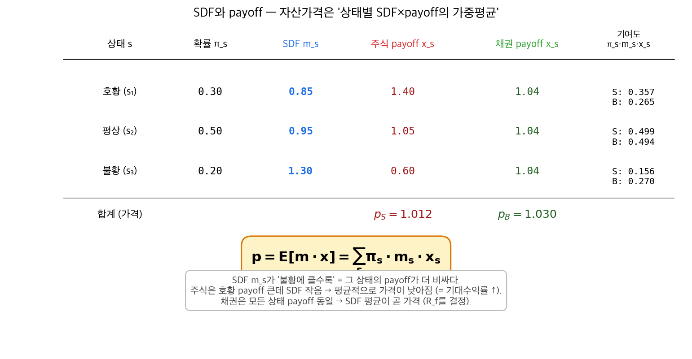
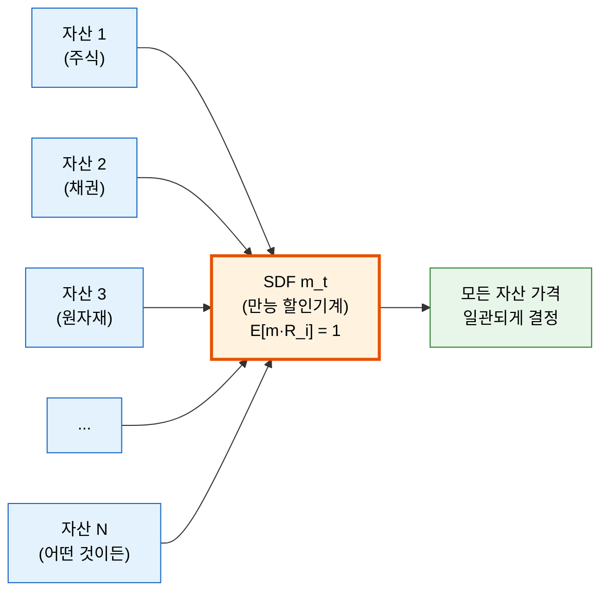
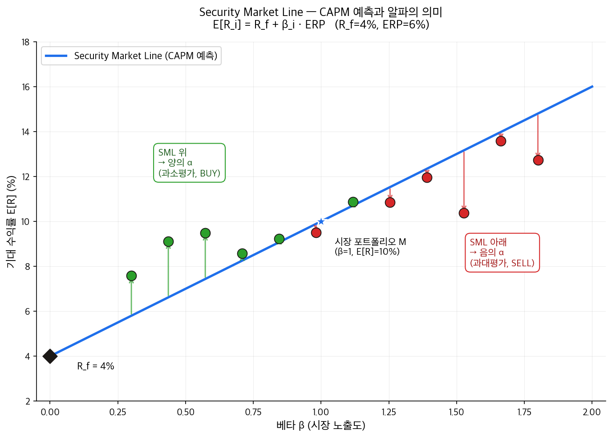

# 6단원: 할인과 확률할인인자(SDF) — 자산가격결정의 핵심

---

## 1. 왜? — 이 단원을 배우는 이유

5단원에서 우리는 네 가지 포트폴리오 전략(동일가중, 최소분산, 리스크패리티, 최대분산)을 배웠다. 이 전략들에는 공통점이 있었다:

> **"기대수익률($\mu$)을 직접 사용하지 않는다."**

왜냐하면 기대수익률 추정이 너무 어렵고, 추정 오차에 결과가 극히 민감했기 때문이다. 그래서 변동성($\sigma$)이나 공분산($\Sigma$)만으로 포트폴리오를 구성하는 전략들을 살펴보았다.

하지만 이것은 본질적인 질문을 피한 것이다:

> **"자산의 기대수익률은 대체 무엇이 결정하는가? 왜 어떤 자산은 높은 수익을, 어떤 자산은 낮은 수익을 주는가?"**

이것이 **자산가격결정(asset pricing)**이라는 금융경제학 분야의 핵심 질문이다. 그리고 그 답의 열쇠가 바로 **확률할인인자(SDF, Stochastic Discount Factor)**다.

이 단원에서는 다음 질문에 답한다:

1. 미래의 돈은 왜 현재의 돈보다 가치가 낮은가? (할인)
2. 자산가격을 하나의 공식으로 설명할 수 있는가? (SDF)
3. 리스크프리미엄은 무엇이 결정하는가? (SDF와 공분산)
4. 가장 단순한 자산가격모형은 무엇인가? (CAPM)
5. CAPM은 왜 실패하는가? (저베타 이상현상)

---

## 2. 단원 흐름도

```
┌──────────────────┐     ┌──────────────────┐     ┌──────────────────┐
│ 5단원의 미해결   │     │ 할인과           │     │ 확률할인인자     │
│ 질문: 기대수익률 │────→│ 할인인자         │────→│ (SDF)            │
│ 은 무엇이       │     │ "미래의 돈은 왜  │     │ E[m·R] = 1       │
│ 결정하는가?     │     │  더 싼가?"       │     │ "만능 할인기계"  │
└──────────────────┘     └──────────────────┘     └──────────────────┘
                                                        │
                                                        ▼
┌──────────────────┐     ┌──────────────────┐     ┌──────────────────┐
│ CAPM의 실패      │     │ CAPM:            │     │ 리스크프리미엄   │
│ α≠0, 저베타     │◀────│ SDF의 특수 경우  │◀────│ = −Cov(m,R)/E[m] │
│ 이상현상         │     │ m = a + b·R_M    │     │ "위험의 대가"    │
│                  │     │ → 베타(β) 등장   │     │                  │
└──────────────────┘     └──────────────────┘     └──────────────────┘
        │
        ▼
┌──────────────────┐
│ 7단원으로:       │
│ CAPM이 실패하면  │
│ 팩터를 더 추가   │
│ → 다중팩터 모형  │
└──────────────────┘
```

---

## 3. 사전 준비 — 기호 읽는 법

이 단원은 수식이 많다. 겁먹지 말자. 모든 기호를 처음 등장할 때 한글로 풀어 설명한다. 먼저 자주 나오는 기호들을 정리한다.

| 기호 | 읽는 법 | 의미 |
|------|---------|------|
| $P_t$ | "피 서브 티" | 자산의 시점 $t$에서의 가격 |
| $R_t$ | "알 서브 티" | 자산의 시점 $t$에서의 수익률 (총수익률, gross return). 100원이 110원이 되면 $R = 1.10$ |
| $R_f$ | "알 서브 에프" | 무위험 이자율의 총수익률. 예금이자가 3%이면 $R_f = 1.03$ |
| $X_{t+1}$ | "엑스 서브 티플러스원" | 자산의 시점 $t+1$에서의 총 보상(payoff). 미래 가격 + 배당금 |
| $E[\cdot]$ | "이 오브 ~" 또는 "기댓값" | 기댓값. 평균적으로 얼마가 될 것인가를 나타내는 연산자 |
| $\text{Cov}(A, B)$ | "코배리언스" 또는 "공분산" | $A$와 $B$가 함께 움직이는 정도. 같은 방향이면 양수, 반대면 음수 |
| $\text{Var}(A)$ | "배리언스" 또는 "분산" | $A$가 평균에서 얼마나 퍼져 있는지. $\text{Var}(A) = \text{Cov}(A, A)$ |
| $m$ | "엠" | 확률할인인자(SDF). 이 단원의 주인공 |
| $R_M$ | "알 서브 엠" | 시장 전체의 수익률 (예: 코스피, S&P 500의 수익률) |
| $\beta$ | "베타" | 시장이 1% 움직일 때 내 자산이 몇 % 움직이는지를 나타내는 민감도 |
| $\alpha$ | "알파" | CAPM이 설명하지 못하는 초과수익. CAPM이 맞다면 0이어야 함 |
| $\varepsilon$ | "엡실론" | 오차항. 모형이 설명하지 못하는 나머지 |
| $R_Z$ | "알 서브 제트" | 제로베타 수익률. SDF와 공분산이 0인 자산의 수익률 |
| affine | "어파인" | 일차식 형태. $y = a + bx$처럼 상수 + 비례 부분으로 이루어진 함수 |

> **$E[\cdot]$ 읽는 법:** $E[m \cdot R]$은 "엠 곱하기 알의 기댓값"이라고 읽는다. "평균적으로 $m \times R$은 얼마인가?"를 묻는 표현이다.

> **$\text{Cov}(A, B)$ 읽는 법:** "에이와 비의 공분산"이라고 읽는다. 두 변수가 함께 움직이는 정도를 숫자로 표현한 것이다. 비유하면, $A$가 기온이고 $B$가 아이스크림 판매량이면 $\text{Cov}(\text{기온}, \text{판매량}) > 0$이다. 기온이 오르면 판매량도 오르니까. (1단원에서 배운 공분산을 기억하는가? 두 변수가 평균에서 같은 방향으로 벗어나면 양수, 반대 방향이면 음수였다.)

---

## 3-A. 이 단원의 숨겨진 가정들

이 단원에서 다루는 이론은 모두 다음의 가정 위에 세워져 있다. 현실에서는 이 가정들이 완벽하게 성립하지 않지만, 이론의 핵심 논리를 이해하기 위해 우선 받아들이자.

| 가정 | 뜻 (비전공자 언어) | 적용 범위 |
|------|-------------------|----------|
| **단일기간 모형** | 오늘 투자하고 내일 결과를 확인하는 1회짜리 게임. 중간에 사고팔지 않는다 | SDF, CAPM 모두 |
| **무차익(no-arbitrage)** | "공짜 점심은 없다." 위험 없이 확실한 수익을 얻는 방법은 없다. 같은 미래를 주는 자산은 같은 가격이어야 한다 | SDF 존재의 근거 |
| **완전시장(complete market)** | 시장에서 어떤 미래 현금흐름이든 기존 자산을 조합하여 만들어낼 수 있다. 빠짐없이 거래할 수 있는 충분한 자산이 존재한다 | SDF의 유일성 |
| **무마찰(frictionless)** | 거래비용, 세금이 없다. 사고팔 때 추가 비용이 전혀 들지 않는다 | SDF, CAPM 모두 |
| **$R_f$는 비확률적 상수** | 무위험 이자율은 미리 정해진 확정 값이다. 은행 예금이자처럼 변동하지 않는다 | 리스크프리미엄 유도 |
| **$m > 0$ (양수 SDF)** | 할인인자는 항상 양수다. "미래의 돈이 마이너스 가치를 가지는 일은 없다" | SDF 전체 |
| **동질적 기대(homogeneous expectations)** | 모든 투자자가 같은 정보를 가지고 미래에 대해 같은 예측을 한다 | CAPM 전용 |

---

## 4. 할인(Discounting)과 할인인자

### 4-1. 왜 할인이 필요한가?

내일 받을 100만원과 오늘의 100만원은 가치가 같을까? 아니다. **오늘의 100만원이 더 가치 있다.** 이유는:

1. **시간가치:** 오늘 100만원을 은행에 넣으면 이자가 붙어 내일은 103만원이 된다
2. **불확실성:** 내일 100만원을 정말 받을 수 있을지 확실하지 않다

그래서 미래의 돈을 현재 가치로 환산하려면 **"깎아야"** 한다. 이 깎는 행위가 **할인(discounting)**이다.

### 4-2. 확실한 세계에서의 할인인자

먼저 가장 단순한 경우를 보자. 불확실성이 전혀 없는 세계, 즉 미래 수익률을 정확히 아는 경우다.

자산 $i$의 시점 $t$에서의 가격을 $P_t$, 시점 $t+1$에서 받을 총 보상(payoff)을 $X_{t+1}$이라 하자. 총 보상이란 미래 가격에 배당금까지 더한 금액이다:

$$X_{t+1} = P_{t+1} + D_{t+1}$$

여기서 $D_{t+1}$은 시점 $t+1$에 받는 배당금이다. [강의 3/11, 14:33]

수익률의 정의에 의해:

$$X_{t+1} = R_{t+1} \times P_t$$

> **왜 이 관계가 성립하는가?** 수익률 $R_{t+1}$은 "투자한 원금 대비 받는 총 보상의 비율"이다. 100만원($P_t$)을 투자해서 110만원($X_{t+1}$)을 받으면, $R_{t+1} = 110/100 = 1.10$이다. 따라서 $X_{t+1} = R_{t+1} \times P_t$. [강의 3/11, 14:33]

불확실성이 없고 수익률이 무위험 이자율 $R_f$와 같다면:

$$P_t = \frac{1}{R_f} \times X_{t+1}$$

여기서 $\frac{1}{R_f}$가 바로 **할인인자(discount factor)**다. [강의 3/11, 14:33]

> **비유:** 백화점 세일을 생각하자. 정가 10만원짜리 물건을 20% 할인하면 8만원에 산다. 할인율이 20%이고, 할인인자는 0.8이다(정가에 0.8을 곱하면 실제 지불 가격). 금융에서도 마찬가지다. 미래에 받을 $X_{t+1}$이라는 "정가"에 할인인자 $\frac{1}{R_f}$를 곱하면 현재 가격 $P_t$가 된다.

> **숫자 예시:** 무위험 이자율이 연 5%이면 $R_f = 1.05$이고, 할인인자는 $\frac{1}{1.05} \approx 0.952$이다. 1년 후 받을 100만원의 현재 가치는 $0.952 \times 100 = 95.2$만원이다.

### 4-3. 불확실한 세계에서의 할인인자

현실은 미래가 불확실하다. 주식에 투자하면 얼마를 받을지 정확히 모른다. 이 경우:

$$P_t = \frac{1}{R_{t+1}} \times X_{t+1}$$

$R_{t+1}$은 미래의 수익률이므로 지금 시점에서는 **모르는 값(확률변수)**이다. [강의 3/11, 14:33–15:27]

> **확률변수(random variable)**: 미래에 어떤 값이 될지 확정되지 않은 변수. 주사위를 던지기 전의 눈금처럼, 가능한 값이 여러 개이고 각각에 확률이 붙어 있다.

> **핵심 통찰:** 만약 이 할인인자 $\frac{1}{R_{t+1}}$을 정확히 알 수 있다면, 우리는 어떤 자산에 투자해야 할지 완벽하게 결정할 수 있다. **금융경제학의 핵심 목표 중 하나가 바로 이 할인인자를 추정하는 것이다.** [강의 3/11, 15:27]

---

## 5. 확률할인인자(SDF) — 자산가격결정의 만능 열쇠

### 5-0. SDF·payoff 도식 — 가격은 어떻게 결정되는가



> **그림 읽는 법** — 3개 상태(호황·평상·불황)에서 주식·채권의 payoff와 SDF로 가격 결정.
> - **SDF m_s**: 불황(s₃)에서 1.30으로 가장 큼 → 불황 payoff가 더 비싸다 (한계효용 큼).
> - **주식**: 호황 payoff(1.40) 큰데 그때 SDF(0.85) 작음 → 가격이 낮아짐(1.012) → 기대수익률 ↑.
> - **채권**: 모든 상태 payoff 동일 → SDF 가중평균이 곧 가격(1.030) → R_f 결정.
> - **공식 p = E[m·x]**: 다음 5-1 절에서 정식 정의.

### 5-1. SDF의 정의

이제 이 단원의 주인공이 등장한다. **확률할인인자(Stochastic Discount Factor, SDF)**란, 다음 조건을 만족하는 확률변수 $m$이다:

$$\boxed{E[m \cdot R_i] = 1 \quad \text{모든 자산 } i \text{에 대해}}$$

[강의 3/11, 15:27]

> **한 문장으로:** SDF는 "어떤 자산의 미래 수익률에 곱해서 기댓값을 취하면 항상 1이 나오게 하는 보편적 할인 도구"다.

이 한 줄짜리 수식이 금융경제학에서 가장 중요한 수식 중 하나다. 한 단어씩 풀어보자:

- **$m$**: 할인인자. "미래의 돈을 현재 가치로 깎아주는 수(數)"
- **확률적(Stochastic)**: $m$이 고정된 상수가 아니라 경제 상황에 따라 변하는 **확률변수**라는 뜻이다. 불황기에는 $m$이 크고(미래 돈의 현재 가치를 높게 쳐줌), 호황기에는 $m$이 작다
- **$R_i$**: 자산 $i$의 (총)수익률. 역시 확률변수
- **$E[\cdot]$**: 기댓값. 평균적으로
- **$= 1$**: $m$과 $R_i$를 곱한 것의 평균이 정확히 1이 되어야 한다
- **모든 자산 $i$에 대해**: 삼성전자든, 미국 국채든, 비트코인이든 — 세상의 모든 자산에 대해 이 식이 성립한다

### 5-2. 왜 "모든 자산"에 대해 하나의 $m$이 존재하는가?

이것이 SDF의 가장 놀라운 특성이다. 자산마다 각각 다른 할인인자 $1/R_i$가 있을 텐데, 왜 **하나의** $m$이 **모든** 자산에 통용되는가? [강의 3/11, 17:20]

그 근거는 **무차익 조건(no-arbitrage condition)**이다. 쉽게 말하면 "공짜 점심은 없다"는 원칙이다.

> **비유: 환전소.** 서울역 앞에 환전소가 10개 있다고 하자. 만약 A 환전소에서 달러를 싸게 사서 B 환전소에서 비싸게 팔아 무위험 이익을 얻을 수 있다면, 모든 사람이 그렇게 할 것이다. 그러면 A의 가격은 오르고 B의 가격은 내려서, 결국 모든 환전소의 실질 환율이 같아진다. 이처럼 "차익거래(공짜 이익)가 불가능하다"는 조건 하에서, 모든 통화에 적용되는 **하나의 환전 비율**이 존재하게 된다.

금융 자산도 마찬가지다:
- 같은 미래 현금흐름을 주는 두 자산은 같은 가격이어야 한다 (일물일가의 법칙)
- 만약 자산마다 할인인자가 다르다면, 싼 자산을 사서 비싼 자산을 팔아 무위험 이익을 얻을 수 있다
- 무차익 조건이 이를 허용하지 않으므로, **모든 자산에 공통으로 적용되는 하나의 $m$이 존재**해야 한다

(이 결과는 금융경제학의 기본 정리, Fundamental Theorem of Asset Pricing으로 알려져 있다)

여기에 **완전시장 가정**(어떤 미래 현금흐름이든 기존 자산을 조합해서 만들 수 있다)을 더하면, 이 $m$은 **유일하게** 결정된다.

### 5-3. SDF 정의의 유도 — 확실한 세계에서 불확실한 세계로

앞에서 확실한 세계의 가격 공식을 보았다:

$$P_t = \frac{1}{R_f} \times X_{t+1}$$

불확실한 세계에서도 비슷한 관계를 쓰고 싶다. 그런데 단순히 "기댓값을 취하면" 되는 것이 아니다. 불확실한 세계에서의 가격 공식은 **무차익 조건에서 별도로 도출**된다.

무차익 조건은 다음을 보장한다: **양수인 확률변수 $m > 0$이 존재하여**, 모든 자산에 대해

$$P_t = E[m \cdot X_{t+1}]$$

이 성립한다. 여기서 $P_t$는 현재 시점에서 이미 알려진 값(상수)이므로 기댓값 밖에 그대로 남는다. [강의 3/11, 16:22]

$X_{t+1} = R_i \cdot P_t$이므로 (보상 = 수익률 $\times$ 현재 가격):

$$P_t = E[m \cdot R_i \cdot P_t]$$

$P_t$는 현재 시점의 알려진 값(상수)이므로 양변에서 나눌 수 있다:

$$1 = E[m \cdot R_i]$$

이것이 SDF 정의다. [강의 3/11, 16:22]

> **비유:** SDF $m$은 **"만능 할인기계"**와 같다. 어떤 자산의 미래 수익률을 이 기계에 넣으면, 할인된 값의 평균이 항상 정확히 1이 나온다. 이 기계가 모든 자산에 대해 작동한다는 것이 핵심이다. 마치 하나의 번역기가 모든 언어를 번역할 수 있는 것처럼, 하나의 $m$이 모든 자산의 가격을 설명한다.



> **그림 읽는 법** — 시장에 자산이 N개 있는데, 그 모두를 동시에 가격결정하는 단 하나의 객체 $m_t$ 가 SDF다. 자산이 1억 개여도 여전히 $m_t$는 하나뿐. 이 사실의 강력함이 자산가격결정 이론의 핵심.

### 5-4. SDF를 알면 왜 모든 문제가 풀리는가?

$E[m \cdot R_i] = 1$을 다르게 쓰면:

$$P_t = E[m \cdot X_{t+1}]$$

즉, **자산의 현재 가격 = SDF $\times$ 미래 보상의 기댓값**이다. SDF를 정확히 알면:

- 어떤 자산이 고평가되었는지, 저평가되었는지 판단할 수 있다
- 어떤 자산에 투자해야 높은 수익을 얻을지 알 수 있다
- 모든 리스크 보정을 하나의 $m$에 담을 수 있다

> **"자산가격결정(asset pricing) 이론의 핵심 목표는 이 SDF $m$을 올바르게 추정하는 것이다."** [강의 3/11, 20:59]

---

## 6. 리스크프리미엄 — SDF가 알려주는 "위험의 대가"

### 6-1. 리스크프리미엄이란?

**리스크프리미엄(risk premium)**이란 위험 자산에 투자할 때 무위험 자산보다 **추가로** 기대할 수 있는 수익이다: [강의 3/11, 20:59]

$$\text{리스크프리미엄}_i = E[R_i] - R_f$$

> **비유:** 은행 예금(무위험)은 연 3%를 준다. 주식(위험)은 평균적으로 연 10%를 준다. 그러면 리스크프리미엄은 $10\% - 3\% = 7\%$다. 이 7%가 "위험을 감수한 대가"다.

이 리스크프리미엄이 양수여야만 사람들이 위험 자산에 투자할 이유가 있다. 위험을 감수했는데 무위험 이자율보다 못 벌면 아무도 투자하지 않을 것이다. [강의 3/11, 21:57]

### 6-2. SDF에서 리스크프리미엄 공식 유도 — 단계별

이제 SDF 정의 $E[m \cdot R] = 1$에서 리스크프리미엄 공식을 유도한다. 모든 단계에 "왜?"를 설명한다.

---

**단계 1: 공분산의 정의를 이용해 $E[m \cdot R]$을 분해한다**

통계학에서 두 확률변수의 곱의 기댓값은 다음과 같이 분해된다:

$$E[m \cdot R] = E[m] \cdot E[R] + \text{Cov}(m, R)$$

> **왜 이 분해를 하는가?** 공분산의 정의가 $\text{Cov}(A, B) = E[AB] - E[A] \cdot E[B]$이기 때문이다. 이것을 $E[AB]$에 대해 정리하면 위 식이 된다. 이 분해를 통해 "평균끼리의 곱"과 "함께 움직이는 정도(공분산)"로 나눌 수 있다.

따라서 SDF 정의 $E[m \cdot R] = 1$은:

$$E[m] \cdot E[R] + \text{Cov}(m, R) = 1 \quad \cdots (*)$$

---

**단계 2: $E[m]$의 값을 알아낸다 — 무위험 자산을 대입한다**

$E[m \cdot R] = 1$은 **모든 자산**에 대해 성립한다. 그러면 무위험 자산($R = R_f$)에도 성립해야 한다:

$$E[m \cdot R_f] = 1$$

$R_f$는 상수(확정된 값, 비확률적)이므로 기댓값 밖으로 뺄 수 있다:

$$R_f \cdot E[m] = 1$$

따라서:

$$\boxed{E[m] = \frac{1}{R_f}}$$

[강의 3/11, 26:16]

> **왜 $R_f$를 대입하는가?** 공분산 항을 없애기 위해서다. $R_f$는 상수이므로 $\text{Cov}(m, R_f) = 0$이다 (상수와 어떤 것의 공분산은 항상 0). 그러면 식이 매우 단순해져서 $E[m]$을 바로 구할 수 있다.

> **해석:** SDF의 평균값은 무위험 이자율의 역수다. 무위험 이자율이 높으면(돈의 시간가치가 크면) $E[m]$은 작아진다. 즉, 미래의 돈을 더 많이 깎는다.

---

**단계 3: $E[m]$을 $(*)$에 대입하여 리스크프리미엄 공식을 얻는다**

$(*)$에서:

$$E[m] \cdot E[R] + \text{Cov}(m, R) = 1$$

$E[m] = \frac{1}{R_f}$를 대입:

$$\frac{1}{R_f} \cdot E[R] + \text{Cov}(m, R) = 1$$

$E[R]$에 대해 정리하기 위해 양변에 $R_f$를 곱한다:

$$E[R] + R_f \cdot \text{Cov}(m, R) = R_f$$

$E[R]$을 좌변에, $R_f$를 우변에 놓으면:

$$E[R] - R_f = -R_f \cdot \text{Cov}(m, R)$$

$R_f = \frac{1}{E[m]}$이므로:

$$\boxed{E[R_i] - R_f = -\frac{\text{Cov}(m, R_i)}{E[m]}}$$

[강의 3/11, 27:15]

> **한 문장으로:** 자산의 리스크프리미엄은 "그 자산의 수익률이 SDF와 얼마나 반대로 움직이는가"에 의해 결정된다.

이것이 **리스크프리미엄의 SDF 공식**이다.

---

**단계 4: 이 공식의 의미를 해석한다**

$$\text{리스크프리미엄}_i = E[R_i] - R_f = -\frac{\text{Cov}(m, R_i)}{E[m]}$$

- $E[m] > 0$이므로 (할인인자는 양수), 부호는 $-\text{Cov}(m, R_i)$에 의해 결정된다
- **$\text{Cov}(m, R_i) < 0$이면** (SDF와 수익률이 반대로 움직이면): $-\text{Cov} > 0$이므로 리스크프리미엄이 **양수**
- **$\text{Cov}(m, R_i) > 0$이면** (SDF와 수익률이 같은 방향으로 움직이면): 리스크프리미엄이 **음수**

> **직관:** SDF $m$은 불황기에 크고 호황기에 작다 (불황기에는 돈 한 푼이 더 귀하므로). 만약 어떤 자산의 수익률이 **불황기에 낮고 호황기에 높으면** ($R_i$와 $m$이 반대 방향으로 움직임), 이 자산은 "가장 돈이 필요할 때 손해를 보는" 자산이다. 투자자들은 이런 자산에 투자하려면 **높은 보상(높은 리스크프리미엄)**을 요구한다.

> 반대로, 불황기에 수익률이 높은 자산(보험 같은 자산)은 "돈이 필요할 때 돈을 주는" 자산이므로, 투자자들이 낮은 수익률도 감수한다 → 리스크프리미엄이 낮거나 음수.

---

### 6-3. 유도 과정 흐름 요약

```
E[m·R] = 1          ← SDF 정의 (출발점)
    │
    ├─ R = Rf 대입 → E[m] = 1/Rf         ← 무위험 자산으로 E[m] 확인
    │
    ├─ E[m·R] = E[m]·E[R] + Cov(m,R)     ← 공분산 정의로 분해
    │
    └─ 대입 & 정리 → E[R] - Rf = −Cov(m,R)/E[m]  ← 리스크프리미엄 공식!
```

---

### 6-4. 제로베타 수익률 ($R_Z$)

리스크프리미엄 공식의 양변을 $E[m]$으로 나누는 변환을 해보자. 원래 공식은:

$$E[m] \cdot E[R] + \text{Cov}(m, R) = 1$$

양변을 $E[m]$으로 나누면:

$$E[R] + \frac{\text{Cov}(m, R)}{E[m]} = \frac{1}{E[m]}$$

정리하면:

$$E[R] = \frac{1}{E[m]} - \frac{\text{Cov}(m, R)}{E[m]}$$

만약 어떤 자산의 수익률이 SDF와 전혀 상관없다면($\text{Cov}(m, R) = 0$):

$$E[R] = \frac{1}{E[m]}$$

이 값을 **제로베타 수익률** $R_Z$라 부른다. [강의 3/11, 31:48]

$$R_Z = \frac{1}{E[m]}$$

> **왜 "제로베타"인가?** 뒤에서 베타($\beta$)를 배우면 알겠지만, SDF(또는 시장)와의 공분산이 0이라는 것은 베타가 0이라는 뜻이다. 시장이 어떻게 움직이든 상관없는 자산이라는 의미다.

> **제로베타 자산의 현실 예시:** 순수하게 시장과 무관한 자산은 현실에서 찾기 어렵지만, 대표적으로 금(gold)이나 일부 헤지펀드 전략이 시장 수익률과 낮은 상관관계를 보인다. 이론적으로 극단적인 경우, 동전 던지기 도박처럼 경제 상황과 전혀 무관한 수익원이 이에 해당한다.

무위험 자산이 존재하면 $R_Z = R_f$다. [강의 3/11, 44:28]

이 $R_Z$를 사용하면 리스크프리미엄 공식을 다음과 같이 다시 쓸 수 있다:

$$E[R_i] - R_Z = -\frac{\text{Cov}(m, R_i)}{E[m]}$$

> **핵심:** "모든 자산가격결정 모형은 이 공식의 특수한 경우다." 서로 다른 모형은 $m$을 서로 다르게 정의할 뿐이다. [강의 3/11, 32:46]

5단원에서 리스크프리미엄과 최대분산 포트폴리오를 다룰 때 "위험의 대가"라는 개념이 등장했다. 여기서 그 대가가 정확히 무엇인지 — SDF와의 공분산 — 가 밝혀진 것이다.

---

## 7. CAPM — SDF의 첫 번째 특수 경우

### 7-1. CAPM의 경제학적 동기와 핵심 주장

CAPM은 다음의 경제학적 가정에서 출발한다: **시장 포트폴리오(모든 자산을 시가총액 비율로 담은 포트폴리오)가 평균-분산 효율적이다.** 즉, 같은 위험에서 가장 높은 기대수익률을 주는 포트폴리오가 바로 시장 그 자체라는 것이다. 이 가정 위에서, 개별 자산의 기대수익률은 시장과의 관계만으로 결정된다.

**CAPM(Capital Asset Pricing Model, 자본자산가격결정모형)**의 핵심 공식: [강의 3/11, 37:47]

$$\boxed{E[R_i] - R_f = \beta_i \times (E[R_M] - R_f)}$$

> **한 문장으로:** 자산의 리스크프리미엄은 "그 자산이 시장에 얼마나 민감한가(베타)" 곱하기 "시장 전체의 위험 보상"이다.

각 항의 의미:

| 항 | 의미 |
|----|------|
| $E[R_i] - R_f$ | 자산 $i$의 리스크프리미엄 ("내 자산이 무위험 이자보다 얼마나 더 벌어다 주는가?") |
| $\beta_i$ | 자산 $i$의 **시장 베타** ("시장이 1% 움직일 때 내 자산은 몇 % 움직이는가?") |
| $E[R_M] - R_f$ | **시장 리스크프리미엄** 또는 **위험의 가격** ("시장 전체가 위험을 감수한 대가") |

> **왜 이 모형이 중요한가?** 이것은 "모든 자산은 시장의 일부이므로, 자산의 수익률은 시장 수익률과의 관계(베타)만으로 결정된다"고 말하는 최초의 자산가격결정 모형이다. [강의 3/11, 38:41]

### 7-2. 베타($\beta$)의 정의와 의미

$$\beta_i = \frac{\text{Cov}(R_i, R_M)}{\text{Var}(R_M)}$$

> **읽는 법:** "자산 $i$의 수익률과 시장 수익률의 공분산을, 시장 수익률의 분산으로 나눈 것." 1단원에서 배운 공분산을 기억하는가? $\text{Cov}(R_i, R_M)$은 "내 자산과 시장이 함께 움직이는 정도"이고, $\text{Var}(R_M)$은 "시장 수익률이 평균에서 얼마나 퍼져 있는가(변동 크기)"다. 공분산을 분산으로 나눈 것이 바로 베타다.

> **직관:** 시장이 1% 오를 때 내 자산이 평균적으로 몇 % 오르는지를 나타낸다. [강의 3/11, 39:40]

| 베타 값 | 의미 | 예시 |
|---------|------|------|
| $\beta = 1$ | 시장과 똑같이 움직인다 | 시장이 5% 오르면 내 자산도 약 5% 오른다 |
| $\beta > 1$ | 시장보다 더 크게 움직인다 (공격적) | 시장이 5% 오르면 내 자산은 7~8% 오를 수 있다 |
| $\beta < 1$ | 시장보다 덜 움직인다 (방어적) | 시장이 5% 오르면 내 자산은 3% 정도만 오른다 |
| $\beta = 0$ | 시장과 무관하게 움직인다 | 무위험 자산 |
| $\beta < 0$ | 시장과 반대로 움직인다 | 매우 드문 경우 |

[강의 3/11, 39:40–40:33]

> **비유:** 베타는 "파도 민감도"와 같다. 바다(시장)에 파도가 치면, 큰 배(저베타 주식)는 조금만 흔들리고, 작은 보트(고베타 주식)는 크게 흔들린다. 파도 자체가 시장 움직임이고, 흔들림의 크기가 베타다.

**베타별 기대수익률 계산표** ($R_f = 3\%$, 시장 리스크프리미엄 $E[R_M] - R_f = 6\%$인 경우):

| $\beta$ | 계산: $R_f + \beta \times 6\%$ | 기대수익률 |
|---------|-------------------------------|-----------|
| 0.5 | $3\% + 0.5 \times 6\%$ | **6.0%** |
| 0.8 | $3\% + 0.8 \times 6\%$ | **7.8%** |
| 1.0 | $3\% + 1.0 \times 6\%$ | **9.0%** (= 시장 수익률) |
| 1.2 | $3\% + 1.2 \times 6\%$ | **10.2%** |
| 1.5 | $3\% + 1.5 \times 6\%$ | **12.0%** |

> 베타가 0.5 증가할 때마다 기대수익률이 3%p씩 늘어남을 확인하라. 이것이 CAPM이 그리는 세상이다.

### 7-3. CAPM이 SDF의 특수 경우임을 유도하기

> **사전 안내:** 이 유도는 여러 단계를 거치지만, 결론은 단순하다: **"CAPM이 맞으면 SDF는 시장 수익률의 일차식($m = a + b \cdot R_M$)이다."** 수식이 어렵게 느껴지면 결론만 기억해도 좋다.

CAPM의 세계에서 SDF는 시장 수익률 $R_M$의 **affine(일차식) 함수**라고 가정한다:

$$m = a + b \cdot R_M$$

여기서 $a$와 $b$는 상수다. [강의 3/13, 51:08]

b의 부호는 음수여야 한다. SDF는 시장이 좋을 때 작고 나쁠 때 커야 하므로, 시장수익률과 반대 방향으로 움직여야 한다.

이 $m$을 **리스크프리미엄 공식** $E[R] - R_Z = -\text{Cov}(m, R) / E[m]$에 대입하면, CAPM 공식이 자연스럽게 도출된다. 이것이 "CAPM은 SDF의 특수 경우"를 보이는 핵심이다.

---

**단계 1: $m = a + bR_M$일 때 $\text{Cov}(m, R)$을 계산한다**

$$\text{Cov}(m, R) = \text{Cov}(a + bR_M, R) = b \cdot \text{Cov}(R_M, R)$$

> **왜?** 공분산에서 상수($a$)는 사라지고, 상수 배수($b$)는 밖으로 나온다. 이것은 공분산의 기본 성질이다.

---

**단계 2: 리스크프리미엄 공식에 대입한다**

$$E[R] - R_Z = -\frac{\text{Cov}(m, R)}{E[m]} = -\frac{b \cdot \text{Cov}(R_M, R)}{E[m]}$$

---

**단계 3: $R = R_M$(시장 자체)을 대입하여 $-b/E[m]$을 결정한다**

시장 수익률 $R_M$도 하나의 자산이므로 위 공식이 적용된다:

$$E[R_M] - R_Z = -\frac{b \cdot \text{Cov}(R_M, R_M)}{E[m]} = -\frac{b \cdot \text{Var}(R_M)}{E[m]}$$

따라서:

$$-\frac{b}{E[m]} = \frac{E[R_M] - R_Z}{\text{Var}(R_M)}$$

---

**단계 4: 일반 자산에 대해 다시 쓴다**

단계 2의 결과에 단계 3을 대입하면:

$$E[R] - R_Z = \frac{E[R_M] - R_Z}{\text{Var}(R_M)} \cdot \text{Cov}(R_M, R)$$

$\frac{\text{Cov}(R_M, R)}{\text{Var}(R_M)}$은 바로 $\beta$의 정의이므로:

$$\boxed{E[R] - R_Z = \beta \cdot (E[R_M] - R_Z)}$$

무위험 자산이 존재하면 $R_Z = R_f$이므로 이것은 CAPM 공식 그 자체다.

---

**단계 5: $E[m \cdot R] = 1$의 검증 (SDF 조건 확인)**

$m$을 구체적으로 $m = R_Z^{-1} - \psi(R_M - E[R_M])$으로 정의한다. 여기서 $\psi = \frac{E[R_M] - R_Z}{\text{Var}(R_M)}$이다. [강의 3/13, 51:08]

$$E[m \cdot R] = E\left[\left(R_Z^{-1} - \psi(R_M - E[R_M])\right) \cdot R\right]$$

$R_Z^{-1}$은 상수이므로 분배하면:

$$= R_Z^{-1} \cdot E[R] - \psi \cdot \text{Cov}(R_M, R)$$

> $E[(R_M - E[R_M]) \cdot R] = \text{Cov}(R_M, R)$이다. ($E[R_M - E[R_M]] = 0$이므로.)

$\psi \cdot \text{Cov}(R_M, R) = \frac{E[R_M] - R_Z}{\text{Var}(R_M)} \cdot \text{Cov}(R_M, R) = \beta(E[R_M] - R_Z)$이고,

CAPM에 의해 $\beta(E[R_M] - R_Z) = E[R] - R_Z$이므로:

$$E[m \cdot R] = \frac{E[R]}{R_Z} - (E[R] - R_Z) = \frac{E[R] - R_Z \cdot E[R] + R_Z^2}{R_Z} = \frac{R_Z(R_Z - E[R]) + E[R]}{R_Z}$$

CAPM 관계를 다시 대입하면 $E[R] = R_Z + \beta(E[R_M] - R_Z)$이므로:

$$E[m \cdot R] = \frac{R_Z + \beta(E[R_M] - R_Z)}{R_Z} - \frac{\beta(E[R_M] - R_Z)}{1}$$

첫째 항을 전개하면 $1 + \frac{\beta(E[R_M] - R_Z)}{R_Z}$인데, 두 번째 항과 합치면... 강의에서는 이 소거를 다음과 같이 간결하게 보인다: [강의 3/13, 53:43]

$$E[m \cdot R] = R_Z^{-1} \cdot E[R] - (E[R] - R_Z) = R_Z^{-1}(R_Z) = 1$$

(마지막 등호는 $E[R] - (E[R] - R_Z) \cdot R_Z \cdot R_Z^{-1}$에서 $E[R]$ 항이 소거되고 $R_Z \cdot R_Z^{-1} = 1$만 남기 때문이다.)

**결론:**

$$E[m \cdot R] = 1 \quad \checkmark$$

따라서 $m = R_Z^{-1} - \psi(R_M - E[R_M])$은 SDF다. 이 $m$은 시장 수익률 $R_M$의 **affine 함수(일차식)**다. [강의 3/13, 54:31]

---

### 7-3a. SDF → 리스크프리미엄 → CAPM 통합 유도 흐름도

```
┌─────────────────────────────┐
│ ① SDF 정의                 │
│    E[m · R] = 1             │
│    (모든 자산에 대해)        │
└──────────────┬──────────────┘
               │  공분산 분해 + R=Rf 대입
               ▼
┌─────────────────────────────┐
│ ② 리스크프리미엄 공식       │
│    E[R] - Rf = −Cov(m,R)   │
│                / E[m]       │
│    (SDF와의 공분산이 결정)   │
└──────────────┬──────────────┘
               │  m = a + b·R_M 대입
               │  → Cov(m,R) = b·Cov(R_M,R)
               ▼
┌─────────────────────────────┐
│ ③ CAPM                     │
│    E[R] - Rf = β(E[R_M]-Rf)│
│    β = Cov(R,R_M)/Var(R_M) │
│    (시장 베타가 결정)        │
└─────────────────────────────┘
```

> 위에서 아래로: 일반 이론(SDF)에서 특수 모형(CAPM)으로. CAPM은 "SDF가 시장 수익률의 일차식"이라는 **하나의 추가 가정**을 넣은 결과다.

---

### 7-4. CAPM의 경제적 의미

CAPM → SDF 유도가 말해주는 것:

> **"CAPM이 맞다면, SDF는 오직 시장 수익률($R_M$)만의 함수다. 즉, 자산의 수익률을 설명하는 데 시장 수익률 하나면 충분하다."** [강의 3/13, 54:31]

이것은 매우 강력한 주장이다:

1. 모든 자산은 시장의 구성원이다
2. 따라서 모든 자산의 수익률은 시장 수익률과의 관계(베타)로 설명된다
3. 베타 하나만 알면 기대수익률을 예측할 수 있다

```
CAPM의 세계관:

수익률 결정 요인: 오직 베타(β) 하나

           높은 β ──→ 높은 기대수익률
           낮은 β ──→ 낮은 기대수익률
           β = 0  ──→ 무위험 이자율

           E[Ri] - Rf = βi × (E[RM] - Rf)
                        ↑        ↑
                   내 자산의    시장 전체의
                   시장 민감도  위험 보상
```

[강의 3/11, 39:40]

---

## 8. CAPM의 회귀분석 형태 — $\alpha$의 등장

### 8-0. Security Market Line (SML) — CAPM의 시각적 핵심

CAPM의 결론 $E[R_i] = R_f + \beta_i \cdot \text{ERP}$ 를 그림으로 보면 **베타-수익률 평면 위 직선** 하나로 표현된다. 이 직선이 SML(증권시장선)이다.



- **직선 위 점** = 양의 알파 (과소평가된 자산, 매수 대상)
- **직선 아래 점** = 음의 알파 (과대평가된 자산, 매도 대상)
- **알파(α)** = 이 직선과 실제 수익률의 수직 거리. CAPM이 설명하지 못한 초과수익이다.
- 다음 절(8-1~8-4)에서 이 α를 회귀분석으로 정량적으로 측정하는 방법을 다룬다.

### 8-1. 왜 회귀분석이 필요한가?

CAPM은 이론이다. 이론이 현실에서 맞는지 확인하려면 **데이터로 검증**해야 한다. CAPM을 실증적으로 검증하려면 회귀분석, 횡단면 분석 같은 통계 도구가 필요하다. 이 절에서는 CAPM을 데이터로 검증 가능한 형태로 바꾸는 과정을 다룬다.

### 8-2. 이론식에서 회귀식으로

CAPM의 이론식은 기댓값에 대한 것이다:

$$E[R_i] - R_f = \beta_i(E[R_M] - R_f)$$

이것을 **실제 데이터**로 옮기면 다음과 같은 회귀분석(regression) 형태가 된다: [강의 3/13, 49:21]

$$R_i - R_f = \alpha_i + \beta_i (R_M - R_f) + \varepsilon_i$$

> **이론식과 회귀식의 차이:** 이론식은 "평균적으로(기댓값)" 성립하는 관계다. 하지만 실제 데이터에서는 매 시점마다 수익률이 달라지므로, 이론이 설명하지 못하는 **나머지($\varepsilon$)**가 발생한다. 회귀식은 이 나머지를 명시적으로 포함한다.

각 항의 의미:

| 항 | 이름 | 의미 |
|----|------|------|
| $R_i - R_f$ | 초과수익률 | 내 자산의 수익률에서 무위험 이자를 뺀 것 (위험 감수의 보상) |
| $\alpha_i$ | 알파 | CAPM이 설명하지 못하는 추가 수익. **CAPM이 맞다면 0이어야 한다** |
| $\beta_i$ | 베타 | 시장 초과수익률에 대한 민감도 (기울기) |
| $R_M - R_f$ | 시장 초과수익률 | 시장 전체의 위험 보상 |
| $\varepsilon_i$ | 오차항 (엡실론) | 모형이 설명하지 못하는 나머지 잡음 |

> **$\varepsilon$(오차항) 비유:** 시험 점수를 공부 시간으로 예측하는 상황을 생각하자. "공부 시간이 길면 점수가 높다"는 모형을 세워도, 실제 점수에는 그날의 컨디션, 운, 시험 범위 등 공부 시간으로 설명되지 않는 부분이 있다. 이 "설명되지 않는 부분"이 바로 $\varepsilon$이다. 마찬가지로, 자산 수익률에서 시장 움직임($\beta \cdot (R_M - R_f)$)으로 설명되지 않는 나머지가 $\varepsilon$이다.

> **$\varepsilon$의 가정:** 회귀분석이 성립하려면 $\varepsilon$에 대해 두 가지를 가정한다. (1) $E[\varepsilon] = 0$: 오차는 평균적으로 0이다 (양수와 음수가 상쇄된다). (2) $\text{Cov}(\varepsilon, R_M) = 0$: 오차는 시장 수익률과 무관하다 (시장이 설명하는 부분은 이미 $\beta(R_M - R_f)$에 포함되었으므로). 이 두 가정 하에서 회귀식의 양변에 기댓값을 취하면 $E[R_i] - R_f = \alpha + \beta(E[R_M] - R_f)$가 되고, CAPM이 맞으면 $\alpha = 0$이 된다.

> **회귀분석이란?** 데이터에 가장 잘 맞는 직선을 찾는 방법이다. "시장이 1% 올랐을 때 내 자산은 평균적으로 몇 % 올랐는가?"를 과거 데이터에서 찾아내는 것이다. $y = a + bx$에서 $a$가 절편(알파), $b$가 기울기(베타)다.

### 8-3. CAPM의 예측: $\alpha = 0$

CAPM 공식 $E[R_i] - R_f = \beta_i(E[R_M] - R_f)$의 양변에서 기댓값을 취하면, 회귀식의 절편 $\alpha$는 0이어야 한다. [강의 3/13, 49:21]

$$\alpha = 0 \quad \text{(CAPM의 예측)}$$

> **해석:** 베타를 통해 시장 위험을 보정하고 나면, **추가 수익은 없어야 한다**는 것이 CAPM의 주장이다. 만약 $\alpha > 0$이면 "시장 위험과 무관하게 꾸준히 돈을 벌어다 주는 초과수익"이 존재한다는 뜻이고, 이는 CAPM으로 설명할 수 없다.

### 8-4. 보안시장선(Security Market Line, SML) — ASCII 그래프

CAPM이 맞다면, 모든 자산은 다음 직선 위에 놓여야 한다:

```
기대수익률 E[Ri]
  │
 12% ─ ─ ─ ─ ─ ─ ─ ─ ─ ─ ─ ─ ─ ─ ╱  ← β=1.5일 때
  │                              ╱
  │                            ╱
  9% ─ ─ ─ ─ ─ ─ ─ ─ ─ ─ ─ ╱ ← β=1.0 (시장)
  │                        ╱
  │                      ╱     기울기 = E[RM] - Rf = 6%
  │                    ╱       (시장 리스크프리미엄)
  6% ─ ─ ─ ─ ─ ─ ─ ╱ ← β=0.5
  │              ╱
  │            ╱
  3%(Rf) ─ ╱ ← β=0 (무위험 자산)
  │      ╱
  └──┬────┬────┬────┬────┬──── 베타(β)
     0   0.5  1.0  1.5  2.0
```

[강의 3/13, 01:08:10–01:09:09]

- **x축:** 자산의 베타
- **y축:** 자산의 기대수익률
- **절편:** $R_f = 3\%$ (무위험 이자율)
- **기울기:** $E[R_M] - R_f = 6\%$ (시장 리스크프리미엄)
- $\beta = 1$인 점에서의 수익률 = $E[R_M] = 9\%$ (시장 자체의 수익률)

> **해석:** 베타가 높을수록 기대수익률이 높다. 이것이 CAPM이 그리는 세상이다. 하지만 현실은 다르다.

### 8-5. 보안특성선(Security Characteristic Line, SCL)

개별 자산의 시계열 회귀를 그리면:

```
Ri - Rf
  │
  │              ·  ·
  │           · ╱· ·
  │         · ╱ ·
  │        ·╱·  ·
  │       ╱·  ·
  │     ╱ · ·        기울기 = β
  │   ╱· ·
  │  ╱ ·
  │╱·
  α────────────────── RM - Rf
  │
```

[강의 3/13, 01:11:08–01:11:27]

- **x축:** 시장 초과수익률 ($R_M - R_f$)
- **y축:** 자산 초과수익률 ($R_i - R_f$)
- **기울기:** $\beta$ (시장이 1% 오를 때 내 자산이 몇 % 오르는지)
- **절편:** $\alpha$ (CAPM이 맞으면 0)

---

## 9. 횡단면 분석 vs 시계열 분석

CAPM(그리고 모든 자산가격결정 모형)을 검증할 때 두 가지 관점이 있다. [강의 3/11, 41:33–43:31]

| | **횡단면 분석 (Cross-sectional)** | **시계열 분석 (Time-series)** |
|------|------|------|
| **질문** | "같은 시점에 왜 A 자산은 수익률이 높고 B 자산은 낮은가?" | "하나의 자산의 수익률이 시간에 따라 어떻게 변하는가?" |
| **비유** | 반 전체 학생의 키를 한 번에 비교 ("누가 더 큰가?") | 한 학생의 키를 매년 측정 ("얼마나 자라는가?") |
| **그래프** | x축: 베타, y축: 기대수익률 (각 점 = 서로 다른 자산) | x축: 시간, y축: 수익률 (하나의 자산의 궤적) |
| **CAPM 검증** | 베타와 기대수익률 사이에 선형 관계가 있는가? | 회귀 절편(α)이 0인가? |
| **핵심 관심** | 자산 간 수익률 차이의 **원인** | 하나의 자산 수익률의 **추세와 패턴** |
| **방향** | "가로 분석" — 한 시점에서 여러 자산을 비교 | "세로 분석" — 한 자산을 여러 시점에서 추적 |

[강의 3/11, 41:33–42:31]

```
횡단면 분석                          시계열 분석

수익률                               수익률
  │  · B                               │
  │    · A                              │    ╱╲    ╱╲
  │      · C                            │   ╱  ╲  ╱  ╲
  │  · D                                │  ╱    ╲╱    ╲
  │        · E                           │ ╱              ╲
  └────────────── 베타                   └──────────────────── 시간
  한 시점에서 여러 자산 비교             한 자산의 시간 변화 추적
```

> **CAPM은 횡단면 모형이다.** CAPM의 핵심 질문은 "왜 삼성전자는 수익률이 높고 한국전력은 낮은가?"이다. 답은 "삼성전자의 베타가 더 높기 때문"이다. 시간에 따른 변화가 아니라, 같은 시점에서 자산 간 차이를 설명하는 것이 CAPM의 목표다. [강의 3/11, 42:31]

> **CAPM의 횡단면 예측:** "수익률의 횡단면 변동은 오직 베타의 횡단면 변동에 의해서만 결정된다." 베타를 제외하면 자산 간 수익률 차이는 없어야 한다. 즉, $\alpha = 0$이다. [강의 3/11, 59:24–01:00:24]

---

## 10. CAPM의 실패 — 현실이 이론과 다르다

### 10-1. $\alpha \neq 0$ 문제

CAPM은 $\alpha = 0$을 예측하지만, 실제 데이터에서 회귀분석을 돌려보면 **거의 모든 경우에서 $\alpha$가 통계적으로 유의하게 0이 아니다**. [강의 3/13, 49:21]

이것은 "베타 하나로는 자산의 수익률을 완전히 설명할 수 없다"는 뜻이다.

### 10-2. 저베타 이상현상 (Low-beta Anomaly)

CAPM이 맞다면 고베타 자산이 고수익, 저베타 자산이 저수익이어야 한다. 하지만 실제로는: [강의 3/13, 50:12–51:08]

> **"저베타 주식이 고베타 주식보다 오히려 더 높은 수익률을 보인다."**

```
CAPM의 예측 vs 현실

기대수익률
  │
 12% ─                              ╱ CAPM 예측
  │                                ╱
  │    현실: 기울기가             ╱
 9% ─  완만하거나 역전          ╱
  │                           ╱
  │  ── ── ── ── ── ── ──   ╱
 6% ── ── ── ── ── ──      ╱      ← 현실은 평평하거나
  │                       ╱         심지어 우하향할 수도
 3%(Rf)                 ╱
  │                   ╱
  └──┬────┬────┬────┬────┬──── 베타(β)
     0   0.5  1.0  1.5  2.0
```

[강의 3/13, 01:09:09–01:10:06]

**왜 이런 현상이 발생하는가?** [강의 3/13, 50:12]

1. CAPM에 따르면 고베타 주식이 높은 수익을 줄 것이라 기대된다
2. 자산운용사(펀드매니저)들이 높은 수익을 원해 **고베타 주식에 몰려든다**
3. 많은 사람이 사려 하니 **고베타 주식의 가격이 올라간다**
4. 현재 가격이 올라가면 **미래의 기대수익률은 낮아진다** (비싸게 사니까 남는 게 적다)
5. 반대로 저베타 주식은 인기가 없어 **싸게 거래되고**, 따라서 **미래 수익률이 높아진다**

> **비유:** 맛집 줄서기와 같다. "이 식당이 맛있다"는 소문(CAPM의 예측)이 퍼지면 사람들이 몰린다. 하지만 줄이 너무 길어지면(가격이 올라가면) "시간 대비 만족도(수익률)"는 오히려 떨어진다. 반면 한적한 식당(저베타)은 대기 없이(싼 가격에) 비슷한 만족을 준다.

### 베타별 알파: Frazzini & Pedersen (2014) Fig.1

베타 순으로 주식을 10분위로 정렬한 후, 각 포트폴리오의 CAPM 알파를 측정:

| 베타 분위 | 월간 알파 | 해석 |
|-----------|---------|------|
| P1 (최저 베타) | **+양수** | CAPM이 예측하는 것보다 수익 높음 |
| P2~P4 | 소폭 양수 | |
| P5~P6 | ≈ 0 | CAPM 예측과 일치 |
| P7~P8 | 소폭 음수 | |
| P9~P10 (최고 베타) | **−음수** | CAPM이 예측하는 것보다 수익 낮음 |

이 패턴은 주식뿐 아니라 채권, 상품, 국가별 주가지수 등 **모든 자산군**에서 일관되게 나타난다.

> **한 문장으로:** 저베타 → 양의 알파, 고베타 → 음의 알파. CAPM의 SML이 이론보다 평탄하다는 것을 베타 10분위 포트폴리오로 정량 확인.

[Frazzini & Pedersen, 2014, JFE, Fig.1]

### 10-3. CAPM 실패의 의미

CAPM의 실패는 다음을 시사한다:

1. **베타 하나로는 부족하다** — 수익률을 설명하는 다른 요인(팩터)이 더 필요하다
2. **SDF는 시장 수익률만의 함수가 아니다** — $m = a + bR_M$이 아니라 더 복잡한 형태여야 한다
3. **더 많은 팩터를 포함한 모형이 필요하다** → 이것이 7단원(팩터모델/APT)의 주제다

> **경제 환경에 따른 변화:** CAPM의 예측선(SML)의 기울기는 경제 환경에 따라 달라진다. 어떤 시기에는 약한 양의 기울기를 보이고, 어떤 시기에는 **음의 기울기**를 보이기도 한다. 일관되게 가파른 양의 기울기를 보이지 않는다. [강의 3/13, 01:10:06]

---

## 11. 그래서? — 다음 단원으로의 연결

이 단원에서 우리는:

1. **할인**의 개념에서 출발하여
2. 모든 자산의 가격을 설명하는 **SDF($m$)**를 정의하고
3. SDF에서 **리스크프리미엄 공식**을 유도하고
4. SDF의 가장 단순한 형태인 **CAPM**을 살펴보았다

그런데 CAPM은 실패했다. $\alpha \neq 0$이고, 저베타 이상현상이 존재한다.

이것은 다음 질문을 낳는다:

> **"시장 베타 하나로 부족하다면, 어떤 추가 요인(팩터)이 수익률을 설명하는가?"**

이 질문이 7단원의 주제다. 7단원에서는 **다중팩터 모형(Multi-factor Model)**과 **APT(차익거래가격결정이론)**를 배운다. CAPM이 "$m$은 $R_M$만의 함수"라고 했다면, 다중팩터 모형은 "$m$은 여러 팩터의 함수"라고 주장한다.

> **8-9절(회귀분석, 횡단면/시계열)이 이 단원에 포함된 이유:** CAPM을 실증적으로 검증하려면 회귀분석과 횡단면 도구가 필수다. 이 도구들이 있어야 "CAPM이 정말 맞는가?"를 데이터로 판단할 수 있고, 실패를 확인한 뒤 "그러면 무엇이 더 필요한가?"라는 다음 질문으로 넘어갈 수 있다.

---

## 12. 한 장 요약표

| 개념 | 핵심 내용 | 수식 |
|------|----------|------|
| **할인** | 미래의 돈을 현재 가치로 환산하기 위해 깎는 것 | $P_t = \frac{1}{R_f} \times X_{t+1}$ |
| **할인인자** | 미래 가치에 곱해서 현재 가치를 구하는 수 | 확실한 세계: $\frac{1}{R_f}$ |
| **SDF ($m$)** | 모든 자산에 대해 $E[mR]=1$을 만족하는 확률변수 | $E[m \cdot R_i] = 1$ |
| **$E[m]$** | SDF의 평균 = 무위험 이자율의 역수 | $E[m] = \frac{1}{R_f}$ |
| **리스크프리미엄** | 위험 감수의 대가 = SDF와의 공분산이 결정 | $E[R_i] - R_f = -\frac{\text{Cov}(m, R_i)}{E[m]}$ |
| **CAPM** | SDF가 시장 수익률의 일차식인 경우 | $E[R_i] - R_f = \beta_i(E[R_M] - R_f)$ |
| **베타 ($\beta$)** | 시장 1% 변동 시 내 자산의 변동 폭 | $\beta_i = \frac{\text{Cov}(R_i, R_M)}{\text{Var}(R_M)}$ |
| **알파 ($\alpha$)** | CAPM이 설명 못 하는 초과수익 (0이어야 함) | $R_i - R_f = \alpha + \beta(R_M - R_f) + \varepsilon$ |
| **저베타 이상현상** | 저베타 주식이 고베타 주식보다 수익률이 높은 현상 | CAPM 예측과 반대 |
| **횡단면 분석** | 같은 시점에서 자산 간 수익률 차이를 비교 | 왜 A가 B보다 수익이 높은가? |
| **시계열 분석** | 한 자산의 수익률 변화를 시간에 따라 추적 | A의 수익은 시간에 따라 어떻게 변하는가? |

---

## 13. 셀프체크

아래 질문에 답할 수 있으면 이 단원을 이해한 것이다. 각 문항 아래에 힌트 또는 정답을 제공한다.

**1.** $E[m \cdot R_i] = 1$에서 $R_i = R_f$(무위험 자산)를 대입하면 $E[m]$은 무엇인가? 왜 $\text{Cov}(m, R_f) = 0$인가?

> **정답:** $E[m] = 1/R_f$. $R_f$는 상수(미리 정해진 확정 값)이므로 확률변수가 아니다. 상수와 어떤 확률변수의 공분산은 항상 0이다. (변하지 않는 것은 "함께 움직임"이 없다.)

**2.** 리스크프리미엄 공식 $E[R_i] - R_f = -\text{Cov}(m, R_i) / E[m]$에서, 불황기에 수익률이 떨어지는 자산의 $\text{Cov}(m, R_i)$는 양수인가 음수인가? 그 자산의 리스크프리미엄은 양수인가 음수인가?

> **정답:** $m$은 불황기에 크고 $R_i$는 불황기에 작으므로 반대 방향 → $\text{Cov}(m, R_i) < 0$. 따라서 $-\text{Cov}(m, R_i) > 0$이므로 리스크프리미엄은 **양수**다. 돈이 가장 필요할 때 손해를 보는 자산이므로 높은 보상을 요구한다.

**3.** CAPM에서 $\beta = 1.5$인 자산이 있고 시장 리스크프리미엄이 6%라면, 이 자산의 리스크프리미엄은 얼마인가?

> **정답:** $1.5 \times 6\% = 9\%$. 위의 베타별 계산표에서 $\beta = 1.5$ 행을 참고하라.

**4.** 저베타 이상현상(low-beta anomaly)이란 무엇이고, 왜 발생하는가? CAPM의 예측과 어떻게 다른가?

> **힌트:** CAPM은 "고베타 = 고수익"을 예측하지만, 현실에서는 반대다. 원인은 자산운용사들의 고베타 쏠림 → 가격 상승 → 미래 수익률 하락. "맛집 줄서기" 비유를 떠올려보라.

**5.** 횡단면 분석과 시계열 분석의 차이를 한 문장씩으로 설명하라. CAPM은 주로 어느 쪽에 해당하는가?

> **정답:** 횡단면 분석은 "한 시점에서 여러 자산의 수익률 차이를 비교"하고, 시계열 분석은 "하나의 자산 수익률이 시간에 따라 어떻게 변하는지 추적"한다. CAPM은 횡단면 모형이다.

---

## 14. 출처 종합

| 내용 | 출처 |
|------|------|
| 자산 가격, 보상(payoff), 할인인자 정의 | [강의 3/11, 14:33–15:27] |
| SDF 정의: $E[mR] = 1$ | [강의 3/11, 15:27–17:20] |
| SDF의 보편성과 무차익 조건 | [강의 3/11, 17:20] |
| SDF와 자산가격결정의 관계 | [강의 3/11, 20:59] |
| 리스크프리미엄 정의 | [강의 3/11, 21:57] |
| $E[m] = 1/R_f$ 유도 | [강의 3/11, 26:16] |
| 리스크프리미엄 = $-\text{Cov}(m,R)/E[m]$ 유도 | [강의 3/11, 27:15] |
| 제로베타 수익률 | [강의 3/11, 31:48] |
| 모든 자산가격모형은 SDF의 특수 경우 | [강의 3/11, 32:46] |
| CAPM 정의, 베타의 의미 | [강의 3/11, 37:47–40:33] |
| 횡단면 분석 vs 시계열 분석 | [강의 3/11, 41:33–43:31] |
| $R_Z = R_f$ 유도 | [강의 3/11, 44:28] |
| 횡단면 변동은 베타의 변동만으로 설명 | [강의 3/11, 59:24–01:00:24] |
| $\alpha = 0$이 CAPM의 예측, 회귀식 | [강의 3/13, 49:21] |
| 저베타 이상현상 발생 원인 | [강의 3/13, 50:12–51:08] |
| CAPM → SDF가 $R_M$의 affine 함수임을 유도 | [강의 3/13, 51:08–54:31] |
| 보안시장선(SML), 보안특성선(SCL) | [강의 3/13, 01:08:10–01:11:27] |
| CAPM의 실패, 경제 환경에 따른 기울기 변화 | [강의 3/13, 01:09:09–01:10:06] |
