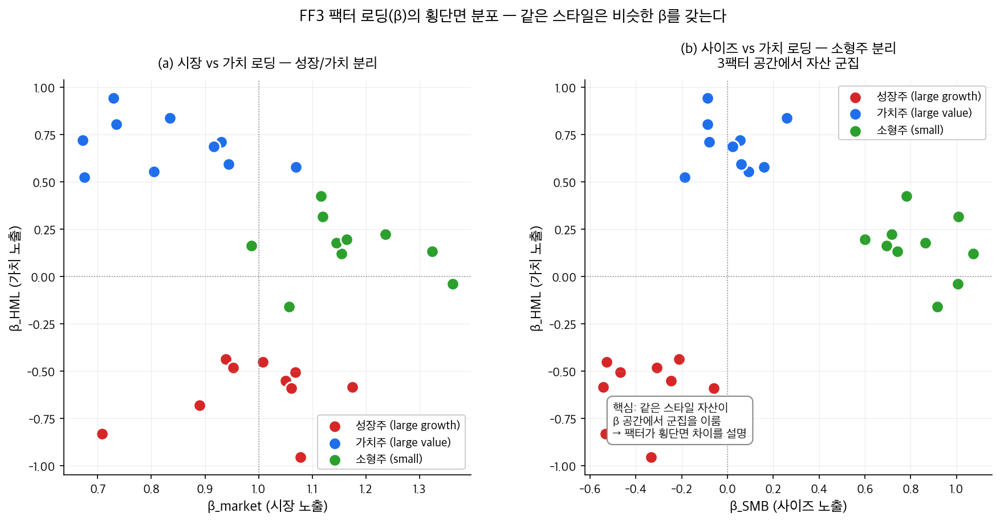
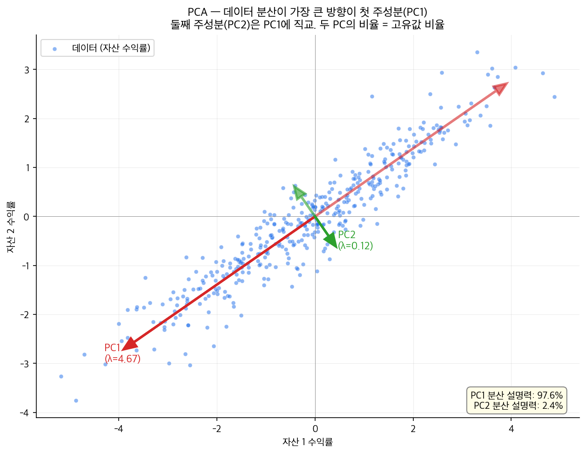

# 7단원: 팩터모델과 APT — 시장 하나로는 부족하다

---

## 1. 왜? — 이 단원을 배우는 이유

6단원에서 우리는 CAPM(자본자산가격결정모형)을 배웠다. CAPM은 이렇게 말했다:

> **"모든 자산의 기대수익률은 시장 베타($\beta_M$) 하나로 설명된다."**

그런데 실제 데이터에 적용하면 두 가지 실패가 드러났다:

1. **$\alpha \neq 0$** — 수익률을 시장수익률에 회귀하면 절편(알파)이 통계적으로 유의하게 0이 아니다. CAPM이 맞다면 $\alpha = 0$이어야 하는데 그렇지 않다. [강의 3/13, 49:21]
2. **저베타 이상현상(low-beta anomaly)** — CAPM은 "베타가 높으면 수익률도 높다"고 예측하지만, 실제로는 저베타 주식이 고베타 주식보다 더 좋은 성과를 보인다. 너무 많은 운용자가 고베타 주식에 몰려 가격을 올려놓았기 때문이다. [강의 3/13, 50:12]

> **[참고: 저베타 이상현상의 원인]** 왜 저베타 주식이 고베타 주식보다 수익률이 높은가? 이에 대해서는 여러 가설이 제시되어 있으며, 그중 유력한 하나가 **차입 제약(leverage constraint) 가설**이다. 많은 투자자(연기금, 뮤추얼펀드 등)는 레버리지(빚을 내서 투자)를 사용할 수 없다. 이들은 높은 수익을 원할 때 레버리지 대신 고베타 주식을 사는 방법을 택한다. 이 수요 쏠림이 고베타 주식의 가격을 올리고 기대수익률을 낮춘다. 반대로 저베타 주식은 상대적으로 소외되어 저평가 상태로 남으며, 결과적으로 더 높은 수익률을 보인다. 이것은 여러 가설 중 하나이며, 행동재무학적 설명(투자자의 복권 선호, 과잉 자신감 등)도 제시되어 있다. [강의 3/13, 50:12]

이 실패들이 던지는 질문:

> **시장 수익률 하나만으로 자산수익률을 설명할 수 없다면, 어떤 추가 요인(팩터)이 필요한가? 그 팩터를 어떻게 찾는가?**

이것이 **다중팩터 모형**과 **APT(차익가격결정이론)**의 출발점이다.

---

## 2. 단원 흐름도

```
┌──────────────────┐     ┌──────────────────┐     ┌──────────────────┐
│ 6단원:           │     │ 단일팩터 모형    │     │ 다중팩터 모형    │
│ CAPM 실패        │────→│ CAPM은 F=R_M인   │────→│ 팩터가 여러 개:  │
│ α≠0, 저베타     │     │ 특수 경우일 뿐   │     │ E[R]-Rf = Σβ·λ  │
│ 이상현상         │     │                  │     │                  │
└──────────────────┘     └──────────────────┘     └──────────────────┘
                                                        │
                              ┌──────────────────────────┘
                              ▼
┌──────────────────┐     ┌──────────────────┐     ┌──────────────────┐
│ 등가성 정리:     │     │ APT:             │     │ APT의 한계:      │
│ 팩터모델         │◀────│ PCA로 팩터 추정  │────→│ 통계적 팩터는    │
│ = SDF 추정       │     │ R = a + Σβ·F + ε│     │ 해석 불가능      │
│ = 평균분산효율   │     │                  │     │                  │
└──────────────────┘     └──────────────────┘     └──────────────────┘
                                                        │
                              ┌──────────────────────────┘
                              ▼
┌──────────────────┐     ┌──────────────────┐     ┌──────────────────┐
│ 특성 기반 팩터   │     │ 사이즈 효과 발견 │     │ SMB 구성:        │
│ 의 등장:         │────→│ 소형주 > 대형주  │────→│ 2×3 이변량 정렬  │
│ 경제적 해석 가능 │     │                  │     │ 다른 특성 통제   │
│ 한 팩터를 찾자   │     │                  │     │                  │
└──────────────────┘     └──────────────────┘     └──────────────────┘
        │
        ▼
┌──────────────────┐
│ 8단원으로:       │
│ 사이즈 외에      │
│ 가치 팩터(HML)   │
│ → FF3 모형       │
└──────────────────┘
```

---

## 3. 가정 목록

이 단원의 이론이 세워지는 전제조건을 명시한다. 6단원의 가정에 추가되는 것들이다.

| 가정 | 뜻 (비전공자 언어) | 적용 범위 |
|------|-------------------|----------|
| **일물일가의 법칙(Law of One Price)** | 같은 미래 보상을 주는 자산은 같은 가격이어야 한다. 만약 다르면 차익거래(arbitrage)가 발생하여 가격이 수렴한다 | APT의 근거 |
| **무차익(No Arbitrage)** | 위험 없이 확실한 수익을 얻는 방법은 없다 | APT, 팩터모형 |
| **선형 팩터 구조** | 수익률이 팩터들의 선형결합(일차식)으로 표현될 수 있다. $R = a + \beta_1 F_1 + \beta_2 F_2 + \cdots + \varepsilon$. **한계:** 현실에서는 팩터와 수익률 사이에 비선형(곡선) 관계가 존재할 수 있다. 예를 들어 극단적 시장 상황에서 팩터의 효과가 비대칭적으로 커질 수 있다. 선형 가정은 분석을 다루기 쉽게 만들어 주지만, 현실의 근사치임을 인식해야 한다 | APT, 다중팩터 |
| **이디오싱크래틱 리스크의 분산가능성** | 개별 종목 고유의 위험($\varepsilon$)은 충분히 많은 종목을 모으면 평균이 0으로 수렴한다 | APT |
| **$\varepsilon_i$끼리 서로 무상관** | $\text{Cov}(\varepsilon_i, \varepsilon_j) = 0$ (리마인드: $\text{Cov}$는 공분산, 두 변수가 함께 움직이는 정도). 자산 $i$의 고유 잡음과 자산 $j$의 고유 잡음은 서로 관련이 없다. A기업의 CEO 교체가 B기업의 공장 화재와 상관없는 것과 같다 | APT |
| **$\varepsilon_i$와 팩터 무상관** | $\text{Cov}(\varepsilon_i, F_j) = 0$. 자산 $i$의 고유 잡음은 어떤 팩터와도 관련이 없다. 팩터로 설명되는 부분과 팩터로 설명되지 않는 부분이 깔끔하게 분리된다 | APT |
| **충분히 많은 자산** | 시장에 자산이 충분히 많아서 분산투자가 가능하다 | APT |
| **팩터 수 유한** | 팩터의 개수 $K$는 유한하며, 자산 수 $N$보다 훨씬 적다 ($K \ll N$). 팩터를 몇 개로 정할지는 PCA의 분산설명력(아래 정의 참조), 정보기준(AIC/BIC) 등을 기준으로 판단한다 | APT |
| **무위험자산 존재** | 위험이 전혀 없는 자산(예: 국채)이 존재하며, 그 수익률이 $R_f$이다. 이 가정이 있으면 제로베타 수익률 $R_Z = R_f$가 성립한다 | 팩터모형, APT |

---

## 4. 기호 사전 — 이 단원에서 새로 등장하는 용어

이 단원에는 새로운 개념이 많다. 처음 보는 용어를 여기서 한꺼번에 정리하고, 본문에서 다시 하나씩 설명한다.

| 용어 / 기호 | 읽는 법 | 뜻 | 비유 |
|-------------|---------|-----|------|
| **팩터(factor)** | "팩터" | 자산 수익률에 공통으로 영향을 미치는 요인. 예: 시장 전체의 등락, 기업 규모 | 날씨가 모든 농작물 수확량에 공통으로 영향을 미치는 것처럼, 팩터는 모든 자산에 공통으로 영향을 미치는 힘 |
| **$F$, $F_j$** | "에프", "에프 서브 제이" | $j$번째 팩터의 수익률 또는 값 | — |
| **로딩/노출(loading/exposure)** = **$\beta_j$** | "베타 서브 제이" | 자산이 $j$번째 팩터에 얼마나 민감한지를 나타내는 계수. "팩터가 1 움직이면 내 수익률이 $\beta_j$만큼 움직인다" | 온도(팩터)에 대한 아이스크림 판매(수익률)의 민감도. 온도가 1도 오를 때 판매가 100개 늘면, 로딩은 100 |
| **팩터 리스크프리미엄(factor risk premium)** = **$\lambda_j$** | "람다 서브 제이" | $j$번째 팩터에 노출되는 대가로 시장이 지불하는 보상. $\lambda_j = E[F_j] - R_f$ | 위험수당. 야간 근무(=위험 팩터)에 노출되면 추가 수당(=$\lambda$)을 받는 것 |
| **이디오싱크래틱 리스크(idiosyncratic risk)** = **$\varepsilon_i$** | "엡실론 서브 아이" | 자산 $i$에만 고유한 위험. 팩터로 설명되지 않는 나머지 | 모든 농작물에 영향을 미치는 날씨(=체계적 위험)와 달리, 특정 밭에서만 발생하는 병충해(=이디오싱크래틱 리스크) |
| **체계적 위험(systematic risk)** | — | 팩터로 설명되는 위험. 분산투자로 제거할 수 없다 | 날씨 자체를 없앨 수는 없다 |
| **$a_i$ (상수항)** | "에이 서브 아이" | 팩터모형에서 자산 $i$의 상수항. 기대수익률 중 팩터 노출($\beta$)로 설명되지 않는 기본 수준. 모든 팩터가 평균값일 때의 자산 $i$의 기대수익률에 해당한다 | 학생의 기본 점수. 시험 과목(팩터)의 난이도와 무관하게 받는 기저 점수 |
| **$b_j$ (SDF 계수)** | "비 서브 제이" | SDF(확률할인인자)에서 $j$번째 팩터의 가중치. $m = a + b_1 F_1 + b_2 F_2 + \cdots$에서 각 팩터가 SDF에 미치는 영향의 크기를 나타낸다 | — |
| **$R_Z$ (제로베타 수익률)** | "알 서브 지" | 팩터 베타($\beta$)가 모두 0인 자산의 기대수익률. 어떤 팩터와도 함께 움직이지 않는 자산이 받는 수익률이다. 무위험자산이 존재하면 $R_Z = R_f$와 같다 | — |
| **직교(orthogonal)** | "직교" | 두 벡터(또는 변수)가 서로 수직으로 만나는 관계. 기호로 $\perp$로 쓴다. 통계에서 두 변수가 직교하면 상관관계가 0이다 — 하나를 알아도 다른 하나에 대해 아무 정보를 주지 않는다 | 좌표평면에서 x축과 y축은 90도로 만난다. x축 위에서 아무리 멀리 가도 y축 값은 바뀌지 않는다. 마찬가지로 직교하는 두 팩터는 서로에게 아무 영향을 주지 않는다 |
| **분산설명력** | — | 전체 데이터의 점수 차이(분산) 중에서 특정 요인이 차지하는 비율. 예를 들어 "PC1의 분산설명력 = 60%"는 자산 수익률 전체 변동의 60%를 첫 번째 주성분 하나가 설명한다는 뜻이다 | — |
| **SDF(Stochastic Discount Factor, 확률할인인자)** | "에스디에프" | 6단원에서 배운 "만능 할인기계". 모든 자산의 가격을 설명하는 확률변수. $E[mR_i] = 1$을 만족한다 (리마인드: "SDF와 수익률을 곱한 것의 기댓값은 1이다" — 올바른 할인을 적용하면 현재가치와 미래가치가 딱 맞아떨어진다는 뜻) | — |
| **평균-분산 프론티어** | — | 리마인드: 주어진 위험(분산) 수준에서 달성 가능한 최대 기대수익률의 경계선. 프론티어 위의 포트폴리오는 "같은 위험에서 이보다 더 높은 수익을 얻을 수 없다"는 의미에서 효율적이다 | — |
| **PCA(주성분분석, Principal Component Analysis)** | "피씨에이" | 많은 변수의 움직임에서 가장 큰 변동을 설명하는 소수의 "주성분"을 뽑아내는 통계 기법 | 100명 학생의 시험 점수에서 "수학 실력"과 "언어 실력"이라는 2개의 주성분이 대부분의 점수 차이를 설명하는 것 |
| **주성분(principal component)** | — | PCA로 추출한 각각의 요인. 서로 직교(orthogonal)한다 = 서로 상관관계가 0이다 | — |
| **시총(market cap, 시가총액)** | — | 주가 × 발행주식수. 기업의 시장 가치 | 삼성전자의 시총은 약 400조원 |
| **B/M(장부가/시장가, Book-to-Market)** | "비 오버 엠" | 기업의 장부가치(회계상 자산 가치) ÷ 시장가치(시총). 높으면 가치주, 낮으면 성장주 | 중고차의 공식 시세(장부가) ÷ 실제 거래가(시장가). 시세보다 싸게 거래되면 B/M이 높다 |
| **퀸타일(quintile)** | "퀸타일" | 데이터를 5등분한 각 그룹. 1분위=하위 20%, 5분위=상위 20% | 반 학생을 성적순으로 5그룹으로 나눈 것 |
| **데사일(decile)** | "데사일" | 데이터를 10등분한 각 그룹. 1분위=하위 10%, 10분위=상위 10% | — |
| **일변량 정렬(univariate sort)** | — | 하나의 특성만으로 종목을 정렬·분류 | 키 순서로만 줄 세우기 |
| **이변량 정렬(bivariate sort)** | — | 두 가지 특성을 동시에 고려하여 종목을 정렬·분류 | 키와 몸무게 두 가지로 동시에 분류 |
| **자기금융(self-financing)** | — | 포트폴리오를 구성하는 데 초기 자본이 필요 없음. 매수 금액 = 매도 금액 | 빌린 돈으로 투자하되 빌린 만큼만 투자하는 것. 주머니에서 돈을 꺼내지 않아도 된다 |
| **SMB(Small Minus Big)** | "에스엠비" | 소형주 수익률 − 대형주 수익률. 사이즈 팩터를 대표하는 포트폴리오 | — |
| **$\sum$ (시그마, 합 기호)** | "시그마" 또는 "합" | 여러 항을 더하라는 기호. $\sum_{j=1}^{K} x_j$는 "$j$를 1부터 $K$까지 바꿔가며 $x_j$를 모두 더하라"는 뜻. 한국어로 "제이가 1부터 케이까지의 엑스 제이의 합"이라 읽는다 | — |
| **Cov (공분산)** | "코브" 또는 "공분산" | 리마인드: $\text{Cov}(X, Y)$는 두 변수 $X$와 $Y$가 함께 움직이는 정도. 양수이면 같은 방향, 음수이면 반대 방향으로 움직인다. 0이면 선형적으로 무관하다 | — |
| **Var (분산)** | "바" 또는 "분산" | 리마인드: $\text{Var}(X)$는 변수 $X$가 평균에서 얼마나 흩어져 있는지를 나타내는 측도. $\text{Var}(X) = \text{Cov}(X, X)$이다 | — |

---

## 5. 단일팩터 모형의 일반화 — CAPM은 특수 경우일 뿐

### 5.1 CAPM을 다시 보자

6단원에서 배운 CAPM 공식:

$$E[R_i] - R_f = \beta_{i,M} \cdot (E[R_M] - R_f)$$

이 식을 분해하면 세 부분이다:

| 부분 | 의미 |
|------|------|
| $E[R_i] - R_f$ | 자산 $i$의 **리스크프리미엄** — 위험을 감수한 대가 |
| $\beta_{i,M} = \frac{\text{Cov}(R_i, R_M)}{\text{Var}(R_M)}$ | 자산 $i$가 **시장에 얼마나 민감**한지 (로딩/노출) |
| $E[R_M] - R_f$ | **시장 리스크프리미엄** ($\lambda_M$) — 시장 위험에 대한 보상 |

여기서 핵심을 뽑아내면:

> **리스크프리미엄 = 팩터에 대한 민감도($\beta$) × 팩터의 리스크프리미엄($\lambda$)**

CAPM은 이 공식에서 **팩터가 시장 수익률($R_M$) 단 하나**인 경우다.

### 5.2 일반적 단일팩터 모형

팩터를 시장 수익률이 아닌 **임의의 팩터 $F$**로 바꾸면 더 일반적인 모형이 된다: [강의 3/13, 14:19]

$$E[R_i] - R_f = \beta_{i,F} \cdot \lambda_F$$

여기서:
- $\beta_{i,F} = \frac{\text{Cov}(R_i, F)}{\text{Var}(F)}$ — 자산 $i$가 팩터 $F$에 대해 갖는 **민감도(로딩)**
- $\lambda_F$ — 팩터 $F$의 **리스크프리미엄** (팩터에 노출되는 대가로 받는 보상)

> **비유:** CAPM은 "자산 수익률의 차이는 오직 '시장 날씨'에 대한 민감도로 결정된다"고 말한 것이다. 일반적 단일팩터 모형은 "날씨 대신 다른 요인(예: '이자율', '물가상승률' 등)이 결정 요인일 수 있다"고 확장한 것이다.

> **[이론적 근거 — 전방 참조]** 이 일반적 단일팩터 모형이 성립하려면, SDF(확률할인인자)가 팩터 $F$의 선형함수여야 한다. 즉 $m = a + bF$ 형태여야 한다. 이에 대한 자세한 내용은 아래 7절(등가성 정리)에서 다룬다.

### 5.3 $R_Z = R_f$의 내적 정합성

> **[주의]** 이 소절은 모형의 "증명"이 아니라, 위 공식이 내부적으로 모순이 없는지 확인하는 **내적 정합성 점검(sanity check)**이다.

위 공식에서 $R$에 무위험자산($R_f$)을 대입하면 어떻게 되는가?

- $\text{Cov}(R_f, F) = 0$ — 무위험자산의 수익률은 상수이므로 어떤 것과도 공분산이 0이다
- 따라서 $\beta_{R_f, F} = 0$
- 식의 오른쪽이 0이 되므로: $E[R_f] - R_f = 0$ ✓

이것은 무위험자산의 수익률이 $R_f$ 자체와 일치함을 확인해 주는 것이다. 6단원에서 제로베타 수익률($R_Z$ — 팩터 베타가 0인 자산의 기대수익률)이라 불렀던 것이 $R_f$와 같다는 논리와 동일하다. 무위험자산이 존재하면 $R_Z = R_f$가 성립한다. [강의 3/13, 14:19]

---

## 6. 다중팩터 모형 — 왜 팩터를 늘려야 하는가?

### 6.0 팩터 로딩(β)의 횡단면 분포 — 다중팩터의 직관

같은 팩터 모형을 30개 자산에 적합하면, 각 자산은 (β_market, β_SMB, β_HML)이라는 **팩터 공간의 한 점**으로 표현된다. 같은 스타일(성장/가치/소형)의 자산은 이 공간에서 **군집을 이룬다**.



- **(a) 좌**: 시장 노출 vs 가치 노출 평면. 가치주(파랑) β_HML > 0, 성장주(빨강) β_HML < 0으로 분리.
- **(b) 우**: 사이즈 노출 vs 가치 노출 평면. 소형주(녹색) β_SMB > 0으로 우측 군집.
- → 단일 팩터(시장)로는 이 군집을 분리 못 함. **다중 팩터가 필요한 이유**가 시각적으로 보임.

### 6.1 동기: 하나로는 부족하다

CAPM(단일팩터, F = 시장)이 실패했다는 것은:

> **시장 수익률 하나만으로는 자산들 간의 수익률 차이를 모두 설명할 수 없다.**

실제로 자산 수익률에 영향을 미치는 공통 요인은 여러 개일 수 있다. 예를 들어:
- 시장 전체의 등락 (시장 팩터)
- 기업 규모의 대소 (사이즈 팩터)
- 기업의 저평가/고평가 (가치 팩터)
- 금리 변동, 인플레이션 등

### 6.2 다중팩터 모형의 공식

팩터가 $K$개 있다면: [강의 3/13, 14:19]

$$E[R_i] - R_f = \beta_{i,1} \cdot \lambda_1 + \beta_{i,2} \cdot \lambda_2 + \cdots + \beta_{i,K} \cdot \lambda_K = \sum_{j=1}^{K} \beta_{i,j} \cdot \lambda_j$$

> **한 문장으로:** 자산 $i$의 리스크프리미엄은, 각 팩터에 대한 민감도($\beta$)와 그 팩터의 위험보상($\lambda$)을 곱한 것을 모두 합한 값이다.

각 항을 읽어 보자:

| 항 | 읽는 법 | 의미 |
|----|---------|------|
| $\beta_{i,1} \cdot \lambda_1$ | "베타 아이 일 곱하기 람다 일" | 첫 번째 팩터에 대한 민감도 × 첫 번째 팩터의 위험보상 |
| $\beta_{i,2} \cdot \lambda_2$ | "베타 아이 이 곱하기 람다 이" | 두 번째 팩터에 대한 민감도 × 두 번째 팩터의 위험보상 |
| $\sum_{j=1}^{K}$ | "제이가 일부터 케이까지의 합" | $j = 1$부터 $K$까지 모든 항을 더하라 |

> **비유:** CAPM이 "이 학생의 대학 입시 성적은 수학 점수 하나로 결정된다"라면, 다중팩터 모형은 "수학 점수, 영어 점수, 면접 점수를 모두 고려해야 한다"라고 말하는 것이다. 각 과목에 대한 가중치($\beta$)와 각 과목의 중요도($\lambda$)가 합쳐져서 최종 결과를 결정한다.

> **왜 $\lambda_j$에 보상이 주어지는가?** SDF와 연결하여 생각하면: 경제가 나쁜 시기(SDF가 높은 시기, 즉 소비가 줄어 화폐의 가치가 높아지는 시기)에 손실을 주는 팩터는, 투자자에게 가장 아쉬운 순간에 돈을 빼앗아 가는 셈이다. 이런 팩터에 노출되는 것은 고통스러우므로, 시장은 이 고통에 대한 보상($\lambda_j > 0$)을 지불해야 한다. 반대로 나쁜 시기에 오히려 수익을 주는 팩터(= 보험 역할)에는 보상이 필요 없거나, 오히려 투자자가 프리미엄을 지불한다($\lambda_j < 0$).

### 6.3 핵심 질문: 팩터가 뭔데?

모형의 형태는 알겠다. 하지만 진짜 어려운 질문이 남아 있다:

> **팩터가 몇 개인지도 모르고, 어떤 팩터인지도 모른다. 어떻게 찾는가?** [강의 3/13, 14:19]

이 질문에 대해 크게 두 가지 접근이 있다:

| 접근 | 방법 | 장점 | 단점 |
|------|------|------|------|
| **통계적 접근** (APT) | PCA 등으로 데이터에서 팩터를 추출 | 데이터가 알려줌, 사전 지식 불필요 | 추출된 팩터가 무엇을 의미하는지 알 수 없음 |
| **특성 기반 접근** | 사이즈, 가치 등 경제적으로 해석 가능한 특성을 팩터로 사용 | 직관적이고 해석 가능 | 어떤 특성이 진짜 팩터인지 판단이 주관적 |

이 두 접근을 순서대로 살펴보자.

---

## 7. 팩터모델의 세 가지 등가성 — 핵심 정리

팩터를 찾는 구체적 방법을 보기 전에, **왜 팩터를 찾는 것이 그토록 중요한지**를 정리하자. 강의에서 강조된 핵심 정리다. [강의 3/13, 14:19]

### 7.1 등가성 1: 팩터모델 = SDF 추정

6단원에서 SDF(Stochastic Discount Factor, 확률할인인자) $m$을 배웠다. SDF는 모든 자산의 가격을 설명하는 "만능 할인기계"였다:

$$E[m \cdot R_i] = 1 \quad \text{(모든 자산 } i \text{에 대해)}$$

> **리마인드:** 이 식의 의미는 "올바른 할인인자($m$)를 적용하면, 어떤 자산의 수익률이든 현재가치로 환산했을 때 1(= 투자 원금)과 같아진다"는 것이다. SDF를 알면 모든 자산의 적정 가격을 계산할 수 있다.

이제 핵심 정리:

> **SDF가 팩터들의 선형함수(일차식)로 표현되면, 그것은 팩터모형과 동치이다.**

수식으로 쓰면:

$$m = a + b_1 F_1 + b_2 F_2 + \cdots + b_K F_K$$

> **[참고: 아핀 함수]** 수학적으로 이 식은 상수항 $a$가 있으므로 "아핀(affine) 함수"라 부르는 것이 정확하지만, 금융경제학에서는 관례적으로 "선형함수"라 부른다. 이 교재에서도 관례를 따른다.

이 $m$이 SDF라는 것(= $E[m \cdot R_i] = 1$을 만족한다는 것)은 다음 팩터모형이 성립한다는 것과 **같은 말**이다:

$$E[R_i] - R_f = \sum_{j=1}^{K} \beta_{i,j} \cdot \lambda_j$$

> **한 문장으로:** "SDF가 팩터의 선형함수"라는 것과 "기대수익률이 팩터 베타의 선형결합으로 표현된다"는 것은 동일한 진술이다.

> **무슨 뜻인가?** 팩터를 찾는 것은 SDF를 추정하는 것과 동일한 작업이다. SDF만 정확히 알면 모든 자산의 미래 수익률을 설명할 수 있다고 했는데, 팩터를 정확히 찾는 것이 곧 SDF를 아는 것이다. [강의 3/13, 14:19]

#### 왜 이 등가가 성립하는가? (정방향 유도: SDF가 선형 → 팩터모형)

6단원에서 유도한 SDF 공식을 떠올리자:

$$E[R_i] - R_Z = -\frac{\text{Cov}(R_i, m)}{E[m]}$$

> **리마인드:** $R_Z$는 팩터 베타가 0인 자산의 기대수익률이다. 무위험자산이 있으면 $R_Z = R_f$와 같다.

여기서 $m = a + \sum_j b_j F_j$를 대입하면:

$$\text{Cov}(R_i, m) = \text{Cov}\left(R_i, \, a + \sum_j b_j F_j\right)$$

**공분산의 성질을 적용한다:**
- 공분산은 덧셈을 풀어 쓸 수 있다: $\text{Cov}(X, Y+Z) = \text{Cov}(X,Y) + \text{Cov}(X,Z)$
- 상수($a$)와의 공분산은 0이다: $\text{Cov}(X, a) = 0$
- 상수 배수($b_j$)는 바깥으로 꺼낼 수 있다: $\text{Cov}(X, b_j Y) = b_j \cdot \text{Cov}(X, Y)$

따라서:

$$\text{Cov}(R_i, m) = \sum_j b_j \cdot \text{Cov}(R_i, F_j)$$

이것을 $E[R_i] - R_Z$의 식에 대입하면:

$$E[R_i] - R_Z = -\frac{\sum_j b_j \cdot \text{Cov}(R_i, F_j)}{E[m]}$$

각 $j$에 대해 $\beta_{i,j} = \frac{\text{Cov}(R_i, F_j)}{\text{Var}(F_j)}$로 정의하고, $\lambda_j = -\frac{b_j \cdot \text{Var}(F_j)}{E[m]}$로 정의하면: [강의 3/13, 14:19]

$$E[R_i] - R_Z = \sum_j \beta_{i,j} \cdot \lambda_j$$

이것이 바로 다중팩터 모형이다. SDF가 팩터의 선형함수이면 팩터모형이 나온다.

> **$\lambda_j$의 음수 부호($-$)가 의미하는 것:** $\lambda_j = -\frac{b_j \cdot \text{Var}(F_j)}{E[m]}$에서 분모 $E[m]$과 $\text{Var}(F_j)$는 모두 양수이다. 따라서 $\lambda_j$의 부호는 $-b_j$의 부호, 즉 $b_j$의 부호의 반대가 된다. 직관적으로: SDF가 높은 시기는 경제가 나쁜 시기다. 팩터 $F_j$가 SDF와 양의 관계($b_j > 0$)라면, 이 팩터는 나쁜 시기에 값이 올라가는 "보험" 역할을 한다. 보험은 보상을 줄 필요가 없으므로 $\lambda_j < 0$(= 음의 프리미엄)이다. 반대로 $b_j < 0$이면, 팩터가 나쁜 시기에 값이 떨어져서 투자자에게 손실을 주므로 $\lambda_j > 0$(= 양의 프리미엄, 위험수당)이 필요하다.

> **여기서 $\lambda_j$의 의미를 다시 보자:** $\lambda_j = -\frac{b_j \cdot \text{Var}(F_j)}{E[m]}$이므로, $\lambda_j$는 $j$번째 팩터가 SDF에 미치는 영향($b_j$)과 팩터의 변동성($\text{Var}(F_j)$)에 비례한다. 즉, **SDF와 강하게 연관된 팩터일수록, 그리고 변동이 큰 팩터일수록, 더 큰 리스크프리미엄을 지불해야 한다.** [강의 3/13, 14:19]

#### 유도 과정 단계별 흐름도 (SDF 등가성)

```
┌──────────────────────────────────────────────────────────────┐
│ 출발점: SDF 공식                                             │
│   E[Rᵢ] - R_Z = -Cov(Rᵢ, m) / E[m]                        │
└──────────────────────┬───────────────────────────────────────┘
                       │ m = a + Σⱼ bⱼFⱼ 를 대입
                       ▼
┌──────────────────────────────────────────────────────────────┐
│ 공분산 분해                                                  │
│   Cov(Rᵢ, m) = Cov(Rᵢ, a + Σⱼ bⱼFⱼ)                      │
│                                                              │
│   적용 규칙:                                                 │
│   ① 상수 a와의 공분산 = 0 → 사라짐                          │
│   ② 덧셈을 풀어 쓸 수 있다 → Σⱼ Cov(Rᵢ, bⱼFⱼ)            │
│   ③ 상수 bⱼ를 바깥으로 → Σⱼ bⱼ·Cov(Rᵢ, Fⱼ)               │
└──────────────────────┬───────────────────────────────────────┘
                       │ 대입
                       ▼
┌──────────────────────────────────────────────────────────────┐
│ 대입 결과                                                    │
│   E[Rᵢ] - R_Z = -Σⱼ bⱼ·Cov(Rᵢ,Fⱼ) / E[m]                │
└──────────────────────┬───────────────────────────────────────┘
                       │ βᵢⱼ = Cov(Rᵢ,Fⱼ)/Var(Fⱼ) 로 정의
                       │ λⱼ = -bⱼ·Var(Fⱼ)/E[m] 로 정의
                       ▼
┌──────────────────────────────────────────────────────────────┐
│ 결론: 다중팩터 모형                                          │
│   E[Rᵢ] - R_Z = Σⱼ βᵢⱼ · λⱼ                               │
│                                                              │
│ → SDF가 팩터의 선형함수이면 팩터모형이 성립한다              │
└──────────────────────────────────────────────────────────────┘
```

#### 역방향: 팩터모형 → SDF가 선형함수

위에서 보인 것은 "SDF가 팩터의 선형함수이면 → 팩터모형이 성립한다"는 정방향이었다. 역방향("팩터모형이 성립하면 → SDF를 팩터의 선형함수로 표현할 수 있다")도 성립한다. 역방향의 핵심 아이디어는: 팩터 가격결정식 $E[R_i] - R_f = \sum_j \beta_{i,j} \lambda_j$가 모든 자산에 대해 성립하면, $m = a + \sum_j b_j F_j$ 형태의 확률변수를 구성하여 $E[mR_i] = 1$을 만족시킬 수 있다는 것이다. 엄밀한 증명은 교재의 자산가격결정이론 장을 참조하라.

### 7.2 등가성 2: 팩터모델 = 평균-분산 효율성

6단원에서 CAPM이 성립하면 시장 포트폴리오가 평균-분산 프론티어(리마인드: 주어진 위험 수준에서 달성 가능한 최대 수익률의 경계선) 위에 놓인다는 것을 보았다. 이것은 일반화된다: [강의 3/13, 14:19]

> **정확한 팩터들을 찾으면, 그 팩터들로 구성한 포트폴리오가 평균-분산 프론티어 위에 놓인다.**

왜인가? 직관적으로:
- 팩터모형이 모든 자산의 수익률을 완벽히 설명한다면, 팩터 포트폴리오 밖에서 추가 수익을 얻을 수 없다
- 추가 수익을 얻을 수 없다는 것은 팩터 포트폴리오가 이미 최적이라는 뜻이다
- 최적의 포트폴리오는 평균-분산 프론티어 위에 있다

> 엄밀한 증명은 교재의 자산가격결정이론 장을 참조하라. 핵심 논리는 6단원에서 보았던 "SDF는 평균-분산 프론티어 위의 포트폴리오 수익률의 아핀 함수로 표현 가능하다"는 정리와 등가성 1을 결합하는 것이다.

### 7.3 세 가지 등가성 요약

```
    ┌─────────────────────────────┐
    │                             │
    │   정확한 팩터를 찾는 것     │
    │                             │
    └──────┬──────────┬───────────┘
           │          │
     ┌─────▼─────┐  ┌▼───────────────┐
     │ SDF를     │  │ 팩터 포트폴리오│
     │ 정확히    │  │ 가 평균-분산   │
     │ 추정하는  │  │ 프론티어 위에  │
     │ 것        │  │ 놓이는 것      │
     └─────┬─────┘  └┬───────────────┘
           │         │
           └────┬────┘
                │
    ┌───────────▼───────────────┐
    │ 모든 자산의 리스크프리미엄│
    │ 을 완벽히 설명하는 것     │
    └───────────────────────────┘
```

> **이 등가성이 왜 중요한가?** 금융경제학의 핵심 과제인 "SDF 추정"이 "올바른 팩터 찾기"로 환원된다. 팩터를 찾으면 SDF를 아는 것이고, SDF를 알면 모든 자산의 적정 수익률을 알 수 있다. 이것이 팩터 연구가 자산운용의 중심에 있는 이유다. [강의 3/13, 14:19]

---

## 8. APT(차익가격결정이론) — 통계로 팩터를 찾자

### 8.1 APT의 출발점

CAPM 이후 "어떤 팩터가 수익률을 설명하는가?"라는 질문에 **통계적으로** 답하려는 시도가 등장했다. 이것이 **APT(Arbitrage Pricing Theory, 차익가격결정이론)**이다. [강의 3/13, 14:19]

APT의 핵심 아이디어:

> **수익률 데이터에서 통계적으로 팩터를 추출하자. 미리 "시장"이니 "사이즈"니 정하지 말고, 데이터가 알려주는 대로 찾자.**

### 8.2 APT 모형의 수식

자산 $i$의 수익률을 다음과 같이 분해한다: [강의 3/13, 14:19]

$$R_i = a_i + \beta_{i,1} F_1 + \beta_{i,2} F_2 + \cdots + \beta_{i,K} F_K + \varepsilon_i$$

> **한 문장으로:** 자산 $i$의 수익률은 기본 수준($a_i$)에, 각 팩터에 대한 민감도($\beta$)와 팩터값($F$)의 곱을 더하고, 팩터로 설명되지 않는 고유 잡음($\varepsilon_i$)을 더한 것이다.

각 부분을 읽어 보자:

| 부분 | 의미 |
|------|------|
| $a_i$ | 자산 $i$의 상수항 — 기대수익률 중 팩터 노출로 설명되지 않는 기본 수준 |
| $\beta_{i,j} F_j$ | 자산 $i$가 $j$번째 팩터에 노출된 정도($\beta_{i,j}$) × 팩터의 실현값($F_j$) |
| $\varepsilon_i$ | **이디오싱크래틱 리스크** — 팩터로 설명되지 않는, 자산 $i$에만 고유한 잡음. $E[\varepsilon_i] = 0$ |

> **비유:** 학생 $i$의 시험 점수 = 기본 점수 + (수학 실력에 대한 민감도 × 수학 난이도) + (영어 실력에 대한 민감도 × 영어 난이도) + 운(잡음). 여기서 수학 난이도와 영어 난이도가 **팩터**이고, 각 학생의 민감도가 **로딩($\beta$)**이다.

### 8.3 체계적 위험 vs 이디오싱크래틱 리스크

APT에서 수익률은 두 부분으로 나뉜다: [강의 3/13, 14:19]

```
R_i = [a_i + β_{i,1}·F_1 + ... + β_{i,K}·F_K] + [ε_i]
      ├──────── 체계적 부분 ─────────┤   ├ 고유 부분 ┤
```

| | 체계적 위험 (systematic risk) | 이디오싱크래틱 리스크 (idiosyncratic risk) |
|--|------|------|
| **원천** | 팩터($F_j$)의 변동 | 개별 자산 고유의 사건 |
| **분산투자** | 제거 불가 — 모든 자산에 공통으로 영향 | 제거 가능 — 충분히 많은 자산에 투자하면 $\varepsilon$의 평균이 0으로 수렴 |
| **보상** | 시장이 리스크프리미엄($\lambda$)으로 보상 | 보상 없음 — 분산투자로 없앨 수 있으므로 |
| **비유** | 태풍(모든 농작물에 영향) | 특정 밭의 해충(그 밭에서만 발생) |

> **중요한 함의:** 분산투자를 잘 하면 이디오싱크래틱 리스크를 없앨 수 있으므로, 투자자가 신경 써야 할 것은 오직 **체계적 위험에 대한 노출($\beta$)**뿐이다. 이것이 팩터와 로딩이 중요한 이유다. [강의 3/13, 14:19]

### 8.4 APT의 핵심 논증 — 분산투자와 차익거래

APT가 팩터 가격결정식 $E[R_i] - R_f = \sum_j \beta_{i,j} \lambda_j$를 도출하는 핵심 논증을 단계별로 따라가 보자.

#### 단계 1: 분산투자로 $\varepsilon$ 소멸

$N$개 자산에 각각 $1/N$의 가중치로 투자하는 포트폴리오 $P$를 생각하자:

$$R_P = \frac{1}{N}\sum_{i=1}^{N} R_i = \frac{1}{N}\sum_{i=1}^{N} a_i + \sum_{j=1}^{K}\left(\frac{1}{N}\sum_{i=1}^{N}\beta_{i,j}\right) F_j + \frac{1}{N}\sum_{i=1}^{N}\varepsilon_i$$

마지막 항 $\frac{1}{N}\sum_{i=1}^{N}\varepsilon_i$에 주목하자. 가정에 의해 $\varepsilon_i$들은 서로 무상관이고($\text{Cov}(\varepsilon_i, \varepsilon_j) = 0$), 기댓값이 0이며, 분산이 유한하다($\text{Var}(\varepsilon_i) \leq \sigma^2_{\max}$). 이 조건에서:

$$\text{Var}\left(\frac{1}{N}\sum_{i=1}^{N}\varepsilon_i\right) = \frac{1}{N^2}\sum_{i=1}^{N}\text{Var}(\varepsilon_i) \leq \frac{N \cdot \sigma^2_{\max}}{N^2} = \frac{\sigma^2_{\max}}{N}$$

$N$이 충분히 크면 이 분산은 0에 가까워진다. 즉, **충분히 많은 자산에 분산투자하면 이디오싱크래틱 리스크가 사실상 사라진다.** 이렇게 고유 위험이 소멸된 포트폴리오를 **well-diversified 포트폴리오**라 부른다. 이 포트폴리오의 수익률은 팩터에 의해서만 결정된다:

$$R_P \approx a_P + \beta_{P,1} F_1 + \beta_{P,2} F_2 + \cdots + \beta_{P,K} F_K$$

#### 단계 2: 같은 $\beta$를 가진 well-diversified 포트폴리오의 차익거래 논증

이제 두 개의 well-diversified 포트폴리오 $P$와 $Q$가 모든 팩터에 대해 같은 로딩을 가진다고 하자: $\beta_{P,j} = \beta_{Q,j}$ (모든 $j$에 대해).

두 포트폴리오의 수익률 차이:

$$R_P - R_Q \approx (a_P - a_Q)$$

고유 위험($\varepsilon$)은 이미 분산투자로 소멸했으므로, 이 차이는 거의 확실한(= 무위험에 가까운) 값이다. 만약 $a_P \neq a_Q$라면, 높은 쪽을 사고 낮은 쪽을 팔면 위험 없이 확실한 이익을 얻는 차익거래가 가능하다. 무차익 가정에 의해 이것은 불가능하므로:

$$a_P = a_Q$$

**결론:** 같은 팩터 로딩을 가진 well-diversified 포트폴리오들은 반드시 같은 기대수익률을 가져야 한다.

#### 단계 3: $\beta = 0$이면 $R_f$, 그리고 선형 가격결정식의 도출

모든 팩터에 대해 $\beta_j = 0$인 well-diversified 포트폴리오를 생각하면, 이 포트폴리오는 팩터 위험에 전혀 노출되지 않고, 고유 위험도 소멸했으므로 사실상 무위험이다. 따라서 그 기대수익률은 $R_f$여야 한다:

$$\beta_j = 0 \text{ (모든 } j\text{)} \implies E[R_P] = R_f$$

이것은 $a_P = R_f$를 의미한다.

이제 일물일가의 법칙과 선형결합의 가격 선형성을 적용한다. 서로 다른 팩터 로딩을 가진 well-diversified 포트폴리오들의 기대수익률은 그 로딩의 선형함수여야 한다. 왜냐하면: 두 포트폴리오의 선형결합도 well-diversified 포트폴리오이고, 선형결합의 로딩은 로딩의 선형결합이며, 일물일가에 의해 기대수익률도 선형결합의 기대수익률과 같아야 하기 때문이다. 절편이 $R_f$이므로:

$$E[R_P] - R_f = \sum_{j=1}^{K} \beta_{P,j} \cdot \lambda_j$$

여기서 $\lambda_j$는 팩터 $j$에 대한 로딩이 1이고 나머지 로딩이 0인 well-diversified 포트폴리오의 리스크프리미엄이다.

#### 단계 4: 개별 자산에 대한 근사적 성립 (Ross의 원래 결과)

위 논증은 **well-diversified 포트폴리오**에 대해 정확히 성립한다. **개별 자산**에 대해서는 $\varepsilon_i$가 완전히 소멸하지 않으므로, APT 가격결정식은 **근사적으로** 성립한다:

$$E[R_i] - R_f \approx \sum_{j=1}^{K} \beta_{i,j} \cdot \lambda_j$$

Ross(1976)의 원래 결과는 정확히 이것이다: APT는 "대부분의" 자산에 대해 위 식이 "거의" 성립한다고 말한다. 구체적으로, 가격결정 오차($E[R_i] - R_f - \sum_j \beta_{i,j}\lambda_j$)의 제곱합이 유한하다는 것이 보장된다. 이것은 CAPM과 같은 균형 모형이 모든 자산에 대해 정확히 성립한다고 주장하는 것과 대비되는 APT의 특징이다.

### 8.5 PCA로 팩터 추출하기

APT에서 팩터를 찾는 대표적 통계 기법이 **PCA(주성분분석)**이다. [강의 3/13, 14:19]

**PCA가 하는 일:**
1. 수백~수천 개 자산의 수익률 데이터를 모은다
2. 이 수익률들의 공통 움직임 패턴을 찾는다
3. 변동의 대부분(예: 분산설명력 90% 이상)을 설명하는 소수의 "주성분"을 추출한다
4. 이 주성분들을 팩터($F_1, F_2, \ldots, F_K$)로 사용한다



> **그림 읽는 법** — 두 자산 수익률의 산점도. 데이터가 분명한 방향성을 가짐.
> - **빨간 화살표 (PC1)**: 데이터의 분산이 가장 큰 방향. 길이는 √λ₁
> - **초록 화살표 (PC2)**: PC1에 직교하면서 분산이 두 번째로 큰 방향. 길이는 √λ₂
> - 우측 박스의 분산 설명력 = λᵢ / (λ₁ + λ₂)
>
> PCA는 데이터의 자연스러운 좌표축을 새로 만드는 것 — 가장 큰 변동을 첫 축으로, 그 다음 큰 변동을 둘째 축으로. 이렇게 만든 PC들이 곧 APT의 통계적 팩터다. (A1단원의 고유값 분해와 직접 연결)

> **비유:** 100명 학생의 10과목 시험 점수 데이터가 있다고 하자. PCA를 적용하면 "이과 능력"과 "문과 능력"이라는 2개의 주성분이 전체 점수 변동의 80%를 설명할 수 있다. 10과목의 복잡한 데이터를 2개의 핵심 요인으로 압축한 것이다.

**PCA로 추출한 팩터의 성질:**
- 주성분들은 서로 **직교(orthogonal)**한다 — 서로 상관관계가 0이다. 직교란 "90도로 만나는 화살표"와 같다: 좌표평면에서 x축과 y축이 직각으로 만나듯이, 직교하는 두 주성분은 서로에게 아무 영향을 주지 않는다. 기호로는 $F_1 \perp F_2$로 쓴다.
- 평균을 빼서 $E[F_j] = 0$이 되도록 조정한다 [강의 3/13, 14:19]
- 첫 번째 주성분이 가장 큰 변동을 설명하고(= 분산설명력이 가장 크고), 두 번째가 그 다음, ... 순서대로 설명력이 줄어든다

> **PC1 ≈ 시장 팩터인 이유:** 주식 시장에서 대부분의 자산은 시장 전체와 양의 상관관계를 갖는다 — 시장이 오르면 대부분의 주식이 오르고, 시장이 내리면 대부분 내린다. PCA의 첫 번째 주성분(PC1)은 "자산 수익률의 변동을 가장 많이 설명하는 방향"이므로, 모든 자산이 공통으로 움직이는 방향, 즉 시장 전체의 등락 방향을 잡아낸다. 그 결과 PC1은 시가총액 가중평균 수익률(= 시장수익률)과 매우 비슷한 형태를 띤다. 다만, PC1이 정확히 시장 수익률인 것은 아니고, 통계적으로 가장 큰 변동 방향을 잡아낸 것이므로 "시장 팩터의 근사치"로 해석하는 것이 적절하다.

### 8.6 일물일가의 법칙과 APT

APT는 **일물일가의 법칙(Law of One Price)**에 기초한다. [강의 3/13, 14:19]

> 같은 미래 보상(payoff)을 주는 두 자산은 같은 가격이어야 한다. 만약 가격이 다르면 **차익거래(arbitrage)**가 가능하다: 싼 것을 사고 비싼 것을 팔아서 위험 없이 이익을 얻는다. 이런 기회는 시장의 합리적 투자자들에 의해 즉시 소멸된다.

이 법칙이 APT 모형에서 어떤 역할을 하는가?

- 팩터에 대한 노출($\beta$)이 같은 두 자산은 같은 기대수익률을 가져야 한다
- 만약 다르면 차익거래가 가능하므로 가격이 조정된다
- 따라서 기대수익률은 $\beta$에 의해서만 결정된다: $E[R_i] - R_f = \sum \beta_{i,j} \lambda_j$

### 8.7 APT의 한계 — 해석 불가능한 팩터

APT의 결정적 문제: [강의 3/13, 14:19]

> **PCA로 추출한 팩터는 경제적 의미를 알 수 없다.**

PCA가 뽑아낸 첫 번째 주성분은 "자산 수익률의 변동을 가장 많이 설명하는 선형결합"이지만, 그것이 **무엇 때문에** 움직이는지는 말해주지 않는다.

- 첫 번째 주성분: 시장 전체의 등락과 비슷해 보이지만(위의 "PC1 ≈ 시장 팩터" 설명 참조), 정확히 "시장"이라고 말할 수 없다
- 두 번째 주성분: 무엇인지 전혀 알 수 없는 숫자 나열

> **비유:** PCA는 "이 학교 학생들의 성적 차이를 가장 잘 설명하는 것은 주성분 1번이다"라고 말해주지만, 그 주성분 1번이 "수학 능력"인지 "가정환경"인지 "공부 시간"인지는 알려주지 않는다. 이름표 없는 팩터다.

이 한계가 다음 발전을 이끈다:

> **통계적 팩터가 해석 불가능하다면, 경제적으로 해석 가능한 팩터를 직접 찾아보자!**

---

## 9. 특성 기반 팩터의 등장 — 사이즈 효과

### 9.1 APT에서 특성 기반 팩터로

APT의 한계를 극복하기 위해 연구자들은 방향을 바꿨다: [강의 3/13, 14:19]

```
APT (통계적 접근)              특성 기반 접근
──────────────                ──────────────
데이터에서 팩터 추출     →     자산의 특성을 팩터로 사용
팩터의 정체 모름         →     팩터의 경제적 의미 명확
"주성분 1번이 중요"      →     "기업 규모가 중요"
```

**특성(characteristic)**이란 기업의 관찰 가능한 속성이다:
- 시가총액(시총, market cap) — 기업 규모
- B/M(장부가/시장가) — 저평가/고평가 정도
- 과거 수익률 — 모멘텀(추세)

이런 특성을 기반으로 팩터를 구성하면 "이 팩터가 왜 수익률을 설명하는지"를 경제적으로 해석할 수 있다.

### 9.2 사이즈 효과의 발견

역사적 데이터를 분석한 결과 다음이 발견되었다: [강의 3/13, 14:19]

> **시가총액이 작은 기업(소형주)이 시가총액이 큰 기업(대형주)보다 장기적으로 높은 수익률을 보인다.**

이것을 **사이즈 효과(size effect)**라고 부른다.

```
월평균 수익률(%)
  ^
  |
  | 1.47%
  |  ████
  |  ████ 1.28%
  |  ████  ████
  |  ████  ████ 1.12%
  |  ████  ████  ████
  |  ████  ████  ████ 0.98%
  |  ████  ████  ████  ████ 0.90%
  |  ████  ████  ████  ████  ████
  +──────────────────────────────→ 시총 크기
   소형주  2분위  3분위  4분위  대형주
   (1분위)                    (5분위)
```

> 위 숫자는 미국 주식시장(NYSE/AMEX/NASDAQ)의 장기 역사적 데이터에서 관찰되는 대략적 수치다. 소형주(1분위)의 월평균 수익률은 약 1.47%, 대형주(5분위)는 약 0.90%로, 그 차이인 **SMB ≈ 월 0.57%**(연 약 6.8%)가 사이즈 프리미엄에 해당한다.

> **사이즈 효과가 왜 존재하는가?** 이에 대해서는 크게 두 가지 설명이 제시된다:
> - **위험 기반 설명:** 소형주는 경기침체에 더 취약하다. 대기업은 경기가 나빠져도 버틸 체력이 있지만, 소기업은 매출 감소에 더 민감하고 도산 위험도 크다. 투자자 입장에서 이 추가 위험에 대한 보상(= 사이즈 프리미엄)이 필요하다.
> - **행동재무학적 설명:** 소형주는 대형주에 비해 애널리스트 커버리지가 적고, 투자자의 주목을 덜 받으며, 거래량이 적어 유동성이 부족하다. 이런 "소외"가 지속적인 저평가를 만들고, 결과적으로 높은 수익률로 이어진다.
> 두 설명 모두 완전하지는 않으며, 사이즈 효과의 크기는 시기와 시장에 따라 달라진다.

### 9.3 SMB 포트폴리오 — 사이즈 팩터를 포트폴리오로 만들기

사이즈 효과를 활용하는 전략: [강의 3/13, 14:19]

- **소형주를 매수(long)**하고 동시에 **대형주를 매도(short)**한다
- 매수 금액 = 매도 금액이므로 **자기금융(self-financing)** 포트폴리오다
- 초기 자본이 필요 없다

이것을 **SMB(Small Minus Big)** 포트폴리오라고 부른다.

> **한 문장으로:** SMB는 "소형주 수익률 빼기 대형주 수익률"로, 사이즈 효과가 존재하면 장기적으로 양(+)의 수익을 낸다.

> **자기금융이란?** 1억 원어치 소형주를 사고, 동시에 1억 원어치 대형주를 공매도한다. 공매도 대금으로 매수 자금을 충당하므로, 주머니에서 돈을 꺼낼 필요가 없다. 사이즈 효과가 존재하면, 소형주가 대형주보다 더 오르므로 양(+)의 수익이 발생한다.

### 9.4 SMB의 팩터모형에서의 역할

사이즈 팩터로 단일팩터 모형을 쓰면: [강의 3/13, 14:19]

$$R_i - R_f = \beta_{i,\text{SMB}} \cdot R_{\text{SMB}} + \varepsilon_i$$

> **한 문장으로:** 자산 $i$의 초과수익률은 사이즈 팩터(SMB)에 대한 민감도($\beta$)와 SMB 수익률의 곱에, 자산 고유의 잡음($\varepsilon$)을 더한 것이다.

- $\beta_{i,\text{SMB}} > 0$인 자산: 소형주와 비슷하게 움직인다 → 사이즈 리스크프리미엄을 받는다
- $\beta_{i,\text{SMB}} < 0$인 자산: 대형주와 비슷하게 움직인다
- $\beta_{i,\text{SMB}} \approx 0$인 자산: 사이즈와 무관하게 움직인다

---

## 10. SMB 구성법 — 왜 이변량 정렬인가?

### 10.1 순진한 접근의 문제

가장 단순한 방법: 전체 종목을 시총 순으로 정렬하고, 시총 중간값(median)을 기준으로 소형주(S)와 대형주(B)로 나눈 뒤, S의 평균 수익률에서 B의 평균 수익률을 빼면 SMB가 되지 않을까?

**문제:** 소형주와 대형주는 **다른 특성에서도 체계적으로 다를 수 있다.** [강의 3/13, 14:19]

예를 들어, 소형주는 B/M(장부가/시장가 비율)이 높은 경향이 있다. 즉, 소형주 그룹에 "가치주(value stock)"가 많이 섞여 있다. 그러면 소형주의 높은 수익률이:
- **사이즈 효과** 때문인지
- **가치 효과**(B/M이 높은 주식이 수익률이 높은 현상) 때문인지

구분할 수 없다. **사이즈 효과를 순수하게 측정하려면, 다른 특성의 영향을 통제(control)해야 한다.** [강의 3/13, 14:19]

### 10.2 이변량 정렬(Bivariate Sort) — 2×3 격자

Fama와 French가 제안한 SMB 구성법: [강의 3/13, 14:19]

**1단계: 시총으로 이분**
- 전체 종목을 시총 중간값(median)으로 나눈다
- 시총 < 중간값 → **S**(Small, 소형주)
- 시총 ≥ 중간값 → **B**(Big, 대형주)

**2단계: 각 그룹 내에서 B/M으로 삼분**
- S 그룹 내에서 B/M 비율의 30번째 백분위수와 70번째 백분위수로 세 그룹 생성
- B 그룹 내에서도 동일하게 세 그룹 생성

결과: **2 × 3 = 6개 포트폴리오**

```
┌─────────────────────────────────────────────────┐
│                   B/M 비율                      │
│          Low(L)      Medium(M)     High(H)      │
│          (성장주)                   (가치주)     │
├──────┬──────────┬──────────────┬─────────────────┤
│ S    │   SL     │    SM        │     SH          │
│소형주│ 소형+성장│  소형+중간   │   소형+가치     │
├──────┼──────────┼──────────────┼─────────────────┤
│ B    │   BL     │    BM        │     BH          │
│대형주│ 대형+성장│  대형+중간   │   대형+가치     │
└──────┴──────────┴──────────────┴─────────────────┘
```

**3단계: SMB 계산** [강의 3/13, 14:19]

$$\text{SMB} = \frac{1}{3}(R_{SH} + R_{SM} + R_{SL}) - \frac{1}{3}(R_{BH} + R_{BM} + R_{BL})$$

읽어 보자:
- **좌변:** SMB의 수익률
- **우변 첫째 항:** 소형주 3개 포트폴리오(SH, SM, SL)의 평균 수익률
- **우변 둘째 항:** 대형주 3개 포트폴리오(BH, BM, BL)의 평균 수익률
- **전체:** 소형주 평균 − 대형주 평균

SMB 구성의 실무적 가정(NYSE 분기점, B/M 시점, 리밸런싱 빈도 등)은 8단원 3.2절에서 상세히 다룬다.

### 10.3 왜 이 방법이 B/M 효과를 통제하는가?

핵심 논리: [강의 3/13, 14:19]

소형주 평균 = $\frac{1}{3}(R_{SH} + R_{SM} + R_{SL})$에는 B/M이 높은 것(SH), 중간인 것(SM), 낮은 것(SL)이 **균등하게** 포함되어 있다.

> **"균등"의 의미:** 여기서 "균등"이란 B/M의 세 수준(L, M, H)에 각각 1/3의 동일한 가중치를 부여한다는 뜻이다. 다만 각 셀 안의 종목 수가 정확히 같지는 않을 수 있으므로, 가중치가 균등하다는 것이지 종목 수가 균등하다는 것은 아니다.

대형주 평균 = $\frac{1}{3}(R_{BH} + R_{BM} + R_{BL})$에도 마찬가지로 B/M이 균등하게 포함되어 있다.

따라서 SMB = 소형주 평균 − 대형주 평균을 구하면:

> **B/M의 효과는 소형주와 대형주 양쪽에서 동일하게 들어가 있으므로, 차이를 구할 때 상쇄된다.** 남는 것은 순수한 사이즈 효과뿐이다.

> **[숨은 가정]** 이 통제가 완벽하게 작동하려면, B/M 효과가 소형주와 대형주 내에서 대략 같은 크기여야 한다(B/M과 수익률의 관계가 선형적이라는 가정). 만약 B/M 효과가 소형주에서 훨씬 크다면, 단순 평균으로는 완벽한 통제가 되지 않을 수 있다. 또한 이변량 정렬은 B/M이라는 제2 특성만 통제할 뿐, **제3의 특성**(예: 모멘텀, 유동성 등)은 여전히 미통제 상태로 남아 있다는 한계가 있다.

만약 단순히 S − B를 했다면, 소형주에 가치주가 많이 섞여 있을 경우 B/M 효과가 사이즈 효과로 오인될 수 있다.

> **비유:** "서울 학생이 지방 학생보다 시험을 잘 보는가?"를 알고 싶다고 하자. 단순 비교하면 서울에 학원이 많아서 높을 수 있다. 이변량 정렬은 "학원 이용 정도가 비슷한 그룹끼리" 서울 vs 지방을 비교하는 것이다. 학원 효과를 통제한 뒤에도 서울이 높다면, 그것이 순수한 지역 효과다.

---

## 11. 일변량 vs 이변량 포트폴리오 정렬

### 11.1 일변량 정렬(Univariate Sort)

가장 단순한 방법: [강의 3/13, 14:19]

1. 전체 종목을 **하나의 특성**(예: 시총)으로 정렬
2. 데사일(10등분) 또는 퀸타일(5등분)로 나눔
3. 각 그룹의 수익률을 비교

**장점:** 단순하고 직관적
**단점:** 다른 특성의 영향이 섞여 들어옴. 예를 들어 시총으로만 정렬하면, 소형주 그룹에 저베타 주식이 집중되어 있을 수 있다. 그러면 소형주의 높은 수익률이 사이즈 때문인지 저베타 때문인지 구분할 수 없다. [강의 3/13, 14:19]

### 11.2 이변량 정렬 — Dependent Sort vs Independent Sort

다른 특성의 영향을 통제하기 위해 **이변량(bivariate) 정렬**을 사용한다. 두 가지 방법이 있다: [강의 3/13, 14:19]

#### Dependent Sort (종속 정렬)

**절차:** [강의 3/13, 14:19]
1. **먼저** 통제 변수(예: 베타)로 퀸타일(5그룹) 정렬
2. **각 퀸타일 안에서** 관심 변수(예: 시총)로 다시 정렬하여 5~10그룹 생성
3. 각 시총 그룹의 최종 포트폴리오 = 5개 베타 퀸타일에 걸친 해당 시총 그룹의 **평균**

```
단계 1: 베타로 5분할
┌────────────────────────────────────────────────┐
│ β₁(최소) │ β₂     │ β₃     │ β₄     │ β₅(최대)│
└────┬───────┴───┬────┴───┬────┴───┬────┴───┬────┘
     │           │        │        │        │
단계 2: 각 β 그룹 내에서 시총으로 5분할
     ▼           ▼        ▼        ▼        ▼
 MC₁~MC₅    MC₁~MC₅  MC₁~MC₅  MC₁~MC₅  MC₁~MC₅

단계 3: 같은 시총 등급끼리 평균
 MC₁ 포트폴리오 = (β₁의 MC₁ + β₂의 MC₁ + ... + β₅의 MC₁) / 5
 MC₂ 포트폴리오 = (β₁의 MC₂ + β₂의 MC₂ + ... + β₅의 MC₂) / 5
 ...
```

**핵심:** MC₁과 MC₂를 비교할 때, 둘 다 모든 베타 수준을 균등하게 포함하고 있으므로 **베타 효과가 통제**된다. 시총만의 순수한 효과를 볼 수 있다. [강의 3/13, 14:19]

#### Independent Sort (독립 정렬)

**절차:** [강의 3/13, 14:19]
1. 베타로 5분할, 시총으로 5분할을 **동시에** 독립적으로 수행
2. 5 × 5 = 25개 셀에 종목 배정

```
단계 1: 두 변수를 독립적으로 분할
 베타 기준: 전체 종목을 β 순으로 5등분 → β₁, β₂, β₃, β₄, β₅
 시총 기준: 전체 종목을 시총 순으로 5등분 → MC₁, MC₂, MC₃, MC₄, MC₅

단계 2: 교차 분류 → 5×5 = 25개 셀

           MC₁     MC₂     MC₃     MC₄     MC₅
         (소형)                            (대형)
  β₁    │ n=?  │ n=?  │ n=?  │ n=?  │ n=?  │
  β₂    │ n=?  │ n=?  │ n=?  │ n=?  │ n=?  │
  β₃    │ n=?  │ n=?  │ n=?  │ n=?  │ n=?  │
  β₄    │ n=?  │ n=?  │ n=?  │ n=?  │ n=?  │
  β₅    │ n=?  │ n=?  │ n=?  │ n=?  │ n=?  │

  ※ n=? 는 각 셀의 종목 수. 셀마다 다를 수 있음!

단계 3: 같은 시총 열(column)끼리 평균하여 시총 포트폴리오 구성
```

**문제:** 각 셀에 들어가는 종목 수가 다를 수 있다. 소형주에 저베타가 집중되면, "소형+저베타" 셀에는 종목이 너무 많고, "소형+고베타" 셀에는 종목이 거의 없을 수 있다. [강의 3/13, 14:19]

#### 비교 다이어그램

```
┌─────────────────────────────────────────────────────────┐
│              Dependent Sort                             │
│                                                         │
│  장점: 모든 셀의 종목 수가 균등                         │
│  장점: 통제 변수의 효과를 확실히 제거                    │
│  단점: 정렬 순서에 따라 결과가 달라질 수 있음            │
│                                                         │
│  → 실무에서 더 선호됨                                   │
├─────────────────────────────────────────────────────────┤
│              Independent Sort                           │
│                                                         │
│  장점: 순서에 의존하지 않음 (두 변수를 대칭적으로 취급)  │
│  단점: 셀 간 종목 수 불균형                             │
│  단점: 두 특성이 상관관계가 높으면 빈 셀 발생 가능      │
│                                                         │
│  → 두 변수의 상관관계가 낮을 때 적합                    │
└─────────────────────────────────────────────────────────┘
```

> **왜 Dependent Sort를 선호하는가?** Dependent sort는 통제 변수를 먼저 정렬하므로, 각 관심 변수 포트폴리오가 통제 변수에 대해 균등한 노출을 갖게 보장한다. 종목 수도 셀 간에 균등하여 통계적으로 안정적이다. [강의 3/13, 14:19]

---

## 12. 비교표 — 단일팩터 vs 다중팩터 vs APT

| | 단일팩터(CAPM) | 다중팩터 모형 | APT |
|--|---------------|-------------|-----|
| **팩터 수** | 1개 (시장) | $K$개 (사전 지정) | $K$개 (데이터에서 추출) |
| **팩터 결정 방법** | 경제 이론 (시장 포트폴리오) | 경제 이론 + 실증 (사이즈, 가치 등) | 통계 기법 (PCA) |
| **팩터의 해석** | 명확 (시장 수익률) | 명확 (각 팩터에 경제적 의미 부여) | 불명확 (주성분은 이름 없음) |
| **핵심 공식** | $E[R_i]-R_f = \beta_M \lambda_M$ | $E[R_i]-R_f = \sum \beta_j \lambda_j$ | $R_i = a_i + \sum \beta_j F_j + \varepsilon_i$ |
| **이론적 근거** | 시장 포트폴리오의 효율성 | SDF = 팩터의 선형함수 | 일물일가의 법칙 + 무차익 |
| **개별 자산 적용** | 정확히 성립 (이론상) | 정확히 성립 (이론상) | 근사적으로 성립 (Ross 원래 결과) |
| **실증 성과** | 나쁨 ($\alpha \neq 0$) | 상대적으로 좋음 (팩터 수에 따라) | 이론적으로 완벽, 실용성 부족 |
| **한계** | 시장 하나로는 수익률 차이 설명 불가 | 어떤 팩터가 "진짜"인지 논쟁 | 팩터 해석 불가, 일반화 어려움 |

---

## 13. 그래서? — 다음 단원으로의 연결

이 단원에서 우리는 다음을 배웠다:

1. CAPM의 실패 → 팩터를 늘려야 한다
2. 팩터를 찾는 것 = SDF를 추정하는 것 = 자산가격결정의 핵심
3. APT는 통계적으로 팩터를 찾았지만 해석이 불가능했다
4. 경제적으로 해석 가능한 특성 기반 팩터의 등장 → 사이즈 효과 발견
5. SMB 구성법과 이변량 정렬의 논리

하지만 남은 질문:

> **사이즈 하나만으로도 충분하지 않다. 어떤 다른 팩터가 있는가?**

실제로 연구자들은 사이즈 효과 외에도 **가치 효과(value effect)**를 발견했다: B/M이 높은 주식(가치주)이 B/M이 낮은 주식(성장주)보다 장기적으로 높은 수익률을 보인다. 이것을 팩터로 만든 것이 **HML(High Minus Low)** 포트폴리오다.

시장 팩터 + 사이즈 팩터(SMB) + 가치 팩터(HML)를 결합한 것이 유명한 **Fama-French 3팩터 모형(FF3)**이다.

> **8단원 미리보기:** SMB와 HML의 구체적 구성, FF3 모형의 공식과 실증, 그리고 이 세 팩터로도 설명되지 않는 현상(→ 모멘텀)을 다룬다.

---

## 14. 한 장 요약표

| 핵심 개념 | 한 줄 정리 |
|----------|-----------|
| 단일팩터 모형 | $E[R]-R_f = \beta_F \cdot \lambda_F$. CAPM은 $F=R_M$인 특수 경우 |
| 다중팩터 모형 | 팩터를 여러 개 사용: $E[R]-R_f = \sum \beta_j \lambda_j$ |
| 팩터 = SDF | SDF가 팩터의 선형함수이면 팩터모형과 동치. 팩터를 찾는 것 = SDF 추정 |
| 팩터 = 평균-분산 효율 | 정확한 팩터를 찾으면 팩터 포트폴리오가 프론티어 위에 놓인다 |
| APT | 통계(PCA)로 팩터 추출. 일물일가 법칙에 기반. 개별 자산에는 근사적 성립. 한계: 해석 불가능 |
| APT 핵심 논증 | 분산투자 → ε 소멸 → 같은 β인 포트폴리오는 같은 수익률 → 선형 가격결정식 |
| 체계적 vs 이디오싱크래틱 | 체계적 위험: 팩터에서 옴, 분산투자 불가, 보상 있음 / 이디오싱크래틱: 개별 고유, 분산투자 가능, 보상 없음 |
| 사이즈 효과 | 소형주 > 대형주 (장기 수익률). 소형주 월 ~1.47%, 대형주 월 ~0.90%, SMB ≈ 월 0.57% |
| SMB | (SH+SM+SL)/3 − (BH+BM+BL)/3. 2×3 이변량 정렬로 B/M 효과 통제 |
| 이변량 정렬 | 다른 특성의 효과를 통제하기 위해 두 변수로 동시에 분류 |
| Dependent sort | 통제 변수를 먼저 정렬 → 균등한 셀 크기, 실무에서 선호 |

---

## 15. 셀프체크

**Q1.** CAPM은 "시장 수익률"이라는 단일팩터 모형이다. CAPM이 실패한다는 것은 구체적으로 무엇을 의미하는가? 두 가지 실증 결과를 들어 설명하라.

<details>
<summary>답 보기</summary>

(1) 수익률을 시장수익률에 회귀하면 절편($\alpha$)이 통계적으로 유의하게 0이 아니다. CAPM이 맞다면 $\alpha = 0$이어야 한다.
(2) CAPM은 "베타가 높으면 수익률도 높다"고 예측하지만, 실제로는 저베타 주식이 고베타 주식보다 더 좋은 성과를 보인다(저베타 이상현상). 이 현상의 원인으로는 차입 제약 가설(투자자들이 레버리지를 쓸 수 없어 고베타 주식에 수요가 몰림)이 유력한 설명 중 하나이다.

</details>

**Q2.** "팩터를 찾는 것은 SDF를 추정하는 것과 같다"는 말의 의미를 설명하라. 왜 이 등가성이 중요한가?

<details>
<summary>답 보기</summary>

SDF(Stochastic Discount Factor, 확률할인인자) $m$이 팩터들의 선형함수($m = a + \sum b_j F_j$)로 표현되면, 이것이 SDF라는 것($E[mR]=1$, 즉 "SDF와 수익률을 곱한 것의 기댓값은 1")은 팩터모형($E[R]-R_f = \sum \beta_j \lambda_j$)이 성립하는 것과 동치이다. 따라서 올바른 팩터를 찾으면 자동으로 SDF를 아는 것이고, SDF를 알면 모든 자산의 적정 수익률을 설명할 수 있다. 이것이 팩터 연구가 금융경제학의 핵심인 이유다.

</details>

**Q3.** APT에서 PCA로 팩터를 추출하는 방법의 장점과 한계를 각각 설명하라.

<details>
<summary>답 보기</summary>

**장점:** 사전에 어떤 팩터인지 정할 필요 없이 데이터가 알려준다. 수익률 변동의 대부분을 설명하는 소수의 주성분을 자동으로 추출한다.
**한계:** 추출된 주성분이 경제적으로 무엇을 의미하는지 알 수 없다. "주성분 1번"이 시장인지, 금리인지, 인플레이션인지 이름표가 없다. 또한 과거 데이터에 맞추어진 것이므로 미래에도 잘 일반화되는지 보장할 수 없다.

</details>

**Q4.** SMB 팩터를 구성할 때 왜 단순히 소형주 평균 − 대형주 평균을 구하지 않고, 2×3 이변량 정렬을 사용하는가?

<details>
<summary>답 보기</summary>

소형주와 대형주는 B/M(장부가/시장가) 등 다른 특성에서도 체계적으로 다를 수 있다. 단순 비교하면 사이즈 효과와 가치 효과(B/M 효과)가 섞여서 구분할 수 없다. 2×3 격자로 B/M을 세 그룹(H, M, L)으로 나누어 소형주와 대형주 각각에서 B/M 분포를 균등하게 만든 뒤 차이를 구하면, B/M 효과가 상쇄되어 순수한 사이즈 효과만 남는다. 다만 이 통제는 B/M 효과가 소형주와 대형주 내에서 대략 같은 크기라는 가정 하에 작동하며, 제3의 특성(모멘텀 등)은 여전히 미통제 상태이다.

</details>

**Q5.** Dependent sort에서 통제 변수를 "먼저" 정렬하는 이유를 설명하라. Independent sort와 비교하여 어떤 장점이 있는가?

<details>
<summary>답 보기</summary>

Dependent sort에서 통제 변수(예: 베타)를 먼저 정렬하면, 각 통제 변수 그룹 내에서 관심 변수(예: 시총)로 다시 나눈다. 이렇게 하면 최종 시총 포트폴리오(각 베타 그룹의 같은 시총 등급을 평균)는 모든 베타 수준을 균등하게 포함하게 되어, 베타 효과가 확실히 통제된다. 또한 모든 셀의 종목 수가 균등하여 통계적으로 안정적이다. Independent sort는 두 변수가 상관관계가 높으면 일부 셀이 비거나 종목 수가 불균형해지는 문제가 있다.

</details>

**Q6.** APT가 개별 자산이 아닌 well-diversified 포트폴리오에 대해 정확히 성립하는 이유를 설명하라. 분산투자가 어떤 역할을 하는가?

<details>
<summary>답 보기</summary>

APT 모형에서 자산 수익률 = 체계적 부분 + 고유 잡음($\varepsilon_i$)이다. $N$개 자산에 $1/N$씩 투자하면, 고유 잡음의 분산이 $\sigma^2_{\max}/N$으로 줄어든다($\varepsilon_i$들이 서로 무상관이므로). $N$이 충분히 크면 잡음이 사실상 사라져서, 수익률이 팩터만의 함수가 된다. 이런 포트폴리오(well-diversified)에 대해서는 차익거래 논증이 정확히 적용되어 선형 가격결정식이 성립한다. 개별 자산에서는 $\varepsilon$이 남아 있으므로 근사적으로만 성립한다.

</details>

---

## 16. 출처

| 출처 | 내용 |
|------|------|
| [강의 3/13, 49:21] | CAPM의 실패: $\alpha \neq 0$ |
| [강의 3/13, 50:12] | 저베타 이상현상 |
| [강의 3/13, 14:19] | SDF, 팩터모형, APT, 등가성 정리, 사이즈 효과, SMB, 이변량 정렬 |
| [강의 3/11, 28:06~43:31] | APT, 팩터모델과 SDF 등가성, 베타 |
