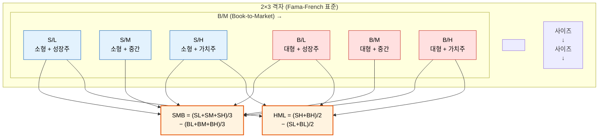

# 8단원: 사이즈 팩터·가치 팩터·FF3 — 세 팩터로 수익률을 설명하다

---

## 1. 왜? — 이 단원을 배우는 이유

7단원에서 우리는 다중팩터 모형의 필요성과 APT, 그리고 사이즈 팩터(SMB)의 구성법까지 배웠다. SMB는 소형주가 대형주보다 높은 수익률을 보이는 현상(사이즈 효과)을 팩터로 포착한 것이었다. 이변량 정렬(2×3 격자)을 이용하여 B/M 효과를 통제하고, 순수한 사이즈 효과만 추출하는 방법도 배웠다.

하지만 이 과정에서 하나의 질문이 고개를 든다:

> **잠깐, 2×3 격자에서 "통제"한 그 B/M(장부가/시장가 비율)이라는 것도 수익률을 설명하는 팩터 아닌가? 사이즈 하나만으로 모든 자산수익률을 설명할 수 있는가?**

답은 **아니다**. 실증 데이터는 사이즈와는 별개로, B/M 비율이 높은 주식(가치주)이 B/M 비율이 낮은 주식(성장주)보다 장기적으로 높은 수익률을 보이는 현상을 강력하게 보여준다. 이것이 **가치 프리미엄(value premium)**이다. [강의 3/20, 06:25]

> **한 문장으로:** 가치 프리미엄이란 "싼 주식(가치주)이 비싼 주식(성장주)보다 장기적으로 수익률이 높은 현상"이다.

사이즈 팩터(SMB)와 가치 팩터(HML)를 시장 팩터와 결합하면, 유명한 **파마-프렌치 3팩터 모형(Fama-French 3-Factor Model, FF3)**이 된다. 파마(Eugene Fama)는 2013년 노벨경제학상을 수상했다(실증적 자산가격 연구 공로). CAPM의 시장 팩터 하나로는 설명하지 못했던 수익률 패턴을 세 팩터로 훨씬 잘 설명할 수 있게 된다. [강의 3/20, 20:01]

---

## 2. 단원 흐름도

```
┌──────────────────┐     ┌──────────────────┐     ┌──────────────────┐
│ 7단원에서:       │     │ 가치 프리미엄    │     │ B/M 비율이란?    │
│ SMB는 만들었는데 │────→│ 가치주가 성장주  │────→│ 장부가치 ÷ 시장  │
│ 사이즈 하나로는  │     │ 보다 수익률 높다 │     │ 가치 = "저평가"  │
│ 부족하다         │     │                  │     │ 의 척도           │
└──────────────────┘     └──────────────────┘     └──────────────────┘
                                                        │
                              ┌──────────────────────────┘
                              ▼
┌──────────────────┐     ┌──────────────────┐     ┌──────────────────┐
│ HML 팩터 구성    │     │ FF3 모형 수식    │     │ α의 해석         │
│ SMB와 동일한     │────→│ R-Rf = α + β_M   │────→│ α=0이면 3팩터가  │
│ 2×3 격자 사용    │     │ + β_SMB·SMB      │     │ 완전 설명        │
│ HML=(SH+BH)/2   │     │ + β_HML·HML + ε  │     │ α≠0이면 초과수익 │
│  -(SL+BL)/2     │     │                  │     │ 또는 미설명 패턴  │
└──────────────────┘     └──────────────────┘     └──────────────────┘
                                                        │
                              ┌──────────────────────────┘
                              ▼
┌──────────────────┐     ┌──────────────────┐
│ FF3의 성과와 한계│     │ 9단원으로:       │
│ CAPM보다 훨씬    │────→│ FF3도 설명 못하는│
│ 나은 설명력,     │     │ 이상현상이 있다  │
│ 하지만 여전히    │     │ → 모멘텀 팩터    │
│ α≠0인 전략 존재 │     │                  │
└──────────────────┘     └──────────────────┘
```

---

## 3. 가정 목록

이 단원의 이론은 7단원에서 소개한 팩터모형의 가정을 그대로 계승한다. 여기에 FF3 고유의 전제를 추가하고, **실제 팩터 구성 시 연구자들이 채택하는 숨겨진 가정**을 함께 명시한다.

### 3.1 이론적 가정

| 가정 | 뜻 (비전공자 언어) | 적용 범위 |
|------|-------------------|----------|
| **선형 팩터 구조** (7단원에서 계승) | 수익률은 팩터들의 일차식(선형결합)으로 표현된다 | FF3 |
| **이디오싱크래틱 리스크의 분산가능성** (7단원에서 계승) | 개별 자산 고유의 무작위 변동(이디오싱크래틱 리스크 = 개별 자산 고유의 무작위 변동)은 충분히 많은 종목에 투자하면 소멸한다 | FF3 |
| **팩터 수 = 3** | 시장·사이즈·가치라는 세 가지 요인이 대부분의 주식 수익률 변동을 설명한다 | FF3 |
| **B/M은 가치의 유효한 척도** | 장부가/시장가 비율이 높으면 저평가된 "가치주", 낮으면 고평가된 "성장주"이다 | HML 구성 |
| **이변량 정렬로 교차 효과 통제** | 2×3 격자 구성 시, 사이즈와 B/M의 교차 효과가 평균에 의해 상쇄된다 | SMB, HML 구성 |
| **상호작용 효과 부재** | 사이즈 효과가 가치주·성장주에서 동일한 크기여야 평균으로 "상쇄"가 완전하다. 만약 소형 가치주에서 사이즈 효과가 유독 크다면, 단순 평균으로는 완벽히 통제되지 않는다 | SMB, HML 구성 |
| **무위험자산 존재** | 위험 없는 자산(예: 국채)이 존재하며 수익률이 $R_f$ | FF3 회귀식 |

### 3.2 데이터 및 구성상의 숨겨진 가정

실제로 FF3 팩터를 만들 때는 아래의 구체적인 규칙이 적용된다. 이것들은 이론 수식에는 드러나지 않지만 결과에 큰 영향을 미친다.

| 숨겨진 가정 | 구체적 내용 | 왜 중요한가 |
|------------|-----------|------------|
| **B/M 데이터 시점** | t-1년 말 장부가치(회계연도 기준) / t년 6월 시장가치 사용. 약 6개월의 래그(시차)를 둔다 | 회계 정보가 실제로 공시되기까지 시간이 걸리므로, 투자자가 사용할 수 없는 미래 정보(look-ahead bias)를 방지한다 |
| **리밸런싱 빈도** | 연 1회, 매년 6월에 포트폴리오를 재구성한다 | 거래비용과 데이터 가용성의 균형. 월별 리밸런싱보다 현실적이다 |
| **동일가중 vs 가치가중의 이중 구조** | 각 셀(예: SH) 내부의 종목들은 **가치가중**(시가총액 비례)으로 합산하고, 셀 간(예: SH와 BH의 평균)은 **동일가중**(단순 평균)으로 계산한다 | 셀 내 가치가중은 대형주 편향을 반영하고, 셀 간 동일가중은 사이즈/가치 효과의 순수한 비교를 가능케 한다 |
| **NYSE 분기점 사용** | 시총 중간값과 B/M 분기점(30번째·70번째 백분위)은 **NYSE 상장 종목만**으로 산출한다. AMEX·NASDAQ 종목은 그 기준에 따라 분류만 된다 | NYSE 종목이 규모가 크고 분포가 안정적이므로, 소형 NASDAQ 종목의 과도한 영향을 방지한다 |
| **생존편향(survivorship bias)** | Fama-French 데이터베이스는 상장폐지·합병된 기업도 포함한다(CRSP 데이터 기반) | 살아남은 기업만 보면 수익률이 과대 추정된다. 망한 기업도 포함해야 현실적 수익률을 알 수 있다 |
| **거래비용·유동성 미반영** | 팩터 수익률은 거래비용을 차감하지 않는다. 특히 소형 가치주는 유동성이 낮아(사고팔기 어렵고 비용이 크다) 실제 투자 시 수익이 크게 줄어들 수 있다 | 이론적 프리미엄과 실현 가능한 프리미엄 사이의 괴리를 낳는 주요 원인이다 |
| **음의 자기자본 제외** | 장부가치(Book Equity)가 음수인 기업(부채 > 자산)은 보통 분석에서 제외한다 | B/M이 음수가 되어 의미 있는 분류가 불가능하기 때문이다 |

---

## 4. 기호 사전 — 이 단원에서 새로 등장하는 용어

이 단원에는 금융 비전공자에게 낯선 개념이 많다. 먼저 용어를 한꺼번에 정리하고, 본문에서 다시 하나씩 풀어낸다.

| 용어 / 기호 | 읽는 법 | 뜻 | 비유 |
|-------------|---------|-----|------|
| **가치주(value stock)** | "가치주" | 시장에서 실제 가치(장부가치)에 비해 낮은 가격에 거래되는 주식. B/M이 높다 | 중고시장에서 원래 가격보다 훨씬 싸게 팔리는 물건. "싸니까 사볼 만하다" |
| **성장주(growth stock)** | "성장주" | 시장에서 실제 가치보다 높은 가격에 거래되는 주식. B/M이 낮다. 미래 성장에 대한 기대가 가격에 반영 | 아직 수익은 적지만 미래가 밝을 것이라고 기대되어 비싸게 거래되는 스타트업 |
| **장부가치(book value, BV)** | "장부가치" | 기업의 회계장부에 기록된 자산 가치. 총자산에서 총부채를 뺀 순자산(= 자기자본, book equity) | 집의 감정가. 시세와 관계없이 공식 기록된 가치 |
| **시장가치(market value, MV)** | "시장가치" | 주식시장에서 거래되는 기업의 총 가치. 주가 × 발행주식 수 = 시가총액(market cap) | 집의 실거래가. 사고파는 사람들이 매기는 가격 |
| **B/M(Book-to-Market ratio)** | "비 투 엠" | 장부가치 ÷ 시장가치. 이 비율이 높으면 "저평가(= 가치주)", 낮으면 "고평가(= 성장주)" | 감정가 ÷ 실거래가. 이 값이 1보다 크면 "실제 가치보다 싸게 팔리고 있다" |
| **가치 프리미엄(value premium)** | "가치 프리미엄" | 가치주가 성장주보다 장기적으로 높은 수익률을 보이는 현상 | 중고시장에서 저평가된 물건을 사면 장기적으로 이익이 더 크다 |
| **HML(High Minus Low)** | "에이치 엠 엘" | 가치 팩터. B/M이 높은 주식(가치주) 수익률 − B/M이 낮은 주식(성장주) 수익률 | "싼 것 사고, 비싼 것 팔아서" 가치 프리미엄을 포착하는 전략 |
| **FF3(Fama-French 3-Factor Model)** | "에프에프 쓰리" | 시장 팩터 + 사이즈 팩터(SMB) + 가치 팩터(HML), 세 팩터로 자산수익률을 설명하는 모형. 파마와 프렌치가 1993년에 제안. 파마는 2013년 노벨경제학상 수상(실증적 자산가격 연구) | 자동차 성능을 "엔진(시장)" 하나로 설명하던 것에서 "엔진 + 타이어(사이즈) + 서스펜션(가치)" 세 요소로 설명하는 것으로 업그레이드 |
| **$\alpha$ (알파)** | "알파" | 회귀분석에서 절편. FF3 맥락에서는 세 팩터로 설명되지 않는 평균 초과수익률. $\alpha = 0$이면 세 팩터가 수익률을 완전히 설명한다는 뜻 | 시험 점수를 공부시간·수면·영양으로 설명한 뒤 남는 "설명 안 되는 점수". 0이면 세 요인이 점수를 완벽히 설명한 것 |
| **$\beta_M$, $\beta_{\text{SMB}}$, $\beta_{\text{HML}}$** | "베타 엠", "베타 에스엠비", "베타 에이치엠엘" | 각 팩터에 대한 민감도(로딩). 해당 팩터가 1% 움직일 때 내 자산이 몇 % 움직이는지 | 온도가 1도 변할 때 아이스크림 판매가 몇 개 변하는지 |
| **$\varepsilon$ (엡실론)** | "엡실론" | 이디오싱크래틱 리스크(idiosyncratic risk). 세 팩터로 설명되지 않는 개별 자산 고유의 무작위 변동 | 공부시간·수면·영양을 다 고려해도 남는, 그날의 컨디션 같은 개인적 요인 |
| **이상수익(abnormal return)** | "이상수익" | 팩터모형이 예측하는 수익률을 초과하는 부분. $\alpha$가 통계적으로 유의하게 0이 아닐 때 존재한다고 판단 | 공부시간 대비 "비정상적으로" 높은(또는 낮은) 시험 점수 |
| **통계적 유의성(statistical significance)** | "통계적 유의성" | 관찰된 결과가 우연이 아니라 진짜로 0이 아닌 것 같다고 판단하는 기준. p값이 0.05 미만이면 "유의하다"고 본다 — 즉 "이 결과가 순전한 우연일 확률이 5% 미만"이라는 뜻 | 동전을 10번 던져 8번 앞면이 나왔을 때, "이 동전이 공정하다면 이런 결과가 우연히 나올 확률이 매우 낮다" → 동전이 편향되었다고 판단 |
| **회귀분석(regression)** | "회귀분석" | 데이터에 가장 잘 맞는 직선(또는 평면)을 찾는 통계 기법. "이 변수가 저 변수를 얼마나 설명하는가?"를 정량화 | 키와 체중 데이터에 가장 잘 맞는 직선을 긋는 것. "키가 1cm 늘면 체중이 약 0.6kg 느는" 관계를 찾아내는 방법 |

---

## 5. 핵심 개념

### 5.1 가치 프리미엄 — 왜 "싼 주식"이 더 잘 벌까?

실증 연구 결과, 장기 데이터에서 다음이 관찰된다: [강의 3/20, 06:25]

> **가치주(value stocks) — 주가가 기업의 장부가치에 비해 낮은 주식 — 가 성장주(growth stocks) — 주가가 장부가치에 비해 높은 주식 — 보다 장기적으로 높은 수익률을 기록한다.**

이것이 **가치 프리미엄(value premium)**이다.

> **한 문장으로:** 가치 프리미엄 = "B/M이 높은(싼) 주식이 B/M이 낮은(비싼) 주식보다 장기적으로 더 많이 번다."

```
연평균 수익률(%)
  ^
  |
  | 15.2%
  |  ████
  |  ████  13.8%
  |  ████   ████
  |  ████   ████  12.1%
  |  ████   ████   ████  10.8%
  |  ████   ████   ████   ████   9.5%
  |  ████   ████   ████   ████   ████
  +──────────────────────────────────────→ B/M 비율
   높음    4분위   3분위   2분위   낮음
  (가치주)                           (성장주)
   B/M ↑                             B/M ↓

  ※ 위 수치는 미국 주식시장의 장기 역사적 데이터에서 관찰되는 대략적 수치다.
    가치주-성장주 수익률 차이(≈ 연 5~6%)가 가치 프리미엄에 해당한다.
```

#### 왜 가치주가 더 높은 수익을 내는가?

이것은 금융학에서 여전히 논쟁 중인 질문이다. 크게 두 가지 설명이 있다:

**① 위험 기반 설명 (리스크 프리미엄):** [강의 3/20, 08:11]

가치주는 이미 시장에서 싸게 팔리는 주식이다. **왜 싸게 팔릴까?** 그 기업이 위험하기 때문이다. 경기침체가 오면 가치주는 성장주보다 더 큰 타격을 받는다. 투자자들은 이 추가 위험에 대한 보상(= 프리미엄)을 요구하기에, 가치주는 장기적으로 더 높은 수익률을 기록하는 것이다.

> **비유:** 비바람이 많이 치는 해안가 집은 내륙 집보다 싸다. 하지만 그 집에서 사는 사람은 (비바람을 견디는 대가로) 더 좋은 바다 전망을 누린다. 가치주의 높은 수익률은 더 높은 위험을 감수하는 대가이다.

**순환론 문제에 대한 주의:** 위험 기반 설명에는 "B/M이 높다 → 싸다 → 위험하다 → 수익이 높다"라는 논리가 있는데, "왜 싸냐?"와 "왜 위험하냐?"가 서로를 가리키는 순환에 빠질 수 있다. 이 설명이 설득력을 가지려면, B/M과 독립적인 위험의 증거가 필요하다. 실제 연구에서는 가치주 기업들의 **레버리지(부채 비율)가 높고**, **파산 확률이 높으며**, **현금흐름 변동성이 크다**는 데이터가 이 설명을 뒷받침한다(Fama & French 1995, Campbell et al. 2008).

**② 행동재무학적 설명:**

행동재무학(Behavioral Finance)에서는 투자자의 심리적 편향으로 가치 프리미엄을 설명한다. 투자자들이 성장주에 지나치게 열광하여 주가가 과도하게 올라가고(과잉 반응), 가치주는 "이 회사는 시대에 뒤처졌다"는 편견에 주가가 지나치게 낮아진다(과소 반응). 시간이 지나면 이런 과잉/과소 반응이 교정되면서 가치주의 수익률이 성장주를 앞서게 된다. 주요 연구로 Lakonishok, Shleifer & Vishny(1994)의 "Contrarian Investment, Extrapolation, and Risk"가 있다.

> **정리:** 위험 기반 설명은 "가치 프리미엄은 합당한 위험 보상"이라 보고, 행동재무학 설명은 "투자자 심리의 비합리성이 만든 가격 왜곡"이라 본다. 현재 학계의 합의는 없으며, 두 설명 모두 부분적으로 작동한다는 견해가 우세하다.

### 5.2 B/M(장부가/시장가) — 왜 이것이 "가치"의 척도인가?

**B/M 비율(Book-to-Market ratio)**은 다음과 같이 정의된다: [강의 3/18, 56:12]

$$\text{B/M} = \frac{\text{장부가치(Book Equity)}}{\text{시장가치(Market Equity)}}$$

- **장부가치(Book Equity, BE):** 기업의 회계장부에 기록된 순자산. 총자산에서 총부채를 뺀 값이다. 회사가 당장 문을 닫고 자산을 처분하면 주주에게 돌아가는 금액에 가깝다.
- **시장가치(Market Equity, ME):** 주식시장에서 매겨진 기업 가치. 주가 × 총 발행주식 수 = 시가총액이다.

> **한 문장으로:** B/M = 장부가치 ÷ 시장가치. 이 비율이 높으면 "시장이 실제 가치보다 싸게 매기고 있다"는 뜻이다.

이 비율이 왜 "가치"의 척도가 되는가?

| B/M 값 | 의미 | 주식 유형 | 비유 |
|--------|------|----------|------|
| **높다** (예: 1.5) | 시장가치 < 장부가치. 시장이 이 기업을 실제 가치보다 낮게 평가 | **가치주** | 감정가 1억인 집이 7천만 원에 매물로 나옴. "저평가" |
| **낮다** (예: 0.2) | 시장가치 ≫ 장부가치. 시장이 미래 성장을 기대하며 높은 가격을 매김 | **성장주** | 감정가 1억인 집이 5억에 거래됨. "미래 가치 기대" |

> **왜 "high B/M = 가치주"인가?** [강의 3/18, 56:55]
> B/M이 높다 = 시장가치(분모)가 장부가치(분자)에 비해 작다 = 시장이 이 기업을 싸게 평가하고 있다. 이런 "저평가된" 주식이 가치주다. 반대로 B/M이 낮다 = 시장가치가 장부가치보다 훨씬 크다 = 시장이 미래 성장을 기대하며 비싸게 사는 주식 = 성장주다. 대표적으로 기술주(tech stocks)가 성장주에 해당한다.

#### B/M의 한계 — 무형자산 시대의 문제

B/M은 완벽한 척도가 아니다. 장부가치는 **유형자산**(공장, 토지, 설비)을 주로 반영하는데, 현대 경제에서는 **무형자산**(브랜드, 소프트웨어, 특허, 고객 데이터)의 비중이 크다. 예를 들어 소프트웨어 기업은 장부에 공장이 없으므로 장부가치가 매우 낮다. 그래서 B/M이 낮게 나와 "성장주"로 분류되지만, 실제로는 안정적인 현금흐름을 가진 "가치주"일 수 있다. B/M이 기업의 실제 가치를 완전히 반영하지 못하는 것이다.

### 5.3 경기 조건에 따른 가치 팩터의 행동

가치 프리미엄은 경기 조건에 따라 달라진다: [강의 3/20, 08:11]

```
──── 경기 사이클과 가치 팩터 ────

  불황기 (경기 하강)                    호황기 (경기 상승)
  ═══════════════                      ═══════════════
  가치주: 위험 ↑↑↑, 프리미엄 ↑↑       가치주: 회복, 프리미엄 보통
  성장주: 상대적 선방                   성장주: 기대 실현 → 강세 ↑↑

  ──불황──────────→ 전환점 ──────────→ 호황──────────→
       HML 변동성 높음                    HML 변동성 낮음
       가치주 ▼▼ (크게 하락)             성장주 ▲▲ (크게 상승)
       하지만 장기 보상 ↑                 가치주 상대 약세
```

**불황기에 가치주가 취약한 경제적 메커니즘:**

가치주가 불황에 특히 취약한 이유는 다음과 같다:

1. **재무곤경(financial distress) 비율이 높다:** 가치주는 이미 시장에서 "문제 있는 기업"으로 인식되어 주가가 낮은 경우가 많다. 이런 기업들은 부채 비율(레버리지)이 높고, 불황이 오면 이자 부담을 감당하기 어려워진다.
2. **현금흐름이 불안정하다:** 가치주 기업들은 성숙한 산업에 속하거나 수요 변동에 민감한 업종인 경우가 많아, 불황 시 매출과 이익이 급격히 감소한다.
3. **자산 유동성이 낮다:** 가치주 기업의 자산은 주로 공장·설비 같은 유형자산으로, 급하게 처분하기 어렵다. 불황 시 자산을 헐값에 팔아야 하는 상황이 생길 수 있다.
4. **신용 경색의 직격탄:** 불황기에 은행이 대출을 줄이면, 이미 부채가 많은 가치주 기업이 가장 먼저 자금 조달에 어려움을 겪는다.

> **핵심:** 가치 프리미엄은 상수가 아니라 **시간에 따라 변한다**. 불황기에 가치주를 사고 성장주를 파는 전략(= HML)은 높은 위험을 수반하지만 높은 보상도 가져온다. 이것은 가치 프리미엄의 **위험 기반 해석**을 뒷받침한다 — 공짜 점심은 없으며, 높은 수익에는 높은 위험이 따른다. [강의 3/20, 08:11]

> (경기 조건별 팩터 행동의 실증 데이터는 9절에서 다시 정리한다.)

---

## 6. HML 팩터 구성 — 가치 프리미엄을 포착하는 포트폴리오

### 6.1 HML이란?

**HML(High Minus Low)** = B/M이 높은 주식(가치주)의 수익률 **빼기** B/M이 낮은 주식(성장주)의 수익률. [강의 3/20, 14:15]

> **한 문장으로:** HML은 "가치주를 사고 성장주를 팔아서" 가치 프리미엄을 수익률 시계열로 만든 팩터다.

SMB가 "사이즈 효과"를 포착하는 팩터였듯이, HML은 "가치 효과"를 포착하는 팩터다.

- **HML > 0인 시기:** 가치주가 성장주를 이겼다 (가치 프리미엄이 실현됨)
- **HML < 0인 시기:** 성장주가 가치주를 이겼다

장기적으로 HML의 평균이 양(+)이라는 것이 가치 프리미엄의 핵심이다.

### 6.2 2×3 이변량 정렬로 HML 구성하기

HML 구성법은 SMB 구성법과 **같은 2×3 격자**를 사용한다. 다만 관점이 다르다: [강의 3/20, 14:15]



> **그림 읽는 법** — 6개 셀을 사이즈(2분위)와 B/M(3분위)으로 나눈 격자.
> - **SMB**: 위 3칸(소형) 평균 − 아래 3칸(대형) 평균. **모든 B/M 구간을 평균 내서 B/M 효과를 통제**한 순수 사이즈 효과
> - **HML**: 양 끝 2칸(가치주: SH+BH) − 양 끝 2칸(성장주: SL+BL). **사이즈를 통제**한 순수 가치 효과
> - 같은 6개 셀에서 두 팩터가 모두 만들어진다 — 효율적

- SMB를 구성할 때는 **B/M을 통제하고** 사이즈 효과만 추출했다
- HML을 구성할 때는 **사이즈를 통제하고** 가치 효과만 추출한다

같은 격자에서 **가로로 읽느냐 세로로 읽느냐**의 차이다.

#### Independent sort 절차 리마인드

7단원에서 배운 것처럼, 이 2×3 격자는 **독립 정렬(independent sort)** 방식이다. 사이즈와 B/M을 각각 독립적으로 분류하므로, 일부 셀에 종목이 많고 다른 셀에 적을 수 있다:

```
독립 정렬(Independent Sort)의 5×5 격자 예시:
┌────┬────┬────┬────┬────┐
│ 12 │  8 │  5 │  3 │  2 │  ← 소형주: 가치주 쪽에 쏠림
├────┼────┼────┼────┼────┤
│  7 │  6 │  6 │  5 │  6 │
├────┼────┼────┼────┼────┤
│  5 │  7 │  7 │  6 │  5 │
├────┼────┼────┼────┼────┤
│  4 │  5 │  7 │  8 │  6 │
├────┼────┼────┼────┼────┤
│  2 │  4 │  5 │  8 │ 11 │  ← 대형주: 성장주 쪽에 쏠림
└────┴────┴────┴────┴────┘
 High                 Low   ← B/M
 (가치)             (성장)

※ 숫자 = 해당 셀에 들어가는 종목 수(예시)
  소형 가치주 셀에 12개, 대형 성장주 셀에 11개 등 편중이 생길 수 있다
  FF3는 2×3 격자를 쓰므로 이 문제가 완화되지만, 원리는 동일하다
```

이런 편중은 소형주와 가치주 사이의 자연스러운 상관관계 때문이다. FF3에서는 2×3이라는 단순한 격자를 사용하므로 편중이 심하지 않지만, 5×5 이상의 세밀한 분석에서는 빈 셀이 발생할 수도 있다.

#### 2×3 격자 (SMB와 동일)

7단원에서 이미 배운 격자를 다시 가져오자:

```
┌─────────────────────────────────────────────────┐
│                   B/M 비율                      │
│          Low(L)      Medium(M)     High(H)      │
│         (성장주)                   (가치주)      │
├──────┬──────────┬──────────────┬─────────────────┤
│ S    │   SL     │    SM        │     SH          │
│소형주│ 소형+성장│  소형+중간   │   소형+가치     │
├──────┼──────────┼──────────────┼─────────────────┤
│ B    │   BL     │    BM        │     BH          │
│대형주│ 대형+성장│  대형+중간   │   대형+가치     │
└──────┴──────────┴──────────────┴─────────────────┘

▲ 시총 중간값(median)으로 S/B 이분 (NYSE 종목 기준으로 산출)
  각 그룹 내에서 B/M의 30·70번째 백분위수로 L/M/H 삼분
  → 총 6개 포트폴리오
```

#### SMB vs HML — 같은 격자, 다른 계산

**SMB (7단원에서 배움):** 소형주 행(row) 평균 − 대형주 행 평균 → 사이즈 효과 추출

$$\text{SMB} = \frac{1}{3}(R_{SH} + R_{SM} + R_{SL}) - \frac{1}{3}(R_{BH} + R_{BM} + R_{BL})$$

```
┌──────┬──────────┬──────────────┬─────────────────┐
│ S    │  ■ SL    │   ■ SM       │    ■ SH         │  ← 이 행의 평균
├──────┼──────────┼──────────────┼─────────────────┤
│ B    │  ■ BL    │   ■ BM       │    ■ BH         │  ← 이 행의 평균
└──────┴──────────┴──────────────┴─────────────────┘
         SMB = 윗행 평균 − 아랫행 평균
         (B/M의 효과는 세 열에 걸쳐 평균되어 상쇄)
```

**HML (이 단원에서 배움):** 가치주 열(column) 평균 − 성장주 열 평균 → 가치 효과 추출 [강의 3/20, 14:15]

$$\text{HML} = \frac{1}{2}(R_{SH} + R_{BH}) - \frac{1}{2}(R_{SL} + R_{BL})$$

```
┌──────┬──────────┬──────────────┬─────────────────┐
│ S    │  ■ SL    │              │    ■ SH         │
├──────┼──────────┼──────────────┼─────────────────┤
│ B    │  ■ BL    │              │    ■ BH         │
└──────┴──────────┴──────────────┴─────────────────┘
           ↑                          ↑
         이 열의                    이 열의
         평균                       평균

         HML = 오른쪽 열 평균 − 왼쪽 열 평균
         (사이즈의 효과는 두 행에 걸쳐 평균되어 상쇄)
```

### 6.3 왜 이 방법이 사이즈 효과를 통제하는가?

논리는 SMB 구성 시 B/M을 통제한 것과 정확히 대칭이다: [강의 3/20, 14:15]

- 가치주 평균 = $\frac{1}{2}(R_{SH} + R_{BH})$: 소형 가치주와 대형 가치주의 평균. 사이즈의 양 극단이 균등하게 포함
- 성장주 평균 = $\frac{1}{2}(R_{SL} + R_{BL})$: 소형 성장주와 대형 성장주의 평균. 역시 사이즈의 양 극단 균등 포함
- 차이를 구하면 **사이즈 효과가 상쇄**되고, 남는 것은 **순수한 가치 효과**(B/M 높은 것 vs 낮은 것)뿐

단, 이 상쇄가 완벽하려면 **상호작용 효과 부재** 가정이 필요하다(3.1절 참고). 즉 사이즈 효과가 가치주에서든 성장주에서든 동일한 크기여야 한다. 현실에서는 약간의 상호작용이 있을 수 있지만, 2×3 격자는 이를 충분히 완화한다.

> **비유:** "여성이 남성보다 수학을 잘 하는가?"를 조사하려면, 연령을 통제해야 한다. 여성 그룹에 20대와 60대를 균등하게 넣고, 남성 그룹에도 20대와 60대를 균등하게 넣은 뒤 비교하면, 연령 효과가 상쇄되어 순수한 성별 효과만 남는다. HML 구성에서 소형주와 대형주를 균등하게 넣는 것이 바로 이 논리다.

### 6.4 HML 포트폴리오의 특성

SMB와 마찬가지로 HML도 **자기금융(self-financing)** 포트폴리오다:

- 가치주(High B/M)를 매수(long)
- 성장주(Low B/M)를 매도(short)
- 매수 금액 = 매도 금액 → **빌려서 파는 돈(공매도 대금)으로 사는 비용을 충당하므로 원금이 불필요하다**

가치 프리미엄이 존재하면, HML은 장기적으로 양(+)의 수익을 낸다. [강의 3/20, 06:25]

---

## 7. 수식 유도 — FF3 모형

### 7.1 세 팩터의 등장

이제 우리에게는 세 가지 팩터가 있다: [강의 3/20, 15:11]

| 팩터 | 포트폴리오 | 무엇을 포착하는가 |
|------|-----------|------------------|
| **시장 팩터** ($R_M - R_f$) | 시장 포트폴리오 매수 − 무위험자산 | 시장 전체의 위험에 대한 보상 |
| **사이즈 팩터** (SMB) | 소형주 매수 − 대형주 매도 | 기업 규모에 따른 수익률 차이 |
| **가치 팩터** (HML) | 가치주 매수 − 성장주 매도 | B/M에 따른 수익률 차이 |

### 7.2 FF3 회귀식

> **수식이 나옵니다. 겁먹지 마세요.** 각 기호가 무엇인지 바로 아래 표에서 하나씩 설명하니, 수식을 "한꺼번에" 이해하려 하지 말고 표를 참고하며 한 항씩 읽으면 됩니다.

이 세 팩터를 하나의 회귀식으로 결합하면 **파마-프렌치 3팩터 모형(FF3)**이 된다: [강의 3/20, 20:01]

$$R_{i,t} - R_{f,t} = \alpha_i + \beta_{i,M}(R_{M,t} - R_{f,t}) + \beta_{i,\text{SMB}} \cdot \text{SMB}_t + \beta_{i,\text{HML}} \cdot \text{HML}_t + \varepsilon_{i,t}$$

> **한 문장으로:** FF3 수식은 "내 자산의 초과수익률 = 시장 민감도 × 시장 초과수익률 + 사이즈 민감도 × SMB + 가치 민감도 × HML + 잡음"이라는 뜻이다.

각 항의 의미를 하나씩 읽어 보자:

| 항 | 기호 | 의미 |
|----|------|------|
| **좌변** | $R_{i,t} - R_{f,t}$ | 자산 $i$의 $t$시점 **초과수익률**(excess return). 자산 수익률에서 무위험이자율을 뺀 것. "위험을 감수한 대가로 얼마를 더 벌었나?" |
| **절편** | $\alpha_i$ | 세 팩터로 설명되지 않는 **평균 초과수익률**. "세 요인을 다 고려하고도 남는 수익" |
| **시장 로딩** | $\beta_{i,M}(R_{M,t} - R_{f,t})$ | 시장 초과수익률에 대한 자산 $i$의 민감도 × 시장 초과수익률. "시장이 1% 오르면 내 자산이 $\beta_{i,M}$% 만큼 움직인다" |
| **사이즈 로딩** | $\beta_{i,\text{SMB}} \cdot \text{SMB}_t$ | SMB 수익률에 대한 민감도 × SMB 수익률. $\beta > 0$이면 소형주처럼 행동, $\beta < 0$이면 대형주처럼 행동 |
| **가치 로딩** | $\beta_{i,\text{HML}} \cdot \text{HML}_t$ | HML 수익률에 대한 민감도 × HML 수익률. $\beta > 0$이면 가치주처럼 행동, $\beta < 0$이면 성장주처럼 행동 |
| **잔차** | $\varepsilon_{i,t}$ | **이디오싱크래틱 리스크**(개별 자산 고유의 무작위 변동). 세 팩터로 설명되지 않는 자산 $i$ 고유의 잡음. 기댓값은 0 |

#### FF3 회귀 계산 워크스루

구체적인 숫자로 FF3 수식이 어떻게 작동하는지 따라가 보자.

**상황 설정:** 이번 달에 시장 초과수익률 = 5%, SMB = 3%, HML = 4%였다고 하자.
"소형 가치주" 포트폴리오의 회귀 추정 결과가 $\beta_M = 1.10$, $\beta_{\text{SMB}} = 0.85$, $\beta_{\text{HML}} = 0.72$, $\alpha = 0$이라고 하자.

**이 포트폴리오의 기대 초과수익률은?**

```
기대 초과수익률 = α + β_M × (R_M - R_f) + β_SMB × SMB + β_HML × HML

  = 0  +  1.10 × 5%  +  0.85 × 3%  +  0.72 × 4%

  시장 기여분:    1.10 × 5%  = 5.50%
  사이즈 기여분:  0.85 × 3%  = 2.55%
  가치 기여분:    0.72 × 4%  = 2.88%
  ─────────────────────────────────
  합계:           5.50 + 2.55 + 2.88 = 10.93%
```

> **해석:** 이 소형 가치주 포트폴리오는 이번 달 약 10.93%의 초과수익률이 기대된다. 이 중 5.50%는 시장 전체 상승 덕분이고, 2.55%는 소형주 프리미엄, 2.88%는 가치주 프리미엄에서 온 것이다. 세 팩터로 수익률이 완전히 설명된다($\alpha = 0$).

### 7.3 $\alpha = 0$의 의미 — "세 팩터가 모든 것을 설명한다"

FF3의 핵심 주장은 다음이다: [강의 3/20, 20:58]

> **만약 모든 자산 $i$에 대해 $\alpha_i = 0$이면, 이 세 팩터(시장·사이즈·가치)가 자산수익률의 횡단면 변동(자산마다 기대수익률이 다른 이유)을 완전히 설명한다.**

> **한 문장으로:** $\alpha = 0$이란 "세 팩터에 대한 노출(β)만 알면, 어떤 자산의 기대수익률이든 계산할 수 있다"는 뜻이다.

이것을 단계별로 풀어 보자:

**단계 1: 회귀분석을 실행한다**

자산 $i$의 시계열 수익률 데이터$(R_{i,1}, R_{i,2}, \ldots, R_{i,T})$와 같은 기간의 팩터 수익률 데이터를 모은다. 회귀분석을 돌려서 $\alpha_i, \beta_{i,M}, \beta_{i,\text{SMB}}, \beta_{i,\text{HML}}$의 추정값을 얻는다.

> **회귀분석(regression)이란?** 데이터에 가장 잘 맞는 관계식을 찾는 통계 기법이다. 여기서는 "세 팩터의 수익률이 주어졌을 때, 자산 $i$의 초과수익률이 어떤 일차식으로 가장 잘 설명되는가?"를 찾는 것이다. 결과물은 절편($\alpha$)과 기울기($\beta$들)다.

**단계 2: $\alpha$의 값을 확인한다**

| 결과 | 해석 |
|------|------|
| $\alpha_i = 0$ (통계적으로 유의하게 0과 다르지 않음) | 자산 $i$의 **기대수익률**은 세 팩터로 **완전히 설명**된다. 세 팩터에 대한 노출($\beta$)이 기대수익률의 전부다 |
| $\alpha_i > 0$ (양수이고 통계적으로 유의) | 자산 $i$는 세 팩터로 설명되는 것 이상의 **이상수익(abnormal return)**을 낸다. "더 잘 벌고 있다" |
| $\alpha_i < 0$ (음수이고 통계적으로 유의) | 자산 $i$는 세 팩터가 예측하는 것보다 **부진한 성과**를 보인다 |

[강의 3/20, 21:55]

**$\alpha = 0$과 $R^2$의 구분 — 중요!**

이 둘은 다른 것을 측정한다:

- **$\alpha = 0$ (시계열 α):** 자산의 **기대수익률**이 세 팩터의 β로 완전히 설명된다는 뜻. "이 자산이 장기 평균적으로 얼마를 버는지"를 세 팩터가 정확히 예측한다. 이것은 **횡단면(cross-section)** 설명력에 해당한다 — 왜 어떤 자산의 평균 수익률이 다른 자산보다 높은지를 설명한다.
- **$R^2$ (결정계수):** 자산 수익률의 **시계열 변동**(이번 달 위로, 다음 달 아래로)이 세 팩터로 얼마나 설명되는지의 비율. 90%라면 변동의 90%가 세 팩터 때문이고, 10%는 이디오싱크래틱 잡음이다.

> 따라서 $\alpha = 0$이면서 $R^2 = 50\%$인 자산이 있을 수 있다: 기대수익률은 팩터로 잘 설명되지만, 매일매일의 변동은 개별 잡음이 크다는 뜻이다.

**$\alpha = 0$과 APT 무차익 논리의 연결:**

$\alpha = 0$은 APT(차익가격결정이론, 7단원)의 무차익 조건과 직결된다. APT는 "같은 β(팩터 노출)를 가진 포트폴리오는 같은 기대수익률을 가져야 한다"고 말한다. 만약 같은 β인데 기대수익률이 다르다면(= $\alpha \neq 0$), 하나를 사고 다른 하나를 팔아 무위험 이익(차익거래)을 얻을 수 있기 때문이다. 따라서 차익거래가 불가능한 균형 상태에서는 모든 자산의 $\alpha = 0$이어야 한다. [강의 3/18, 36:05]

**단계 3: 모든 자산에 대해 확인한다**

만약 어떤 포트폴리오의 수익률을 좌변에 놓든 $\alpha = 0$이 나온다면, 이 FF3 모형은 시장·사이즈·가치라는 세 요인으로 모든 자산수익률을 완전히 기술하는 자산가격결정모형이 된다. [강의 3/20, 20:58]

**실무적 한계:** 실제로 "모든 자산"에 대해 α = 0을 확인하는 것은 불가능하다. 연구자들은 보통 사이즈와 B/M으로 정렬한 **25개 포트폴리오**(5×5 격자)를 대상으로 테스트한다. 이 25개에서 α ≈ 0이 나오더라도, 테스트하지 않은 다른 전략(예: 모멘텀)에서는 α ≠ 0이 나올 수 있다. "모든 자산에서 α = 0"은 유한한 수의 테스트 포트폴리오에서만 검증된 결과임을 기억해야 한다.

> **비유:** 학생들의 시험 점수를 "공부시간 + 수면시간 + 식사 품질"로 설명하는 모형을 세웠다고 하자. 모든 학생에 대해 이 세 변수로 점수를 예측하니 오차(α)가 0이다. 그러면 이 세 변수가 시험 점수의 모든 변동을 완벽히 설명한다고 말할 수 있다. 단, 25명만 검사했다면 26번째 학생에게도 적용된다는 보장은 없다.

### 7.4 $\alpha \neq 0$의 의미 — "아직 설명 못 하는 것이 있다"

현실에서는 많은 포트폴리오에서 $\alpha \neq 0$이 나온다: [강의 3/20, 21:55]

- $\alpha > 0$이 통계적으로 유의한 포트폴리오가 존재 → 이 포트폴리오는 FF3가 예측하는 것보다 더 높은 수익을 내고 있다
- 이것은 세 팩터 외에 수익률을 결정하는 **추가적인 패턴**이 존재한다는 증거

> **핵심:** $\alpha$가 양수이고 통계적으로 유의하면 "이상수익(abnormal return)"이 존재한다고 말한다. "이상"이라는 것은 **현재 모형(FF3)으로는 비정상적으로 보인다**는 뜻이지, 반드시 불법적이거나 비합리적이라는 뜻은 아니다. 모형이 놓치고 있는 팩터가 있을 수 있다. [강의 3/20, 21:55]

### 7.5 FF3 회귀 결과 예시

아래는 FF3 회귀를 다양한 포트폴리오에 적용한 가상의 결과 예시다:

```
┌──────────────────┬──────────┬──────────┬──────────┬──────────┬──────────┐
│ 포트폴리오       │   α(%)   │  β_M     │ β_SMB    │ β_HML    │ R² (%)   │
│                  │ (월간)   │          │          │          │          │
├──────────────────┼──────────┼──────────┼──────────┼──────────┼──────────┤
│ 대형 성장주      │  -0.02   │   1.05   │  -0.30   │  -0.42   │   92     │
│ 대형 가치주      │   0.01   │   0.98   │  -0.15   │   0.68   │   93     │
│ 소형 가치주      │   0.05   │   1.10   │   0.85   │   0.72   │   90     │
│ 소형 성장주      │   0.03   │   1.15   │   0.90   │  -0.35   │   88     │
│ 모멘텀 전략(WML) │  0.85**  │   1.02   │   0.05   │  -0.18   │   45     │
└──────────────────┴──────────┴──────────┴──────────┴──────────┴──────────┘
  ** = 통계적으로 유의 (p < 0.05, 즉 이 결과가 우연일 확률이 5% 미만)

  ※ 위 수치는 FF3의 구조를 이해하기 위한 예시이며 실제 데이터와 다를 수 있다.
```

**읽는 법:**

- **대형 성장주:** $\beta_{\text{SMB}} = -0.30$ (대형주처럼 행동), $\beta_{\text{HML}} = -0.42$ (성장주처럼 행동). $\alpha \approx 0$ → FF3가 잘 설명
- **소형 가치주:** $\beta_{\text{SMB}} = 0.85$ (소형주처럼 행동), $\beta_{\text{HML}} = 0.72$ (가치주처럼 행동). $\alpha \approx 0$ → FF3가 잘 설명
- **모멘텀 전략(WML):** $\alpha = 0.85\%$ (월간)이며 통계적으로 유의 → **FF3가 설명하지 못하는 이상수익 존재!** $R^2 = 45\%$로 시계열 설명력도 낮다

> 이것이 바로 FF3의 한계다. 모멘텀 전략의 수익률은 시장·사이즈·가치 세 팩터로 설명되지 않는다.

---

## 8. 비교표 — CAPM vs FF3

```
설명력(R²)
  ^
  |                                          ████████ 약 90%
  |                                          ████████
  |                                          ████████
  |                                          ████████
  |           ████████ 약 70%                ████████
  |           ████████                       ████████
  |           ████████                       ████████
  |           ████████                       ████████
  +──────────────────────────────────────────────────→
               CAPM                           FF3
             (팩터 1개)                     (팩터 3개)
```

| 비교 항목 | CAPM | FF3 |
|----------|------|-----|
| **팩터 수** | 1개 (시장) | 3개 (시장 + 사이즈 + 가치) |
| **핵심 수식 (회귀 형태)** | $R_i - R_f = \alpha + \beta_M(R_M - R_f) + \varepsilon$ | $R_i - R_f = \alpha + \beta_M(R_M - R_f) + \beta_{\text{SMB}} \cdot \text{SMB} + \beta_{\text{HML}} \cdot \text{HML} + \varepsilon$ |
| **이론적 예측** | $\alpha = 0$, 즉 $E[R_i] - R_f = \beta_M(E[R_M] - R_f)$ | $\alpha = 0$, 즉 기대수익률은 세 β로 결정 |
| **사이즈 효과 설명** | 불가 — $\alpha \neq 0$ | 가능 — SMB 팩터가 포착 |
| **가치 효과 설명** | 불가 — $\alpha \neq 0$ | 가능 — HML 팩터가 포착 |
| **평균 $R^2$** | 약 70% | 약 90% |
| **$\alpha$ 잔존 여부** | 많은 포트폴리오에서 $\alpha \neq 0$ | 대부분의 사이즈·가치 포트폴리오에서 $\alpha \approx 0$ |
| **모멘텀 설명** | 불가 | **불가** — 여전히 $\alpha \neq 0$ |
| **팩터의 해석** | 명확 (시장 위험) | 명확 (시장 + 사이즈 + 가치 위험) |
| **이론적 근거** | 시장 포트폴리오의 평균분산효율성 | 실증적 발견 + 리스크 기반 해석 |
| **제안 연도** | 1964년 (Sharpe 등) | 1993년 (Fama & French) |

> **주의:** CAPM도 이론적으로는 $\alpha = 0$을 예측한다. 위 표에서 CAPM 수식을 $R_i - R_f = \alpha + \beta_M(R_M - R_f) + \varepsilon$ 형태(α를 포함한 회귀식)로 적은 이유는, 이렇게 회귀분석을 돌려서 $\alpha$가 실제로 0인지 검정하기 위함이다. CAPM이 맞다면 $\alpha = 0$이어야 하지만, 실증적으로는 많은 포트폴리오에서 $\alpha \neq 0$이 나온다 — 이것이 FF3가 필요한 이유다.

> **핵심 요약:** FF3는 CAPM에 비해 훨씬 나은 설명력을 보인다. CAPM에서 $\alpha \neq 0$이었던 사이즈·가치 관련 포트폴리오들이 FF3에서는 $\alpha \approx 0$으로 줄어든다. 그러나 모멘텀 전략에서는 여전히 $\alpha \neq 0$이 남는다.

---

## 9. 실증 근거

### 9.1 가치 프리미엄 시계열

가치 프리미엄의 장기 시계열을 도식화하면 다음과 같은 패턴이 관찰된다:

```
HML 누적수익률 (로그 스케일)
  ^
  |
  |                           ╱╲       ╱──────
  |                      ╱──╱  ╲╱────╱
  |                ╱────╱
  |           ╱───╱
  |      ╱───╱
  |  ╱──╱
  | ╱
  +──────────────────────────────────────────→ 시간
  1930     1950     1970     1990     2010

  ※ 장기적으로 우상향 (가치주가 성장주를 이김)
    하지만 1990년대 후반 ~ 2000년대 초반 닷컴 버블기에는
    성장주가 가치주를 크게 이겨 HML이 하락 (변동성 존재)
```

#### 2010년 이후 가치 프리미엄의 약화

주목할 점은 **2010년 이후 가치 프리미엄이 상당히 약화**되었다는 것이다. 특히 2017~2020년에는 가치주가 성장주에 크게 뒤처졌다. 원인으로 지목되는 것들:

- **기술주의 지배:** FAANG(Facebook, Amazon, Apple, Netflix, Google) 등 대형 성장주의 압도적 성과
- **저금리 환경:** 초저금리가 미래 현금흐름의 현재가치를 높여 성장주에 유리하게 작용
- **무형자산의 비중 증가:** B/M이 현대 기업의 가치를 제대로 반영하지 못하는 문제(5.2절 참고)
- **팩터 혼잡(factor crowding):** 가치 전략이 널리 알려지면서 초과수익이 줄어드는 현상

이 때문에 "가치 프리미엄은 끝났다"는 주장도 있지만, 역사적으로 가치 프리미엄은 10~15년간 부진했다가 다시 나타난 적이 여러 번 있다. 2021~2022년에는 가치주가 다시 성장주를 앞서기도 했다.

### 9.2 FF3의 실증적 성과

Fama-French(1993)의 원래 연구와 이후의 수많은 후속 연구에서: [강의 3/20, 20:58]

- FF3의 $R^2$ (설명력)은 사이즈·가치 기준으로 정렬한 25개 포트폴리오에서 평균 **약 90%** 이상
- CAPM으로 했을 때 유의했던 $\alpha$가 FF3에서는 대부분 유의하지 않게 됨
- **그러나** 모멘텀(과거 승자-패자 전략) 포트폴리오에서는 FF3에서도 여전히 유의한 양의 $\alpha$가 존재 → FF3로도 설명되지 않는 이상현상

### 9.3 경기 조건별 팩터 행동 (실증 정리)

5.3절에서 불황기에 가치주가 취약한 경제적 메커니즘을 설명했다. 이를 팩터별로 정리하면: [강의 3/20, 08:11]

```
┌──────────────────┬─────────────────────┬─────────────────────┐
│                  │  불황기              │  호황기              │
├──────────────────┼─────────────────────┼─────────────────────┤
│ HML (가치팩터)   │ 변동성↑, 프리미엄↑  │ 성장주 상대 유리     │
│                  │ (위험↑, 보상↑)      │                     │
│                  │ → 메커니즘: 5.3절   │                     │
├──────────────────┼─────────────────────┼─────────────────────┤
│ SMB (사이즈팩터)  │ 소형주 더 취약      │ 소형주 회복력 강     │
│                  │ 위험↑               │                     │
├──────────────────┼─────────────────────┼─────────────────────┤
│ 시장 팩터         │ 전체적으로 하락     │ 전체적으로 상승      │
└──────────────────┴─────────────────────┴─────────────────────┘
```

> **위험 기반 해석:** 가치 팩터와 사이즈 팩터 모두 불황기에 더 큰 위험에 노출된다. 이 위험을 감수하는 대가로 장기 프리미엄이 존재한다는 것이 리스크 기반 설명의 핵심이다. 불황기 취약성의 구체적 원인(재무곤경, 높은 레버리지, 자산 유동성 부족)은 5.3절에서 자세히 다루었다. [강의 3/20, 08:11]

---

## 10. FF3의 한계 — 모든 것을 설명하지는 못한다

FF3는 CAPM에 비해 큰 진보였지만, 완벽하지는 않다: [강의 3/20, 23:28]

1. **모멘텀 이상현상:** 과거 12개월 수익률이 높았던 주식(승자)은 앞으로도 좋은 성과를 보이고, 낮았던 주식(패자)은 계속 부진하다. 이 승자-패자 전략(WML)을 FF3에 넣으면 $\alpha > 0$이 유의하게 남는다. 즉, 모멘텀은 시장·사이즈·가치 세 팩터로 설명되지 않는 별도의 현상이다.

2. **수익성·투자 이상현상:** 이후의 연구에서 수익성이 높은 기업, 보수적으로 투자하는 기업이 그렇지 않은 기업보다 높은 수익률을 보이는 현상도 발견되었다. 이것들도 FF3의 $\alpha \neq 0$으로 나타난다.

3. **B/M의 한계:** B/M이 "가치"의 완벽한 척도는 아니다. 회계 기준에 따라 장부가치가 달라질 수 있고, 무형자산이 중요한 현대 기업에서는 장부가치가 기업의 실제 가치를 제대로 반영하지 못한다(5.2절 참고). 소프트웨어 기업은 장부에 공장이 없으므로 B/M이 실제 가치를 반영 못하는 대표적 사례다.

4. **가치 프리미엄의 시의성:** 9.1절에서 다룬 것처럼, 2010년 이후 가치 프리미엄이 약화된 기간이 길어지면서 FF3의 실증적 설명력에 의문이 제기되고 있다. 이에 Fama-French 본인들도 2015년에 수익성과 투자 팩터를 추가한 5팩터 모형(FF5)을 제안했다.

---

## 11. 그래서? — 다음 단원으로의 연결

이 단원에서 우리는 다음을 배웠다:

1. **가치 프리미엄** — 가치주가 성장주보다 장기적으로 높은 수익률을 보인다
2. **B/M** — 장부가/시장가 비율이 "저평가"의 척도이다 (단, 무형자산 시대의 한계가 있다)
3. **HML** — 2×3 격자에서 가치주 열 평균 − 성장주 열 평균으로 가치 효과를 포착한다
4. **FF3** — 시장 + SMB + HML 세 팩터로 CAPM보다 훨씬 나은 설명력을 달성한다
5. **$\alpha = 0$** — 세 팩터가 기대수익률의 횡단면을 완전히 설명한다는 뜻이다 ($R^2$와 구분할 것)

하지만 결정적인 문제가 남았다:

> **FF3에서도 설명되지 않는 이상현상이 존재한다. 과거 승자가 계속 이기는 현상 — 모멘텀(momentum) — 의 $\alpha$가 여전히 유의하게 양수다. 이 모멘텀이란 무엇이며, 어떻게 팩터로 포착할 수 있는가?**

이것이 **9단원: 모멘텀 팩터**의 출발점이다.

---

## 12. 한 장 요약표

| 항목 | 내용 |
|------|------|
| **가치 프리미엄** | 가치주(B/M 높음)가 성장주(B/M 낮음)보다 장기적으로 높은 수익. 한 문장으로: "싼 주식이 비싼 주식보다 장기적으로 더 번다" |
| **B/M** | 장부가치 ÷ 시장가치. 높으면 가치주, 낮으면 성장주. 한 문장으로: "회사의 장부 가격 대비 시장 가격 비율" |
| **HML 구성** | 2×3 격자에서 $\text{HML} = \frac{1}{2}(R_{SH}+R_{BH}) - \frac{1}{2}(R_{SL}+R_{BL})$. 한 문장으로: "가치주를 사고 성장주를 판 수익률 차이" |
| **FF3 수식** | $R_i - R_f = \alpha + \beta_M(R_M-R_f) + \beta_{\text{SMB}} \cdot \text{SMB} + \beta_{\text{HML}} \cdot \text{HML} + \varepsilon$. 한 문장으로: "자산 초과수익 = 시장 기여 + 사이즈 기여 + 가치 기여 + 잡음" |
| **$\alpha = 0$** | 세 팩터가 기대수익률의 횡단면을 완전히 설명. 한 문장으로: "β만 알면 기대수익률을 계산할 수 있다" |
| **$\alpha \neq 0$** | 세 팩터 외에 설명되지 않는 초과수익(이상수익) 존재 |
| **FF3 성과** | CAPM 대비 $R^2$가 약 70% → 90%로 향상 |
| **FF3 한계** | 모멘텀 전략에서 $\alpha \neq 0$ 잔존. 2010년대 가치 프리미엄 약화 |
| **가치 팩터와 경기** | 불황기에 위험↑ 보상↑(재무곤경·레버리지·유동성 부족), 호황기에 성장주 유리 |
| **숨겨진 가정** | 6개월 래그, 연 1회 리밸런싱, 셀 내 가치가중/셀 간 동일가중, NYSE 분기점, 생존편향 고려, 거래비용 미반영, 음의 자기자본 제외 |

---

## 셀프체크

1. **FF3 모형에서 α=0이면 무엇을 의미하는가?** α≠0이면? (7.3절 참조)
2. **HML 구성법을 SMB와 대비하여 설명하라.** "같은 2×3 격자에서..." (6.2절 참조)
3. **숨겨진 가정 3가지를 열거하고, 각각이 결과에 어떤 영향을 주는지 설명하라.** (3.2절 참조)
4. **2010년 이후 가치 프리미엄이 약화된 원인을 3가지 이상 제시하라.** (9.1절 참조)
5. **β_HML이 양수인 포트폴리오와 음수인 포트폴리오는 각각 어떤 성격인가?** (7.5절 예시표 참조)

---
