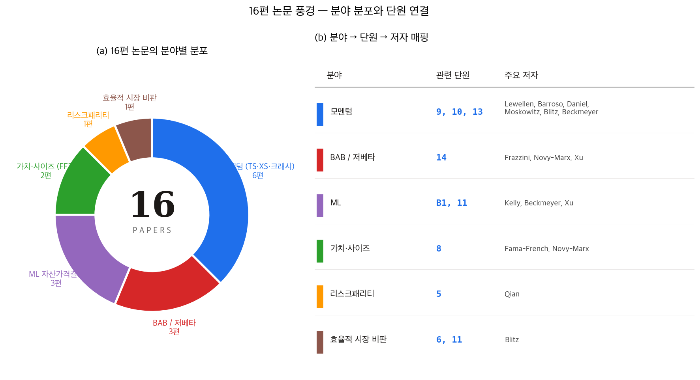
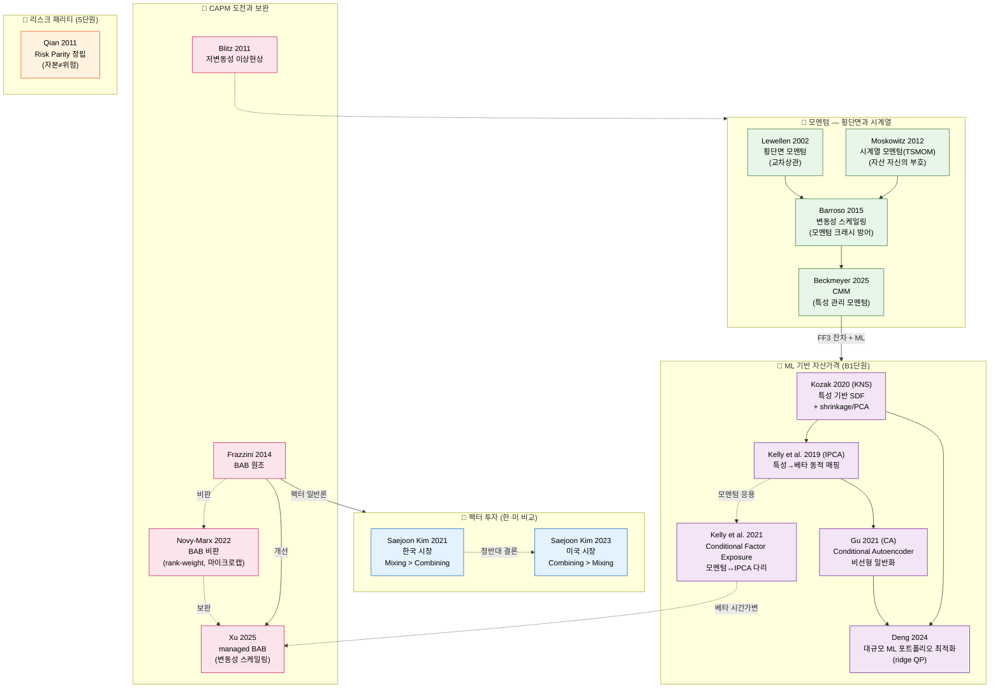

# 11단원: 논문 리뷰 종합 — 9편의 논문이 말하는 것

---

## 0. 핵심 용어 사전

이 단원에서 반복적으로 등장하는 용어를 먼저 정리한다. 본문을 읽다가 헷갈릴 때 여기로 돌아오면 된다.

| 용어 | 설명 | 비유 |
|------|------|------|
| **알파(α)** | 팩터모형이 설명하지 못하는 초과수익. 양수면 모형보다 잘한 것, 0이면 모형이 완전히 설명한 것 | 시험에서 예상 점수 대비 실제 점수 차이 |
| **샤프비율** | 위험 1단위당 초과수익. 0.5 이상이면 괜찮고, 1.0 이상이면 우수 | 시간당 시급 — 같은 노력(위험)으로 얼마나 버는가 |
| **잔차 모멘텀** | 팩터 노출을 제거한 뒤의 "진짜 실력" 기반 모멘텀 | 시험 총점이 아니라 과목 난이도를 보정한 후의 점수 |
| **오토인코더** | 입력을 압축했다 복원하는 과정에서 핵심 패턴만 남기는 AI 필터 | 사진을 극단적으로 축소했다가 다시 복원하면 핵심 윤곽만 남는 것 |
| **조건부 베타** | 시간에 따라 변하는 민감도. 고정된 베타가 아니라 상황별로 달라지는 위험 노출 | 계절에 따라 변하는 체력 — 여름과 겨울에 마라톤 기록이 다르듯 |
| **리드-래그** | 큰 주식(또는 시장)이 먼저 움직이고 작은 주식이 뒤따르는 현상 | 큰 배가 방향을 틀면 작은 배가 뒤따르는 것 |
| **TSMOM** | 시계열 모멘텀. 자산 자체의 과거 수익률 부호(+/−)로 매수/매도를 결정 | "내 성적이 올랐으니 계속 오를 것"이라는 베팅 |
| **BAB** | Betting Against Beta. 저베타 주식을 사고 고베타 주식을 파는 전략 | 안정적인 우등생에 투자하고, 변동이 큰 학생은 피하는 전략 |
| **변동성 스케일링** | 위험이 클 때 투자 비중을 줄이고, 작을 때 늘리는 위험 관리 기법 | 파도가 높으면 돛을 줄이고, 잔잔하면 돛을 펼치는 것 |

---

## 1. 왜? — 이 단원을 배우는 이유

1~10단원까지 우리는 자산운용의 기초 개념(포트폴리오, 분산투자)에서 출발해, 이론(효율적 프론티어, CAPM, SDF, 팩터모델)을 거쳐, 실증 팩터(SMB, HML, WML)와 그 위험(모멘텀 크래시, 변동성 스케일링)까지 도달했다.

그런데 이 모든 내용은 **어디에서 온 것일까?**

교과서도 있고 강의도 있지만, 자산운용의 지식은 궁극적으로 **학술 논문**에서 시작된다. 연구자들이 데이터를 모으고, 가설을 세우고, 검증하고, 학술지에 발표한 결과물이 쌓여서 교과서가 되고, 결국 실무의 근거가 된다.

이 단원에서는 수업에서 참고한 **9편의 핵심 논문**을 하나씩 살펴본다. 각 논문이 어떤 질문에 답하려 했고, 무엇을 발견했으며, 우리 학습서의 어느 부분과 연결되는지를 정리한다.

> **비유:** 학습서가 완성된 건물이라면, 논문은 그 건물을 짓는 데 쓰인 **벽돌**이다. 벽돌 하나하나가 어디에 쓰였는지를 알면, 건물 전체의 구조가 더 선명하게 보인다.

---

## 2. 논문별 요약

### 2-0. 16편의 풍경 한눈에



> **그림 읽는 법** —
> - **(a) 좌측 도넛**: 16편을 6개 분야로 분류. 가장 비중이 큰 것은 **모멘텀(6편)**, 다음 BAB·ML(각 3편), 가치·사이즈(2편), 리스크패리티·효율시장 비판(각 1편).
> - **(b) 우측 표**: 각 분야 → 관련 단원 → 주요 저자 매핑. 한 분야의 논문 여러 편이 한 단원에 모이지 않고, **한 단원이 여러 분야를 묶는** 경우(예: 11단원·B1단원)가 자주 보인다.

이 단원의 나머지(2-1~)에서는 16편을 한 편씩 자세히 다룬다.

---

### 논문 1: Barroso & Santa-Clara (2015, JFE)

**"Momentum has its moments"**

**한 문장으로:** 모멘텀은 위험관리 없이는 재앙이 될 수 있지만, 변동성 스케일링으로 방어 가능하다.

**연구 설계:** 미국 주식(CRSP), 1927~2011년, 월별 모멘텀 포트폴리오 수익률의 변동성을 과거 6개월 일별 수익률로 추정하여 스케일링 적용.

**핵심 질문:** 모멘텀 전략은 왜 때때로 폭락(크래시)하며, 이를 사전에 방어할 수 있는가?

**핵심 발견:**
- 모멘텀 전략의 수익률 변동성(위험)은 시간에 따라 크게 변한다. 어떤 달에는 안정적이고, 어떤 달에는 극도로 위험하다.
- 변동성은 **예측 가능**하다. 과거 6개월의 일별 수익률로 다음 달의 변동성을 꽤 정확히 추정할 수 있다.
- 이 예측된 변동성에 맞춰 투자 비중을 조절하면(변동성 스케일링), 모멘텀 크래시의 피해를 대폭 줄이면서도 수익은 유지할 수 있다. 샤프비율이 0.53에서 0.97로, 거의 2배 개선된다.

**학습서 연결:** 10단원 (모멘텀 크래시와 변동성 스케일링)의 핵심 논거. 변동성 스케일링 공식 $r_{scaled} = \frac{\sigma_{target}}{\hat{\sigma}_t} \times r_t$의 이론적 근거를 제공한다.

**한계/열린 질문:** 거래비용 증가, 레버리지 필요, 변동성 추정 오류 시 역효과 가능.

**이 결과를 그대로 믿어도 되는가?** 표본 기간이 대공황·2차대전을 포함하여 극단적 크래시의 빈도가 과대 추정될 수 있다. 변동성 추정 오류가 스케일링 효과를 감소시킬 수 있으므로, 실전에서는 보수적으로 적용해야 한다.

**So what? — 투자/연구 함의:** "변동성이 높으면 포지션을 줄여라 — 이것이 위험관리의 핵심." 모멘텀 전략을 실행하는 모든 투자자에게 변동성 스케일링은 선택이 아니라 필수다. 수익률뿐 아니라 위험의 시간적 변화를 이해하는 것이 자산운용의 핵심임을 보여준다.

---

### 논문 2: Beckmeyer & Moerke (2025, JBF)

**"Characteristic-Managed Momentum"**

**한 문장으로:** 기업 특성(사이즈, 변동성 등)을 활용해 모멘텀 신호의 가중치를 조절하면, 모멘텀 전략의 성과를 크게 개선할 수 있다.

**연구 설계:** 미국 주식, 기업 특성 데이터(사이즈, 변동성, 거래량 등)를 활용하여 CMM(Characteristic-Managed Momentum) 포트폴리오를 구성하고 전통 모멘텀과 성과 비교.

**핵심 질문:** 모멘텀 신호의 모든 구성 요소가 동등하게 중요한가, 아니면 기업 특성에 따라 모멘텀의 강도가 달라지는가?

**핵심 발견:**
- 모멘텀 신호는 모든 종목에서 동등하게 작동하지 않는다. **기업 특성(사이즈, 변동성, 거래량 등)에 따라 모멘텀의 강도가 크게 달라진다.**
- 기업 특성을 활용하여 모멘텀 가중치를 체계적으로 조절하면(CMM), 전통 모멘텀 대비 **샤프비율이 약 2배 개선**된다.
- 이 개선은 단순히 팩터 수를 늘려서 얻는 것이 아니라, 기존 모멘텀 신호를 **더 정교하게 활용**하는 데서 비롯된다.

**학습서 연결:** 9단원 (모멘텀 팩터)에서 배운 전통 모멘텀의 한계를 보완. 7단원 (팩터모델과 APT)에서 배운 "왜 여러 팩터가 필요한가?"에 대한 실증적 답변이기도 하다.

**한계/열린 질문:** ML 기반 특성 선택 시 과적합 위험. 표본 내 성과가 표본 외에서 유지되는지 추가 검증 필요.

**이 결과를 그대로 믿어도 되는가?** 기업 특성 조합의 수가 많으므로 데이터 마이닝 가능성이 있다. 특성 선택이 사후적(ex post)인지 사전적(ex ante)인지를 구분해서 봐야 한다.

**So what? — 투자/연구 함의:** "ML로 모멘텀 신호를 개선할 수 있다 — 모든 종목의 모멘텀이 동등하지 않다." 모멘텀 전략을 쓸 때 단순히 과거 수익률만 볼 것이 아니라, 어떤 종류의 종목에서 모멘텀이 강한지를 함께 고려해야 한다.

---

### 논문 3: Blitz & Van Vliet (2011, JPM)

**"The volatility effect"**

**한 문장으로:** CAPM의 예측과 달리, 변동성이 낮은 주식이 오히려 더 높은 위험조정 수익률을 보인다 — 이것이 저변동성 이상현상이다.

**연구 설계:** 미국 및 글로벌 주식(1986~2006년), 변동성(과거 3년 주간 수익률의 표준편차) 기준으로 10분위 포트폴리오를 구성하여 수익률 비교.

**핵심 질문:** CAPM에 따르면 위험이 높은 주식이 높은 수익을 줘야 하는데, 실제로도 그런가?

**핵심 발견:**
- 놀랍게도 **반대**다. 변동성이 낮은(덜 위험한) 주식이 오히려 더 높은 위험 조정 수익률을 보인다. 이것을 **저변동성 이상현상(low-volatility anomaly)**이라 한다.
- 이 현상은 CAPM의 핵심 예측("위험에 대한 보상")을 정면으로 반박한다.
- 모멘텀 팩터와 결합하면 설명력이 더 높아진다.
- 부가적 발견으로, 잔차 모멘텀(팩터 노출 제거 후의 모멘텀)의 누적수익이 전통 모멘텀을 크게 상회한다. 전통 모멘텀이 약 $200~300인 반면, 잔차 모멘텀은 약 $2,000~3,000에 달한다.

**학습서 연결:** 6단원 (CAPM)에서 배운 베타-수익률 관계에 대한 실증적 반례. 9단원 (모멘텀 팩터)과도 연결된다. "CAPM이 왜 현실에서 잘 안 맞는가?"에 대한 구체적 증거. 모멘텀 그룹(Lewellen, Moskowitz, Barroso)과도 교차점이 있다 — 저변동성 종목에서 모멘텀 효과가 어떻게 나타나는지가 후속 연구의 주제다.

**한계/열린 질문:** 잔차 모멘텀의 성과가 사용하는 팩터 모형에 의존한다 (FF3 vs FF5로 결과가 달라질 수 있음). 저변동성 이상현상 자체가 시기에 따라 강도가 변한다.

**이 결과를 그대로 믿어도 되는가?** 저변동성 포트폴리오는 유틸리티, 필수소비재 등 특정 섹터에 편중되기 쉽다. 섹터 쏠림이 수익의 원천인지, 진짜 변동성 효과인지를 구분해야 한다.

**So what? — 투자/연구 함의:** "저변동성 주식에 집중하는 것이 위험조정 수익 면에서 유리할 수 있다." CAPM이 "틀렸다"는 것이 아니라, 현실에는 CAPM이 포착하지 못하는 요소(투자자의 행동 편향, 레버리지 제약 등)가 있다는 것을 보여준다.

---

### 논문 4: Frazzini & Pedersen (2014, JFE)

**"Betting against beta"**

**한 문장으로:** 저베타가 고베타를 이기는 현상은 모든 자산군에서 나타나는 보편적 이상현상이다.

**연구 설계:** 미국 주식(1926~2012), 20개국 주식, 국채, 회사채, 선물 등 다자산군. 베타 기준 10분위 포트폴리오 구성, 저베타 매수 + 고베타 매도.

**핵심 질문:** 왜 고베타(고위험) 주식의 수익률이 CAPM 예측보다 낮고, 저베타(저위험) 주식이 예측보다 높은가?

**핵심 발견:**
- 많은 투자자(연기금, 뮤추얼펀드 등)는 **레버리지(빚을 내서 투자)에 제약**이 있다. 이들은 높은 수익을 원하면 빚을 내는 대신 고베타 주식을 산다.
- 이로 인해 고베타 주식이 **과대평가**되고, 저베타 주식이 **과소평가**된다.
- "저베타 주식을 사고 고베타 주식을 파는(BAB)" 전략은 유의미한 양의 초과수익을 낸다. 이 현상은 주식, 채권, 외환, 상품 등 거의 모든 자산군에서 관찰된다.

**학습서 연결:** 8단원 (사이즈/가치 팩터, FF3)에서 다룬 SMB, HML의 논리를 베타 차원으로 확장. CAPM의 SML(증권시장선)이 이론보다 "평평하다"는 실증 사실의 원인을 설명.

**한계/열린 질문:**
- **레버리지 비용:** BAB 전략은 이론적으로 레버리지를 사용하는데, 실제 차입 비용이 수익을 잠식할 수 있다.
- **공매도 제약:** 고베타 주식을 공매도하는 데 드는 비용(대차 수수료)과 제약이 수익을 감소시킨다.
- **Novy-Marx 비판(논문 8 교차 참조):** BAB의 수익 대부분이 소형·비유동성 종목에 집중되어 있어, 거래비용 반영 시 수익이 크게 감소한다.
- **구성 방법 민감도:** 베타 추정 기간, 포트폴리오 가중 방식에 따라 결과가 달라진다.

**이 결과를 그대로 믿어도 되는가?** Novy-Marx & Velikov(2022)가 보여주듯, BAB의 논문 상 수익과 실제 구현 가능 수익 사이에 큰 간극이 있다. 거래비용, 유동성 제약을 반드시 고려해야 한다.

**So what? — 투자/연구 함의:** "시장의 비효율성은 투자자의 '어리석음' 때문만이 아니라 '할 수 없음' 때문이기도 하다." 구조적 제약(레버리지 한계)이 가격 왜곡을 만들 수 있으며, 이를 이해하면 위험조정 수익을 개선할 여지가 있다.

**교차 참조:** 논문 8(Novy-Marx, 2022)이 BAB 전략의 실행가능성을 비판하며, 논문 9(Xu, 2025)가 managed BAB로 대안을 제시한다.

---

### 논문 5: Kelly, Pruitt & Su (2021, JFE)

**"Autoencoder asset pricing models"**

**한 문장으로:** AI(오토인코더)가 전통 팩터를 대체할 비선형 팩터를 발견할 수 있다.

**연구 설계:** 미국 주식(CRSP, 1957~2016), 94개 기업 특성, 선형(PCA, IPCA)과 비선형(오토인코더) 모형의 수익률 설명력 비교. 표본 외 R² 기준 평가.

**핵심 질문:** 기계학습(오토인코더)을 사용하면 전통적 팩터모델보다 자산 수익률을 더 잘 설명할 수 있는가?

**핵심 발견:**
- 전통적 팩터모델은 연구자가 **어떤 팩터를 쓸지 직접 결정**한다(시장, 사이즈, 가치 등). 하지만 오토인코더는 데이터로부터 **최적의 팩터를 자동으로 학습**한다.
- 이렇게 학습된 팩터는 기존 3팩터, 5팩터 모형보다 수익률 설명력이 높다. 특히 비선형 오토인코더가 선형 모형보다 우수하다.
- 기계학습이 발견한 팩터는 기존 팩터(시장, SMB, HML 등)와 **부분적으로 겹치지만 완전히 같지는 않다.** 인간이 미처 포착하지 못한 패턴이 데이터 속에 존재할 수 있다.

**IPCA와 모멘텀 설명:**

Kelly et al.은 오토인코더 외에도 **IPCA(Instrumented PCA, 7단원에서 배운 주성분분석의 확장)** 모형을 제안했다. IPCA는 기업의 특성(사이즈, 가치, 모멘텀 등)이 시간에 따라 변하는 것을 반영하여 **조건부 베타(conditional beta)**를 추정한다.

핵심 발견:
- IPCA 모형은 **조건부 베타를 통해 모멘텀 수익의 상당 부분을 설명**한다. 즉, 모멘텀 수익이 단순한 "이상현상"이 아니라, 팩터 노출이 시간에 따라 변하기 때문에 발생할 가능성이 있다.
- **Fig.1 요약:** 전통 모멘텀, IPCA 기반 모멘텀, 잔차 모멘텀의 누적수익률을 비교하면, IPCA 기반이 가장 높은 누적수익을 보인다.
- **핵심 함의:** 모멘텀은 팩터 노출의 시간적 변동(time-varying beta)에서 비롯될 가능성이 있다. 이것이 맞다면, 모멘텀은 "비합리적 행동"의 산물이 아니라 "변하는 위험에 대한 합리적 보상"일 수 있다.

[Kelly, Pruitt & Su, 2021, JFE, Fig.1]

**학습서 연결:** 7단원 (팩터모델/SDF)에서 배운 "자산가격은 팩터로 설명된다"는 프레임워크를 ML로 확장. 수업 제목("자산운용을 위한 인공지능")의 핵심을 관통하는 논문.

**한계/열린 질문:** 경제적 해석 부재, 실시간 구현 난이도, 구조 변화 시 모형 실패 위험.

**이 결과를 그대로 믿어도 되는가?** 오토인코더가 발견한 팩터가 경제적으로 무엇을 의미하는지 설명할 수 없다면, 과적합의 위험이 항상 존재한다. "설명 없는 패턴"에 돈을 걸 수 있는가는 별도의 판단이다.

**So what? — 투자/연구 함의:** "AI가 팩터를 '발견'할 수 있다면, 인간 연구자의 역할은 '왜?'를 묻는 것이다." ML은 패턴을 찾지만, 그 패턴이 왜 존재하는지(경제적 이유)는 설명하지 못한다. Beckmeyer의 CMM과 비교하면, Kelly는 팩터 자체를 학습하는 반면 Beckmeyer는 기존 모멘텀 팩터의 가중치를 최적화한다 — 접근 방식은 다르지만 "데이터에서 더 많은 정보를 추출하자"는 목표는 같다.

---

### 논문 6: Lewellen (2002, RFS)

**"Momentum and autocorrelation in stock returns"**

**한 문장으로:** 모멘텀은 개별 주식만의 현상이 아니라, 주식들 사이의 교차상관(리드-래그)에서 상당 부분 발생한다.

**연구 설계:** 미국 주식(NYSE/AMEX, 1941~1999), 사이즈·B/M 기준 포트폴리오의 자기상관과 교차상관을 분해하여 모멘텀 수익의 원천 분석.

**핵심 질문:** 모멘텀 효과의 원천은 무엇인가? 개별 주식의 자기상관인가, 아니면 주식 간의 교차 상관인가?

**핵심 발견:**
- 모멘텀 수익의 상당 부분은 개별 주식이 스스로 오르내리는 것(자기상관)이 아니라, **주식들 사이의 리드-래그(선도-후행) 관계**에서 온다.
- 특히 사이즈 포트폴리오와 B/M(장부가/시가) 포트폴리오에서 이 교차 상관이 뚜렷하다. 포트폴리오 모멘텀 수익이 개별 주식 모멘텀의 약 50~100%에 달하며, 모멘텀이 개별 주식만의 현상이 아님을 보여준다.
- 이것은 모멘텀이 단순히 "추세 추종"이 아니라, **정보가 시장에 천천히 반영되는 과정**(slow diffusion of information)과 관련됨을 시사한다.

**학습서 연결:** 9단원 (모멘텀 팩터)에서 배운 모멘텀의 원천에 대한 깊은 분석. Moskowitz(논문 7)의 시계열 모멘텀과 대비하면, Lewellen은 **횡단면**에서 모멘텀의 원천을 파고든다. 둘 다 "왜 과거 승자가 미래에도 이기는가?"를 묻지만, Lewellen은 주식 간 관계에서, Moskowitz는 자산 자체의 시간적 패턴에서 답을 찾는다.

**한계/열린 질문:** 교차상관 설명이 후속 연구에서 얼마나 지지되는지 추가 검증 필요. 포트폴리오 수준 분석이 개별 주식 수준으로 확장 가능한지도 열려 있다.

**이 결과를 그대로 믿어도 되는가?** 교차상관이 모멘텀의 "유일한" 원천인지, 아니면 여러 원천 중 하나인지는 아직 결론나지 않았다. 후속 연구들은 행동재무학적 설명(과소반응, 과잉반응)과 정보 전파 설명이 공존할 수 있음을 시사한다.

**So what? — 투자/연구 함의:** "모멘텀은 단순한 추세 추종이 아니라 정보 전파의 부산물일 수 있다." 대형주의 움직임을 관찰하면 소형주의 향후 움직임을 예측할 단서가 될 수 있다.

---

### 논문 7: Moskowitz, Ooi & Pedersen (2012, JFE)

**"Time series momentum"**

**한 문장으로:** 모멘텀은 횡단면뿐 아니라 시계열에서도 작동하며, 58개 선물에서 검증되었다.

**연구 설계:** 24개국, 58개 유동 선물계약(주식지수 12, 채권 13, 통화 9, 상품 24), 1965~2009년. 과거 12개월 수익률의 부호(+/−)로 롱/숏 결정.

**핵심 질문:** 모멘텀은 횡단면(주식 간 비교)뿐 아니라, 시계열(자산 자체의 과거 대비)에서도 존재하는가?

**핵심 발견:**
- **그렇다.** 주식지수, 채권, 통화, 상품 등 58개 자산에서, 과거 12개월 수익률이 양(+)이면 앞으로도 양의 수익을 낼 확률이 높다(반대도 마찬가지).
- 이것을 **시계열 모멘텀(time-series momentum, TSMOM)**이라 한다. 횡단면 모멘텀("A가 B보다 많이 올랐으니 A를 사자")과 달리, "이 자산이 자기 자신의 과거보다 올랐으니 사자"는 전략이다.
- TSMOM은 기존 팩터(시장, 가치, 사이즈, 횡단면 모멘텀)로 설명되지 않는 **독립적인 수익원**이다.
- 변동성이 높은 시기에 특히 강한 성과를 보인다.

**TSMOM 핵심 데이터와 비전공자를 위한 설명:**

횡단면 모멘텀과 시계열 모멘텀은 "비교 대상"이 다르다.

> **비유:** 횡단면 모멘텀은 "반 석차"와 같다. "나보다 잘한 애 vs 못한 애"를 비교해서, 잘한 쪽에 베팅한다. 시계열 모멘텀은 "나 자신의 성적 추이"와 같다. "내가 지난 학기보다 올랐으면 계속 오를 것이다"라고 베팅한다. 다른 사람(다른 주식)과 비교하지 않고, 오직 자기 자신의 과거와 비교한다.

- **횡단면 모멘텀:** "A주식이 B주식보다 많이 올랐으니, A를 사고 B를 판다" (주식 간 비교)
- **시계열 모멘텀(TSMOM):** "이 자산의 과거 12개월 수익률이 양수면 long, 음수면 short" (자기 자신과 비교)

**검증 범위:** 58개 선물계약, 4개 자산군(주식지수, 채권, 통화, 상품)

**핵심 결과:**
- 연 샤프비율 약 1.0 — 매우 높은 위험 조정 성과
- 모든 자산군에서 양의 알파 (기존 팩터로 설명되지 않는 독립적 수익원)
- 횡단면 모멘텀과 상관은 있지만 완전히 같지 않다 — 둘 다 쓰면 분산투자 효과

**Fig.3 요약 — TSMOM의 누적수익률:**
TSMOM 전략의 누적수익률은 단순 패시브 롱(buy-and-hold) 전략을 크게 상회한다. 특히 **2008년 금융위기에서 TSMOM은 양의 수익**을 기록했다. 시장이 폭락할 때 과거 수익률이 음수이므로 자동으로 short 포지션을 취하게 되고, 이것이 하락장에서 수익을 만들어낸다.

[Moskowitz, Ooi & Pedersen, 2012, JFE, Fig.3]

**학습서 연결:** 9단원 (모멘텀 팩터)에서 배운 횡단면 모멘텀의 확장판. 10단원 (변동성 스케일링)과도 긴밀히 연결 — 시계열 모멘텀은 변동성 관리와 자연스럽게 결합된다.

**한계/열린 질문:** TSMOM이 최근(2010년대 이후) 성과 약화 추세. 전략이 널리 알려지면서 차익이 줄어들었을 가능성.

**이 결과를 그대로 믿어도 되는가?** 선물 데이터는 주식보다 이용 가능 기간이 짧고, 일부 상품 선물은 유동성이 낮다. 또한 2010년대 이후 성과 약화는 "전략이 알려지면 사라진다"는 효율적 시장 가설의 예측과 일치할 수 있다.

**So what? — 투자/연구 함의:** "모멘텀이 주식뿐 아니라 채권, 통화, 원자재에서도 나타난다는 것은, 이 현상이 특정 시장의 특수성이 아니라 인간 행동의 보편적 패턴(느린 반응, 군중 심리)에 기반할 가능성을 시사한다." 위기 때 수익을 내는 TSMOM의 성질은 포트폴리오 보험으로서의 가치가 있다.

---

### 논문 8: Novy-Marx & Velikov (2022, JFE)

**"Betting Against Betting Against Beta"**

**한 문장으로:** 유명한 BAB 전략도 구성 방법을 바꾸면 성과가 사라질 수 있다 — 팩터 연구의 교훈.

**연구 설계:** 미국 주식(CRSP, 1963~2019), BAB 포트폴리오의 가중치 구조와 거래비용을 체계적으로 분석. 동일가중 대안 전략과 비교.

**핵심 질문:** Frazzini & Pedersen(2014)의 BAB 전략이 실제로 실행 가능한가?

**핵심 발견:**
- **Fig.1 요약:** BAB 전략의 포트폴리오 가중치를 분석하면, 소수의 소형주에 극도로 집중되어 있다. 이론적 수익의 상당 부분이 유동성이 낮고 거래하기 어려운 종목에서 발생한다.
- 단순 동일가중 베타 차익거래 전략이 BAB와 **84% 상관**을 보인다. 복잡한 BAB 구성이 크게 다른 정보를 담고 있지 않다는 뜻이다.
- **Fig.9 요약:** 거래비용(매매수수료, 호가 스프레드)을 반영하면 BAB의 수익 대부분이 소멸한다. "논문 위의 수익"과 "실제 투자할 수 있는 수익"의 간극이 크다.
- **핵심 함의:** 팩터 연구에서 **팩터 구성 방법(포트폴리오 가중치, 유니버스 선택)**이 결과를 크게 좌우한다.

[Novy-Marx & Velikov, 2022, JFE, Fig.1, Fig.9]

**학습서 연결:** 7단원 (팩터모델/APT)과 8단원 (FF3)에서 배운 팩터모델의 "품질 관리" 기준. Kelly의 오토인코더(논문 5)에 대해서도 같은 질문을 던질 수 있다 — "ML이 발견한 팩터도 실제 거래비용을 감당할 수 있는가?"

**한계/열린 질문:** Novy-Marx 자신의 비판도 특정 거래비용 가정에 의존한다. 거래비용이 시간에 따라 감소하는 추세를 고려하면 결론이 달라질 수 있다.

**이 결과를 그대로 믿어도 되는가?** 비판 논문도 완벽하지 않다. 거래비용 추정치 자체에 불확실성이 있고, ETF 등 새로운 투자 수단으로 구현하면 비용 구조가 달라질 수 있다.

**So what? — 투자/연구 함의:** "'좋은 팩터'와 '좋은 투자'는 다르다." 학술 논문에서 유의미한 팩터라도, 실제 구현 시 거래비용과 유동성을 반드시 점검해야 한다. "모델이 데이터에 잘 맞는다"와 "모델이 돈을 벌 수 있다"는 다른 문제다.

---

### 논문 9: Xu (2025, JEF)

**"Managed portfolios and betting against beta"**

**한 문장으로:** 저베타 전략에도 변동성 스케일링을 적용하면 크래시를 방어하면서 수익을 개선할 수 있다.

**연구 설계:** 미국 주식(1963~2022), BAB 포트폴리오에 Barroso & Santa-Clara(2015)의 변동성 스케일링 기법을 적용한 managed BAB 구성 및 성과 비교.

**핵심 질문:** BAB 전략의 크래시 위험을 변동성 스케일링으로 관리할 수 있는가?

**핵심 발견:**
- **Fig.1 요약:** 장기 누적수익률을 비교하면, 저베타 포트폴리오가 고베타 포트폴리오보다 높은 누적수익을 기록한다. CAPM의 예측과 정반대다. Frazzini & Pedersen(2014)의 발견을 더 긴 기간에서 재확인.
- **Fig.4 요약:** 변동성 스케일링을 적용한 managed BAB는 전통 BAB 대비 두 가지가 개선된다. (1) **크래시 방어** — 고변동기에 포지션을 자동 축소하여 급락 피해를 줄인다. (2) **수익 개선** — 저변동기에 레버리지를 적절히 활용하여 장기 수익이 높아진다.
- **핵심 함의:** 변동성 스케일링은 모멘텀 전략만의 도구가 아니라, BAB를 포함한 다양한 팩터 전략에 범용적으로 적용할 수 있는 위험 관리 기법이다. 10단원에서 배운 모멘텀 변동성 스케일링과 동일한 원리가 BAB에도 적용되는 셈이다.

[Xu, 2025, JEF, Fig.1, Fig.4]

**학습서 연결:** 수업 전체의 미래 방향을 제시하는 논문. 7단원 (SDF/팩터모델)의 프레임워크를 AI로 확장하며, Barroso(논문 1)의 변동성 스케일링을 BAB에 적용한 것이므로 논문 1과 논문 4의 교차점이기도 하다.

**한계/열린 질문:** ML 기반 가격결정의 데이터 마이닝 비판, 경제적 구조 변화 시 모형 실패. managed BAB의 레버리지 비용이 실전에서 어느 정도인지 추가 검증 필요.

**이 결과를 그대로 믿어도 되는가?** managed BAB가 Novy-Marx의 거래비용 비판을 완전히 극복하는지는 아직 열린 질문이다. 스케일링 자체가 추가적인 거래를 유발하므로, 거래비용이 더 늘어날 수 있다.

**So what? — 투자/연구 함의:** "하나의 기법(변동성 스케일링)이 여러 팩터에 범용 적용될 수 있다." AI가 아무리 뛰어나도, 1~10단원에서 배운 기초 이론(분산투자, 팩터, 위험-수익 트레이드오프)을 이해하지 않으면 AI의 출력을 해석할 수 없다. 기초가 먼저다.

---

### 논문 10: Qian (2011, Journal of Investing)

**"Risk Parity and Diversification"**

**한 문장으로:** 자산을 동일한 위험 기여(risk contribution)로 배분하는 리스크 패리티가 효율적 프론티어상의 의미 있는 점이며, 분산투자의 가장 균형 잡힌 형태다.

**연구 설계:** 리스크 패리티 포트폴리오의 수학적 정의(자산별 한계 위험 기여가 동일)를 정립하고, 이를 다양한 자산군에서 시뮬레이션. 미국 주식·채권·상품의 다중 자산 포트폴리오에서 RP, 60/40, EW 비교.

**핵심 질문:** 단순한 시총 가중이나 60/40 같은 전통적 배분이 정말 최적인가? 리스크가 어디에서 오는지를 명시적으로 고려하는 더 나은 방법이 있는가?

**핵심 발견:**
- 60/40 포트폴리오는 자본의 60%를 주식에 배분하지만, 주식의 변동성이 채권보다 훨씬 크기 때문에 **위험의 약 90%가 주식에서 온다**. 즉 자본 분산이지 위험 분산이 아니다.
- 리스크 패리티 포트폴리오는 모든 자산의 위험 기여가 동일하도록 가중치를 설정한다. 보통 채권에 더 큰 자본 비중, 주식에 더 작은 자본 비중.
- 적절한 레버리지를 적용하면 RP는 같은 위험 수준에서 60/40보다 높은 수익률을 낸다.
- 자산이 충분히 다양해지면 (10개 이상) RP의 분산투자 효과가 EW를 압도한다.

[Qian, 2011, Exhibits 1, 3]

**학습서 연결:** 5단원(포트폴리오 전략)의 리스크 패리티 절의 직접적 이론 출처. 5단원에서 다룬 RP 수식(자산 $i$의 한계 위험 기여 $RC_i$ 정의, $RC_i = RC_j$ 조건, 2자산 해의 $\sigma$-역수 비례 결과)이 이 논문에서 정립됐다. 또한 1단원의 분산투자 개념이 "자본의 분산"이 아니라 "위험의 분산"으로 진화하는 분기점.

**한계/열린 질문:** RP에 필요한 레버리지가 실전에서 비용이 큼. 채권 시장에서 빌리는 것이 어려운 시기(예: 2008)에는 RP가 작동 안 함. 또한 자산 간 공분산 추정 오류에 민감.

**이 결과를 그대로 믿어도 되는가?** 2010년대의 저금리 환경이 RP의 채권 비중을 부풀리는 효과가 있었다. 금리가 정상화되면 RP의 우월성이 약해질 수 있다. 또한 모든 자산의 변동성이 같이 폭증하는 위기에서는 RP도 무력하다.

**So what? — 투자/연구 함의:** "분산투자의 진짜 의미는 자본이 아니라 위험의 분산이다." 5단원에서 본 4가지 전략 중 RP가 학계와 실무에서 가장 큰 호응을 얻은 이유. AQR의 Risk Parity Fund, Bridgewater의 All Weather가 이 사상의 직접적 적용 사례.

---

### 논문 11: Saejoon Kim (2021, Pacific-Basin Finance Journal)

**"Enhanced factor investing in the Korean stock market"**

**한 문장으로:** 한국 시장의 5개 팩터(사이즈·가치·모멘텀·수익성·저위험)에서 부정적 노출을 사전 제거한 enhanced 단일팩터를 단순 mixing하면, 시그널 결합(combining)보다 우수하다 — 통념과 정반대.

**연구 설계:** 한국 주식시장 데이터로 5팩터 long-only 포트폴리오 구성. 각 팩터의 "부정적 노출(negative exposure to unintended factors)"이 큰 종목을 제거하여 enhanced 단일팩터 포트폴리오 구성. Mixing(단일팩터 평균)과 Combining(시그널 결합)의 성과 비교.

**핵심 질문:** 한국 시장에서 어떤 팩터가 risk premium을 가지는가? 다중팩터를 결합하는 두 방식 중 어느 쪽이 더 효과적인가?

**핵심 발견:**
- 한국 시장에서 **5팩터 모두 양의 risk premium**을 갖는다. 특히 **사이즈 팩터의 프리미엄이 가장 크다**.
- 단일팩터 포트폴리오를 만들 때, 다른 팩터에 대한 부정적 노출이 수익률을 갉아먹는다.
- 부정적 노출을 큰 자산을 제거하면 enhanced 단일팩터 포트폴리오의 수익이 크게 개선됨.
- **Mixing(부정 노출 제거 후 단일팩터 평균) > Combining(시그널 결합)**. 통계적으로 유의.

[Kim, 2021, PBFJ]

**학습서 연결:** 14단원의 한국 측 핵심 자료. 8단원(FF3)과 9단원(WML)의 한국 적용. 11단원의 "한국 시장 적용 시 고려사항"(§6) 섹션과 직접 연결. Mixing vs Combining의 통념을 뒤집는다는 점에서 BAB(논문 4)와 비슷한 "통념 도전" 논문.

**한계/열린 질문:** 한국 시장의 단기 표본(약 20년). 거래비용 무시. 부정 노출 제거 임계값 선택의 robustness 검증 필요.

**이 결과를 그대로 믿어도 되는가?** 한국 시장의 특수성(작은 규모, 외국인 비중 변화)이 결과에 영향. 다른 신흥국에서 재현 가능한지 확인 필요. 또한 미국에서 같은 결과가 안 나오는 점(논문 12)이 일반화 어려움을 시사.

**So what? — 투자/연구 함의:** "한 시장에서 검증된 팩터 투자 방식이 다른 시장에서 그대로 통하지 않는다." 신흥국 자산운용에서 추정 잡음이 클 때, 단순한 방법(mixing)이 정교한 방법(combining)을 이길 수 있다는 점은 12단원의 메타 교훈("이론의 가정을 항상 검증하라")의 실증 사례.

---

### 논문 12: Saejoon Kim (2023, Applied Economics)

**"Factor investing: a unified view"**

**한 문장으로:** 미국 주식 50년 데이터에서 enhanced 단일팩터를 구성한 결과, 한국과 정반대로 **시그널 결합(signal-blended combining)** 이 mixing을 1% 유의수준에서 압도한다.

**연구 설계:** 미국 주식 약 50년 데이터(1970년대~2010년대). 동일한 5팩터(사이즈·가치·모멘텀·수익성·저위험)와 enhanced 방법론. Mixing과 Combining(특히 signal-blended)의 다양한 성과 측도(평균 수익, 샤프비율, 정보비율) 비교.

**핵심 질문:** 미국 시장에서도 한국에서처럼 mixing이 우수한가? 즉 enhanced 방식의 결과는 시장 독립적인가?

**핵심 발견:**
- 미국에서도 5팩터 모두 양의 risk premium을 갖는다. 약 50년 동안 일관됨.
- 그러나 **결합 방식의 우열은 한국과 정반대**: 미국에서는 **signal-blended combining > mixing**.
- 통계적 유의성 1% 수준 (매우 강한 결과).

[Kim, 2023, AE]

**학습서 연결:** 14단원의 미국 측 핵심 자료. 논문 11과 짝을 이루는 비교 연구. 신흥국 vs 선진국 자산운용의 방법론 차이를 보여주는 가장 명확한 사례.

**한계/열린 질문:** 한·미 차이의 원인 분석이 추가 연구 과제. 시장 미시구조? 표본 크기? 거래비용? 행동 편향의 차이?

**이 결과를 그대로 믿어도 되는가?** 미국은 50년 표본이라 잡음 평균 효과가 강력. 미래에도 같은 패턴이 지속될지는 불확실(시장 효율성이 시간에 따라 변하므로). 단 50년이라는 표본은 학계에서 매우 신뢰할 만한 분량.

**So what? — 투자/연구 함의:** 논문 11과 함께 묶어 봐야 의미가 큰 논문. **"하나의 정답이 없다"** 는 자산운용의 일반 원칙을 두 시장의 정반대 결론으로 보여준다. 한국 운용역과 미국 운용역이 같은 방법론을 써서는 안 된다.

---

### 논문 13: Kozak, Nagel & Santosh (2020, Journal of Financial Economics)

**"Shrinking the cross-section"** — 일명 KNS

**한 문장으로:** 수많은 자산 특성을 SDF의 후보 변수로 받아들이되, **shrinkage(수축)** 을 통해 진짜로 작동하는 소수만 살리는 방식이 ML 기반 자산가격결정의 출발점.

**연구 설계:** SDF $m_t = 1 - b'(F_t - E[F_t])$로 매개변수화. $F_t$를 자산 특성으로부터 만든 K개의 팩터 수익률로 정의. $b = \Sigma^{-1} E[F_t]$의 sample 추정에 ridge / lasso 같은 shrinkage 적용. 미국 주식 50개 이상의 anomaly로 검증.

**핵심 질문:** 자산 특성이 수십~수백 개 있을 때, 어느 것을 SDF에 넣어야 하나? 정통 회귀로는 추정 잡음이 너무 크다. ML의 shrinkage가 답이 될 수 있나?

**핵심 발견 (강의 슬라이드 [l6.pdf] 기반, 정량 수치는 원논문 확인 필요):**
- 자산 특성이 많아질수록 ($K \ll T$가 깨지면) 정통 sample 추정 $\hat b = \hat\Sigma^{-1}\hat\mu$이 매우 부정확해진다 [l6.pdf p.6].
- 이를 해결하기 위해 **shrinkage(ridge)** 또는 **PCA 기반 차원 축소**가 필수.
- $\Sigma = QDQ'$로 분해하여 PC 팩터 $P_t = Q'F_t$를 정의하면, 작은 고유값 방향(추정 잡음이 큰)을 제거하고 큰 고유값 방향(진짜 위험 프리미엄을 담는)에 집중할 수 있다 [l6.pdf p.7].
- 슬라이드의 "Figures 2, 4, 6, 8" 결과는 이 접근의 실증 우수성을 보여준다.

[Kozak, Nagel & Santosh, 2020, JFE, Figs. 2, 4, 6, 8 — l6.pdf p.7~8 참조]

> **⚠ 주의**: OOS 샤프비율의 정량 비교는 슬라이드에 명시되지 않았다. 정확한 수치는 원논문 본문에서 확인해야 한다.

**학습서 연결:** B1단원 §5의 직접 출처. 6단원(SDF)의 함수형태 가정을 ML로 확장하는 첫 시도. 7단원의 PCA가 이 논문에서 SDF 추정에 적용된다. 11단원에 ML 자산가격 모형이 본격 등장하는 시작점.

**한계/열린 질문:** 자산 특성을 어떻게 정규화할 것인가의 선택이 결과에 큰 영향. 시간 가변 SDF는 다루지 못함 (IPCA가 그 방향 — 논문 14).

**이 결과를 그대로 믿어도 되는가?** OOS 성능이 강하다고 해도, 시장 구조가 바뀌면 학습된 SDF가 무너질 수 있다. 미국 데이터에서 검증된 결과. 신흥국 적용 가능성은 별개의 연구 과제.

**So what? — 투자/연구 함의:** "정통 회귀 + 많은 특성 = 재앙. ML의 shrinkage가 그것을 살린다." 자산운용에서 ML이 본격적으로 사용되는 이론적 정당화. AQR, BlackRock 같은 대형 운용사의 systematic team이 이 사상을 차용.

---

### 논문 14: Kelly, Pruitt & Su (2019, Journal of Financial Economics)

**"Characteristics are covariances: A unified model of risk and return"** — 일명 IPCA

**한 문장으로:** 자산 특성이 곧 팩터가 아니라, 팩터 노출($\beta$)을 결정하는 **도구 변수(instrument)** 로 작용한다 — PCA의 시간 가변 일반화.

**연구 설계:** 모형: $R_{i,t+1} = \alpha_{i,t} + \beta_{i,t}' f_{t+1} + \varepsilon$, $\beta_{i,t} = z_{i,t}' \Gamma_\beta$, $\alpha_{i,t} = z_{i,t}' \Gamma_\alpha$. Alternating LS로 $\Gamma_\beta, f$를 동시 추정. 36개 자산 특성, 1962~2014년 12,813 미국 기업.

**핵심 질문:** 자산 특성이 평균 수익률과 관련이 있는 이유는 무엇인가? 특성 자체가 risk premium의 원천인가, 아니면 risk factor에 대한 노출의 proxy인가?

**핵심 발견:**
- 5개 IPCA 팩터가 36개 anomaly의 cross-section을 거의 완전히 설명. FF5보다 우수.
- 가설 검정 $H_0: \Gamma_\alpha = 0$를 기각할 수 없다 → **anomaly는 risk-based로 설명 가능**, 즉 시장 비효율의 증거가 아니라 시간 가변 risk 노출의 증거.
- 시간 가변 베타 ($\beta_{i,t}$)가 시간 불변 베타보다 자산수익률을 훨씬 더 잘 설명.
- predictive $R^2$도 정통 모형 대비 크게 개선.

[Kelly, Pruitt & Su, 2019, JFE, Tables 1, 2, 6]

**학습서 연결:** B1단원 §6의 직접 출처. 7단원(다중팩터 모형, PCA)의 본격적 ML 일반화. 9단원(잔차 모멘텀의 conditional factor exposure)과 직접 연결. 자산가격결정의 패러다임을 "static factor model + alpha"에서 "dynamic factor exposure + zero alpha"로 전환한 논문.

**한계/열린 질문:** 매핑 $z \to \beta$의 선형성. 특성의 비선형 변환·상호작용은 다루지 못함 (CA가 답 — 논문 15). $\Gamma_\alpha = 0$의 통계적 검증력은 표본 크기에 의존.

**이 결과를 그대로 믿어도 되는가?** "anomaly가 모두 risk로 설명된다"는 결론이 맞다면, 효율적 시장 가설(EMH)에 가까운 입장. 그러나 실증 검정 자체가 가설들의 동시 검정이므로 (joint hypothesis problem) 절대적 결론은 어렵다.

**So what? — 투자/연구 함의:** "팩터는 잠재적이다. 특성은 도구일 뿐." 7단원의 "관측 팩터(MKT, SMB, HML)"가 사실은 잠재 팩터의 noisy proxy임을 시사. 자산운용 실무에서 IPCA로 추정한 5팩터를 활용하는 사례가 증가.

---

### 논문 15: Gu, Kelly & Xiu (2021, Journal of Econometrics)

**"Autoencoder asset pricing models"** — 일명 CA (Conditional Autoencoder)

**한 문장으로:** IPCA의 선형 매핑을 **신경망(autoencoder)** 으로 일반화하면, 자산 특성 사이의 비선형·상호작용 효과까지 포착되어 자산가격 모형의 설명력과 예측력이 또 한 단계 개선된다.

**연구 설계:** Conditional Autoencoder 구조: 좌측 베타 네트워크($z_{i,t} \to \beta_{i,t}$ 비선형 매핑), 우측 팩터 네트워크($r_t \to f_t$). SGD + train/validation/test split + L2 정규화. 1957~2016년 미국 주식, 94개 특성.

**핵심 질문:** 자산 특성과 팩터 노출 사이의 관계가 비선형적이라면? 신경망으로 그것을 학습할 수 있다면 자산가격 설명력이 얼마나 더 개선되는가?

**핵심 발견 (강의 슬라이드 [l6.pdf] 기반):**
- 자산 특성에서 팩터 노출 $\beta$로의 매핑을 **신경망(autoencoder)** 으로 일반화하여 비선형성과 상호작용 효과를 포착.
- 좌측 베타 네트워크: $z_{i,t} \to \beta_{i,t}$ 비선형 매핑 (다층 활성함수 $g(\cdot)$)
- 우측 팩터 네트워크: 자산 수익률 $r_t \to f_t$ 비선형 매핑
- 학습 절차: 시계열을 train/validation/test로 분할, 정규화 항 $\phi(\theta)$ 추가, SGD로 최적화 [l6.pdf p.27]
- 슬라이드의 "Tables 1, 2, 3, 4, 6" 결과로 IPCA보다 향상된 설명력을 보여준다.

[Gu, Kelly & Xiu, 2021, J.Econometrics, Tables 1~6 — l6.pdf p.20~28 참조]

> **⚠ 주의**: 신경망 깊이의 최적값, OOS 개선폭의 정량 수치는 슬라이드에 명시되지 않았다. 정확한 비교는 원논문 본문에서 확인해야 한다.

**학습서 연결:** B1단원 §7의 직접 출처. 자산가격결정에 **딥러닝**이 본격 도입된 첫 사례 중 하나. 7단원 → IPCA(논문 14) → CA의 직선적 일반화 흐름의 종착점.

**한계/열린 질문:** 신경망의 해석 가능성(interpretability) 부재 — 어느 비선형이 어떤 경제적 메커니즘에 대응하는지 알기 어렵다. 데이터 의존성이 강해 다른 시장·시기에서 재현 보장 불확실. 학습 비용(GPU).

**이 결과를 그대로 믿어도 되는가?** ML 모형 일반의 위험 — 과적합, 데이터 누수(look-ahead bias), 시장 구조 변화. 이 논문의 OOS 평가는 엄격하지만, 실전 적용 시에는 추가 검증 필수.

**So what? — 투자/연구 함의:** "딥러닝은 자산가격 모형의 해상도를 높이지만 해석 가능성을 잃는다." 12단원의 "수학은 정답을 주는 게 아니라 무엇을 모르는지를 알려준다"의 ML 시대 버전. 자산운용에서 CA/Transformer 같은 모형이 빠르게 보급되는 중.

---

### 논문 16: Deng et al. (2024, Data Science in Science)

**"A Unified Framework for Fast Large-Scale Portfolio Optimization"**

**한 문장으로:** ML로 추정한 평균과 공분산을 받아 대규모(>1,000개 자산) 포트폴리오 최적화를 효율적으로 푸는 통합 프레임워크. ridge penalty의 행렬 분해 효과가 핵심.

**연구 설계:** 평균/공분산 추정에 shrinkage와 factor model 두 트랙. 포트폴리오 최적화에 long-only, turnover, factor neutrality 같은 다양한 선형 제약. ridge penalty의 spectral 해석. 미국 주식 대규모 universe에서 시뮬레이션.

**핵심 질문:** ML로 추정한 자산 모형을 어떻게 실전 포트폴리오에 효율적으로 연결할 것인가? 거래비용·제약을 고려한 대규모 QP를 빠르게 푸는 방법은?

**핵심 발견 (강의 슬라이드 [l6.pdf p.29~34] 기반):**
- ridge penalty $\lambda \|w\|^2_2$ 추가가 공분산 행렬의 spectral 분해 $\Sigma = P\Lambda P^t$를 통해 **모든 고유값을 $\lambda$만큼 위로 이동**시키는 효과로 환원된다 ($\tilde\Sigma = P(\Lambda + \lambda I) P^t$). 즉 작은 고유값(불안정 방향)이 안정화 [l6.pdf p.31].
- 다양한 선형 제약(long-only, turnover, benchmark exposure, factor neutrality)이 모두 표준 QP 형식으로 통합 가능 [l6.pdf p.30].
- 최대 샤프비율 포트폴리오 구성에서 PCA·IPCA가 추정한 매핑 행렬 $V$를 통해 자산-팩터 관계를 정의 [l6.pdf p.33~34].
- 슬라이드의 "Table 2"가 모형별 비교 결과를 제시.

[Deng et al., 2024, DSS — l6.pdf p.29~34 참조]

> **⚠ 주의**: 정통 mean-variance와의 OOS 성과 비교 수치는 슬라이드에 명시되지 않았다. 원논문 Table 2에서 확인 필요.

**학습서 연결:** B1단원 §8의 직접 출처. A1단원의 이차 최적화와 양정부호 정리가 실전에서 어떻게 활용되는지 보여주는 사례. 5단원(포트폴리오 전략) + B1(ML 자산가격) + A1(최적화)의 합류점.

**한계/열린 질문:** ridge penalty 강도 $\lambda$의 선택이 hyperparameter 튜닝에 의존. 거래비용 모델링이 상수로 단순화되어 있음. 실전 시장에서의 시장 충격(market impact) 미반영.

**이 결과를 그대로 믿어도 되는가?** 시뮬레이션 검증은 강력하지만, 실전 운용에서는 거래비용과 시장 충격이 결과를 크게 좌우. 이 논문의 결과는 중대형 펀드(수천억~수조원)의 운용에는 추가 보정 필요.

**So what? — 투자/연구 함의:** "ML 자산가격 모형의 실용적 활용을 위한 마지막 다리." 학계의 ML 모형(KNS, IPCA, CA)이 실무 자산운용으로 흘러가는 통로. AI 기반 systematic 운용 회사가 이 사상을 적극 채택.

---

## 3. 논문 간 관계도

> **시각화 안내**: 아래 Mermaid 다이어그램은 VSCode·GitHub·Typora·Obsidian에서 자동 렌더링된다. 16편 논문의 비판-응답-확장 관계를 한눈에 보여준다.



**관계도 읽는 법:**

- 실선 화살표 (→): 직접 발전·개선 관계
- 점선 화살표 (-.->): 비판·대안 관계
- 색상별 테마: 빨강(BAB), 초록(모멘텀), 주황(리스크패리티), 파랑(팩터투자), 보라(ML)

**5가지 큰 흐름:**

1. **CAPM 도전·보완**: Blitz → Frazzini(BAB) → Novy-Marx(비판) → Xu(보완)
2. **모멘텀**: Lewellen·Moskowitz → Barroso(변동성 스케일링) → Beckmeyer(CMM)
3. **리스크 패리티**: Qian이 분산투자 사상의 분기점 (5단원)
4. **팩터 투자(한·미)**: Saejoon Kim 2021 vs 2023 — 정반대 결론
5. **ML 자산가격**: Kozak → Kelly2019(IPCA) → Gu(CA) → Deng (B1단원의 본체)

**참고용 ASCII 버전 (텍스트 환경용):**

```
┌─────────────────────────────────────────────────────────────────────────────┐
│                        논문 간 관계 — 큰 그림                                │
├─────────────────────────────────────────────────────────────────────────────┤
│                                                                             │
│  ┌─────────────────────────── 이론 기반 ───────────────────────────┐        │
│  │                                                                 │        │
│  │   Blitz & Van Vliet (2011)         Frazzini & Pedersen (2014)  │        │
│  │   "저변동성 이상현상"               "Betting Against Beta"      │        │
│  │   CAPM이 틀렸다?                   왜 틀렸는지 설명            │        │
│  │         │                                  │  ▲                 │        │
│  │         │ ·····모멘텀 그룹과 교차·····      │  │ 비판            │        │
│  │         │                           Novy-Marx (2022)            │        │
│  │         │                           "BAB 실행가능성 의문"       │        │
│  │         │                                  │  │                 │        │
│  │         │                                  │  ▼ 대안            │        │
│  │         │                             Xu (2025)                 │        │
│  │         │                           "managed BAB"               │        │
│  │         │                                  │                    │        │
│  │         └──────────┬───────────────────────┘                    │        │
│  │                    ▼                                            │        │
│  │            CAPM/팩터모델의 한계                                  │        │
│  │            (6~8단원의 실증적 도전)                                │        │
│  └─────────────────────────────────────────────────────────────────┘        │
│                    │                                                        │
│                    ▼                                                        │
│  ┌─────────────────────────── 모멘텀 ─────────────────────────────┐        │
│  │                                                                 │        │
│  │   Lewellen (2002)          Moskowitz et al. (2012)             │        │
│  │   "모멘텀의 원천은          "시계열 모멘텀도 존재               │        │
│  │    교차상관이다"             (주식뿐 아니라 전 자산군)"          │        │
│  │   [횡단면 분석]              [시계열 분석]                      │        │
│  │         │                          │                            │        │
│  │         │    Blitz (2011)          │                            │        │
│  │         │  ··저변동성+모멘텀··     │                            │        │
│  │         │    교차 발견             │                            │        │
│  │         │                          │                            │        │
│  │         └──────────┬───────────────┘                            │        │
│  │                    ▼                                            │        │
│  │         Barroso & Santa-Clara (2015)                            │        │
│  │         "모멘텀 크래시를 변동성 스케일링으로 방어"               │        │
│  │         (9~10단원의 핵심)                                       │        │
│  │                    │                                            │        │
│  │                    ▼                                            │        │
│  │         Beckmeyer & Moerke (2025)                               │        │
│  │         "CMM: 기업 특성으로 모멘텀 가중치 최적화"               │        │
│  │         (모멘텀 신호 개선의 최신 시도)                           │        │
│  └─────────────────────────────────────────────────────────────────┘        │
│                    │                                                        │
│                    ▼                                                        │
│  ┌─────────────── 팩터모델 평가/확장 ─────────────────────────────┐        │
│  │                                                                 │        │
│  │   Novy-Marx (2022)             Beckmeyer & Moerke (2025)       │        │
│  │   "팩터/전략의 실행가능성       "모멘텀 신호 개선 →             │        │
│  │    검증" (과적합 경고)           팩터모델 비교로 확장"           │        │
│  │         │                              │                        │        │
│  │         │   ← Kelly와 교차 대화 →      │                        │        │
│  │         │  "ML 팩터도 거래비용을       │                        │        │
│  │         │   감당할 수 있는가?"          │                        │        │
│  │         └──────────┬───────────────────┘                        │        │
│  │                    ▼                                            │        │
│  │   Kelly, Pruitt & Su (2021)         Xu (2025)                  │        │
│  │   "AI로 팩터를 자동 발견"           "managed BAB +              │        │
│  │   (오토인코더)"                      ML 자산가격결정"           │        │
│  │         │                                  │                    │        │
│  │         │ ← Beckmeyer와 교차 대화 →       │                    │        │
│  │         │  "학습된 팩터 vs 관리된 팩터"     │                    │        │
│  │         │  Novy-Marx와 교차 대화:          │                    │        │
│  │         │  "ML 팩터의 실행가능성은?"        │                    │        │
│  │         └──────────────────┬────────────────┘                   │        │
│  │                            ▼                                    │        │
│  │              전통 팩터 → AI 팩터로의 진화                        │        │
│  │              (수업 전체의 도달점)                                 │        │
│  └─────────────────────────────────────────────────────────────────┘        │
│                                                                             │
│  ════════════════════════════════════════════════════════════════════        │
│  Lewellen(횡단면) vs Moskowitz(시계열):                                     │
│  같은 "모멘텀"을 다른 차원에서 분석. Lewellen은 주식 간 교차상관에서,       │
│  Moskowitz는 자산 자체의 시간적 패턴에서 모멘텀의 원천을 찾는다.            │
│  ════════════════════════════════════════════════════════════════════        │
│  읽는 순서 제안:                                                            │
│  Blitz → Frazzini → Lewellen → Moskowitz → Barroso                        │
│  → Beckmeyer → Novy-Marx → Kelly → Xu                                     │
│  (CAPM 도전 → 모멘텀 이해 → 모멘텀 개선 → 팩터 평가 → AI 확장)           │
│  ════════════════════════════════════════════════════════════════════        │
└─────────────────────────────────────────────────────────────────────────────┘
```

---

## 4. 한 장 요약표

| # | 논문 | 핵심 질문 | 핵심 발견(한 줄) | 핵심 키워드 | 관련 단원 |
|---|------|----------|-----------------|------------|----------|
| 1 | Barroso & Santa-Clara (2015, JFE) | 모멘텀 크래시를 예방할 수 있는가? | 변동성 스케일링으로 샤프비율 거의 2배 개선 | 변동성 스케일링, 모멘텀 크래시 | 10단원 |
| 2 | Beckmeyer & Moerke (2025, JBF) | 모멘텀 신호를 개선할 수 있는가? | 기업 특성으로 모멘텀 가중치 조절(CMM) → 성과 2배 | CMM, 기업 특성 | 7, 9단원 |
| 3 | Blitz & Van Vliet (2011, JPM) | 고위험 = 고수익인가? | 저변동성 주식이 오히려 위험조정 수익 우수 | 저변동성 이상현상, CAPM 반례 | 6, 9단원 |
| 4 | Frazzini & Pedersen (2014, JFE) | 왜 저베타 주식이 더 좋은가? | 레버리지 제약이 저베타 프리미엄의 원인 | BAB, 레버리지 제약 | 8단원 |
| 5 | Kelly, Pruitt & Su (2021, JFE) | AI가 더 좋은 팩터를 찾는가? | 비선형 오토인코더가 기존 팩터모형 설명력 초과 | 오토인코더, ML 팩터 | 7단원 |
| 6 | Lewellen (2002, RFS) | 모멘텀의 진짜 원천은? | 모멘텀의 상당 부분이 주식 간 교차상관(리드-래그)에서 발생 | 교차상관, 정보 전파 | 9단원 |
| 7 | Moskowitz, Ooi & Pedersen (2012, JFE) | 시계열 모멘텀이 존재하는가? | 58개 선물에서 TSMOM 확인, 연 샤프비율 약 1.0 | TSMOM, 자산군 보편성 | 9, 10단원 |
| 8 | Novy-Marx & Velikov (2022, JFE) | BAB가 실제로 실행 가능한가? | BAB 수익 대부분이 거래비용 반영 시 소멸 | 거래비용, 실행가능성 | 7, 8단원 |
| 9 | Xu (2025, JEF) | BAB를 변동성 스케일링으로 개선할 수 있는가? | managed BAB로 크래시 방어와 수익 동시 개선 | managed BAB, 변동성 스케일링 | 향후 학습 |

---

## 5. "만약 ~라면?" — 확장 질문

각 논문의 발견을 한 발짝 더 밀어붙이면 어떤 연구가 가능할까? 아래 질문들은 정답이 없는 열린 질문이다.

| 확장 질문 | 관련 논문 | 왜 흥미로운가? |
|-----------|----------|---------------|
| 잔차 모멘텀에 변동성 스케일링을 적용하면? | Blitz + Barroso | 잔차 모멘텀이 전통 모멘텀보다 우수하고, 변동성 스케일링이 모멘텀 크래시를 방어한다면, 둘을 결합하면 시너지가 날 수 있다 |
| TSMOM을 암호화폐에 적용하면? | Moskowitz | 암호화폐는 변동성이 극도로 높고, 24시간 거래되며, 전통 자산과 상관이 낮다. TSMOM의 "위기 때 돈을 버는" 성질이 작동할까? |
| 오토인코더에 ESG 데이터를 추가하면? | Kelly | 기업의 환경·사회·지배구조 데이터가 수익률에 담긴 정보를 보완할 수 있다면, AI가 새로운 팩터를 발견할 가능성이 있다 |
| BAB를 ETF로 구현하면 거래비용 비판을 극복 가능한가? | Frazzini + Novy-Marx | Novy-Marx의 핵심 비판이 거래비용이었으므로, 개별 종목 매매 대신 저베타/고베타 ETF를 활용하면 비용 구조가 근본적으로 달라질 수 있다 |
| CMM(기업 특성 관리 모멘텀)에 변동성 스케일링을 더하면? | Beckmeyer + Barroso | 모멘텀 신호 개선(CMM)과 위험 관리(스케일링)를 동시에 적용하는 "이중 관리" 전략 |
| 한국 시장에서 이 전략들은 작동하는가? | 전체 | 아래 섹션 6에서 상세 논의 |

---

## 6. 한국 시장 적용 시 고려사항

9편의 논문은 대부분 미국 시장(CRSP, Compustat) 데이터를 기반으로 한다. 한국 시장에 이 전략들을 적용하려면 다음과 같은 구조적 차이를 반드시 고려해야 한다.

### 6.1 공매도 제한

한국에서 개인 투자자의 공매도는 사실상 금지되어 있다(2025년 기준 부분 재개 논의 중). 이는 BAB, 횡단면 모멘텀 등 long-short 전략의 short leg을 구현할 수 없다는 뜻이다.

- **실무적 대안:** long-only 버전으로 구현 (저베타 매수만, 저변동성 매수만)
- **연구 질문:** long-only BAB가 long-short BAB의 수익 중 얼마를 포착하는가?

### 6.2 유동성과 시총 편중

- 한국 시장은 삼성전자 등 소수 대형주에 시총이 극도로 편중되어 있다.
- 소형주 유동성이 미국보다 훨씬 낮아, 소형주 기반 전략(SMB, BAB의 소형주 집중 문제)의 실행이 더 어렵다.

### 6.3 데이터 인프라

| 미국 | 한국 |
|------|------|
| CRSP (주가), Compustat (재무) | KIS-Value, FnGuide, DataGuide |
| Kenneth French Library (무료 팩터 데이터) | 한국 팩터 데이터는 직접 구성해야 하는 경우가 많음 |
| 1926년부터 데이터 존재 | 1990년대 이전 데이터의 질이 낮음 |

### 6.4 가격제한폭과 거래정지

- 한국 시장은 일일 가격제한폭(±30%)이 있다. 이는 변동성 추정치와 모멘텀 신호에 영향을 줄 수 있다.
- 거래정지(서킷브레이커, 사이드카) 기간의 수익률 처리 방법에 따라 결과가 달라질 수 있다.
- 변동성 스케일링에서 가격제한폭으로 인해 실제 변동성이 과소 추정될 위험이 있다.

### 6.5 한국 모멘텀 효과의 실증

- 한국 시장에서 모멘텀 효과는 미국보다 약하거나 불안정한 것으로 보고되어 있다.
- 원인으로는 개인 투자자 비중이 높은 시장 구조, 공매도 제한, 높은 거래회전율 등이 제시된다.
- 반면, 저변동성 이상현상은 한국에서도 상대적으로 강하게 나타나는 것으로 보고된다.

---

## 7. 논문별 재현 가이드

각 논문의 핵심 분석을 직접 재현해보려면 다음 표를 참고하라.

| 논문 | 데이터 소스 | 핵심 메서드 | Python 라이브러리 | 난이도 |
|------|-----------|-----------|-----------------|--------|
| Barroso (2015) | Kenneth French Library | 변동성 스케일링 (과거 126일 실현변동성 추정 → 목표변동성 조절) | pandas, numpy | ★★☆☆ |
| Beckmeyer (2025) | CRSP + 기업 특성 | CMM 포트폴리오 구성 (특성별 모멘텀 가중치 조절) | pandas, scikit-learn | ★★★☆ |
| Blitz (2011) | CRSP | 변동성 정렬 포트폴리오 (10분위) | pandas, statsmodels | ★★☆☆ |
| Frazzini (2014) | CRSP/Compustat | BAB 구성 (베타 추정 → 저/고 베타 포트폴리오) | pandas, numpy | ★★★☆ |
| Kelly (2021) | CRSP + 94개 특성 | 오토인코더 (비선형 팩터 학습) | pytorch, pandas | ★★★★ |
| Lewellen (2002) | CRSP (NYSE/AMEX) | 교차상관 분석 (VAR 모형) | statsmodels, pandas | ★★★☆ |
| Moskowitz (2012) | 선물 데이터 (Bloomberg 등) | TSMOM: 과거 12개월 수익률 부호 → 롱/숏 | pandas, numpy | ★★☆☆ |
| Novy-Marx (2022) | CRSP | BAB 가중치 분석 + 거래비용 시뮬레이션 | pandas, numpy | ★★★☆ |
| Xu (2025) | CRSP | managed BAB (BAB + 변동성 스케일링) | pandas, numpy | ★★★☆ |

---

## 8. 핵심 알고리즘 의사코드 (주요 4편)

### 8.1 Barroso — 변동성 스케일링 모멘텀

```
입력: 모멘텀 포트폴리오 일별 수익률 시계열, 목표변동성 σ_target

매월 t에 대해:
  1. 과거 126거래일(약 6개월)의 일별 수익률로 실현변동성 σ_hat_t 계산
     σ_hat_t = std(과거 126일 일별 수익률) × sqrt(21)   # 월간으로 환산
  2. 스케일링 비율 계산
     w_t = σ_target / σ_hat_t
  3. 스케일링된 수익률 계산
     r_scaled_t = w_t × r_t

출력: 스케일링된 모멘텀 수익률 시계열
핵심: 변동성이 높으면 w_t가 작아져 포지션 축소, 낮으면 확대
```

### 8.2 Moskowitz — 시계열 모멘텀 (TSMOM)

```
입력: N개 자산의 일별 수익률 시계열, 룩백 기간 L=12개월

매월 t, 각 자산 i에 대해:
  1. 과거 L개월 누적수익률 계산
     cum_ret_i = (1+r_{t-L}) × (1+r_{t-L+1}) × ... × (1+r_{t-1}) - 1
  2. 포지션 결정
     만약 cum_ret_i > 0:  position_i = +1 (롱)
     만약 cum_ret_i ≤ 0:  position_i = -1 (숏)
  3. 변동성 조정 (각 자산의 포지션 크기를 변동성에 반비례하게)
     σ_i = 과거 60일 실현변동성
     weight_i = (1/σ_i) / Σ(1/σ_j)
  4. 포트폴리오 수익률
     r_portfolio_t = Σ (weight_i × position_i × r_i_t)

출력: TSMOM 포트폴리오 월간 수익률
핵심: 자기 자신의 과거와만 비교, 양수면 사고 음수면 판다
```

### 8.3 Blitz — 저변동성 포트폴리오

```
입력: 전체 주식의 주간 수익률 시계열

매월 t에 대해:
  1. 각 주식의 과거 3년(156주) 주간 수익률의 표준편차 계산
     vol_i = std(과거 156주 주간 수익률)
  2. 변동성 기준으로 전체 주식을 10분위로 정렬
     D1 = 변동성 최저 10% (저변동성)
     D10 = 변동성 최고 10% (고변동성)
  3. 각 분위 내 동일가중 포트폴리오 구성
  4. 성과 비교
     long_short = D1 수익률 - D10 수익률

출력: 저변동성 - 고변동성 수익률 스프레드
핵심: CAPM 예측과 달리 D1(저위험)이 D10(고위험)보다 위험조정 수익 우수
```

### 8.4 Lewellen — 교차상관 분석

```
입력: K개 포트폴리오(사이즈 또는 B/M 기준)의 월간 수익률 시계열

1. 각 포트폴리오의 자기상관(autocorrelation) 계산
   AC_k = corr(r_k_t, r_k_{t-1})   # 자기 자신의 1개월 래그

2. 포트폴리오 간 교차상관(cross-autocorrelation) 계산
   CC_{j,k} = corr(r_j_t, r_k_{t-1})  # 포트폴리오 j의 수익률과 k의 래그 수익률

3. 모멘텀 수익 분해
   총 모멘텀 수익 = 자기상관 기여분 + 교차상관 기여분 + 분산 기여분
   (VAR 모형으로 각 기여분의 크기를 추정)

4. 결과 해석
   만약 교차상관 기여분 > 자기상관 기여분:
     → 모멘텀의 주요 원천은 주식 간 리드-래그 관계

출력: 모멘텀 수익에서 자기상관 vs 교차상관의 상대적 기여도
핵심: 대형주가 먼저 반응하고 소형주가 뒤따르는 패턴
```

---

## 9. 그래서? — 이 단원의 결론

### 논문 간 "비판-응답-확장" 체인

Frazzini가 BAB를 제안(2014) → Novy-Marx가 실행가능성을 비판(2022) → Xu가 managed BAB로 대안 제시(2025). 하나의 아이디어가 비판을 거쳐 더 강건한 전략으로 진화하는 학술 연구의 전형적 과정이다.

### 세 가지 큰 흐름

9편의 논문을 관통하는 세 가지 큰 흐름이 있다:

1. **CAPM은 출발점이지 종착점이 아니다.** Blitz, Frazzini의 논문은 CAPM의 예측이 현실과 어긋남을 보여주고, 그 원인(레버리지 제약, 행동 편향)을 파고든다.

2. **모멘텀은 가장 강력하지만 가장 위험한 팩터다.** Lewellen이 원천을(횡단면에서) 분석하고, Moskowitz가 보편성을(시계열에서) 확인하고, Barroso가 위험 관리 방법을 제시하고, Beckmeyer가 신호 개선 방법을 찾는다. 네 논문이 하나의 이야기를 완성한다.

3. **팩터모델은 진화 중이다.** Novy-Marx가 기존 모델의 한계를 진단하고, Kelly가 AI라는 새로운 도구로 다음 단계를 제안하고, Xu가 전통 기법(변동성 스케일링)과 새로운 전략(managed BAB)을 결합한다.

### 메타 교훈

**교훈 1: 학술 연구는 선형적 진보가 아니라 비판-수정-재비판의 변증법적 과정이다.** BAB → BAB 비판 → managed BAB의 체인이 이를 잘 보여준다. 한 논문이 "최종 답"을 주는 것이 아니라, 각 논문이 이전 논문의 빈틈을 찾고 메우는 과정이 반복된다.

**교훈 2: 하나의 기법(변동성 스케일링)이 여러 팩터에 범용 적용될 수 있다.** Barroso가 모멘텀에 적용한 변동성 스케일링을 Xu가 BAB에도 적용했다. 좋은 아이디어는 특정 전략에 국한되지 않고, 다양한 맥락으로 확장될 수 있다.

**교훈 3: "논문 위의 수익"과 "실제 투자 가능한 수익"은 다르다.** Novy-Marx의 BAB 비판이 이를 가장 극명하게 보여준다. 학술 논문의 결과를 실전에 적용할 때는 반드시 거래비용, 유동성, 공매도 제약 등 현실적 마찰을 고려해야 한다.

> 다음 단원(12단원)에서는 이 모든 것을 관통하는 궁극적 질문으로 돌아간다: **"왜 이 모든 것을 배우는가?"**

---

## 10. 셀프체크

1. Barroso & Santa-Clara (2015)의 변동성 스케일링은 어떤 문제를 해결하려 했는가?
2. Blitz & Van Vliet (2011)이 발견한 "저변동성 이상현상"은 CAPM의 어떤 예측을 반박하는가?
3. Beckmeyer & Moerke (2025)의 CMM은 전통 모멘텀과 어떻게 다른가?
4. Moskowitz et al. (2012)의 "시계열 모멘텀"은 기존의 "횡단면 모멘텀"과 어떻게 다른가?
5. Lewellen (2002)이 발견한 모멘텀의 주요 원천은 무엇이며, 이것이 Moskowitz의 시계열 모멘텀과 어떤 점에서 대비되는가?
6. Frazzini & Pedersen (2014)의 BAB 전략에 대한 Novy-Marx의 핵심 비판은 무엇인가?
7. Kelly et al. (2021)이 제안한 오토인코더 팩터모델은 전통적 팩터모델과 어떤 점이 다른가?
8. 변동성 스케일링이 모멘텀(Barroso)과 BAB(Xu) 두 전략 모두에 적용될 수 있다는 것은 어떤 교훈을 주는가?
9. 9편의 논문을 크게 세 그룹으로 나눈다면 어떻게 나눌 수 있는가?
10. 한국 시장에서 이 논문들의 전략을 적용할 때 가장 큰 제약은 무엇인가?

---

## 출처

- Barroso, P. & Santa-Clara, P. (2015). "Momentum has its moments." *Journal of Financial Economics*, 116(1), 111-120.
- Beckmeyer, H. & Moerke, M. (2025). "Characteristic-Managed Momentum." *Journal of Banking & Finance*.
- Blitz, D. & Van Vliet, P. (2011). "The volatility effect." *Journal of Empirical Finance*, 18(4), 519-530.
- Frazzini, A. & Pedersen, L.H. (2014). "Betting against beta." *Journal of Financial Economics*, 111(1), 1-25.
- Kelly, B., Pruitt, S. & Su, Y. (2021). "Autoencoder asset pricing models." *Journal of Financial Economics*.
- Lewellen, J. (2002). "Momentum and autocorrelation in stock returns." *Review of Financial Studies*, 15(2), 533-564.
- Moskowitz, T.J., Ooi, Y.H. & Pedersen, L.H. (2012). "Time series momentum." *Journal of Financial Economics*, 104(2), 228-250.
- Novy-Marx, R. & Velikov, M. (2022). "Betting Against Betting Against Beta." *Journal of Financial Economics*.
- Xu (2025). "Managed portfolios and betting against beta." *Journal of Empirical Finance*.
