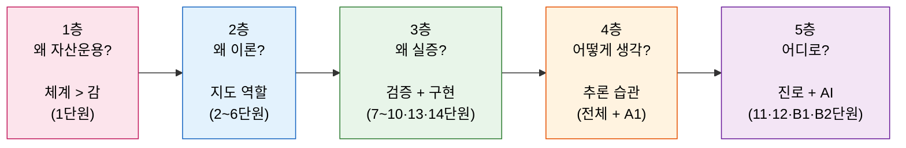

# 12단원: 왜 이 모든 것을 배우는가 — 심화 프레임워크



> **그림 읽는 법** — "왜?"라는 질문이 5단계로 점점 깊어진다. 1층은 가장 표면적인 질문(왜 자산운용을 배우나)에서 출발해, 5층의 가장 추상적인 질문(이 모든 게 어디로 가는가)으로 심화된다. 화살표 방향이 학습서 전체의 사고 흐름.

---

> "가장 위험한 투자자는 자기가 뭘 모르는지 모르는 사람이다."

이 단원은 학습서의 마지막이다. 1~11단원에서 우리는 포트폴리오 이론, 팩터모델, 모멘텀, 위험 관리, 그리고 그 뒤에 있는 논문들까지 훑었다. 이제 한 발 물러서서, **"왜?"**라는 질문을 가장 높은 곳에서 던져본다.

이 단원에는 수식이 없다. 대신 **사고방식, 추론 습관, 마음가짐**을 다룬다.

---

## 1층: 왜 자산운용을 배우는가?

> **한 문장으로:** 감이 아닌 체계가 필요한 이유는, 체계만이 실패에서 배울 수 있게 해주기 때문이다.

---

### 왜 감이 아니라 체계가 필요한가?

"이 주식 오를 것 같아." 누구나 이런 느낌을 받은 적이 있다. 문제는 그 느낌이 **맞았을 때만 기억**한다는 점이다. 틀렸을 때는? 조용히 잊는다. 이것을 심리학에서 **확증 편향(confirmation bias)**이라 한다.

감(intuition)에 의존하는 투자는 마치 날씨를 "오늘 기분에 따라" 예측하는 것과 같다. 가끔 맞지만, 체계적으로 하는 사람(기상청)을 장기적으로 이길 수 없다.

> **이것은 1단원에서 배운 것이다.** 자산운용은 "좋은 종목을 고르는 기술"이 아니라, "위험과 수익의 관계를 체계적으로 관리하는 학문"이다.

**그런데 왜?** 체계적이라고 해서 항상 이기는 것은 아니지 않은가?

맞다. 체계적 방법도 틀릴 수 있다. 하지만 핵심 차이가 있다: 체계적 방법은 **왜 틀렸는지 알 수 있다.** 감에 의존하면 왜 틀렸는지도, 무엇을 고쳐야 하는지도 알 수 없다. 체계는 실패로부터 배울 수 있게 해준다.

> **비유:** 요리에서 "대충 간을 맞추는 사람"과 "레시피를 따르는 사람"의 차이다. 레시피를 따르면, 결과가 안 좋을 때 어디를 고쳐야 하는지 안다. 대충 하면, 어제 맛있었는데 오늘 왜 맛없는지 영원히 모른다.

---

### 왜 단일 종목이 아니라 포트폴리오인가?

삼성전자 하나만 사면 안 될까? 이 질문에 대한 답은 1단원에서 수학적으로 증명했다: **분산투자는 공짜 점심**이다. 수익률의 기대값을 유지하면서 위험(분산)만 줄일 수 있다.

**그런데 왜?** 분산투자가 정말 "공짜"인가?

완전히 공짜는 아니다. 포트폴리오를 관리하려면 여러 종목을 추적해야 하고, 거래비용도 든다. 하지만 **체계적 위험(시장 전체가 빠지는 위험)**을 제외한 **비체계적 위험(개별 기업의 특수한 위험)**은 분산투자로 거의 0에 가깝게 줄일 수 있다. 이 사실은 수학적으로 증명된 것이지, 단순한 경험칙이 아니다.

> **이것은 1단원의 포트폴리오 분산 공식과 2단원의 효율적 프론티어에서 배운 것이다.**

**그런데 왜?** 주식들의 위험이 서로 상쇄되는 게 가능한가?

모든 주식이 항상 같은 방향으로 움직이지 않기 때문이다. A 기업이 나쁜 뉴스로 빠질 때, B 기업은 괜찮을 수 있다. 이 "같이 움직이지 않는 정도"가 **공분산**이다. 공분산이 완전히 +1이 아닌 한, 섞으면 무조건 위험이 줄어든다. 이것이 포트폴리오 이론의 수학적 핵심이다.

여기서 **3단원의 효용함수**가 등장한다. 효용함수란 '나는 위험을 얼마나 싫어하는가?'를 숫자로 표현한 것이다. 위험 회피 정도가 사람마다 다르기 때문에, 같은 효율적 프론티어 위에서도 각자 선택하는 포트폴리오가 달라진다. 효용함수는 "좋은 포트폴리오"의 기준이 보편적이 아니라 개인적이라는 사실을 수학적으로 보여준다.

---

### 왜 수학이 필요한가?

"포트폴리오가 좋다는 건 알겠는데, 왜 수식을 배워야 하나? 그냥 여러 종목에 나눠 사면 안 되나?"

될 수도 있다. 하지만 **얼마씩** 나눠 살 것인지가 문제다. 삼성전자 50% + 현대차 50%? 아니면 30% + 70%? 이 비율(가중치)에 따라 위험과 수익이 완전히 달라진다.

> **이것은 2~4단원에서 배운 것이다.** 2단원에서 효율적 프론티어의 수학적 구조를 세웠고, 3단원에서 효용함수를 통해 개인의 위험 선호를 정량화하는 법을 배웠으며, 4단원에서 무위험자산 도입과 CAL(자본배분선), 2기금 분리 정리를 통해 최적 포트폴리오 선택을 완성했다. 최적 가중치를 구하려면 기대수익률, 분산, 공분산을 알아야 하고, 이를 최적화하려면 수식이 필요하다.

**그런데 왜?** 수식으로 구한 최적이 실제로 최적인가?

여기서 중요한 통찰이 나온다: **아니, 완벽하게 최적이 아닐 수 있다.** 수식에 넣는 기대수익률과 공분산 자체가 **추정값**이기 때문이다. 추정에는 오차가 있다. 이것이 바로 **5단원(포트폴리오 전략)**에서 동일가중, 최소분산, 리스크패리티 같은 "덜 야심적인" 전략이 오히려 잘 작동하는 이유다. 5단원의 전략들은 이론의 불완전성에 대한 실용적 대응이다 — 추정 오차를 줄이거나 아예 피함으로써, 이론적 최적해보다 현실에서 더 안정적인 성과를 낸다. 수학은 "정답"을 주는 도구가 아니라, **"어떤 조건에서 어떤 결과가 나오는지 명확히 보여주는 도구"**다.

---

## 2층: 왜 이론을 배우는가?

> **한 문장으로:** 이론이 현실에서 실패해도 배우는 이유는, 이론이 '무엇을 모르는지'를 알려주기 때문이다.

---

### 왜 효율적 프론티어를 알아야 하는가?

효율적 프론티어(2~3단원)는 "주어진 위험 수준에서 가장 높은 기대수익을 주는 포트폴리오의 집합"이다. 이것을 왜 알아야 하는가?

**모든 투자 의사결정의 출발점**이기 때문이다. "이 포트폴리오가 좋은가?"라는 질문은, "이 포트폴리오가 효율적 프론티어 위에 있는가 (또는 가까운가)?"로 바꿀 수 있다. 벤치마크가 없으면 좋고 나쁨을 판단할 기준이 없다.

**그런데 왜?** 현실에서 효율적 프론티어를 정확히 그릴 수 있는가?

솔직히 어렵다. 미래의 기대수익률과 공분산을 정확히 알 수 없기 때문이다. 하지만 프론티어의 **형태**를 이해하는 것만으로도 가치가 있다. "위험을 줄이면 수익도 줄어든다"는 **트레이드오프의 존재**를 명확히 인식하는 것, 그리고 그 트레이드오프의 **기울기가 어떤 형태인지** 아는 것이 투자자의 기본 소양이다.

여기서 핵심적인 연결고리가 있다. **4단원에서 배운 무위험자산의 도입**이 효율적 프론티어를 곡선에서 직선(자본배분선, CAL)으로 변환한다. 이 전환이 왜 중요한가? 곡선 위에서는 투자자마다 다른 포트폴리오를 선택해야 했지만, 직선 위에서는 **모든 투자자가 같은 위험자산 조합(접선 포트폴리오)을 사용하고, 무위험자산과의 비율만 조정**하면 된다. 이것이 2기금 분리 정리이고, 투자 의사결정을 극적으로 단순화하는 결과다.

**그런데 왜?** 트레이드오프를 안다고 해서 투자를 잘하는 것은 아니지 않은가?

맞다. 하지만 트레이드오프를 **모르면** 반드시 실패한다. "높은 수익, 낮은 위험"을 동시에 약속하는 상품은 사기이거나 숨겨진 위험이 있다. 효율적 프론티어를 아는 사람은 이런 함정을 즉시 알아본다. "이건 프론티어 바깥에 있다. 불가능하다. 뭔가 잘못됐다."

---

### 왜 SDF와 팩터모델을 알아야 하는가?

SDF(확률할인인자)와 팩터모델(6~8단원)은 학습서에서 가장 추상적인 부분이다. 비전공자가 보기에 "이걸 왜 배우지?"라는 의문이 가장 강하게 드는 지점이다.

**답은 이렇다:** SDF는 **자산의 가격이 왜 이 수준인가?**라는 가장 근본적인 질문에 답하는 프레임워크다. 주식이 왜 이 가격인지, 채권 금리가 왜 이 수준인지, 모든 자산가격의 이유를 하나의 틀로 설명한다.

6단원에서 배운 SDF의 핵심 공식 E[m·R]=1의 직관은 이것이다: **"나쁜 시기에 돈을 주는 자산이 비싸다."** 경기가 나빠서 모두가 돈이 필요할 때 수익을 내주는 자산은 보험과 같으므로, 사람들이 비싼 값을 치르고도 기꺼이 보유한다. 반대로 나쁜 시기에 함께 빠지는 자산은 쌀 수밖에 없고, 그래서 높은 기대수익률(위험 프리미엄)을 준다. 12단원의 맥락에서 이 통찰이 왜 중요한가? 모든 투자 전략의 수익이 결국 "어떤 종류의 나쁜 시기를 감수하는 대가인가?"로 환원되기 때문이다. 모멘텀의 높은 수익은 모멘텀 크래시라는 나쁜 시기의 대가이고, 가치주의 프리미엄은 경기 침체기의 취약성에 대한 대가다.

팩터모델은 그 SDF를 **실용적으로 사용하는 방법**이다. "이 주식의 수익률 중에서 시장 위험에 대한 보상은 얼마이고, 그 밖의 초과수익(알파)은 얼마인가?"를 분리해낸다.

**그런데 왜?** 알파를 분리하는 게 왜 중요한가?

펀드매니저가 "올해 수익률 20%입니다!"라고 말했다고 하자. 시장이 25% 올랐다면? 그 매니저는 사실 시장보다 못한 것이다. 반대로 시장이 5% 빠졌는데 그 매니저가 -3%라면? 훌륭한 것이다. **팩터모델 없이는 이 구분이 불가능하다.** 팩터모델은 "실력"과 "운"을 분리하는 도구다.

> **이것은 6~8단원에서 배운 것이다.** CAPM이 첫 번째 시도이고, FF3가 개선이고, 그 후 모멘텀 팩터까지 추가되었다.

---

### 이론이 현실에서 실패하는데 왜 배우는가?

CAPM의 예측은 현실 데이터와 잘 맞지 않는다(11단원, Blitz & Van Vliet, Frazzini & Pedersen). 효율적 시장 가설도 모멘텀의 존재로 도전받는다. 그렇다면 이 이론들을 배우는 게 시간 낭비 아닌가?

**절대 아니다.** 이유는 세 가지:

1. **이론은 "지도"다.** 지도는 현실과 100% 같지 않다. 산의 높이, 강의 깊이가 정확히 반영되지 않는다. 하지만 지도 없이 길을 찾는 것보다 지도를 갖고 찾는 것이 훨씬 낫다. 이론은 불완전한 지도이지만, **방향감각**을 준다.

2. **이론의 실패 자체가 정보다.** CAPM이 어디서 실패하는지 알면, 그 실패 지점에서 **새로운 팩터(SMB, HML, WML)**를 발견할 수 있다. 이론 없이는 "실패"를 인식조차 할 수 없다.

3. **이론은 질문을 만든다.** "왜 저베타 주식이 더 잘하지?"라는 질문은 CAPM을 알아야만 던질 수 있다. 이론이 없으면 질문 자체가 생기지 않고, 질문이 없으면 발견도 없다.

여기서 한 가지 메타 교훈을 짚고 넘어가자. **학술 연구는 비판-수정-재비판의 변증법으로 발전한다.** CAPM이 나왔고, CAPM의 실패가 비판받았고, 그 비판에 대한 대응으로 FF3가 등장했고, FF3의 한계가 다시 비판받아 모멘텀 팩터가 추가되었다. 어떤 이론도 최종 답이 아니며, 비판 자체가 지식의 진보를 만든다. 마찬가지로 **하나의 기법이 범용적으로 적용될 수 있다** — 10단원에서 배운 변동성 스케일링은 모멘텀 전략에서 시작했지만, 가치 전략이든 캐리 전략이든, 변동성이 시간에 따라 변하는 모든 전략에 적용할 수 있는 범용 도구다.

**그런데 왜?** 질문을 던지는 것만으로 충분한가?

아니다. 질문을 던지고, 데이터로 검증해야 한다. 이것이 바로 다음 층에서 다루는 "실증"의 영역이다.

---

## 3층: 왜 실증을 배우는가?

> **한 문장으로:** 데이터로 직접 검증하는 이유는, 이론의 약속을 현실이 지키는지 확인해야 하기 때문이다.

여기서 **5단원의 전략들**이 왜 실증 단계에서 다시 중요해지는지 확인하자. 5단원의 동일가중, 최소분산, 리스크패리티 등은 이론의 불완전성에 대한 실용적 대응이다. 이론(2~4단원)이 요구하는 입력값(기대수익률, 공분산)의 추정 오차가 크다는 사실을 인정하고, 그 오차에 덜 민감한 전략을 설계한 것이다. 실증은 이 전략들이 실제로 추정 오차를 견디는지 데이터로 확인하는 과정이다.

---

### 왜 SMB, HML, WML 같은 팩터를 직접 구성해야 하는가?

"사이즈 팩터, 가치 팩터, 모멘텀 팩터가 있다는 것은 알겠다. 왜 직접 만드는 법까지 알아야 하는가?"

이유: **직접 구성해봐야 그 팩터가 진짜 무엇을 측정하는지 안다.**

SMB를 예로 들자. "소형주 - 대형주"라고 한마디로 말하지만, 실제로는 결정해야 할 것이 산더미다:
- 소형주의 기준은? 시가총액 하위 몇 %?
- 매달 리밸런싱하는가, 매년 하는가?
- 거래비용은 반영하는가?
- 상장폐지된 종목은 어떻게 처리하는가?

이런 세부 사항에 따라 결과가 크게 달라진다. 직접 해봐야 이 "설계 선택"의 영향을 체감할 수 있다.

**그런데 왜?** 설계 선택의 영향을 체감하면 구체적으로 뭐가 달라지는가? 예를 들어, 8단원에서 배운 것처럼 SMB를 구성할 때 **NYSE 종목만의 시가총액 중앙값**을 분기점으로 쓰느냐, **전체 종목의 중앙값**을 분기점으로 쓰느냐에 따라 소형주 포트폴리오의 구성이 완전히 달라진다. 전체 종목 기준을 쓰면 소형주가 지나치게 많아지고, 팩터 수익률의 크기와 통계적 유의성이 달라진다. 이런 차이를 직접 경험해봐야, 남이 만든 팩터 데이터를 쓸 때도 "이 숫자 뒤에 어떤 설계 선택이 있는가?"를 의식할 수 있다.

> **이것은 8단원 (SMB, HML)과 9단원 (WML)에서 배운 것이다.**

**그런데 왜?** 연구자들이 이미 공개한 팩터 데이터(Kenneth French 웹사이트 등)를 그냥 쓰면 안 되나?

쓸 수 있고, 실무에서는 실제로 그렇게 한다. 하지만 **그 데이터가 어떻게 만들어졌는지 모르면**, 결과를 오해할 수 있다. "이 팩터의 수익률이 3%다"라는 숫자 뒤에 숨은 **가정과 한계**를 아는 사람만이 그 숫자를 올바르게 해석할 수 있다.

---

### 왜 과거 데이터로 미래를 예측하려 하는가?

"과거 실적이 미래 수익을 보장하지 않습니다." 모든 금융 상품에 붙어있는 경고 문구다. 그런데 왜 학자들과 실무자들은 끊임없이 과거 데이터를 분석하는가?

**과거가 미래를 "보장"하지는 않지만, "제약"한다.** 과거에 한 번도 작동한 적 없는 전략이 갑자기 미래에 작동할 가능성은 낮다. 반대로 50년간 꾸준히 작동한 전략이 내일 갑자기 사라질 가능성도 (그 이유를 설명할 수 없다면) 낮다.

더 중요한 것: 과거 데이터 분석의 진짜 가치는 **예측 자체보다 패턴의 이해**에 있다. "모멘텀이 존재한다"는 발견은 미래 수익률을 맞추기 위해서가 아니라, **시장에서 정보가 어떻게 반영되는지**를 이해하기 위한 것이다.

> **이것은 9~10단원과 11단원의 논문들에서 배운 것이다.**

**그런데 왜?** 패턴을 이해하면 뭐가 달라지는가?

패턴을 이해하면 **그 패턴이 사라질 때를 인식할 수 있다.** "모멘텀이 작동하는 이유가 투자자의 느린 반응 때문"이라면, 시장이 더 효율적으로 바뀌면 모멘텀이 약해질 것이라 예상할 수 있다. 이유를 모른 채 과거 패턴만 따르는 사람은 패턴이 사라져도 눈치 못 챈다.

**그런데 왜?** 패턴이 사라지는 것을 인식하는 게 왜 그렇게 중요한가?

패턴이 사라지는 것을 인식해야 **전략을 수정**할 수 있기 때문이다. 그리고 수정 여부를 판단하는 기준은 감이 아니라 **통계적 유의성**이다. 8단원에서 배운 t-통계량이 여기서 다시 등장한다: t > 2.0이면 95% 신뢰수준에서 유의하다. 예컨대 모멘텀 전략의 초과수익이 과거 20년간 t = 3.5였는데, 최근 5년간 t = 1.2로 떨어졌다면? 이 숫자가 "패턴이 약해지고 있다"는 경고 신호다. 통계적 유의성이라는 잣대가 없으면, "아직 괜찮을 거야"라는 막연한 희망과 "이제 끝났어"라는 막연한 공포 사이에서 방황할 수밖에 없다.

---

### 왜 알파를 추구하는가? 알파가 정말 존재하는가?

알파(alpha)는 팩터모델로 설명되지 않는 초과수익이다. 펀드매니저의 "실력"이라고도 할 수 있다.

**효율적 시장 가설(EMH)**을 극단적으로 믿으면, 알파는 존재하지 않는다. 모든 정보가 가격에 반영되어 있으므로, 누구도 체계적으로 시장을 이길 수 없다.

하지만 현실은 더 복잡하다:
- **단기적으로는** 알파가 존재할 수 있다. 정보의 전파에 시간이 걸리고, 구조적 제약(레버리지 한계, 규제 등)이 있기 때문이다.
- **장기적으로는** 알파가 발견되면 경쟁에 의해 사라지는 경향이 있다. 많은 사람이 같은 전략을 쓰면 수익이 줄어든다.
- **순수한 의미의 알파**는 매우 드물고, 있더라도 크지 않으며, 발견하기 어렵다.

> **이것은 6~9단원의 핵심 주제이며, 11단원에서 리뷰한 논문들의 공통 관심사다.**

**그런데 왜?** 알파가 그렇게 어렵다면, 왜 포기하지 않는가?

알파의 추구는 시장을 더 효율적으로 만드는 **사회적 기능**이 있다. 누군가가 잘못된 가격을 찾아내고 거래하면, 그 과정에서 가격이 교정된다. 알파를 추구하는 행위 자체가 시장의 효율성을 유지하는 엔진이다. 역설적으로, 모두가 알파를 포기하면 시장은 비효율적이 되고, 다시 알파의 기회가 생긴다.

---

## 4층: 이 지식으로 어떻게 생각해야 하는가?

> **한 문장으로:** 지식보다 중요한 것은 '내가 틀릴 수 있다'는 사실을 늘 의식하는 사고 습관이다.

---

### 어떤 추론 습관을 가져야 하는가?

자산운용을 공부한 사람이 가져야 할 핵심 추론 습관은 하나다:

> **"이것이 맞다면, 왜 다른 사람들은 이미 하고 있지 않는가?"**

이것을 **"왜 안 하지?" 테스트**라고 부르자. 어떤 투자 전략이 훌륭해 보일 때, 이 질문을 던져야 한다:

- "이 전략이 연 20% 수익을 준다고? 그러면 왜 모든 헤지펀드가 이 전략을 쓰고 있지 않지?"
- "이 팩터가 30년간 양의 프리미엄을 줬다고? 그러면 이미 많은 사람이 알고 있을 텐데, 왜 아직도 작동하지?"

가능한 답은 네 가지다:
1. **다른 사람들이 이미 하고 있다** → 그래서 프리미엄이 줄어들고 있을 것이다.
2. **숨겨진 위험이 있다** → 모멘텀 크래시(9~10단원)처럼, 평소에는 안 보이다가 위기 때 폭발하는 위험.
3. **실행이 어렵다** → 거래비용, 유동성, 레버리지 제약 등(5단원에서 다룬 현실적 제약).
4. **진짜 새로운 발견이다** → 이 경우는 극히 드물다.

> **이것은 학습서 전체에서 배운 것이다.** 특히 Frazzini & Pedersen (2014)의 BAB 전략(11단원)이 좋은 예다: "왜 저베타 주식이 고수익인가?"에 대해 "레버리지 제약 때문"이라는 구조적 이유를 제시한다.

**그런데 왜?** 이 테스트를 습관화하면 뭐가 달라지는가?

**사기와 과대광고를 걸러낼 수 있다.** 금융 세계에는 "연 50% 수익, 무위험!" 같은 제안이 끊이지 않는다. "왜 안 하지?" 테스트를 적용하면, 이런 제안의 99%는 즉시 걸러진다. 효율적 프론티어 바깥의 수익을 약속하는 것은 물리법칙을 어기는 것과 같다.

---

### 어떤 질문을 자신에게 던져야 하는가?

투자 의사결정 앞에서, 다음 질문들을 자신에게 던져보자:

1. **"내가 이것을 아는데, 시장은 모르는가?"** — 대부분의 경우 답은 "아니다, 시장도 알고 있다." (6단원 EMH)
2. **"이 수익의 원천은 무엇인가?"** — 위험에 대한 보상인가? 행동 편향의 착취인가? 아니면 우연인가? (6~8단원 팩터모델로 분해)
3. **"표본 밖에서도 작동하는가?"** — 과거 데이터에서만 잘 되는 전략(과적합)은 미래에 실패한다. (11단원 Novy-Marx 과적합 경고)
4. **"최악의 시나리오에서는 어떻게 되는가?"** — 모멘텀 크래시를 떠올려라. 평균 수익률만 보지 말고, 꼬리 위험을 봐라. (10단원 변동성 관리)
5. **"거래비용과 세금을 반영하면 어떤가?"** — 논문의 "아름다운 수익률"에서 거래비용을 빼면 종종 사라진다. (5단원 현실적 제약)

> **이것은 2~5단원(포트폴리오 최적화)과 9~10단원(팩터 전략의 현실적 한계)에서 반복적으로 배운 교훈이다.** 특히 3단원에서 배운 효용함수는 "좋은 포트폴리오"의 기준이 투자자마다 다름을 보여주고, 4단원의 2기금 분리 정리는 최적 위험자산 조합이 투자자의 선호와 무관함을 증명했으며, 7단원의 팩터모델 회귀분석은 수익의 원천을 분해하는 실증 도구를 제공했다.

---

### 어떤 마음가짐이 필요한가?

**1. 과잉확신 경계**

"나는 시장을 이길 수 있다"는 믿음은 위험하다. 자기가 만든 요리가 항상 맛있다고 생각하는 요리사처럼, 자기가 선택한 전략이 항상 옳다고 믿는 투자자는 실수를 인식하지 못한다. 통계적으로, 대부분의 전문 펀드매니저도 장기적으로 시장(인덱스)을 이기지 못한다(11단원, 알파의 희소성). 이것은 그들이 무능해서가 아니라, **경쟁이 너무 치열하기 때문**이다. 겸손이 첫 번째 덕목이다.

**그런데 왜?** 겸손하면 뭘 하는 건가? 아무것도 안 하고 인덱스만 사는 건가?

그것도 훌륭한 전략이다(5단원의 시장 포트폴리오). 하지만 더 중요한 것은, **겸손과 포기는 다르다**는 점이다. "내가 틀릴 수 있다"는 인식을 갖고 투자하는 것과, "어차피 못 이기니까 아무렇게나 하는 것"은 완전히 다르다. 겸손한 투자자는 **리스크 관리**(10단원)에 더 신경 쓰고, **분산투자**(1~2단원)를 더 철저히 하고, **비용**(5단원)을 더 절감한다.

**2. 불확실성 수용**

미래는 알 수 없다. 이것은 자산운용의 출발점이자 끝이다. 불확실성을 "제거"하려 하지 말고, "관리"하려 해야 한다.

> **비유:** 날씨를 통제할 수는 없지만, 우산을 챙길 수는 있다. 분산투자와 변동성 스케일링은 "우산"이다.

**그런데 왜?** 불확실성을 제거하려 하면 안 되는가?

불확실성을 제거하려 하면 **과적합과 과잉확신**에 빠진다. "이 모델은 과거 20년 데이터를 완벽하게 설명한다!"는 말은 대부분 과적합의 신호다. 11단원에서 배운 Novy-Marx(2015)의 과적합 경고를 떠올려보자 — 그는 부정적인 예로 "화성과 금성의 위치"가 주가를 예측한다는 무의미한 상관관계를 보여주었다. 불확실성을 없애겠다는 욕심이 과적합을 만들고, 과적합은 미래에 작동하지 않는 가짜 전략을 양산한다. 불확실성은 제거 대상이 아니라 **관리 대상**이다.

**3. 장기적 관점**

주간, 월간 수익률에 일희일비하지 않기. 나무를 심는 것과 같다: 올해 열매를 기대하면 실망하고, 10년 후를 기대하면 숲을 얻는다. 모멘텀 크래시(10단원)는 단기적으로 처참하지만, 변동성 스케일링을 적용하면 장기적으로 여전히 우수한 전략이다. 단기 손실에 패닉하여 전략을 바꾸면, 장기적 수익을 포기하는 것이다.

**그런데 왜?** 장기적 관점을 유지하는 게 왜 이렇게 어려운가?

인간의 뇌가 **손실 회피(loss aversion)**에 편향되어 있기 때문이다. 같은 금액이라도 잃는 고통이 얻는 기쁨의 약 2배다 (Kahneman & Tversky). 구체적으로, 100만원 수익의 기쁨보다 100만원 손실의 고통이 훨씬 크게 느껴진다. 그래서 실제 투자에서 -10% 손실을 보면 패닉에 빠져 매도하고, 이후 반등을 놓치는 일이 반복된다. 이것을 아는 것만으로도, 패닉 셀링의 충동을 한 박자 늦출 수 있다. "지금 내가 느끼는 공포는 손실 회피 편향 때문이야. 전략의 논리가 바뀐 게 아니라 내 감정이 과반응하는 거야."

---

### 어떤 고민을 해야 하는가?

**윤리적 측면:**

자산운용은 결국 **다른 사람의 돈**을 관리하는 일이다(혹은 자신의 노후 자금). 여기에는 윤리적 책임이 따른다:

- 고객에게 위험을 충분히 설명했는가?
- 수수료가 성과에 비해 합리적인가?
- 자신의 이익과 고객의 이익이 충돌하지 않는가?

**시장에 대한 책임:**

대규모 퀀트 전략이 시장의 변동성을 키울 수 있다. 2010년 "Flash Crash"처럼, 알고리즘 거래가 시장을 일시적으로 붕괴시킨 사례가 있다. 한국 시장에서도 윤리적 실패의 대표적 사례들이 있다:

- **라임펀드 사태(2019):** 비유동 자산에 투자하면서 유동성을 약속하고, 손실을 숨기기 위해 허위 평가를 한 사건. 약 1조 6천억원의 투자자 피해가 발생했다.
- **옵티머스펀드 사태(2020):** 공공기관 매출채권에 투자한다고 속이고 실제로는 부실 자산에 투자한 사기. 약 5천억원의 피해.
- **DLF(파생결합펀드) 사태(2019):** 원금 손실 가능성이 높은 해외 금리 연계 파생상품을 원금 보장인 것처럼 판매. 고령 투자자들이 큰 피해를 입었고, "적합성 원칙"의 중요성이 부각되었다.

이 사건들의 공통점은 **위험에 대한 불충분한 설명**과 **이해상충(conflict of interest)**이다. 자산운용을 배운 사람이라면, 효율적 프론티어 바깥의 수익을 약속하는 상품을 보고 "이건 불가능하다"고 판단할 수 있어야 한다.

전략이 개인에게는 합리적이라도, **모두가 같은 전략을 쓰면 시스템 위험**이 될 수 있다. 모두가 동시에 출구로 달려가면 문이 좁아지는 것과 같다 — 개별적으로는 합리적인 탈출 행동이, 군중이 되면 패닉과 붕괴를 만든다.

> "내 전략이 시장 전체에 미치는 영향은 무엇인가?"라는 질문은, 규모가 커질수록 더 중요해진다.

---

## 5층: 어디로 가야 하는가?

> **한 문장으로:** 이 지식은 끝이 아니라 시작이다 — 배움을 멈추지 않는 한, 길은 열려 있다.

---

### 이 학습서를 마친 후 할 수 있는 것

이 학습서의 12단원을 모두 마치면, 다음 7가지를 실제로 할 수 있다:

1. **Python으로 효율적 프론티어 그리기** — 2~4단원에서 배운 평균-분산 최적화를 코드로 구현하고, 프론티어의 형태를 시각적으로 확인할 수 있다.
2. **FF3 회귀로 펀드 알파 분리** — 7~8단원의 팩터모델 회귀분석을 사용하여, 어떤 펀드의 수익이 실력(알파)인지 시장 노출(베타)인지 구분할 수 있다.
3. **모멘텀 전략 백테스트 + 변동성 스케일링** — 9~10단원의 모멘텀 전략을 과거 데이터로 시뮬레이션하고, 변동성 스케일링으로 꼬리 위험을 관리할 수 있다.
4. **리스크패리티 포트폴리오 구성** — 5단원의 리스크패리티 방법론을 사용하여, 각 자산이 동일한 위험 기여도를 갖는 포트폴리오를 만들 수 있다.
5. **논문 읽고 핵심 아이디어 추출** — 11단원에서 훈련한 논문 독해 능력으로, 새로운 학술 논문의 핵심 가설, 방법론, 결론을 파악할 수 있다.
6. **투자 전략의 "왜?" 체크리스트 적용** — 12단원의 체크리스트를 사용하여, 어떤 전략이든 체계적으로 검증할 수 있다.
7. **한국 시장 데이터로 팩터 재현** — 8~9단원의 팩터 구성 방법을 한국 주식 데이터에 적용하여, 한국 시장에서 사이즈/가치/모멘텀 팩터가 작동하는지 확인할 수 있다.

---

### 이 수업 이후 어떤 방향으로 공부할 수 있는가?

1~12단원은 자산운용의 **기초 체력**이다. 여기서 다루지 못한 영역이 아직 많다:

- **고급 포트폴리오 이론:** Black-Litterman 모형, 동적 자산배분, 하방위험 최적화
- **채권과 파생상품:** 듀레이션, 옵션 가격결정(Black-Scholes), 변동성 표면
- **행동재무학:** 왜 투자자들이 체계적으로 비합리적인 결정을 하는가
- **시장 미시구조:** 호가창, 유동성, 고빈도 거래(HFT)
- **대체투자:** 부동산, 사모펀드, 벤처캐피탈, 헤지펀드 전략
- **ESG/지속가능투자:** 환경·사회·지배구조 요인이 수익률에 미치는 영향

**그런데 왜?** 이 모든 것을 다 배워야 하는가?

아니다. 자신의 **관심과 진로**에 따라 깊이를 선택하면 된다. 다만, 어떤 분야를 선택하든 1~12단원의 기초(분산투자, 팩터, 위험-수익 트레이드오프)는 공통 언어다.

---

### 실무와 학계 — 어떤 길이 있는가?

**실무 (Practitioner):**
- **자산운용사 (Asset Manager):** 포트폴리오를 직접 구성하고 운용. 연기금, 보험사, 뮤추얼펀드 등.
- **퀀트 (Quantitative Analyst):** 수학/프로그래밍으로 투자 전략을 개발. 팩터 모델 구현, 백테스팅, 리스크 관리.
- **리스크 매니저:** 포트폴리오의 위험을 측정하고 관리. VaR, 스트레스 테스트 등.
- **핀테크/로보어드바이저:** 알고리즘 기반 자산배분 서비스 개발.

**학계 (Academia):**
- **재무학 연구:** 새로운 팩터 발견, 자산가격모형 개선, 시장 이상현상 분석. 재무학 대학원(석·박사)이 일반적인 진입 경로다.
- **금융공학:** 파생상품 가격결정, 리스크 모델링. 수학·공학 배경에 금융 이론을 결합한다.
- **계량경제학:** 금융 데이터의 통계적 분석 방법론 개발. 통계학·경제학 대학원과 밀접하다.

**국내 맥락:**
- **자산운용사:** 삼성자산운용, 미래에셋자산운용, KB자산운용 등 국내 대형 운용사에서 펀드매니저, 퀀트 애널리스트로 일할 수 있다.
- **증권사 리서치:** 한국투자증권, NH투자증권 등에서 팩터 분석, 전략 리서치를 수행한다.
- **핀테크:** 카카오페이증권, 토스증권 등 신생 플랫폼에서 로보어드바이저, 데이터 기반 투자 서비스를 개발한다.

**추천 자격증:**
- **CFA (Chartered Financial Analyst):** 자산운용 실무의 글로벌 표준 자격. 이 학습서의 내용은 CFA Level I~II의 포트폴리오 관리, 계량분석 파트와 직결된다.
- **FRM (Financial Risk Manager):** 리스크 관리 전문 자격. 10단원의 변동성 관리, 꼬리 위험과 연결된다.
- **CAIA (Chartered Alternative Investment Analyst):** 대체투자 전문 자격. 사모펀드, 헤지펀드 전략에 관심이 있다면 적합하다.

**다음 학습 자료:**
- Cochrane, *Asset Pricing* — SDF 프레임워크(6단원)를 본격적으로 심화한 대학원 수준 교재.
- Ang, *Asset Management* — 팩터 투자와 포트폴리오 구성을 실무 관점에서 정리한 심화서.
- *Python for Finance* (Hilpisch) — 이 학습서에서 배운 이론을 Python으로 직접 구현하는 데 적합하다.

> **중요한 것:** 실무와 학계는 대립이 아니라 상호보완이다. 학계가 발견한 팩터(SMB, HML)를 실무가 전략으로 구현하고, 실무에서 발견한 문제(모멘텀 크래시)를 학계가 분석한다.

---

### 한국 시장 구현 경로

한국 시장에서 이 학습서의 내용을 실제로 구현하려면 어떻게 해야 하는가?

**데이터 소스:**
- **KRX(한국거래소):** 일별/월별 주가, 거래량, 시가총액 데이터. KRX 정보데이터시스템(data.krx.co.kr)에서 무료로 다운로드 가능.
- **FnGuide:** 재무제표, 팩터 데이터, 스타일 인덱스 제공. 학교 도서관이나 기관을 통해 접근 가능한 경우가 많다.
- **DART(전자공시시스템):** 기업 공시 데이터. 재무제표, 지분 변동, 대주주 현황 등 기본적 분석에 필수.

**한국 시장의 특수성:**
- **공매도 제한:** 한국 시장은 공매도가 자주 금지되거나 제한된다. 롱숏 전략(예: SMB, HML 팩터)의 숏 레그를 실제로 구현하기 어려울 수 있다. 숏 대신 "언더웨이트"로 근사하거나, 롱 온리 포트폴리오로 변형해야 한다.
- **거래세:** 매도 시 0.18~0.23%의 증권거래세가 부과된다. 이것이 회전율이 높은 모멘텀 전략의 실제 수익을 크게 깎아먹을 수 있다. 9~10단원의 모멘텀 백테스트를 한국 데이터로 재현할 때, 거래세를 반드시 반영해야 한다.
- **시장 규모:** KOSPI + KOSDAQ 합해도 미국 시장의 일부에 불과하므로, 포트폴리오 구성 시 종목 수와 유동성 제약을 고려해야 한다.

**11단원 재현 가이드와의 연결:** 11단원에서 리뷰한 논문들(Blitz & Van Vliet의 저변동성 이상현상, Frazzini & Pedersen의 BAB 등)을 한국 데이터로 재현하면, "이 현상이 한국에서도 성립하는가?"라는 질문에 직접 답할 수 있다. 이것이 단순한 학습을 넘어 **연구**로 나아가는 첫걸음이다.

---

### 발표 구조 매핑

학습서의 내용으로 발표나 보고서를 만들 때, 다음과 같이 구조를 매핑할 수 있다:

| 발표 구조 | 학습서 매핑 | 핵심 질문 |
|-----------|------------|----------|
| **Intro** (왜 중요한가) | 1층: 왜 자산운용을 배우는가 | "이 연구/전략이 왜 필요한가?" |
| **Method** (이론 + 실증) | 2~3층: 이론적 배경 + 데이터 검증 | "어떤 이론에 기반하고, 어떻게 검증했는가?" |
| **Result** (전략 검증) | 체크리스트: 수익 원천 → 강건성 → 위험 | "결과가 진짜인가? 견고한가?" |
| **Discussion** (한계 + 향후) | 4~5층: 한계 인식 + 미래 방향 | "무엇이 부족하고, 다음은 무엇인가?" |

이 매핑은 투자 전략 발표뿐 아니라, 논문 발표, 업무 보고 등 거의 모든 분석적 발표에 적용할 수 있다. 1~5층의 사고 흐름이 자연스럽게 발표의 뼈대가 된다.

---

### AI와 자산운용의 접점

이 수업의 제목은 **"자산운용을 위한 인공지능"**이다. 강의에서는 ML로 모멘텀 가중치를 최적화하는 **CMM(Conditional Momentum Model, 9단원)**과 오토인코더로 팩터를 발견하는 **IPCA(Instrumented PCA, 11단원)**를 배웠다. 이 두 사례는 전통적 이론(모멘텀, 팩터모델)과 머신러닝이 어떻게 결합하는지를 구체적으로 보여준다. 더 넓은 시야에서, AI는 자산운용의 어디에 쓰이는가?

**1. 팩터 발견:** Kelly et al. (2021)의 오토인코더처럼, 인간이 미처 생각하지 못한 팩터를 데이터에서 자동으로 추출. 오토인코더를 비유하면 **데이터 압축기**다 — 수백 개 주식의 수익률이라는 방대한 데이터를 소수의 핵심 패턴(잠재 팩터)으로 압축하고, 그 압축된 정보만으로 원래 데이터를 복원할 수 있는지 확인한다. 잘 복원된다면, 그 소수의 패턴이 수익률의 본질적 구조를 잘 포착한 것이다.

**2. 수익률 예측:** 딥러닝, 랜덤포레스트, 그래디언트 부스팅 등으로 주가 방향 예측. 전통적 선형 모형보다 정확도가 높을 수 있다.

**3. 포트폴리오 최적화:** 강화학습(Reinforcement Learning)으로 동적 자산배분 문제를 풀기. 전통적 최적화(2~4단원)보다 유연한 접근.

**4. 자연어 처리(NLP):** 뉴스, 실적 발표, SNS 등 텍스트 데이터에서 투자 신호 추출.

**5. 리스크 관리:** 이상 탐지(anomaly detection)로 포트폴리오의 위험 신호를 조기에 포착.

**6. 오토인코더와 팩터모델의 대응:** 전통적 팩터모델(7단원)은 수익률을 소수의 팩터로 설명하는 **선형 PCA**에 가깝다. 오토인코더는 이것을 **비선형 PCA**로 확장한 것이다. 즉, 선형 팩터가 포착하지 못하는 복잡한 수익률 패턴을 비선형 팩터로 잡아낸다. 비선형이란, 예를 들어 "시장이 약간 오를 때"와 "시장이 크게 오를 때"의 팩터 영향이 다를 수 있다는 것이다 — 선형 모형은 이 차이를 포착하지 못하지만, 오토인코더는 할 수 있다.

**7. 선형 CAPM의 한계를 AI로 극복하려는 시도(비선형 SDF 추정):** CAPM과 Fama-French 3팩터(8단원)는 본질적으로 **선형 SDF**(6단원)를 가정한다. 즉, 할인인자($m$)가 팩터의 선형 결합이라고 본다. 그러나 현실의 할인인자가 선형이라는 보장은 없다. 머신러닝은 SDF를 **비선형 함수**로 추정할 수 있게 해주며, 이를 통해 선형 모형이 놓치는 리스크프리미엄의 원천을 포착할 수 있다. 쉽게 말해, CAPM이 "직선으로 세상을 설명하려는 시도"라면, AI는 "곡선까지 허용하여 더 정교하게 설명하려는 시도"다.

> **Kelly, Pruitt & Su (2021) "Autoencoder Asset Pricing Models"의 핵심 아이디어:**
> 이 논문은 오토인코더 신경망을 사용하여 자산 수익률에서 **비선형 잠재 팩터**를 추출한다. 전통적 PCA가 선형 팩터만 찾는 반면, 오토인코더는 비선형 관계까지 학습한다. 추출된 팩터는 SDF를 구성하는 데 사용되며, 기존 선형 팩터모델보다 횡단면 수익률 차이를 더 잘 설명한다. 이는 "팩터가 무엇인가?"라는 질문에 대해 인간이 사전에 정의하지 않고 **데이터가 스스로 답하게 하는** 접근이다.

**그런데 왜?** AI가 이렇게 만능이면, 인간은 필요 없는 것 아닌가?

**아니다.** AI의 핵심 한계:

- **해석가능성:** AI가 "이 주식을 사라"고 해도, **왜** 사야 하는지 설명하지 못하면 신뢰하기 어렵다.
- **과적합:** AI는 패턴이 없는 곳에서도 패턴을 "발견"할 수 있다. 특히 금융 데이터처럼 잡음이 많은 영역에서는 이 위험이 크다.
- **꼬리 위험:** AI는 과거 데이터로 학습하므로, 과거에 없었던 유형의 위기(예: 코로나)에는 대응하지 못할 수 있다.
- **윤리와 규제:** AI가 내린 투자 결정의 책임은 누가 지는가?

> **결론:** AI는 도구이지, 답이 아니다. 1~10단원에서 배운 이론과 실증을 이해하는 인간이 AI를 **사용하는** 것이지, AI가 인간을 **대체하는** 것이 아니다.

---

## 사고 프레임워크: "이 전략이 좋아 보일 때" 체크리스트

```
┌─────────────────────────────────────────────────────────────────────┐
│          "이 전략이 좋아 보인다!" → 정말 좋은가?                      │
├─────────────────────────────────────────────────────────────────────┤
│                                                                     │
│  1단계: 수익의 원천은? (→ 6~8단원 팩터모델로 분해)                   │
│  ┌──────────────────────────────────────────────────────────┐       │
│  │ □ 위험에 대한 보상인가? (체계적 위험 프리미엄)             │       │
│  │ □ 행동 편향의 착취인가? (모멘텀, 과잉반응 등)             │       │
│  │ □ 구조적 제약의 이용인가? (레버리지 한계, 규제 등)         │       │
│  │ □ 그냥 우연인가? (데이터 마이닝, 과적합)                  │       │
│  └──────────────────────────────────────────────────────────┘       │
│         │                                                           │
│         ▼                                                           │
│  2단계: "왜 안 하지?" 테스트 (→ 4층 추론 습관 + 11단원 논문 검증)    │
│  ┌──────────────────────────────────────────────────────────┐       │
│  │ □ 다른 사람들이 이미 하고 있는가?                         │       │
│  │ □ 숨겨진 위험이 있는가? (크래시, 유동성 위기)             │       │
│  │ □ 거래비용/세금을 반영하면 수익이 남는가?                 │       │
│  │ □ 실행 가능한가? (공매도 제약, 레버리지 제약)             │       │
│  └──────────────────────────────────────────────────────────┘       │
│         │                                                           │
│         ▼                                                           │
│  3단계: 강건성 점검 (→ 8~9단원 팩터 구성 + 11단원 표본외 검증)       │
│  ┌──────────────────────────────────────────────────────────┐       │
│  │ □ 다른 기간에서도 작동하는가? (표본 외 검증)              │       │
│  │ □ 다른 시장/자산군에서도 작동하는가? (보편성)             │       │
│  │ □ 팩터모델의 α가 통계적으로 유의한가? (t > 2.0)          │       │
│  │ □ 매개변수를 바꿔도 결과가 크게 달라지지 않는가?          │       │
│  └──────────────────────────────────────────────────────────┘       │
│         │                                                           │
│         ▼                                                           │
│  4단계: 위험 관리 (→ 10단원 변동성 스케일링 + 5단원 포트폴리오 전략) │
│  ┌──────────────────────────────────────────────────────────┐       │
│  │ □ 최악의 경우 최대 손실은? (MDD, 꼬리 위험)              │       │
│  │ □ 변동성 스케일링 등 방어 장치가 있는가?                  │       │
│  │ □ 포트폴리오 전체에서 이 전략의 비중은 적절한가?          │       │
│  │ □ 상관관계: 기존 포트폴리오와 겹치지 않는가?              │       │
│  └──────────────────────────────────────────────────────────┘       │
│         │                                                           │
│         ▼                                                           │
│  결론                                                                │
│  ┌──────────────────────────────────────────────────────────┐       │
│  │ 모든 단계를 통과했는가?                                    │       │
│  │                                                            │       │
│  │  → 대부분 통과: 소규모로 시작, 모니터링하며 점진적 확대    │       │
│  │  → 일부 불통과: 해당 약점을 보완할 방법이 있는지 검토      │       │
│  │  → 대부분 불통과: 재검토 또는 포기                         │       │
│  │                                                            │       │
│  │  ※ 어떤 전략도 "완벽"하지 않다.                            │       │
│  │     중요한 것은 약점을 "알고" 감수하는 것이다.             │       │
│  └──────────────────────────────────────────────────────────┘       │
│                                                                     │
└─────────────────────────────────────────────────────────────────────┘
```

---

## 전체 "왜?" 연쇄 — 12단원이 하나로 이어지는 이유

```
왜 자산운용?(1) ──"감으로는 배울 수 없으니까"──→ 왜 포트폴리오?(1)
  ──"한 종목은 너무 위험"──→ 왜 최적화?(2-4)
  ──"무한한 조합 중 최선을 찾아야"──→ 왜 전략?(5)
  ──"최적해의 추정 오차가 크니까"──→ 왜 가격이론?(6)
  ──"수익의 원천을 근본적으로 이해해야"──→ 왜 팩터?(7-8)
  ──"실력과 운을 분리해야"──→ 왜 모멘텀?(9)
  ──"이론 밖의 이상현상도 다뤄야"──→ 왜 위험관리?(10)
  ──"좋은 전략도 크래시에 취약하니까"──→ 왜 논문?(11)
  ──"남의 연구를 읽고 검증해야"──→ 왜 이 모든 것?(12)
  ──"질문하는 습관이 투자의 핵심이니까"
```

각 단원의 "왜?"는 이전 단원의 답에서 자연스럽게 생겨난 다음 질문이다. 이 연쇄를 거꾸로 읽으면 — "왜 이 모든 것을 배우는가?"에서 출발하여 "왜 자산운용을 배우는가?"까지 — 학습서 전체가 하나의 논증임을 확인할 수 있다.

---

## 마무리: 이 학습서를 덮으며

**여정을 되돌아보자.** 1단원에서 "감이 아닌 체계"의 필요성을 인식한 것이 출발이었다. 2~4단원에서 포트폴리오 이론의 수학적 뼈대를 세웠고, 5단원에서 그 이론의 한계를 인정하고 실용적 전략으로 보완했다. 6단원의 SDF로 자산가격의 근본 원리를 이해한 뒤, 7~8단원에서 팩터모델이라는 실증 도구를 손에 쥐었다. 9~10단원에서 모멘텀이라는 이상현상과 그 위험 관리를 다루었고, 11단원에서 논문을 직접 읽으며 학술 연구의 비판적 사고를 훈련했다. 그리고 이 12단원에서 "왜?"라는 질문을 전체에 걸쳐 던지며, 지식을 사고 습관으로 전환하는 작업을 했다. 이 여정의 본질은 기법의 나열이 아니라, **"불확실한 세상에서 어떻게 합리적으로 생각할 것인가"**를 배우는 과정이었다.

자산운용은 "돈을 버는 기술"이 아니다. **불확실한 세상에서 합리적으로 의사결정하는 사고방식**이다.

수식은 도구이고, 이론은 지도이고, 데이터는 증거이고, AI는 조수다. 이 모든 것의 중심에는 **질문하는 인간**이 있다.

좋은 투자자는 정답을 아는 사람이 아니다. **좋은 질문을 던지는 사람**이다.

- "이 수익은 어디서 오는가?"
- "왜 다른 사람은 이걸 안 하는가?"
- "내가 틀렸다면 무엇이 잘못된 것인가?"
- "최악의 경우 얼마를 잃는가?"

이 질문들을 습관으로 만들었다면, 이 학습서는 제 역할을 다한 것이다.

> 겸손하되 포기하지 말 것.
> 불확실성을 두려워하되 도망치지 말 것.
> 배움을 멈추지 말 것.

---

## 셀프체크

각 층에 대응하는 질문 하나씩, 총 5개:

1. **(1층 — 왜 자산운용?)** 감에 의존하는 투자와 체계에 의존하는 투자의 핵심 차이는 무엇이며, 왜 체계가 "항상 이기는 것"이 아님에도 체계를 써야 하는가?
2. **(2층 — 왜 이론?)** 이론이 현실에서 실패하는데도 배워야 하는 이유 세 가지는 무엇이며, SDF 공식 E[m·R]=1이 "나쁜 시기에 돈을 주는 자산이 비싸다"는 직관과 어떻게 연결되는가?
3. **(3층 — 왜 실증?)** 과거 데이터로 발견한 패턴이 사라질 때 이를 인식하려면 무엇이 필요하며, 전략 수정 여부를 판단하는 통계적 기준(t-통계량)은 어떻게 사용하는가?
4. **(4층 — 어떻게 생각?)** "왜 안 하지?" 테스트란 무엇이며, 투자 의사결정 전에 자신에게 던져야 할 핵심 질문 다섯 가지를 체크리스트의 어떤 단계와 연결하여 설명해보라.
5. **(5층 — 어디로?)** AI(오토인코더, 비선형 SDF)가 전통적 팩터모델의 어떤 한계를 극복하려 하며, 그럼에도 AI가 인간을 대체할 수 없는 이유는 무엇인가?
