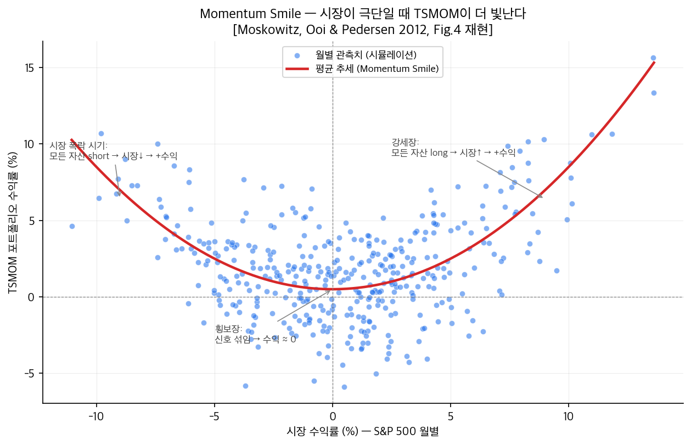
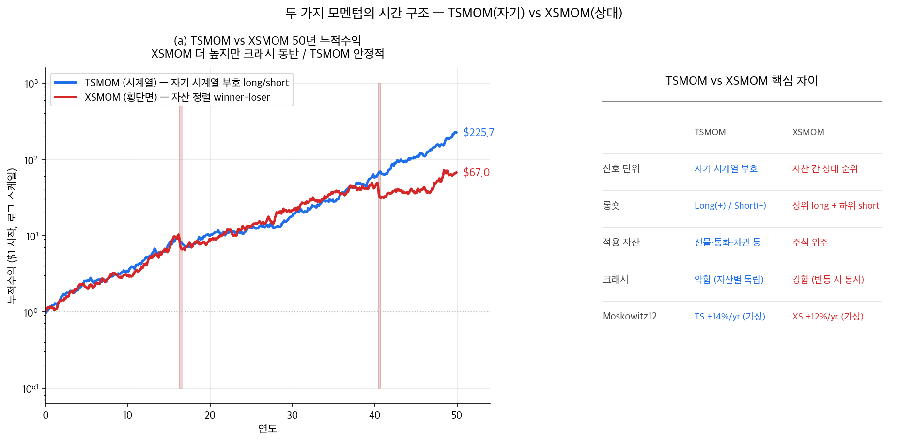

# 13단원: 시계열 모멘텀 (TSMOM) — 자산 자신의 과거가 미래를 말한다

---

## 1. 왜? — 이 단원을 배우는 이유

9단원에서 우리는 모멘텀을 배웠다. 그런데 그 모멘텀에는 공통된 특징이 하나 있었다:

> **"다른 자산들과 비교해서, 상대적으로 잘했던 자산은 사고 상대적으로 못했던 자산은 판다."**

이를 **횡단면 모멘텀(cross-sectional momentum, XSMOM)** 이라 한다. 같은 시점에 여러 자산을 줄세워(횡단면) 상위 10%와 하위 10%를 비교하는 방식이다. WML(Winners Minus Losers)이라는 이름이 붙은 이유도 여기에 있다.

하지만 이 시점에서 자연스러운 질문이 떠오른다:

> **"내가 한 가지 자산(예: 코스피 지수)만 거래하고 있다면? 다른 자산과 줄세울 필요 없이, 그 자산의 과거 수익률만 보고 매수/매도를 결정할 수는 없을까?"**

이 질문에 답하는 것이 **시계열 모멘텀(time-series momentum, TSMOM)** 이다. 자산 자신의 과거 수익률을 가지고 — 다른 자산과 비교하지 않고 — 그 자산의 미래 수익률을 예측하는 전략이다.

> "An asset's own past return is a good indicator of its future return. So here we just consider one asset only. So the momentum is defined by its own, by one asset only. It's not compared against other assets."
> [강의 3/27, 15:17]

이 단원에서 다음 다섯 질문에 답한다:

1. 횡단면 모멘텀(XSMOM)과 시계열 모멘텀(TSMOM)의 차이는 정확히 무엇인가?
2. 시계열 모멘텀은 어떻게 측정하고 어떻게 거래하는가?
3. 왜 변동성 스케일링이 시계열 모멘텀의 필수 구성요소인가?
4. 어떤 자산군에서 작동하는가? — 주식, 채권, 통화, 상품 모두?
5. 횡단면 모멘텀과 시계열 모멘텀은 서로 독립적인가, 아니면 한쪽이 다른 쪽을 함의하는가?

이 모든 질문의 출처가 되는 핵심 논문은 다음이다:

> **Moskowitz, Ooi & Pedersen (2012). "Time Series Momentum." *Journal of Financial Economics*, 104, 228-250.** [moskowitz2012jfe]

---

## 2. 단원 흐름도

```
┌─────────────────────────────────────────────────────────────────────────┐
│                       13단원 전체 로드맵                                 │
├─────────────────────────────────────────────────────────────────────────┤
│                                                                         │
│  §1 문제 제기: 자산 한 개만 가지고도 모멘텀 거래가 가능한가?            │
│       │                                                                 │
│       ▼                                                                 │
│  §2~4 단원 흐름도 / 가정 / 기호 사전                                     │
│       │                                                                 │
│       ▼                                                                 │
│  §5 횡단면(XSMOM) vs 시계열(TSMOM): 결정적 차이                         │
│       │  (XSMOM: 자산 줄세우기 / TSMOM: 자산 자신의 부호)               │
│       ▼                                                                 │
│  §6 TSMOM 전략 구성                                                     │
│       ├─ 6.1 형성기간(K) ・ 보유기간(H)                                 │
│       ├─ 6.2 매수/매도: 부호로 결정                                     │
│       ├─ 6.3 포지션 크기: 변동성 스케일링 1/σ                           │
│       └─ 6.4 왜 자기금융이 아닌가?                                      │
│       │                                                                 │
│       ▼                                                                 │
│  §7 수식 유도: 시계열 회귀 모형 r_t/σ_{t-1} = α + β_h·r_{t-h}/σ_{t-h-1} │
│       │                                                                 │
│       ▼                                                                 │
│  §8 실증: 자산군별 보편성 — 주식·채권·통화·상품 모두 12개월 정의 부호 +│
│       │                    13개월 이후 반전(-)                          │
│       ▼                                                                 │
│  §9 Momentum Smile — 시장이 극단적일 때 TSMOM이 더 빛난다              │
│       │                                                                 │
│       ▼                                                                 │
│  §10 TSMOM vs XSMOM 비교 회귀 — 둘은 독립적인가?                       │
│       │                                                                 │
│       ▼                                                                 │
│  §11 그래서? → 14단원: 또 다른 팩터(BAB)로                              │
│       │                                                                 │
│       ▼                                                                 │
│  §12 셀프체크                                                           │
└─────────────────────────────────────────────────────────────────────────┘
```

---

## 3. 가정과 전제

이 단원의 결과는 다음 가정 위에 성립한다.

| # | 가정 | 의미 |
|---|------|------|
| 1 | 자산의 과거 수익률에 정보가 있다 | 시장이 완전히 효율적이라면 과거 수익률은 미래를 예측할 수 없어야 하지만, 실증적으로 12개월 단위에서는 양의 자기상관(positive autocorrelation)이 관측된다 |
| 2 | 변동성 σ는 추정 가능하다 | 과거 일별 수익률로 다음 달의 변동성을 의미 있는 정확도로 추정할 수 있다고 가정한다 (변동성 클러스터링 현상). 이는 10단원에서 이미 본 가정 |
| 3 | 거래비용은 무시 가능 | TSMOM은 한 달에 한 번 정도 리밸런싱하므로 거래비용 부담이 비교적 작다고 가정 |
| 4 | 무위험자산이 존재 | 초과수익률 $r_t = R_t - R_f$를 정의할 수 있어야 한다 |
| 5 | 형성기간(K) 동안 자산은 거래 가능 | 거래 정지·상폐가 없다고 가정 |
| 6 | 자산군 간 비교 가능성 | 주식·채권·통화·상품의 수익률을 같은 단위(연환산 %)로 비교 가능 |

> **9·10단원과의 차이:** 9단원의 횡단면 모멘텀은 "자산이 충분히 많아 줄세울 수 있다"는 가정이 필요했지만, TSMOM은 자산 한 개만으로도 작동하므로 그 가정이 필요 없다.

---

## 4. 기호 사전

| 기호 | 읽는 법 | 의미 |
|------|---------|------|
| $r_t$ | "알 서브 티" | 시점 $t$의 초과수익률(excess return). 즉 $R_t - R_f$ |
| $R_t$ | "대문자 알 서브 티" | 시점 $t$의 총수익률 |
| $R_f$ | "알 서브 에프" | 무위험이자율 |
| $\sigma_t$ | "시그마 서브 티" | 시점 $t$의 (사전적 ex ante) 변동성 추정치 |
| $K$ | "케이" | **형성기간(lookback period)** — 과거 몇 개월의 수익률을 볼 것인가 |
| $H$ | "에이치" | **보유기간(holding period)** — 매수/매도 후 몇 개월 들고 있을 것인가 |
| $h$ | "소문자 에이치" | 시계열 회귀에서 시차(lag) 변수 |
| $\text{sign}(\cdot)$ | "사인" | 부호 함수: $x>0$이면 +1, $x<0$이면 −1, $x=0$이면 0 |
| $\sigma_{\text{target}}$ | "시그마 타겟" | 목표 변동성. TSMOM의 표준 설정은 연 40% (Moskowitz et al. 2012) |
| TSMOM | "티에스모멈" | Time-Series Momentum (시계열 모멘텀) |
| XSMOM | "엑스에스모멈" | Cross-Sectional Momentum (횡단면 모멘텀, = WML) |
| MKT, BOND, GSCI, SMB, HML, UMD | 표준 약어 | 시장 / 채권 / 골드만삭스 상품지수 / 사이즈 / 가치 / 모멘텀 팩터 |
| 자기상관 | (한글) | 자산의 수익률이 자기 자신의 과거 수익률과 갖는 상관관계 |

---

## 5. 핵심 개념: 횡단면(XSMOM)과 시계열(TSMOM)

### 5-1. 횡단면 모멘텀의 한계

9단원에서 만들었던 WML 포트폴리오를 떠올리자.

- 시점 $t$에서 모든 주식의 과거 12개월 수익률을 줄세운다
- **상위 10%(승자)** 를 long, **하위 10%(패자)** 를 short
- 이 long-short 포트폴리오의 수익률 = WML

이때 핵심은 **"줄세움(ranking)"** 이다. 자산들을 서로 비교해서 상대적 순위를 매겼다.

비유하자면, 학교에서 시험 점수로 등수를 매기는 것과 같다. 같은 시험을 본 학생들 사이에서 1등과 꼴등을 가리는 일이다. 만약 학생이 한 명뿐이라면 — 등수가 의미가 없다.

마찬가지로, **자산이 한 개뿐이거나 줄세울 비교 대상이 없다면 XSMOM은 무의미하다.**

### 5-2. 시계열 모멘텀의 발상

TSMOM은 정반대 발상이다.

> **"한 자산의 과거 수익률 부호만 본다. 다른 자산과의 비교는 하지 않는다."**

- 자산 $i$의 과거 12개월 누적 수익률이 **양수**였다면 → 다음 달 long
- 음수였다면 → 다음 달 short

이는 시간 축을 따라 자기 자신과 비교하는 것이므로 **"시계열(time-series)"** 이라는 이름이 붙었다.

> **비유: 학생 한 명의 성적 추세**
>
> 한 학생이 지난 1년간 성적이 꾸준히 올랐다면, 다음 시험에서도 잘 볼 가능성이 크다. 다른 학생과 비교할 필요가 없다. 그 학생 본인의 시간 축 위 추세만 본다.

### 5-3. 결정적 차이

| 구분 | 횡단면 모멘텀 (XSMOM) | 시계열 모멘텀 (TSMOM) |
|------|---------|---------|
| 비교 대상 | 같은 시점에 다른 자산들과 | 같은 자산의 다른 시점(과거)과 |
| 신호 | 상대적 순위 (rank) | 절대적 부호 (sign) |
| 자산 수 | 줄세울 수 있을 만큼 많아야 함 | 한 개로도 가능 |
| 매수/매도 비율 | 같은 금액 long, 같은 금액 short → **자기금융(self-financing)** | 양수 자산은 모두 long, 음수 자산은 모두 short → **자기금융 아님** (양수 자산이 더 많을 수 있음) |
| 시장 노출 | 이론상 시장 베타가 0 | 시장 노출이 시기마다 달라짐 |

> "In cross-sectional momentum, you always long the same dollar amount, you short. But here, that's not required."
> [강의 3/27, 29:31]

### 5-4. "왜 자기금융이 아닌가?"를 자세히

이 부분이 비전공자에게 가장 헷갈리는 지점이라 풀어 설명한다.

**자기금융(self-financing)** 이란 추가 자본 없이 매수와 매도가 서로를 상쇄하는 구조를 말한다. 5단원에서 본 WML이 그 예시다: $1 어치 사고 $1 어치 팔면 순투자금 = 0이다.

XSMOM은 항상 상위 10%와 하위 10%를 같은 비율로 long/short하기 때문에 자기금융이다. 그러나 TSMOM은 그렇지 않다.

예를 들어 100개 자산이 있는데 그중 70개의 과거 12개월 수익률이 양수, 30개가 음수라고 하자.

- TSMOM은 70개를 long, 30개를 short한다.
- 즉 long 금액 ≠ short 금액 → **자기금융이 아니다.**
- 시장 전체가 좋은 시기에는 long 비중이 압도적, 안 좋은 시기에는 short 비중이 압도적이 된다.

이 점이 §9에서 다룰 **momentum smile**의 핵심 원리가 된다. 시장이 한쪽으로 쏠릴수록 TSMOM이 더 강하게 작동하는 이유가 바로 이 비대칭성이다.

---

## 6. TSMOM 전략 구성

이제 실제로 TSMOM 포트폴리오를 어떻게 만드는지 단계별로 본다.

### 6-1. 형성기간(K)과 보유기간(H)

전략은 두 파라미터를 정해야 한다.

- **$K$ = 형성기간(lookback period):** 과거 몇 개월의 수익률을 볼 것인가
- **$H$ = 보유기간(holding period):** 매수/매도 후 며칠/몇 달을 들고 있을 것인가

Moskowitz et al. (2012)의 기본 설정은 $K = H = 12$ (개월). 즉 **과거 12개월의 누적 초과수익률을 보고 부호 결정 → 12개월 보유**.

> **왜 12개월인가?**
>
> 9단원에서 "winners minus losers" 정의에 사용된 형성기간이 12개월이었던 것과 같은 이유다. 12개월 미만에서는 단기 반전(short-term reversal)이 일어나고, 12개월 너머에서는 장기 반전(long-term reversal)이 일어난다. 12개월 부근이 "추세 지속(trend continuation)"이 가장 명확한 구간이다. [moskowitz2012jfe, p.232]

### 6-2. 매수/매도 결정 규칙

자산 $i$의 시점 $t$에서의 신호는 다음과 같이 정의한다:

$$
s_{i,t} = \text{sign}\!\left(\sum_{k=1}^{K} r_{i, t-k}\right)
$$

각 기호의 의미:

- 합 $\sum_{k=1}^{K} r_{i, t-k}$ = 자산 $i$의 과거 $K$개월 누적 초과수익률
- $\text{sign}(\cdot)$ = 그 값이 양수면 +1, 음수면 −1, 0이면 0
- $s_{i,t}$ = +1이면 다음 달 long, −1이면 short

### 6-3. 포지션 크기: 변동성 스케일링

TSMOM의 핵심은 **단순히 부호로 long/short만 정하는 것이 아니라, 그 크기를 변동성에 반비례하게 결정한다**는 점이다.

자산 $i$의 시점 $t$에서의 포지션 크기는:

$$
w_{i,t} = \frac{\sigma_{\text{target}}}{\hat\sigma_{i, t-1}}
$$

각 기호의 의미:

- $\sigma_{\text{target}}$ = 목표 변동성. Moskowitz et al. (2012)는 **연 40%** 사용
- $\hat\sigma_{i, t-1}$ = 자산 $i$의 시점 $t-1$까지로 추정한 변동성 (보통 과거 60일 일별 수익률의 표준편차에서 연 단위로 변환)

따라서 자산 $i$를 매수/매도하는 실제 수익률은:

$$
r^{\text{TSMOM}}_{i,t} = s_{i,t} \cdot w_{i,t} \cdot r_{i,t} = \text{sign}\!\left(\sum_{k=1}^{K} r_{i, t-k}\right) \cdot \frac{\sigma_{\text{target}}}{\hat\sigma_{i, t-1}} \cdot r_{i,t}
$$

### 6-4. 왜 변동성 스케일링이 필수인가?

> "The position size is proportional to one over the asset's quickest amount of volatility. ... A few volatile periods do not dominate the overall performance."
> [강의 3/27, 27:38]

변동성이 큰 자산(예: 비트코인)은 작은 비중으로, 변동성이 작은 자산(예: 미국 국채)은 큰 비중으로 투자한다. 그렇지 않으면:

- **변동성이 큰 자산 몇 개가 전체 포트폴리오 변동성을 압도** → 위험 분산이 안 됨
- 한 두 달의 폭락이 전체 누적 수익을 다 갉아먹음

10단원에서 본 변동성 스케일링과 같은 원리지만, 적용 대상이 다르다.

| 단원 | 변동성 스케일링 적용 대상 |
|------|------------------|
| 10단원 (모멘텀 크래시) | WML 포트폴리오 **전체**의 변동성을 일정하게 (상위 10% vs 하위 10% 묶음 단위) |
| 13단원 (TSMOM) | 자산군 안의 **각 자산** 변동성을 일정하게 (자산 단위) |

10단원이 거시적 보호장치라면, 13단원은 자산별 미시 보호장치다.

### 6-5. 포트폴리오 수익률

$N$개 자산을 모두 합친 TSMOM 포트폴리오 수익률은:

$$
r^{\text{TSMOM}}_{t}(K, H) = \frac{1}{N} \sum_{i=1}^{N} s_{i,t} \cdot \frac{\sigma_{\text{target}}}{\hat\sigma_{i, t-1}} \cdot r_{i,t}
$$

각 자산이 동일가중(1/N)으로 합쳐지지만, 변동성 스케일링 때문에 **위험 기여도는 자산마다 거의 같다**. 이는 5단원에서 본 **리스크패리티(risk parity)** 와 같은 사상이다.

---

## 7. 수식: 시계열 회귀 모형

### 7-1. 모형 설정

자산의 과거 수익률이 정말로 미래를 예측하는지를 통계적으로 검증하려면 회귀를 돌린다. Moskowitz et al. (2012)이 사용한 시계열 회귀는 다음과 같다:

$$
\frac{r_{t}}{\hat\sigma_{t-1}} = \alpha + \beta_h \cdot \frac{r_{t-h}}{\hat\sigma_{t-h-1}} + \varepsilon_t
$$

각 기호의 의미:

- 좌변 $r_t / \hat\sigma_{t-1}$ = **표준화된** 시점 $t$ 수익률 (변동성으로 나누어 단위 통일)
- $h$ = 시차(lag). 1, 2, ..., 60개월까지 시도
- $\beta_h$ = 시차 $h$일 때의 회귀계수
- $\varepsilon_t$ = 오차항

### 7-2. 왜 변동성으로 나누는가? (핵심 단계)

> **이 단계가 가장 중요하고, 가장 자주 빠뜨리는 이해 포인트다.**

수익률을 그냥 $r_t$ 그대로 쓰지 않고 $r_t / \hat\sigma_{t-1}$ 로 표준화한 이유:

**(1) 단위 통일.** 자산마다 변동성 수준이 천차만별이다. 미국 국채는 연 변동성 5%, 신흥국 주식은 30%일 수 있다. 그대로 회귀하면 변동성 큰 자산이 통계량을 압도한다.

**(2) 자기상관과 변동성 상관의 분리.** 만약 변동성이 큰 시기에 수익률도 크다면, 단순 $r_t$의 자기상관에는 "변동성이 크다는 사실 자체"의 자기상관이 섞여 들어간다. 이걸 빼내고 **순수 부호의 자기상관**만 보려면 변동성으로 나눠야 한다.

**(3) 표준화로 회귀계수의 해석 가능.** 표준화 이후 $\beta_h$는 "1 표준편차 충격에 대한 1 표준편차 반응"으로 깔끔히 해석된다.

> "Some other paper argued that this predictability comes mostly from volatility scaling. ... If they take away this volatility scaling, then it's not a good predictor."
> [강의 3/27, 21:22]

이 인용은 의외의 사실을 말한다. **변동성 스케일링 없이 수익률 자체로 보면 시계열 모멘텀은 약하다.** 변동성 스케일링이 시계열 모멘텀의 본질이라는 뜻이다.

### 7-3. 결과 해석

Moskowitz et al. (2012, Figure 1)의 결과를 요약하면:

| 시차 $h$ | $\beta_h$ 부호 | 통계적 유의성 |
|------|------|------|
| $h = 1, 2, \ldots, 12$ | **양수(+)** | 강하게 유의 |
| $h = 13, 14, \ldots, 60$ | **음수(−)** | 약하게 유의 |

해석:

- **$h \le 12$:** 과거 수익률이 양수면 미래도 양수 → **추세 지속(continuation)**. 이것이 시계열 모멘텀
- **$h \ge 13$:** 과거 수익률이 양수면 미래는 음수 → **반전(reversal)**. 1년이 넘어가면 추세가 뒤집힌다

이는 9단원에서 본 **단기 반전(1개월)** + **모멘텀(2~12개월)** + **장기 반전(13~60개월)** 의 패턴과 정확히 일치한다. **횡단면이든 시계열이든 같은 패턴.**

> **그래서?** 횡단면과 시계열이 본질적으로 같은 현상의 두 측면일 가능성을 시사한다. §10에서 이를 회귀로 검증한다.

---

## 8. 실증: 자산군별 보편성

### 8-1. 표 2 [moskowitz2012jfe, p.236]

Moskowitz et al. (2012)는 1985~2009년 동안 **58개의 자산**을 분석했다. 자산 구성:

- **24개 상품 선물 (commodity futures)** — 원유, 금, 옥수수 등
- **9개 주가지수 선물 (equity index futures)** — S&P 500, 닛케이 225 등
- **13개 채권 선물 (bond futures)** — 미국 10년물, 독일 분트 등
- **12개 통화 (currencies)** — 달러/엔, 달러/유로 등

**핵심 결과:** 패널 A(전체 58개 자산), B(상품), C(주가지수), D(채권), E(통화) 모두에서

- $K \le 12$, $H \le 12$ 영역에서 **양의 회귀계수** + 통계적 유의 (t > 2)
- $K = H = 12$ 부근에서 효과가 가장 강함

> "So for example, if you do equity indices, low beta — sorry, panel A focused. If they restrict to commodity futures, it's pretty similar. If you look at index equity futures such as S&P futures... Even bond futures, this result shows."
> [강의 3/27, 35:25]

이게 의미하는 바:

> **시계열 모멘텀은 자산군과 무관하게 보편적인 현상이다.**

이는 모멘텀이 단순한 주식 시장 특이성(idiosyncrasy)이 아니라, 자산 가격 형성에 관한 **근본 메커니즘**의 결과라는 강력한 시사점을 제공한다.

### 8-2. 6개 표준 팩터로 설명되는가?

Moskowitz et al. (2012, Table 2)는 다음 회귀를 돌렸다:

$$
r^{(K, H)}_t = \alpha + \beta_1 \text{MKT}_t + \beta_2 \text{BOND}_t + \beta_3 \text{GSCI}_t + \beta_4 \text{SMB}_t + \beta_5 \text{HML}_t + \beta_6 \text{UMD}_t + \varepsilon_t
$$

각 팩터:

- $\text{MKT}_t$ = 시장 팩터 (CAPM의 시장 초과수익률)
- $\text{BOND}_t$ = 채권 팩터
- $\text{GSCI}_t$ = 골드만삭스 상품지수 팩터
- $\text{SMB}_t, \text{HML}_t$ = 8단원 사이즈·가치 팩터
- $\text{UMD}_t$ = 9단원 모멘텀(WML과 동의어, "Up Minus Down") 팩터

**결과:** 모든 자산군에서 $\alpha$가 통계적으로 유의하게 양수.

해석:

> **TSMOM은 6개 표준 팩터로 설명되지 않는 독립적인 수익원이다.** 특히 9단원의 횡단면 모멘텀(UMD/WML)으로도 충분히 설명되지 않는다.

이건 $\alpha$ 양수의 의미를 다시 새겨야 하는 결과다. 8단원·9단원에서 본 것처럼, **$\alpha \neq 0$은 그 모형이 실패했다는 뜻**이다. 즉 6개 팩터로는 TSMOM의 수익을 설명할 수 없다.

---

## 9. Momentum Smile — TSMOM의 비밀병기

### 9-1. 그림 4의 의미

Moskowitz et al. (2012, Figure 4)이 보여주는 그림은 **"momentum smile"** 이라는 별명이 붙었다.



> **그림 읽는 법** — x축은 같은 달의 시장(S&P 500) 수익률, y축은 그 달의 TSMOM 포트폴리오 수익률. 점 하나가 한 달이고, 빨간 곡선이 평균 추세. (시뮬레이션 자료, [Moskowitz, Ooi & Pedersen 2012, Fig.4]의 정성적 패턴 재현. 정확한 실증 수치는 원논문 Fig.4 참조.)

**관찰 — 양 끝이 올라간 "스마일" 모양:**

- 시장이 **크게 음수(좌측 끝)** 일 때 → TSMOM은 **양수**
- 시장이 **크게 양수(우측 끝)** 일 때 → TSMOM도 **양수**
- 시장이 **0 부근** 일 때 → TSMOM도 0 부근

즉 시장이 어느 방향이든 **극단**으로 갈수록 TSMOM이 잘 작동한다. 양 끝이 올라간 미소 모양이라 "smile"이라 불린다.

### 9-2. 왜 이런 모양이 나오는가?

핵심은 §5-4에서 본 **"TSMOM이 자기금융이 아니다"** 는 사실이다.

**시장이 크게 음수인 시기:**
- 거의 모든 자산의 과거 12개월 수익률이 음수가 된다
- TSMOM은 거의 모든 자산을 short
- 시장이 더 떨어지면 → short에서 큰 수익

**시장이 크게 양수인 시기:**
- 거의 모든 자산의 과거 12개월 수익률이 양수
- TSMOM은 거의 모든 자산을 long
- 시장이 더 오르면 → long에서 큰 수익

**시장이 횡보하는 시기:**
- 자산들의 신호가 섞임 (반은 long, 반은 short)
- 큰 수익도, 큰 손실도 안 남

> "Even if the SMP returns is negative, what does a time series momentum portfolio do? If the asset was negative, we short. So if it continues being negative, we profit. Even if the market was bad, we can still profit."
> [강의 3/27, 36:35]

### 9-3. 실용적 함의

이 momentum smile은 매우 강력한 함의를 갖는다:

> **TSMOM은 시장이 위기일 때 위기 헤지(crisis hedge)로 작동한다.**

대부분의 자산은 시장이 폭락할 때 같이 폭락한다(상관관계가 1로 수렴). 그러나 TSMOM은 시장이 폭락할 때 더 잘 작동하는 거의 유일한 자산군이다. 이런 특성을 갖는 또 다른 전략은 "꼬리 위험 헤지(tail risk hedge)"라 불리며, 펀드 매니저들이 매우 비싸게 사들인다.

이 점이 TSMOM이 헤지펀드의 핵심 전략 중 하나(예: AQR의 Managed Futures Fund)인 이유다.

> **10단원과의 대조:** 9단원의 횡단면 모멘텀은 위기에서 **크래시**(2009년 −150%)를 낸다고 배웠다. 같은 "모멘텀"이라는 이름이지만, **시계열 모멘텀은 정반대로 위기에서 빛난다**. 이 비대칭은 §5-4의 자기금융 차이에서 직접 비롯된다.

---

## 10. TSMOM vs XSMOM — 둘은 독립적인가?

### 10-0. 두 전략의 50년 누적수익 비교



> **그림 읽는 법** —
> - **(a) 좌**: TSMOM(파랑) $1 → $225.7 vs XSMOM(빨강) $1 → $67.0. XSMOM이 두 차례 크래시(빨간 영역) 직후 큰 손실을 입어 누적이 뒤처짐.
> - **(b) 우**: 두 전략의 핵심 차이 표 — 신호 단위 / 롱숏 / 적용 자산 / 크래시 강도 / Moskowitz 2012 평균 수익.
> - → TSMOM은 자산별로 독립이라 크래시가 약하고, XSMOM은 반등 시 동시 손실로 크래시가 강함.

### 10-1. 동기

지금까지 본 두 모멘텀:

- 9단원 XSMOM: 자산을 줄세워 winners minus losers
- 13단원 TSMOM: 각 자산의 부호로 long/short

이 둘이 **본질적으로 같은 현상**인지, 아니면 **독립적인 두 현상**인지 검증해야 한다.

방법은 회귀다. 한쪽을 종속변수, 다른 쪽을 독립변수로 놓고 절편 $\alpha$가 0인지 본다. 만약 $\alpha = 0$이면 한쪽이 다른 쪽으로 완전히 설명된다는 뜻이고, $\alpha \neq 0$이면 독립적인 부분이 남는다는 뜻이다.

### 10-2. 회귀 결과

Moskowitz et al. (2012, Table 5):

**(A) TSMOM을 XSMOM으로 회귀:**

$$
\text{TSMOM}_t = \alpha_A + \beta_A \cdot \text{XSMOM}_t + \varepsilon_t
$$

결과:

- $\beta_A$ 양수, 통계적으로 유의
- $\alpha_A$ **양수, 통계적으로 유의**

**(B) XSMOM을 TSMOM으로 회귀:**

$$
\text{XSMOM}_t = \alpha_B + \beta_B \cdot \text{TSMOM}_t + \varepsilon_t
$$

결과:

- $\beta_B$ 양수, 유의
- $\alpha_B$ **0과 통계적으로 구별되지 않음** (또는 매우 작음)

### 10-3. 해석

이 비대칭한 결과가 보여주는 것:

> **XSMOM은 TSMOM의 한 부분집합으로 거의 다 설명되지만, TSMOM에는 XSMOM으로 설명되지 않는 추가 수익이 있다.**

직관적으로 풀자면:

- TSMOM이 **더 큰 집합**이다.
- XSMOM은 TSMOM 중에서 "상대 순위"라는 정보만 추출한 것
- TSMOM은 그 외에도 "절대 부호" + "시장 추세" 정보를 추가로 활용

따라서 어떤 투자자가 자기자본 운용을 한다면:

> **TSMOM을 쓰는 것이 XSMOM을 쓰는 것보다 정보적으로 우수하다.** 다만 TSMOM은 자기금융이 아니므로 자본 효율은 더 낮다는 점도 함께 고려해야 한다.

### 10-4. 9단원 잔차 모멘텀과의 관계

> **참고:** 9단원에서 잔차 모멘텀(residual momentum)이 일반 모멘텀보다 샤프비율을 거의 2배 개선한다고 배웠다. 잔차 모멘텀은 FF3 팩터 노출을 제거한 후의 모멘텀이다. TSMOM 역시 6팩터 회귀에서 $\alpha$가 양수였다는 점에서, **TSMOM도 일종의 "노출 제거된 모멘텀"으로 볼 수 있다**. 두 접근 모두 "팩터 잡음을 빼고 순수한 모멘텀 신호를 추출"하는 사상에 닿아 있다.

---

## 11. 그래서? — 14단원으로

이번 단원에서 얻은 결론:

1. 자산 자신의 과거 12개월 수익률은 미래 수익률을 강하게 예측한다 (TSMOM)
2. 이 효과는 주식·채권·통화·상품 모두에서 보편적
3. 변동성 스케일링이 핵심 (안 하면 효과가 사라진다)
4. 시장이 극단일 때 더 잘 작동 (momentum smile)
5. 6개 표준 팩터로도 설명되지 않는 독립적 수익원
6. 횡단면 모멘텀(XSMOM)은 TSMOM의 부분집합 (TSMOM이 더 큰 정보)

그런데 여기서 또 다른 질문이 떠오른다:

> **모멘텀 외에 또 다른 팩터는 없는가? 특히 CAPM의 베타 자체가 또 다른 수익원이 될 수는 없는가?**

CAPM은 "베타가 높으면 수익률도 높다"고 예측했다. 그런데 7단원에서 잠깐 언급했던 **저베타 이상현상(low-beta anomaly)** — 실증적으로는 저베타 주식이 고베타 주식보다 더 좋은 수익을 낸다 — 을 본격적으로 활용하는 전략이 있다. **Bet Against Beta (BAB)**.

또한 BAB로 워렌 버핏의 50년간의 알파를 거의 다 설명할 수 있다는 충격적인 사실도 다음 단원의 주제다.

→ **14단원: BAB · 워렌 버핏 · 팩터 투자(한·미)**

---

## 12. 셀프체크

다음 질문에 답할 수 있다면 이 단원을 이해한 것이다.

1. **횡단면 모멘텀과 시계열 모멘텀의 결정적 차이를 한 문장으로 말해보라.** 왜 TSMOM은 자산이 한 개여도 작동하지만 XSMOM은 그렇지 않은가?

2. **TSMOM의 신호 함수 $s_{i,t} = \text{sign}\!\left(\sum_{k=1}^{K} r_{i, t-k}\right)$ 에서 `sign`을 빼면 무슨 일이 일어나는가?** 왜 부호만 쓰는 게 합리적인가? (힌트: 변동성 스케일링과의 관계)

3. **변동성 스케일링이 없으면 TSMOM의 예측력이 거의 사라진다고 했다. 왜 그런가?** (힌트: §7-2의 세 가지 이유)

4. **Momentum smile은 왜 양 끝이 올라간 모양인가?** 시장이 크게 양수일 때와 음수일 때, TSMOM 포트폴리오의 long/short 비중이 어떻게 달라지는지 설명하라.

5. **10단원의 모멘텀 크래시(WML이 위기 때 폭락)와 momentum smile(TSMOM이 위기 때 빛남)이 양립할 수 있는가?** 둘 다 "모멘텀"이라 불리는데 위기에서 정반대로 행동하는 이유는?

6. **TSMOM을 XSMOM으로 회귀할 때 $\alpha > 0$이고, XSMOM을 TSMOM으로 회귀할 때 $\alpha \approx 0$이었다.** 이 비대칭이 둘의 정보 관계에 대해 무엇을 말하는가?

7. **6개 팩터(MKT, BOND, GSCI, SMB, HML, UMD)로 TSMOM을 회귀했을 때 $\alpha$가 양의 유의값이었다.** 이 결과가 자산가격결정 모형에 던지는 함의는 무엇인가?

---

## 출처 / 참고

- **Moskowitz, T. J., Ooi, Y. H., & Pedersen, L. H. (2012). Time series momentum. *Journal of Financial Economics*, 104(2), 228–250.** [moskowitz2012jfe]
- 강의 녹취 2026-03-27 [02:12 ~ 41:47]
- 강의 슬라이드 [l3.pdf, pages 12~14]
- 9단원 (모멘텀 팩터), 10단원 (모멘텀 크래시와 변동성 스케일링)
