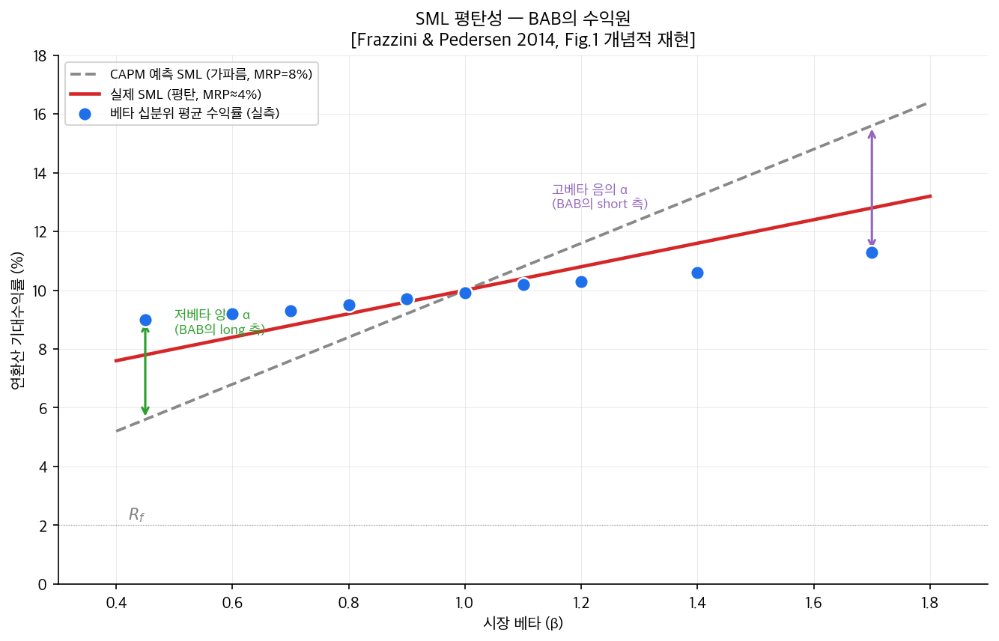
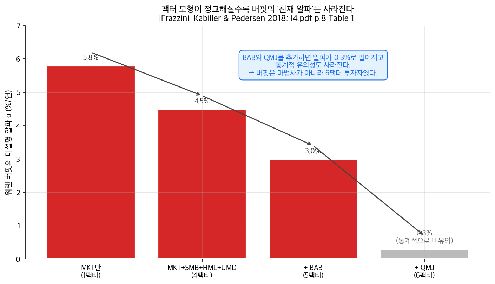

# 14단원: BAB · 워렌 버핏 · 팩터 투자(한·미) — 다섯 번째 팩터의 발견

---

## 1. 왜? — 이 단원을 배우는 이유

13단원까지 우리는 자산 가격을 설명하는 팩터들을 하나씩 모았다.

| 단원 | 팩터 | 풀이 |
|------|------|------|
| 6 | MKT | 시장 |
| 8 | SMB, HML | 사이즈, 가치 |
| 9 | UMD (= WML) | 모멘텀 (횡단면) |
| 13 | TSMOM | 모멘텀 (시계열) |

그런데 6단원에서 잠깐 짚고 넘어간 미해결 문제가 있었다:

> **저베타 이상현상(low-beta anomaly)** — CAPM은 "베타가 높을수록 수익률도 높다"고 예측하지만, 실제로는 저베타 주식이 고베타 주식보다 더 좋은 수익을 낸다.

6단원에서는 이 현상을 "CAPM의 실패 사례"로만 짚었다. 그런데 만약 이 이상현상을 **그냥 인지하고 끝내는 게 아니라, 적극적으로 거래 전략으로 만들면** 어떻게 될까?

> **저베타 주식을 사고, 고베타 주식을 파는 전략. 이름하여 Bet Against Beta (BAB).**

이 단원에서 답할 다섯 질문:

1. BAB는 어떻게 구성하는가? 왜 단순히 "저베타 long, 고베타 short"이 아닌가?
2. BAB가 정말로 작동하는가? 어떤 자산군과 국가에서?
3. 워렌 버핏의 50년간의 초과수익(알파)이 사실은 BAB로 설명된다는 게 무슨 뜻인가?
4. BAB에는 어떤 비판이 제기되었고, 어떻게 보완되는가?
5. 이런 팩터들을 어떻게 결합하는 것이 최적인가? — 팩터 투자(factor investing)의 두 접근법

핵심 자료:

> **[1] Frazzini & Pedersen (2014). "Betting against beta." *Journal of Financial Economics*, 111, 1-15.** — BAB의 원조
>
> **[2] Novy-Marx & Velikov (2022). "Betting against betting against beta." *Journal of Financial Economics*, 143, 80-106.** — BAB에 대한 강력한 비판
>
> **[3] Xu (2025). "Market neutrality and beta crashes." *Journal of Empirical Finance*, 80, 101577.** — BAB의 시장중립 실패와 보완
>
> **[4] Saejoon Kim (2021). "Enhanced factor investing in the Korean stock market." *Pacific-Basin Finance Journal*, 67, 101558.** — 교수님 본인 논문, 한국 시장
>
> **[5] Saejoon Kim (2023). "Factor investing: a unified view." *Applied Economics*.** — 교수님 본인 논문, 미국 시장

---

## 2. 단원 흐름도

```
┌─────────────────────────────────────────────────────────────────────────┐
│                          14단원 전체 로드맵                              │
├─────────────────────────────────────────────────────────────────────────┤
│  §1 문제 제기: 저베타 이상현상을 어떻게 거래 전략으로 만들까?            │
│       │                                                                 │
│       ▼                                                                 │
│  §3~4 가정 / 기호 사전                                                   │
│       │                                                                 │
│       ▼                                                                 │
│  §5 BAB 구성 — 저베타 long(레버리지 ↑) + 고베타 short(레버리지 ↓)       │
│       │  (단순 long-short이 아닌, 베타 1로 맞춘 시장중립 포트폴리오)     │
│       ▼                                                                 │
│  §6 수식 유도 — 왜 시장중립이 되는가? + 왜 자기금융이 아닌가?            │
│       │                                                                 │
│       ▼                                                                 │
│  §7 실증 — 미국·국제·국채·통화·상품에서 모두 BAB가 작동                 │
│       │                                                                 │
│       ▼                                                                 │
│  §8 워렌 버핏의 비밀 — 6팩터로 거의 다 설명되는 50년 알파               │
│       │  (Buffett는 매직 종목 선택가가 아니라 팩터 투자자)               │
│       ▼                                                                 │
│  §9 비판 (Novy-Marx 2022) — rank-weighting · 마이크로캡 편향 ·           │
│       │  비표준 베타 추정 → 사실은 실현 불가능한 환상?                  │
│       ▼                                                                 │
│  §10 시장중립 실패 (Xu 2025) — 베어마켓에서 BAB가 부의 베타로            │
│       │  변동성 스케일링으로 보완                                        │
│       ▼                                                                 │
│  §11 팩터 투자 일반론 — Single Factor / Multifactor / 부정적 노출 제거  │
│       │                                                                 │
│       ▼                                                                 │
│  §12 한국 시장 (Saejoon Kim 2021) — Mixing > Combining                  │
│       │                                                                 │
│       ▼                                                                 │
│  §13 미국 시장 (Saejoon Kim 2023) — Combining(Signal-blended) > Mixing  │
│       │                                                                 │
│       ▼                                                                 │
│  §14 한·미 결론 차이의 의미                                              │
│       │                                                                 │
│       ▼                                                                 │
│  §15 그래서? → A1단원으로 (이 모든 것의 수학적 기반)                    │
│       │                                                                 │
│       ▼                                                                 │
│  §16 셀프체크                                                           │
└─────────────────────────────────────────────────────────────────────────┘
```

---

## 3. 가정과 전제

| # | 가정 | 의미 |
|---|------|------|
| 1 | 저베타 이상현상이 실재 | SML(증권시장선)이 CAPM 예측보다 평탄(flatter)하다는 실증 사실 |
| 2 | 베타 추정이 가능 | 과거 데이터로 자산의 시장 베타를 추정할 수 있어야 한다 |
| 3 | 무위험이자율로 차입 가능 (이상화) | BAB는 저베타 포트폴리오를 레버리지(차입으로 확대)한다. 차입 비용이 무위험이자율과 같다고 가정 |
| 4 | 공매도 가능 | BAB는 고베타 포트폴리오를 공매도한다 |
| 5 | 거래비용 무시 (이상화) | 실제로 BAB는 마이크로캡 거래로 비용이 클 수 있음. §9에서 본격적으로 다룬다 |
| 6 | 평균-분산 프레임워크 | 투자자가 평균과 분산만 본다는 가정. 4·5단원에서 사용한 가정과 동일 |

---

## 4. 기호 사전

| 기호 | 읽는 법 | 의미 |
|------|---------|------|
| $\beta_i$ | "베타 서브 아이" | 자산 $i$의 시장 베타 |
| $r^L_t, r^H_t$ | "알 엘", "알 에이치" | 저베타 포트폴리오와 고베타 포트폴리오의 시점 $t$ 수익률 |
| $\beta^L_t, \beta^H_t$ | | 저/고베타 포트폴리오의 평균 베타 |
| $r_f$ | | 무위험이자율 |
| $r^{\text{BAB}}_t$ | | BAB 포트폴리오의 시점 $t$ 수익률 |
| $w_L, w_H$ | "더블유 엘/에이치" | 저/고베타 포트폴리오의 가중치 벡터 |
| SML | "에스엠엘" | Security Market Line, 증권시장선. CAPM이 예측하는 베타-수익률 직선 |
| QMJ | "큐엠제이" | Quality Minus Junk. 우량주 - 불량주 팩터 |
| $\alpha$ | "알파" | 팩터 모형이 설명하지 못하는 초과수익 |
| BAB | | Betting Against Beta |
| $\Sigma$ | | 공분산 행렬 |
| Mixing | | 단일팩터 포트폴리오들을 합치는 방식 (포트폴리오 블렌딩) |
| Combining | | 팩터 신호들을 합쳐서 한 포트폴리오를 만드는 방식 (시그널 블렌딩) |

---

## 5. 핵심 개념: BAB의 구성

### 5-1. 단순 발상

저베타 이상현상을 활용하려는 첫 발상은 단순하다.

> "저베타 주식을 사고 고베타 주식을 팔자."

하지만 이대로는 문제가 있다. 단순 long-short 포트폴리오의 베타는 다음과 같다:

$$
\beta_{\text{simple long-short}} = \beta^L - \beta^H
$$

저베타 long, 고베타 short이므로 $\beta^L < \beta^H$이고, 따라서 **이 포트폴리오는 부의 시장 베타를 갖는다**. 시장이 오를 때 손실을 본다는 뜻이다.

이건 우리가 원하는 게 아니다. 우리가 원하는 것은:

> **시장 방향과 무관하게 항상 양의 알파를 내는 것.**

이걸 위해서는 시장 베타 = 0인 포트폴리오를 만들어야 한다.

### 5-2. 레버리지로 시장중립 만들기

Frazzini & Pedersen(2014)의 핵심 아이디어:

- **저베타 long 쪽을 레버리지(돈을 빌려 더 사기) → 베타 = 1로 끌어올림**
- **고베타 short 쪽을 디레버리지(덜 팔기) → 베타 = 1로 끌어내림**
- 그 결과 두 쪽의 베타가 같아져서 long − short의 순베타 = 0

수식으로:

$$
r^{\text{BAB}}_{t+1} = \frac{1}{\beta^L_t}\left(r^L_{t+1} - r_f\right) - \frac{1}{\beta^H_t}\left(r^H_{t+1} - r_f\right)
$$

각 기호의 의미:

- $r^L_{t+1} - r_f$ = 저베타 포트폴리오의 초과수익률
- $1/\beta^L_t$ = 저베타 포트폴리오를 베타 1로 만들기 위한 레버리지 배수. $\beta^L_t < 1$이므로 $1/\beta^L_t > 1$ → **레버리지 확대**
- $r^H_{t+1} - r_f$ = 고베타 포트폴리오의 초과수익률
- $1/\beta^H_t$ = 고베타 포트폴리오의 디레버리지 배수. $\beta^H_t > 1$이므로 $1/\beta^H_t < 1$ → **레버리지 축소**

### 5-3. 미국 주식 예시

> "Eg. US stock BAB factor is long $1.4 of low-beta stocks and short sells $0.7 of high-beta stocks."
> [l4.pdf p.5]

- 저베타 평균 베타가 약 0.7이라면 → $1/0.7 \approx 1.43$ → 자기자본 $1당 $1.43 어치 매수
- 고베타 평균 베타가 약 1.4라면 → $1/1.4 \approx 0.71$ → $0.71 어치 매도
- 결과적으로 long $1.43 + short $0.71 → 베타 = 1.43 × 0.7 − 0.71 × 1.4 = 1 − 1 = 0

### 5-4. 자기금융이 아니다

13단원의 TSMOM과 마찬가지로, BAB도 **자기금융이 아니다**.

- long $1.43 + short $0.71 → 순투자금 = $0.72 필요
- 즉 자기자본 $0.72를 넣어야 이 전략을 실행할 수 있다

> "It's not dollar neutral. It's not self-financing. You do not long the same amount, you short. So it's not dollar-neutral, it's not self-financing, but it has beta equal to zero."
> [강의 3/27, 01:03:41]

---

## 6. 수식 유도

### 6-1. BAB가 시장중립인지 증명

레버리지 적용 후 long 측 포트폴리오의 베타를 계산해보자.

$$
\beta_{\text{long side}} = \frac{1}{\beta^L_t} \cdot \beta^L_t = 1
$$

마찬가지로 short 측:

$$
\beta_{\text{short side}} = \frac{1}{\beta^H_t} \cdot \beta^H_t = 1
$$

(short은 음의 포지션이므로 부호를 반대로 하면)

$$
\beta_{\text{BAB}} = 1 - 1 = 0
$$

따라서 **BAB는 사전적(ex ante) 시장중립**이다. 이는 베타 추정이 정확하다는 가정 위에 성립한다. (§10에서 이 가정이 어떻게 깨지는지 본다.)

### 6-2. BAB의 기대수익률

CAPM에서 자산 $i$의 기대수익률은:

$$
E[r_i] - r_f = \beta_i (E[r_M] - r_f)
$$

만약 CAPM이 정확히 성립한다면, 저베타·고베타 포트폴리오의 기대수익률은:

$$
E[r^L] - r_f = \beta^L (E[r_M] - r_f)
$$

$$
E[r^H] - r_f = \beta^H (E[r_M] - r_f)
$$

이를 BAB에 대입:

$$
E[r^{\text{BAB}}] = \frac{1}{\beta^L} \cdot \beta^L (E[r_M] - r_f) - \frac{1}{\beta^H} \cdot \beta^H (E[r_M] - r_f) = (E[r_M] - r_f) - (E[r_M] - r_f) = 0
$$

즉 **CAPM이 정확히 성립한다면 BAB의 기대수익률은 0이어야 한다.**

그런데 실증적으로 BAB의 수익률은 양수다. 이건 무엇을 의미하는가?

> **CAPM이 틀렸거나, SML이 평탄(flatter)하다는 뜻이다.**

평탄한 SML이란 저베타가 CAPM 예측보다 더 높은 수익을, 고베타가 더 낮은 수익을 내는 현상이다. 이걸 그림으로 보면:



> **그림 읽는 법** — x축은 시장 베타, y축은 연환산 기대수익률.
> - **회색 점선**: CAPM이 예측하는 SML (가파른 직선)
> - **빨간 실선**: 실제 시장이 보여주는 SML (훨씬 평탄)
> - **파란 점**: 베타 십분위 평균 수익률 (실측)
> - **초록 화살표 (저베타 영역)**: 실제가 CAPM 예측보다 **위에** 있는 갭 → +α → BAB의 long 측 수익
> - **보라 화살표 (고베타 영역)**: 실제가 CAPM 예측보다 **아래에** 있는 갭 → −α → BAB의 short 측 수익
>
> 이 두 갭의 합이 BAB의 수익원이다. (개념적 재현, 정확한 실증 수치는 [Frazzini & Pedersen 2014, Fig.1] 참조)

### 6-3. 왜 SML이 평탄한가? — 차입 제약 가설

7단원에서 잠깐 본 **차입 제약 가설(leverage constraint hypothesis)**:

- 많은 기관투자자(연기금, 뮤추얼펀드)는 레버리지를 사용할 수 없다
- 높은 수익을 원할 때, 레버리지 대신 **고베타 주식을 매수**하는 방법을 택한다
- 이 수요 쏠림이 고베타 주식의 가격을 올리고, 결과적으로 기대수익률을 낮춘다
- 반대로 저베타 주식은 상대적으로 소외되어 저평가 → 더 높은 수익률

> "Investors with leverage constraints will pay too much for high-beta stocks. Frazzini and Pedersen (2014) provide a theoretical model that derives this implication."

이는 BAB의 이론적 근거가 된다.

---

## 7. 실증: BAB는 어디서나 작동한다

Frazzini & Pedersen (2014)는 약 20개의 자산군과 국가를 검증했다.

### 7-1. 미국 주식

> "Alpha of beta-sorted decile portfolios. Low-beta decile generates 0.4 alpha, and the highest beta portfolio generates negative alpha."
> [강의 3/27, 01:09:36]

강의에서 직접 인용된 두 끝값:

| 베타 십분위 | 알파 (월) | 출처 |
|------|------|------|
| P1 (최저) | **+0.40 (강의 직접 언급)** | [강의 3/27, 01:09:36] |
| P2 ~ P9 | (단조 감소 패턴, 정확한 수치는 원논문 Frazzini & Pedersen 2014 Fig.1 참조) | [frazzini2014jfe Fig.1] |
| P10 (최고) | **−0.40 (강의 직접 언급)** | [강의 3/27, 01:09:36] |

저베타 long, 고베타 short → 알파의 차이가 약 +0.6%/월 (연 약 7~10%)로 매우 강한 결과. 정확한 누적 P-값과 십분위 전체 수치는 원논문 [Frazzini & Pedersen 2014, Fig.1, Tables 3~4]을 참조.

### 7-2. 다른 자산군

| 자산군 | BAB 샤프비율 |
|------|----------|
| 미국 주식 | ~0.8 |
| 국제 주식 | 양수, 유의 |
| 미국 국채 (Treasuries) | 양수, 유의 |
| 주가지수 선물 | 양수 |
| 통화 (Currencies) | 양수 |
| 상품 (Commodities) | 양수 |

> "So regardless of which asset class or country you consider, Sharpe ratio is strictly positive."
> [강의 4/1, 05:54]

이는 모멘텀이나 가치(HML)에 못지않은 보편성이다. BAB가 단순한 미국 주식의 통계적 우연이 아니라 **자산 가격의 근본 메커니즘**과 관련됨을 시사한다.

### 7-3. 다른 팩터 모형으로 설명되는가?

> "We get pretty much the same results when we consider international equities. ... BAF strategy generates statistically significant alphas across CAPM, three-factor, four-factor, and five-factor models."
> [강의 4/1, 09:47]

CAPM, FF3, FF5(Carhart), 어떤 모형으로도 BAB의 알파를 설명할 수 없다. 즉 **BAB는 기존 팩터들로 설명되지 않는 독립적 수익원**이다. 따라서 5번째 팩터로 추가될 자격이 있다.

---

## 8. 워렌 버핏의 비밀 — 50년 알파의 정체

이 단원의 가장 흥미로운 부분이다.

### 8-1. 버핏의 성과

> 약 50년 동안 워렌 버핏의 연간 평균 초과수익률은 약 **연 18.6%**, S&P 500의 약 7.5%를 두 배 이상 초과했다.
> [l4.pdf p.6]

이 성과는 어디서 왔는가? 일반인의 답은:

> "버핏은 천재적 종목 선택가다."

이 답이 맞는지 검증하는 방법은 6팩터 회귀다.

### 8-2. 6팩터 회귀

$$
R^{\text{Buffett}}_t - r_f = \alpha + \beta_1 \text{MKT}_t + \beta_2 \text{SMB}_t + \beta_3 \text{HML}_t + \beta_4 \text{UMD}_t + \beta_5 \text{BAB}_t + \beta_6 \text{QMJ}_t + \varepsilon_t
$$

각 팩터:

- MKT: 시장
- SMB, HML: 사이즈, 가치
- UMD: 모멘텀
- **BAB: 베팅 어게인스트 베타**
- **QMJ (Quality Minus Junk): 수익성·성장성·안전성으로 정의되는 우량주 팩터**

### 8-3. 결과 [l4.pdf p.8, Table 1]

| 모형 | 알파 (연) |
|------|----------|
| MKT만 | 5.8% |
| MKT+SMB+HML+UMD (4팩터) | 4.5% |
| 4팩터 + BAB (5팩터) | 3.0% |
| 4팩터 + BAB + QMJ (6팩터) | **0.3%, 통계적으로 비유의** |



> **그림 읽는 법** — 막대 높이가 워렌 버핏 포트폴리오의 미설명 알파(α). 팩터를 추가할 때마다 막대가 낮아진다. 6팩터 모형에서 알파가 0.3%로 떨어지고 통계적으로 비유의(회색 막대)가 된다 = "알파가 사라졌다 = 모든 수익이 6팩터 노출로 설명됐다".

**해석:**

- MKT만으로는 알파 5.8% (큰 미설명 성과)
- 사이즈·가치·모멘텀 추가하면 4.5%로 감소
- BAB 추가하면 3.0%로 더 감소
- QMJ까지 추가하면 알파가 거의 0이고 통계적으로 유의하지 않음

> "So Buffett's strategy was in fact buying stocks that had high exposures to these factors. ... So it's not some magic stock picker. It's in fact a factor investor."
> [강의 4/1, 26:24]

### 8-4. 충격적 함의

> **버핏은 "천재적 종목 선택가"가 아니라 "체계적 팩터 투자자"였다.**

버핏의 실제 종목들을 보면 — 코카콜라, 프록터앤드갬블, 아메리칸익스프레스 — 모두 **저베타 + 고품질**의 우량주들이다. 즉 BAB와 QMJ에 강한 노출.

> "Factors of assets are like nutrients in food. So when we intake food, we are actually intaking nutrients. ... If you want to be healthy, you want to eat nutrient rich food. So if you want to get rich, you should buy stocks with heavy exposures to factors."
> [강의 4/1, 17:05]

이 발견의 실용적 함의:

> **6개 팩터를 미리 알았다면, 누구나 50년간 버핏과 비슷한 성과를 낼 수 있었다.**

물론 "미리 알았다면"이라는 가정이 핵심이다. 1950년대에는 BAB도 QMJ도 발견되지 않았다. 하지만 적어도 **버핏의 성과가 신비한 직관이 아니라 체계적이고 학습 가능한 패턴**이라는 점은 중요하다.

---

## 9. BAB에 대한 비판 — Novy-Marx & Velikov (2022)

BAB가 너무 좋아보이면 의심해야 한다. Novy-Marx & Velikov(2022)는 BAB의 세 가지 문제를 지적했다.

### 9-1. 비판 1: Rank-Weighted Portfolio Construction

> "First problem with the original paper is that they consider rank-weighted portfolio construction. They do not consider the value-weighted portfolio."
> [강의 4/1, 32:29]

**Frazzini & Pedersen의 가중치 방식:**

- 자산을 베타 순으로 줄세움
- 베타가 더 작은(또는 더 큰) 자산일수록 **가중치가 더 큼** (rank-weighted)
- 이는 시가총액과 무관

**문제점:**

이렇게 가중치를 주면 **마이크로캡(micro-cap), 나노캡(nano-cap) 주식들이 과도하게 큰 비중을 차지한다**. 이들은:

- 시총이 너무 작아 실제로 매수/매도하기 어렵다
- 거래비용이 매우 크다
- 시장 충격(market impact)이 크다

> "BAB achieves high Sharpe ratio by hugely overweighting micro- and nano-cap stocks which have the lowest betas. For each dollar invested in BAB, the strategy commits on average $1.05 to stocks in the bottom 1% of total market capitalization."
> [l4.pdf p.10]

즉 **$1을 BAB에 투자하면, 그 중 $1.05가 시장 시총의 하위 1%인 마이크로캡 주식에 들어간다**. 이는 실현 불가능한 비중이다.

**Novy-Marx의 대안:**

- 가중치를 **시가총액 가중(value-weighted)** 으로 바꾸어 본다
- 그러면 BAB의 누적 수익률이 50년에 걸쳐 약 $1 → $20,000 (rank-weighted) → 약 $1 → $20 미만 (value-weighted)으로 **1,000배 차이**

> **결론:** rank-weighted 방식의 결과는 "이론상의 환상"이고, 실제로 구현하면 효과가 크게 줄어든다.

### 9-2. 비판 2: Hedging by Leveraging의 부자연스러움

> "Second problem is that they hedge by leveraging. Instead of hedging the BAB strategy by buying the market in proportion to the strategy's short market tilt, they leverage the low beta portfolio and deleverage the high beta portfolio."
> [l4.pdf p.9]

**Frazzini의 헤지 방식 (BAB 원조):**

- 저베타 long 쪽을 레버리지(× $1/\beta^L$)
- 고베타 short 쪽을 디레버리지(× $1/\beta^H$)

**더 자연스러운 헤지 방식:**

- 그냥 저베타 long, 고베타 short
- 그 결과 남는 시장 노출(잔여 베타)은 시장지수를 short해서 헤지

수식으로:

$$
r^{\text{직접 헤지 BAB}}_t = (r^L_t - r^H_t) - (\beta^L - \beta^H) r^{\text{MKT}}_t
$$

이게 더 일반적이고 자연스럽다. 그런데 Frazzini의 방식은 왜 이걸 안 썼는가?

레버리지 방식이 결과적으로 좋게 나오는 효과를 만들기 때문이다. 즉 **방법론 선택이 결과를 만든다**는 의심.

### 9-3. 비판 3: 비표준 베타 추정

> "Third problem is the way by which they estimated the beta. They used three-day overlapping returns combined with one-year daily volatility. ... So their beta estimation technique was kind of not the standard way."
> [l4.pdf p.9]

표준 베타 추정은 단순 회귀 — 자산 수익률을 시장 수익률에 회귀해서 기울기를 구한다. 하지만 Frazzini의 방식은:

- **3일 중첩 수익률**(three-day overlapping returns)로 상관관계 추정 (5년 데이터)
- **일별 수익률**로 변동성 추정 (1년 데이터)
- 이 둘을 결합해서 베타 산출

이런 방식의 베타가 **체계적으로 더 작아 보이게**(저베타 쪽으로 편향) 추정된다. 그러면 BAB가 더 좋아 보인다.

### 9-4. 비판의 종합

> "While all these results look nice, they might not be implementable."
> [강의 4/1, 33:26]

Novy-Marx & Velikov(2022)의 결론:

> **세 가지 비표준 선택(rank-weighted, leverage hedging, 비표준 베타 추정)을 모두 표준 방식으로 바꾸면, BAB의 성과는 통계적으로 유의하지 않다.**

즉 **BAB 효과는 방법론적 선택의 산물일 가능성이 크다.** 다만 이 비판이 BAB를 완전히 폐기하는 것은 아니고, **실용 가능한 BAB는 원조보다 훨씬 약하다**는 정도로 이해해야 한다.

---

## 10. 시장중립 실패 — Xu (2025)

### 10-1. BAB의 또 다른 문제

§5에서 BAB는 "사전적(ex ante) 시장중립"이라 했다. 즉 베타 추정이 정확하다는 가정 위에 베타 = 0.

문제는 **베타가 시간에 따라 변한다**는 것이다. 특히 **시장 충격 직후 베타 추정이 부정확**해진다.

> "When the market rebounds from recession, BAB has a negative beta because this part [high-beta] was underestimated when this was much larger."
> [강의 4/1, 01:04:21]

이게 무슨 뜻인가:

- 시장이 폭락 → 고베타 주식들이 더 크게 폭락 → 그 후 시장이 반등하면 고베타 주식들이 더 크게 반등
- 그런데 베타 추정은 과거 데이터 기반이라 반등기에 베타가 **과소평가**된다
- 이로 인해 short 쪽 디레버리지가 부족해짐 → 실제 BAB 베타는 부의 값
- 시장이 오를 때 BAB는 손실을 본다

### 10-2. 세 가지 비대칭

Xu(2025)는 BAB가 다음 세 가지 부정적 특성을 가진다고 보여줬다:

1. **베어마켓 후 반등기에 부의 베타** — 시장이 반등할 때 손실
2. **부의 시장 타이밍(negative market timing)** — 정확히 잘못된 시기에 시장 노출이 커진다
3. **부의 변동성 타이밍(negative volatility timing)** — 변동성이 클 때 노출도 같이 커져서 손실 확대

> "If anything, for the strategy to have good returns, its exposure should go up during bull markets ... but it turns out that it moves in the opposite way."
> [강의 4/1, 01:06:55]

이는 BAB에 **모멘텀 크래시와 비슷한 위험**이 있음을 의미한다. 9·10단원에서 본 모멘텀의 약점과 본질적으로 같은 메커니즘이다.

### 10-3. 변동성 스케일링으로 보완

Xu(2025)의 해결책은 우리가 10단원에서 이미 본 것이다: **변동성 스케일링**.

$$
r^{\text{vol-managed BAB}}_t = \frac{\sigma_{\text{target}}}{\hat\sigma_{t-1}^{\text{BAB}}} \cdot r^{\text{BAB}}_t
$$

> "Volatility scaling is pretty much standard. It's the same technique we saw when we did momentum, right? We studied momentum, volatility scaled momentum to mitigate the occasional crashes found in momentum strategy."
> [강의 4/1, 01:13:01]

> **공통 사상의 일반화:** 10단원(모멘텀 크래시) → 13단원(TSMOM 변동성 스케일링) → 14단원(BAB 변동성 스케일링). **위험이 시간에 따라 변할 수 있는 모든 팩터 전략**에 변동성 스케일링은 거의 필수가 된다.

### 10-4. 결과: 누적 수익률 차이

Xu(2025)의 분석에 따르면:

- 원조 BAB: 50년 누적 약 $1 → $20,000
- 변동성 관리 BAB: 50년 누적 약 $1 → 200~300배 더 우월

> "After 90 years, you start with one dollar. After almost a century, this is about $20,000 [original BAB]. ... Volatility scaled BAB is more than a couple of hundred times the return."
> [강의 4/1, 01:12:05]

물론 이는 Novy-Marx의 비판(rank-weighted, 마이크로캡)을 고려하지 않은 결과다. 두 가지 보완을 모두 반영하면 BAB의 진짜 성과는 더 작아진다.

---

## 11. 팩터 투자 일반론

여기까지가 14단원의 절반이다. 후반부는 **팩터들을 어떻게 결합할 것인가** — 즉 본격적인 **팩터 투자(factor investing)** 의 실전 문제다.

### 11-1. 단일 팩터 포트폴리오의 문제

7단원에서 이변량 정렬(2×3 격자)로 SMB·HML을 만드는 법을 배웠다. 그때 핵심 아이디어:

> **"한 팩터를 추출할 때 다른 팩터의 노출을 통제해야 한다."**

이걸 안 하면, SMB라고 만들어도 그 안에 가치 효과가 섞여 들어간다.

이 이슈는 현실에서 더 심각한 형태로 나타난다.

> **부정적 노출(negative exposure):** 한 팩터(예: 가치)에 노출을 갖기 위해 만든 포트폴리오에, 의도치 않게 다른 팩터(예: 모멘텀)의 부정적 노출이 따라붙는 현상.

예를 들어 **가치주(저 PER)** 를 단순히 모으면 — 이 주식들은 보통 최근에 가격이 안 좋았던 주식들이다 → **부의 모멘텀 노출** 동반. 가치 프리미엄에 모멘텀 페널티가 붙어 순효과가 줄어든다.

### 11-2. 두 가지 결합 방식

여러 팩터(가치, 사이즈, 모멘텀 등)를 동시에 활용하려 할 때, 두 가지 접근이 있다.

**방식 A: 포트폴리오 블렌딩 (Mixing)**

각 팩터마다 독립적으로 포트폴리오를 만들고, 마지막에 합친다.

```
가치 포트폴리오   ─┐
사이즈 포트폴리오 ─┼──→ 평균 / 가중평균 ──→ 최종 포트폴리오
모멘텀 포트폴리오 ─┘
```

- 장점: 단순함, 팩터별 독립적 검증 가능
- 단점: 위에서 본 부정적 노출이 그대로 남음

**방식 B: 시그널 블렌딩 (Combining / Signal Blending)**

각 자산에 대해 모든 팩터의 신호를 먼저 결합하고, 그 결합 신호로 한 번에 포트폴리오를 만든다.

```
각 자산: [가치 점수 + 사이즈 점수 + 모멘텀 점수] = 종합 점수
                            │
                            ▼
              종합 점수가 높은 자산을 long, 낮은 자산을 short
```

- 장점: 부정적 노출이 자동으로 상쇄됨 (가치+모멘텀이 둘 다 좋은 자산만 매수)
- 단점: 어느 팩터가 얼마나 기여했는지 분리하기 어려움

> "Multifactor portfolios based on the two prevalent approaches: mixing portfolios vs. combining signals — with the latter often perceived as the more effective approach."
> [Saejoon Kim 2021, Abstract]

이 시점까지의 통념은 **"combining (signal blending)이 mixing보다 우수하다"** 였다. 그런데...

---

## 12. 한국 시장의 검증 — Saejoon Kim (2021)

### 12-1. 연구 설계

> **Saejoon Kim (2021). "Enhanced factor investing in the Korean stock market." *Pacific-Basin Finance Journal*, 67, 101558.** [2021PBFJ]

- 대상: 한국 주식시장 (KOSPI · KOSDAQ)
- 기간: 약 20년
- 팩터: 5개 — 사이즈, 가치, 모멘텀, **수익성(profitability)**, **저위험(low risk)**
- 핵심 기여: **부정적 노출을 사전에 제거**해서 enhanced 팩터 포트폴리오 구성

### 12-2. Enhanced Factor Portfolio의 구성법

기본 아이디어는 다음과 같다.

기존 가치 포트폴리오를 만들 때 — 저PER 주식들을 그냥 모은다고 하자. 그러면 이 포트폴리오는 다음과 같은 노출을 갖는다:

- 가치 노출: + (의도된)
- 모멘텀 노출: − (부정적, 의도되지 않은)
- 저위험 노출: + (의도되지 않았지만 우연히 양수일 수 있음)
- ...

Saejoon Kim(2021)은 이 중에서 **부정적 노출이 큰 자산을 제거**한다. 즉:

- 저PER 주식들 중에서 **모멘텀 점수가 너무 나쁜 주식들은 빼버린다**
- 남은 자산들은 가치 노출은 유지하면서, 모멘텀의 부정적 노출이 줄어든다

> "Negative exposures to unintended factors that detract from the expected factor risk premium are identified. These constituents with large negative exposures are then removed from the factor portfolio."
> [Saejoon Kim 2021, Abstract]

### 12-3. 결과: 한국 시장의 5팩터 프리미엄

| 팩터 | 한국 시장 risk premium |
|------|---------|
| **사이즈** | 가장 큰 양수 |
| 가치 | 양수 |
| 모멘텀 | 양수 |
| 수익성 | 양수 |
| 저위험 | 양수 |

특이점:

> **한국 시장에서는 사이즈 팩터가 가장 큰 risk premium을 보인다.** 이는 미국 시장에서는 점차 약해지고 있는 사이즈 효과와 대비된다.

### 12-4. 핵심 결론: Mixing vs Combining

Saejoon Kim(2021)이 한국 시장에서 발견한 충격적 결과:

> **부정적 노출을 제거한 단일 팩터 포트폴리오들을 단순히 합치는(Mixing) 방식이, 시그널을 결합하는(Combining) 방식보다 더 좋은 성과를 낸다.**

이는 기존의 통념(combining > mixing)을 **뒤집은 결과**다.

이유 추정:

1. 부정적 노출 제거가 mixing의 가장 큰 약점이었는데, 그걸 직접 해결했기 때문
2. 한국 시장의 특수성 — 신흥국이고 시장 규모가 작아 cross-sectional dispersion이 다름
3. 데이터 기간이 짧아 combining의 추정 잡음(estimation noise)이 더 크게 영향

---

## 13. 미국 시장의 재검증 — Saejoon Kim (2023)

### 13-1. 연구 설계

> **Saejoon Kim (2023). "Factor investing: a unified view." *Applied Economics*.** [2023AE]

- 대상: 미국 주식시장 (US equity)
- 기간: 약 50년 (long-term)
- 팩터: 동일하게 5개 (사이즈, 가치, 모멘텀, 수익성, 저위험)
- 동일한 enhanced 방법론 적용

### 13-2. 결과: 5팩터 프리미엄

> "By examining the levels of exposure to a set of factors collectively, we construct enhanced factor portfolios from conventional single-factor portfolios that substantially increase factor risk premia consistently for nearly five decades in the US equity data."
> [Saejoon Kim 2023, Abstract]

미국에서도 5팩터 모두 양의 risk premia가 일관되게 확인됐다.

### 13-3. 핵심 결론: Combining > Mixing

미국 시장에서는 한국과 정반대 결과가 나왔다.

> **Signal-blended multifactor portfolio가 다른 모든 팩터 포트폴리오 대비 통계적 유의성 1% 수준에서 우수.**

즉 **미국에서는 통념대로 combining이 mixing보다 좋다**.

> "We present the outperformance of the signal-blended multifactor portfolio for various return measures over all factor portfolios considered at a statistical significance level of 1%."
> [Saejoon Kim 2023, Abstract]

---

## 14. 한·미 결론 차이의 의미

이게 14단원의 가장 흥미로운 부분이다.

### 14-1. 실험 결과 비교

| 시장 | Mixing vs Combining 우열 |
|------|---------|
| **한국** (2021) | **Mixing > Combining** |
| **미국** (2023) | **Combining > Mixing** |

### 14-2. 의미

이 결과는 **시장마다 최적 팩터 결합 방식이 다르다**는 것을 시사한다. 가능한 해석들:

**(A) 시장 미시구조의 차이**

- 한국: 작은 시장 + 거래비용이 미국보다 큼 + 기관/개인 비중 차이
- 미국: 큰 시장 + 자유로운 차익거래
- 두 시장에서 팩터 노출의 dispersion이 다르다

**(B) 데이터 기간의 차이**

- 한국: 약 20년 (단기 표본 → combining의 추정 잡음 부각)
- 미국: 약 50년 (장기 표본 → 잡음 평균 효과)

**(C) 팩터 특성의 차이**

- 한국에서 사이즈 효과가 가장 강하다는 점
- 미국에서는 가치·모멘텀이 더 강하다는 점
- 이런 특성 차이가 결합 방식의 효과를 다르게 만든다

### 14-3. 실용적 함의

> **"Factor investing은 시장에 따라 다른 처방이 필요하다."**

이는 단순한 팁이 아니라, **금융 연구의 일반적 원칙**을 보여준다:

1. 한 시장(보통 미국)에서 검증된 결과가 다른 시장에서 그대로 적용되지 않는다
2. 신흥국(emerging market) 데이터로 별도 검증이 필요하다
3. **자산운용 실무는 "하나의 정답"을 찾는 게 아니라, "이 시장에서는 어떤 방식이 작동하는지"를 발견하는 일**이다

이 원칙은 12단원에서 본 **"왜 수학이 필요한가"** 와도 연결된다. 수식은 정답을 주는 게 아니라, **어떤 조건에서 어떤 결과가 나오는지**를 명확히 보여주는 도구다. 한·미의 다른 결론은 이 원칙의 실증 사례다.

---

## 15. 그래서? — A1단원으로

이번 단원에서 우리가 본 핵심:

1. CAPM의 저베타 이상현상을 거래 전략으로 만든 게 BAB
2. BAB는 자산군과 국가에 무관하게 보편적으로 작동
3. 워렌 버핏의 50년 알파는 6팩터(특히 BAB·QMJ)로 거의 다 설명됨
4. BAB에 대한 비판: rank-weighting, 마이크로캡 편향, 비표준 베타 추정 (Novy-Marx)
5. BAB의 시장중립 실패와 변동성 스케일링 보완 (Xu)
6. 팩터 투자의 두 결합 방식: Mixing(포트폴리오) vs Combining(시그널)
7. 한국과 미국에서 결합 방식의 우열이 정반대라는 충격적 발견 (Saejoon Kim 2021/2023)

자산운용 트랙의 1차 마무리다. 우리는 1단원의 분산투자에서 시작해서, 효율적 프론티어와 효용함수를 거쳐, SDF·CAPM·APT의 이론, FF3와 모멘텀과 BAB까지 여섯 팩터를 모았다.

그런데 이 모든 과정에서 **수학의 깊이**를 깊이 다루지는 않았다. 라그랑주 승수법(2단원), 회귀분석(7단원), 변동성 스케일링(10단원, 13단원, 14단원) — 이 모든 도구의 **수학적 근간**이 무엇인가?

실은 이 모든 것이 **이차 최적화(quadratic optimization)** 와 **선형대수**라는 두 기둥 위에 서 있다.

또 앞으로 우리가 만나게 될 ML(머신러닝) 기반 자산가격 모형 — KNS, IPCA, Conditional Autoencoder — 도 같은 수학을 쓴다. 따라서 다음 단원에서는 본격적으로 이 수학적 기초를 다룬다.

→ **A1단원: 선형대수와 이차최적화 — 자산운용을 위한 인공지능의 수학적 기둥**

---

## 16. 셀프체크

1. **BAB가 단순한 "저베타 long, 고베타 short"이 아니라 레버리지를 사용하는 이유를 설명하라.** 그렇지 않으면 어떤 문제가 생기는가?

2. **CAPM이 정확히 성립한다면 BAB의 기대수익률은 0이 되어야 한다.** 이 결과를 §6-2의 수식을 보지 않고 직접 유도해보라. 그렇다면 BAB가 양의 수익을 내는 것은 무슨 의미인가?

3. **워렌 버핏의 6팩터 회귀에서 알파가 5.8% → 4.5% → 3.0% → 0.3% 로 감소했다.** 각 단계마다 추가된 팩터가 무엇이고, 그 팩터가 버핏의 어떤 종목 선호와 관련 있는지 설명하라.

4. **Novy-Marx의 BAB 비판 세 가지를 구체적으로 설명하라.** 특히 "rank-weighted"와 "value-weighted"의 차이가 마이크로캡 편향과 어떻게 연결되는가?

5. **BAB의 베타가 시간에 따라 어떻게 변하는가? Xu(2025)의 부의 시장 타이밍과 부의 변동성 타이밍을 직관적으로 설명해보라.** 이게 10단원의 모멘텀 크래시와 어떤 점에서 비슷한가?

6. **Mixing과 Combining의 차이를 한 문장으로 말해보라.** 왜 통념적으로 Combining이 더 낫다고 알려져 있었나?

7. **Saejoon Kim(2021/2023)의 한·미 결론 차이가 시사하는 일반 원칙을 두 가지 들어보라.** 이는 자산운용 연구의 일반적 태도와 어떤 관련이 있는가?

8. **이 단원에서 본 BAB·QMJ를 9단원의 모멘텀 잔차와 비교하라.** 두 접근 모두 "팩터 노출을 정리한 후의 순수 수익원"이라는 공통 사상이 있는데, 차이는 무엇인가?

---

## 출처 / 참고

- **Frazzini, A., & Pedersen, L. H. (2014). Betting against beta. *Journal of Financial Economics*, 111(1), 1–25.** [frazzini2014jfe]
- **Novy-Marx, R., & Velikov, M. (2022). Betting against betting against beta. *Journal of Financial Economics*, 143(1), 80–106.** [novymarx2022jfe]
- **Xu, J. (2025). Market neutrality and beta crashes. *Journal of Empirical Finance*, 80, 101577.** [xu2025jef]
- **Frazzini, A., Kabiller, D., & Pedersen, L. H. (2018). Buffett's Alpha. *Financial Analysts Journal*, 74(4), 35–55.** (인용)
- **Saejoon Kim (2021). Enhanced factor investing in the Korean stock market. *Pacific-Basin Finance Journal*, 67, 101558.** [2021PBFJ]
- **Saejoon Kim (2023). Factor investing: a unified view. *Applied Economics*.** [2023AE]
- 강의 녹취 2026-03-27 [01:00:00 ~ 01:13:32], 2026-04-01 [00:00 ~ 01:13:01]
- 강의 슬라이드 [l4.pdf, pages 1~15]
- 6단원 (CAPM의 실패), 9·10단원 (모멘텀과 크래시), 13단원 (TSMOM과 변동성 스케일링)
