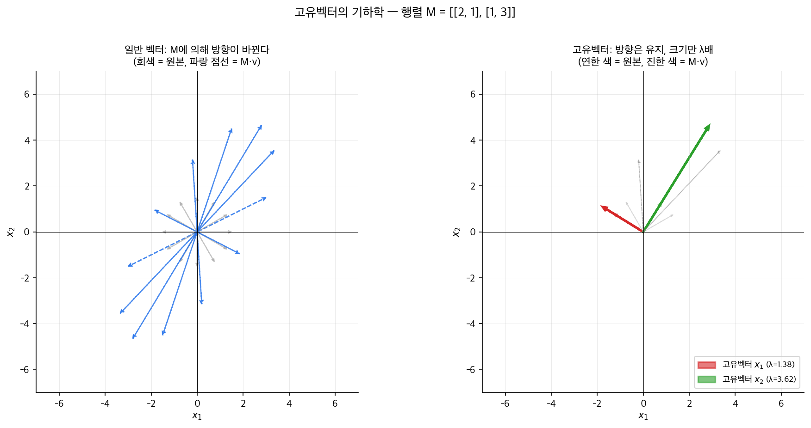
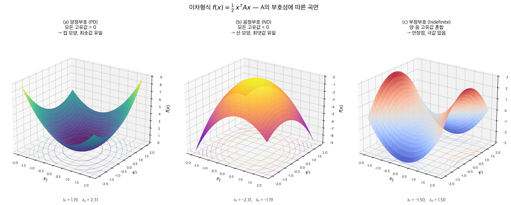

# A1단원: 선형대수와 이차최적화 — 자산운용을 위한 인공지능의 수학적 기둥

> **이 단원의 위치**: 자산운용 트랙(1~14)의 곁에 새로 시작하는 **AI 수학·ML 트랙**의 첫 단원이다. 1~14단원이 "무엇을 어떻게 운용하는가"의 트랙이라면, A1·B1·B2는 "그 운용을 어떤 수학·ML 도구로 가능하게 하는가"의 트랙이다.

---

## 1. 왜? — 이 단원을 배우는 이유

### 1-1. 우리가 지금까지 사용해 온 수학들

1~14단원을 돌이켜보자. 학습서의 거의 모든 단원에서 우리는 이미 어떤 수학적 도구를 사용해왔다.

| 단원 | 사용한 수학 도구 |
|------|---------|
| 2단원 | 라그랑주 승수법 (효율적 프론티어 유도) |
| 4단원 | 직선 방정식, 접선 (CAL, 샤프비율) |
| 5단원 | **공분산 행렬**, 행렬 역행렬, 라그랑주 |
| 7단원 | **회귀분석**, **PCA(주성분분석)**, 이변량 정렬 |
| 8단원 | 회귀분석, FF3 |
| 9·10·13·14단원 | **변동성 추정**, 시계열 회귀, 변동성 스케일링 |

이 모든 도구를 우리는 "쓸 수 있는" 수준으로만 익혔다. 라그랑주 승수법이 왜 작동하는지, PCA가 왜 분산을 가장 잘 설명하는 방향을 찾는지, 회귀분석이 왜 잔차 제곱합을 최소화하는지 — 그 **밑바닥**을 들여다보지는 않았다.

### 1-2. 앞으로 만나게 될 수학들

여기에 더해, **B1단원과 B2단원** — 즉 머신러닝 기반 자산가격결정과 스펙트럴 클러스터링 — 에 들어가려면 더 깊은 수학이 필요하다.

| 다음 단원 | 필수로 알아야 할 수학 |
|------|---------|
| B1 (KNS, IPCA, CA) | 행렬 분해, 고유값, 그래디언트, 신경망의 비선형 변환 |
| B2 (Spectral Clustering) | **그래프 라플라시안**, 고유값 분해, 클러스터링 |

이 모든 것의 공통 기반은 **선형대수**와 **이차최적화** 두 기둥이다.

### 1-3. 교수님의 말로 하면

> "We're going to study about quadratic optimization because it's a major component in machine learning, deep learning. And before we do this, we're going to study some properties of matrices because the matrix will represent the relationship between assets. ... For example, the covariance matrix is a matrix, so it would be useful to learn some characteristics from the matrix."
> [강의 4/29, 01:51]

핵심 포인트 두 가지:

1. **행렬은 자산들 사이의 관계를 표현하는 도구다.** 공분산 행렬, 상관 행렬, 그래프 인접 행렬, 회귀의 설계 행렬 — 모두 행렬이다.
2. **이차 최적화는 ML/DL의 핵심 구성요소다.** 손실 함수의 최소화, 분산의 최소화, 최대 샤프비율 — 모두 이차 최적화의 사례다.

### 1-4. 이 단원에서 답할 7개 질문

1. 행렬을 "변환 기계"로 본다는 게 무슨 뜻인가?
2. 고유값(eigenvalue)과 고유벡터(eigenvector)는 무엇이고, 왜 중요한가?
3. **실대칭행렬(real symmetric matrix)** 의 특별한 성질은? — 자산운용에서 다루는 모든 행렬이 사실상 이것이다
4. 어떤 행렬의 고유값은 어떤 최적화 문제의 해와 같다는 게 무슨 뜻인가? (Rayleigh quotient)
5. **양정부호(positive definite)** 행렬은 무엇인가? 왜 그 행렬은 "컵 모양"의 함수를 만드는가?
6. **이차형식(quadratic form)** 을 어떻게 최소화하는가?
7. 이 모든 것이 결국 자산운용과 ML의 어떤 문제로 환원되는가?

---

## 2. 단원 흐름도

```
┌──────────────────────────────────────────────────────────────────────────┐
│                         A1단원 전체 로드맵                                │
├──────────────────────────────────────────────────────────────────────────┤
│  §1  왜? → 자산운용·ML 모두 행렬과 이차최적화 위에 서 있다              │
│       │                                                                  │
│       ▼                                                                  │
│  §3~4 가정 / 기호 사전                                                    │
│       │                                                                  │
│       ▼                                                                  │
│  §5  행렬을 변환 기계로 보기 — 직관적 도입                              │
│       │                                                                  │
│       ▼                                                                  │
│  §6  고유값·고유벡터의 정의와 직관                                       │
│       │  (행렬이 회전 없이 늘리는 방향, 그 늘리는 비율)                  │
│       ▼                                                                  │
│  §7  실대칭행렬의 세 가지 성질 (Lemma 1, 2, 3)                           │
│       ├─ 모든 고유값이 실수                                              │
│       ├─ 다른 고유값에 대응하는 고유벡터는 직교                          │
│       └─ 정규직교 고유벡터 시스템이 존재                                 │
│       │                                                                  │
│       ▼                                                                  │
│  §8  Rayleigh Quotient — 고유값을 최적화 문제로 표현                    │
│       │                                                                  │
│       ▼                                                                  │
│  §9  그래프와 인접행렬의 스펙트럼 (k-regular)                            │
│       │                                                                  │
│       ▼                                                                  │
│  §10 볼록함수와 양정부호                                                 │
│       │  (양정부호 ⇔ 모든 고유값 양수 ⇔ 컵 모양)                        │
│       ▼                                                                  │
│  §11 이차형식과 그래디언트                                               │
│       │  f(x) = ½xᵀAx − bᵀx + c                                         │
│       ▼                                                                  │
│  §12 이차 최적화 (QP)                                                   │
│       │  Ax = b로 환원, 라그랑주를 일반화                                │
│       ▼                                                                  │
│  §13 그래서? → B1단원으로                                                │
│       │                                                                  │
│       ▼                                                                  │
│  §14 셀프체크                                                            │
└──────────────────────────────────────────────────────────────────────────┘
```

---

## 3. 가정과 전제

이 단원은 다음 수학적 사실을 사용한다(고등학교 후반~대학 1학년 수준).

| # | 가정/전제 | 의미 |
|---|---|---|
| 1 | 벡터 공간 $\mathbb{R}^n$ | $n$차원 실수 공간. 자산이 $n$개면 벡터는 길이 $n$ |
| 2 | 행렬 곱셈 | $(AB)_{ij} = \sum_k A_{ik} B_{kj}$ |
| 3 | 행렬 전치(transpose) $A^t$ | 행과 열을 바꾼 행렬. $(A^t)_{ij} = A_{ji}$ |
| 4 | 행렬식(determinant) $\det(A)$ | 행렬의 "부피 계수". $\det(A) = 0$이면 역행렬 없음 |
| 5 | 내적(inner product) $\langle x, y\rangle = x^t y = \sum x_i y_i$ | 두 벡터 사이의 "겹침" 측도 |
| 6 | $L^2$ 노름 $\|x\| = \sqrt{x^t x}$ | 벡터의 길이 |
| 7 | 직교(orthogonal) | $\langle x, y\rangle = 0$이면 $x \perp y$ |
| 8 | 미분의 사슬법칙 | $\frac{d}{dx}f(g(x)) = f'(g(x))g'(x)$ |

> **이 단원의 모든 행렬은 정사각(square)이며 대부분 실대칭(real symmetric)이다.** 자산운용에서 다루는 행렬(공분산, 상관, 그래프 인접)이 모두 이 형태다.

---

## 4. 기호 사전

| 기호 | 읽는 법 | 의미 |
|------|---------|------|
| $M, A, \Sigma$ | "엠", "에이", "시그마" | 행렬 |
| $x, y, v, w$ | | 벡터 |
| $\lambda$ | "람다" | 고유값(eigenvalue) — 실수 또는 복소수 |
| $\bar\lambda$ | "람다 바" | 복소수 $\lambda = a+ib$의 켤레 $\bar\lambda = a - ib$ |
| $x^*$ | "엑스 스타" | 복소 벡터의 켤레 전치(conjugate transpose) |
| $A^*$ | | 복소 행렬의 켤레 전치. 실행렬이면 $A^* = A^t$ |
| $\langle x, y\rangle$ | "엑스 와이 내적" | $x^* y = \sum \bar x_i y_i$. 실수일 때는 $x^t y$ |
| $I$ | "대문자 아이" | 단위행렬 (대각이 모두 1, 나머지 0) |
| $\det(\cdot)$ | "디터미넌트" 또는 "행렬식" | 행렬의 행렬식 |
| $\|x\|^2_2$ | "엘투 노름 제곱" | $x^t x = \sum x_i^2$ |
| Spec($G$) | "스펙트럼 오브 지" | 그래프 $G$의 인접행렬의 고유값 집합 |
| PD, PSD | "피디", "피에스디" | 양정부호(positive definite), 양반정부호(positive semi-definite) |
| ND | "엔디" | 음정부호(negative definite) |
| $f(x), \nabla f(x)$ | | 함수와 그 그래디언트(gradient, 다변수 미분) |
| $H(x)$ | "에이치 오브 엑스" | 헤시안(Hessian) — 이계 편미분의 행렬 |
| QP | "큐피" | Quadratic Programming, 이차계획법 |

---

## 5. 행렬을 "변환 기계"로 보기

### 5-1. 직관적 도입

행렬 곱셈은 단순한 숫자 계산이 아니라 **벡터를 다른 벡터로 보내는 함수**로 이해할 수 있다.

행렬 $A \in \mathbb{R}^{n \times n}$가 있을 때, 어떤 벡터 $x \in \mathbb{R}^n$에 대해 $Ax$는 또다른 길이 $n$ 벡터다. 즉:

$$
A: \mathbb{R}^n \to \mathbb{R}^n, \quad x \mapsto Ax
$$

이걸 **선형변환(linear transformation)** 이라 한다. 어떤 행렬은 회전을, 어떤 행렬은 확대·축소를, 어떤 행렬은 그 둘을 섞은 변환을 만든다.

> **비유: 카메라 필터**
>
> 행렬 $A$는 사진 필터다. 원본 사진(벡터 $x$)을 입력하면, 필터를 거친 새 사진($Ax$)이 나온다. 필터는 사진을 회전시키거나, 확대하거나, 색을 바꾸는 식의 변환을 한다.

### 5-2. 자산운용에서의 의미

| 행렬 | 무엇을 표현하는가 |
|------|----------|
| 공분산 행렬 $\Sigma$ | 자산들 사이의 함께-움직임 |
| 상관 행렬 | 자산들 사이의 상관관계(스케일 제거) |
| 그래프 인접 행렬 | 자산들 사이의 관계망 (예: 같은 산업, 같은 국가) |
| 베타 행렬 | 자산들의 팩터 노출 |
| 회귀의 설계 행렬 | 입력 변수들 |

이 모든 행렬은 **"$n$개 자산 사이의 어떤 관계를 표현"** 한다. 그리고 곧 보겠지만, 이 행렬들은 모두 **실대칭(또는 그에 준하는)** 이다.

### 5-3. 두 가지 핵심 질문

행렬을 변환 기계로 본다면, 자연스럽게 두 질문이 떠오른다.

> **질문 A:** 이 행렬이 변환할 때, **회전 없이 단순히 늘리거나 줄이기만** 하는 방향이 있는가? 있다면 그 방향과 늘리는 비율은?
>
> **질문 B:** 그 정보를 가지고 행렬의 행동을 어떻게 단순화할 수 있는가?

질문 A의 답이 **고유벡터(eigenvector)와 고유값(eigenvalue)** 이다. 이게 §6의 주제다.

---

## 6. 고유값과 고유벡터

### 6-1. 정의

> $M \in \mathbb{R}^{n \times n}$ 가 정사각 행렬이고, $\lambda$ 가 스칼라(상수), $x \in \mathbb{R}^n \setminus \{0\}$ 가 영벡터가 아닌 벡터라 하자. 만약
>
> $$Mx = \lambda x$$
>
> 가 성립하면, $\lambda$를 $M$의 **고유값(eigenvalue)**, $x$를 그 고유값에 대응하는 **고유벡터(eigenvector)** 라 한다.

수식 한 줄을 천천히 풀어보자.

- $Mx$ = 행렬 $M$이 벡터 $x$를 변환한 결과
- $\lambda x$ = 벡터 $x$를 단순히 $\lambda$배 늘린 결과
- $Mx = \lambda x$ = **두 결과가 같다**

즉:

> **$M$이 $x$를 변환했을 때, 그 결과가 $x$의 단순한 $\lambda$배라는 뜻.** 다시 말해 $M$은 $x$의 방향을 바꾸지 않고, 단지 $\lambda$만큼 늘리거나(>1), 줄이거나(<1), 뒤집기만(<0) 한다.

### 6-2. 직관적 비유

> **비유: 트램펄린**
>
> 트램펄린(행렬 $M$)이 어떤 공(벡터 $x$)을 받아 다시 튕긴다고 하자. 보통은 공의 방향이 바뀌어 굴절된다. 그러나 트램펄린의 정중앙에서 수직으로 떨어뜨린 공은 — 방향이 바뀌지 않고 — 그저 위로 튀어 오른다(같은 방향, 다른 크기). 이 "정중앙의 수직 방향"이 트램펄린의 고유벡터, 튀어 오르는 비율이 고유값.

행렬 $M$은 보통 무수히 많은 방향에서 벡터를 받지만, 그중 **방향이 그대로 유지되는 특별한 방향들이 정확히 $n$개**(중복 포함)다. 이게 고유벡터의 핵심 의미다.



> **그림 읽는 법** — $M = \begin{pmatrix}2 & 1\\ 1 & 3\end{pmatrix}$로 변환했을 때:
> - **좌측**: 사방으로 출발한 일반 벡터들(회색)이 변환 후(파랑 점선)는 모두 같은 방향($x_2 \approx 1.6 x_1$ 부근)으로 쏠린다. **방향이 바뀐다**.
> - **우측**: 두 고유벡터(빨강·초록 굵은 화살표)는 변환 후에도 **방향 그대로**, 길이만 $\lambda_1 = 1.38$, $\lambda_2 = 3.62$배 변한다. 일반 벡터(연회색)와 대비하면 차이가 분명.

### 6-3. 행렬식 조건

$Mx = \lambda x$를 다시 쓰면

$$
(M - \lambda I)x = 0
$$

여기서 $I$는 단위행렬, $0$은 영벡터.

이 식에서 $x \neq 0$인 해가 존재하려면, 행렬 $(M - \lambda I)$가 **역행렬을 갖지 않아야** 한다. 왜? 만약 역행렬 $(M-\lambda I)^{-1}$이 있으면 양변에 곱해서 $x = 0$이 되어버리기 때문.

행렬이 역행렬을 갖지 않을 조건은 **행렬식이 0**이라는 것:

$$
\det(M - \lambda I) = 0
$$

이 식을 $\lambda$에 대해 풀면 고유값들이 나온다. 이걸 **특성방정식(characteristic equation)** 이라 부른다.

> **왜 이 단계가 중요한가?** $\det(M - \lambda I)$는 $\lambda$에 대한 $n$차 다항식이다. 따라서 $n$개의 고유값(중복 포함)을 갖는다. 이게 "$n \times n$ 행렬은 정확히 $n$개의 고유값을 갖는다"의 근거.

### 6-4. 간단한 예

$M = \begin{pmatrix} 2 & 0 \\ 0 & 3 \end{pmatrix}$ 의 고유값을 구해보자.

$$
\det(M - \lambda I) = \det\begin{pmatrix} 2-\lambda & 0 \\ 0 & 3-\lambda \end{pmatrix} = (2-\lambda)(3-\lambda) = 0
$$

따라서 $\lambda_1 = 2, \lambda_2 = 3$. 고유벡터를 구하면:

- $\lambda = 2$일 때 $Mx = 2x$ → $x = (1, 0)^t$
- $\lambda = 3$일 때 $Mx = 3x$ → $x = (0, 1)^t$

이 행렬은 x축 방향으로는 2배, y축 방향으로는 3배 늘리는 변환이다. 두 축이 곧 고유벡터.

---

## 7. 실대칭행렬의 세 가지 성질

자산운용에서 다루는 행렬은 거의 모두 **실대칭(real symmetric)** 이다.

> **실대칭행렬:** $A^t = A$이고 모든 entries가 실수인 행렬.

### 7-1. 왜 실대칭이 등장하는가?

| 행렬 | 왜 실대칭인가? |
|------|----------|
| 공분산 행렬 $\Sigma$ | $\sigma_{ij} = \text{Cov}(R_i, R_j) = \text{Cov}(R_j, R_i) = \sigma_{ji}$ |
| 상관 행렬 | 같은 이유 |
| 그래프 인접 행렬 (무방향 그래프) | $i$와 $j$가 연결되면 $j$와 $i$도 연결 |
| $X^t X$ (회귀의 핵심 행렬) | $(X^tX)^t = X^tX$ |

> **즉 실대칭행렬은 자산운용에서 "쌍방 관계"를 표현하는 표준 형식이다.**

이런 행렬들에는 매우 강력한 세 가지 성질이 있다.

### 7-2. Lemma 1: 모든 고유값이 실수다

> **정리:** $M$이 실대칭행렬이면, 모든 고유값 $\lambda$는 실수다.

#### 증명 (단계별로)

증명에서 사용할 도구: 복소 내적 $\langle x, y\rangle = x^* y$, 그리고 다음 사실들.

- 복소수 $z = a + ib$의 켤레 $\bar z = a - ib$. 만약 $z = \bar z$이면 $z$는 실수다.
- 켤레 전치의 성질: $(AB)^* = B^* A^*$, $(A^*)^* = A$
- 실수 행렬은 자기 자신과 켤레가 같다: $\bar M = M$. 따라서 $M^* = (\bar M)^t = M^t$. 대칭이면 $M^t = M$이므로 결국 **$M^* = M$**

**증명 시작.** $Mx = \lambda x$, 즉 $\lambda$가 고유값이고 $x$가 그 고유벡터라 하자. 우리가 보일 것은 $\lambda = \bar\lambda$.

**1단계:** $\langle Mx, x\rangle$ 계산.

$$
\langle Mx, x\rangle = \langle \lambda x, x\rangle = \bar\lambda \langle x, x\rangle = \bar\lambda \|x\|^2_2
$$

> **왜 $\bar\lambda$가 나오는가?** 켤레 내적의 정의 $\langle a, b\rangle = a^* b$에서, $a$ 자리에서 켤레가 일어난다. $\langle \lambda x, x\rangle = (\lambda x)^* x = \bar\lambda \, x^* x = \bar\lambda \|x\|^2_2$.

**2단계:** $\langle x, Mx\rangle$ 계산.

$$
\langle x, Mx\rangle = \langle x, \lambda x\rangle = \lambda \langle x, x\rangle = \lambda \|x\|^2_2
$$

이 경우 $\lambda$가 두 번째 자리에 있으므로 켤레가 일어나지 않는다.

**3단계:** $\langle Mx, x\rangle = \langle x, Mx\rangle$ 보이기. 이게 핵심.

$$
\langle Mx, x\rangle = (Mx)^* x = x^* M^* x = x^* M x = \langle x, Mx\rangle
$$

> 여기서 $M^* = M$을 썼다 (실대칭). 이 한 줄이 정리의 본질이다.

**4단계:** 결론.

$$
\bar\lambda \|x\|^2_2 = \lambda \|x\|^2_2
$$

$x \neq 0$이므로 $\|x\|^2_2 > 0$. 따라서 $\bar\lambda = \lambda$, 즉 $\lambda$는 실수.

**증명 끝.**

#### 의미

> **자산운용의 모든 공분산 행렬·상관 행렬·인접 행렬의 고유값은 실수다.** 복소수가 등장할 일은 없다. 이건 단순히 편의가 아니라 **자산운용 분석의 근간**을 이루는 사실이다.

### 7-3. Lemma 2: 다른 고유값의 고유벡터는 서로 직교한다

> **정리:** $M$이 실대칭이고, $x$와 $y$가 각각 다른 고유값 $\lambda$와 $\lambda'$에 대응하는 고유벡터라면, $x \perp y$ (즉 $\langle x, y\rangle = 0$).

#### 증명

같은 트릭. $\langle Mx, y\rangle$ 와 $\langle x, My\rangle$ 를 비교한다.

**1단계:** $\langle Mx, y\rangle = \langle x, My\rangle$. (Lemma 1과 같은 이유)

$$
\langle Mx, y\rangle = (Mx)^t y = x^t M^t y = x^t M y = \langle x, My\rangle
$$

**2단계:** 양쪽을 다른 식으로 펼치기.

$$
\langle Mx, y\rangle = \langle \lambda x, y\rangle = \lambda \langle x, y\rangle
$$

$$
\langle x, My\rangle = \langle x, \lambda' y\rangle = \lambda' \langle x, y\rangle
$$

(여기서 모든 고유값이 실수이므로 켤레가 의미 없다.)

**3단계:** 두 식의 차이.

$$
(\lambda - \lambda') \langle x, y\rangle = 0
$$

$\lambda \neq \lambda'$ 이므로 $\langle x, y\rangle = 0$.

**증명 끝.**

#### 의미

> **공분산 행렬의 서로 다른 고유값에 해당하는 고유벡터들은 서로 90도 직각이다.** 이는 **PCA(주성분분석)의 수학적 근거**가 된다. 7단원에서 PCA가 "분산을 가장 잘 설명하는 직교 방향들을 찾는다"고 한 게 바로 이 정리에서 나온다.

### 7-4. Lemma 3: 정규직교 고유벡터 시스템의 존재

> **정리:** $M$이 실대칭 $n \times n$ 행렬이라 하자. 그러면 $M$은 **정규직교 고유벡터 $x_1, \ldots, x_n$의 시스템**을 가진다. 즉
>
> $$Mx_i = \lambda_i x_i, \quad \langle x_i, x_j\rangle = \begin{cases} 1 & i = j \\ 0 & i \neq j \end{cases}$$

여기서 "정규(normal)"는 $\|x_i\| = 1$을 의미하고, "직교(orthogonal)"는 서로 다른 고유벡터들이 직교임을 의미한다.

#### 증명의 요지

이 정리는 Lemma 1·2를 반복 적용해서 차례차례 고유벡터를 추출하는 방식으로 증명한다. 한 단계만 보면:

**Lemma 3a (귀납적 단계):** 이미 직교 고유벡터 $x_1, \ldots, x_k$가 있다고 하자 ($k < n$). 그러면 $x_1, \ldots, x_k$ 모두에 직교하는 또다른 고유벡터 $x_{k+1}$이 존재한다.

**증명 스케치:**

1. $V$를 $x_1, \ldots, x_k$에 모두 직교하는 벡터들의 집합($n-k$차원 부분공간)이라 하자.
2. 임의의 $y \in V$에 대해 $My \in V$임을 보인다 (즉 $V$는 $M$에 대해 불변).
3. $V$ 위에서 $M$을 제한한 새 행렬 $M' = B^t M B$를 정의 ($B$는 $V$의 기저행렬). 이 $M'$도 실대칭.
4. $M'$의 고유벡터 $y$를 잡으면 $By \in V$이고, $By$가 $M$의 고유벡터.
5. $By$를 $x_{k+1}$로 잡는다.

이 과정을 $k = 0$에서 시작해 $n$번 반복하면 정규직교 시스템 $x_1, \ldots, x_n$이 완성된다.

> **자세한 행렬 조작은 [l5.pdf p.6~7]에 있다. 본 학습서에서는 직관과 결론 중심으로 다룬다.**

#### 의미: 고유값 분해

이 정리의 핵심 결론은 **모든 실대칭 행렬은 고유값 분해(eigendecomposition)가 가능**하다는 것이다.

$$
M = Q \Lambda Q^t
$$

각 행렬:

- $Q = (x_1 | x_2 | \ldots | x_n)$ — 정규직교 고유벡터들을 열로 갖는 행렬. $Q^tQ = I$
- $\Lambda = \text{diag}(\lambda_1, \ldots, \lambda_n)$ — 대각에 고유값들이 늘어선 대각행렬

> **이 분해가 왜 강력한가?** 어떤 복잡한 행렬 $M$도 "회전($Q^t$) → 축 방향 늘리기·줄이기($\Lambda$) → 다시 회전($Q$)"의 세 단계로 분해된다는 뜻. 이게 PCA, 스펙트럴 클러스터링, IPCA의 모든 수학적 근간이다.

---

## 8. Rayleigh Quotient — 고유값을 최적화로 표현

### 8-1. 동기

지금까지 우리는 고유값을 "특성방정식 $\det(M-\lambda I) = 0$의 해"로 정의했다. 그런데 자산운용·ML에서는 종종 다른 형태가 더 유용하다:

> **고유값을 어떤 함수의 최솟값(또는 최댓값)으로 표현할 수 있는가?**

답은 **Yes**, 그리고 그 함수가 **Rayleigh quotient**다.

### 8-2. 정의와 정리

> **Rayleigh Quotient:** 행렬 $M$과 영이 아닌 벡터 $x$에 대해
>
> $$R_M(x) = \frac{x^t M x}{x^t x}$$

실대칭 $M$의 고유값 $\lambda_1 \le \lambda_2 \le \cdots \le \lambda_n$ 와 정규직교 고유벡터 $x_1, \ldots, x_n$ 가 주어졌을 때:

> **정리(Theorem 5):** 이미 $x_1, \ldots, x_k$ ($k < n$)를 알고 있으면
>
> $$\lambda_{k+1} = \min_{x \neq 0,\, x \perp x_1, \ldots, x_k} \frac{x^t M x}{x^t x}$$
>
> 그리고 그 최솟값을 달성하는 $x$는 $\lambda_{k+1}$의 고유벡터다.

특히 $k = 0$일 때:

$$
\lambda_1 = \min_{x \neq 0} \frac{x^t M x}{x^t x}
$$

즉 **가장 작은 고유값은 Rayleigh quotient의 (제약 없는) 최솟값**.

### 8-3. 직관

왜 이런 일이 일어나는가?

$x$를 정규직교 고유벡터들로 분해하자: $x = \sum_{i=1}^n a_i x_i$. 이렇게 하면

$$
x^t x = \sum a_i^2, \quad x^t M x = \sum a_i^2 \lambda_i
$$

따라서

$$
R_M(x) = \frac{\sum a_i^2 \lambda_i}{\sum a_i^2}
$$

이건 $\lambda_i$들의 **가중평균**이다 (가중치는 $a_i^2$). 가중평균은 항상 최솟값과 최댓값 사이에 있다:

$$
\lambda_1 \le R_M(x) \le \lambda_n
$$

최솟값 $\lambda_1$은 모든 가중치를 $a_1$에만 몰아줄 때, 즉 $x = x_1$일 때 달성된다.

> **비유: 무게 중심**
>
> $\lambda_i$들은 일렬로 늘어선 점들이고, $a_i^2$는 각 점에 놓인 무게다. Rayleigh quotient는 이 무게중심의 위치다. 무게중심은 항상 가장 왼쪽 점($\lambda_1$)과 가장 오른쪽 점($\lambda_n$) 사이에 있다.

### 8-4. 자산운용에서의 의미

5단원에서 본 **최소분산 포트폴리오** 문제:

$$
\min_w w^t \Sigma w \quad \text{s.t.} \quad w^t \mathbf{1} = 1
$$

만약 가중치 합 제약을 풀고 단위 노름 제약 $\|w\| = 1$로 바꾸면, 이는 정확히 Rayleigh quotient의 최소화 문제가 된다.

$$
\min_{\|w\|=1} w^t \Sigma w = \lambda_1(\Sigma)
$$

즉 **단위 노름 제약 하의 최소분산 포트폴리오는 공분산 행렬의 가장 작은 고유값에 대응하는 고유벡터**다. PCA에서 가장 작은 분산 방향이 곧 가장 작은 고유값 방향인 이유.

> **PCA의 본질을 다시 보면:** 가장 큰 고유값 → 가장 큰 분산 방향(주성분 1) → Rayleigh quotient의 최댓값. 이 구조가 7단원의 PCA를 가능케 한 수학적 근거.

---

## 9. 그래프와 인접행렬의 스펙트럼

### 9-1. 왜 그래프인가?

자산들 사이의 관계를 행렬로 표현하는 또 다른 방법은 **그래프(graph)** 다.

| 표현 | 자산운용에서의 예 |
|------|----------|
| 정점(vertex) | 자산 |
| 간선(edge) | "관계 있음" (같은 산업, 같은 국가, 거래 상관관계 임계 이상 등) |
| 가중치(weight) | 관계의 강도 |

이를 **인접행렬(adjacency matrix)** 로 표현한다. $A_{ij}$ = 정점 $i$와 $j$ 사이의 가중치 (또는 0/1 binary).

> **B2단원에서 본격적으로 다룰 spectral clustering이 바로 이 인접행렬의 고유값으로 클러스터를 찾는 기법이다.**

### 9-2. k-Regular Graph의 스펙트럼

#### 정의

> **k-regular graph:** 모든 정점이 정확히 $k$개의 이웃을 갖는 무방향 그래프.

예시: 모든 자산이 같은 수의 다른 자산과 연결된 네트워크. 이건 단순한 모델이지만, 인접행렬의 스펙트럼이 깔끔히 분석된다.

#### 정리

$A$가 연결된 $k$-regular graph의 인접행렬(이진)이라 하자. 그러면:

1. $A$의 고유값들은 모두 실수다 (Lemma 1)
2. 고유벡터들은 정규직교로 잡을 수 있다 (Lemma 3)
3. $\lambda_0 = k$가 가장 큰 고유값이고, **multiplicity는 1**
4. 모든 고유값은 $|\lambda| \le k$
5. 고유값들을 $\lambda_0 \ge \lambda_1 \ge \cdots \ge \lambda_{n-1}$로 정렬할 때 $\lambda_0 > \lambda_1$ 이고 $\lambda_{n-1} \ge -k$

#### 핵심 증명: 왜 $k$가 고유값인가?

$\mathbf{v} = (1, 1, \ldots, 1)^t$ (모두 1인 벡터)를 잡자. $A\mathbf{v}$의 $i$번째 entry는 행렬의 $i$행과 $\mathbf{v}$의 내적, 즉 **$i$행의 1의 개수** = $i$의 이웃 수 = $k$ (모든 행이 $k$).

따라서

$$
A\mathbf{v} = (k, k, \ldots, k)^t = k\mathbf{v}
$$

즉 $\mathbf{v}$는 고유벡터이고 $\lambda = k$가 고유값. 정규화하면 $v_0 = \mathbf{v}/\sqrt{n}$.

#### 핵심 증명: 왜 $|\lambda| \le k$인가?

$Ay = \lambda y$, $y \neq 0$이라 하자. $y_j$가 절댓값 최대인 entry라 두자. 행렬 $A$의 $j$번째 행이 $y$와 곱해지면

$$
\lambda y_j = (Ay)_j = \sum_{i \in \Gamma(j)} y_i
$$

여기서 $\Gamma(j)$는 $j$의 이웃 집합 (정확히 $k$개).

양변에 절댓값을 취하면:

$$
|\lambda||y_j| = \left|\sum_{i \in \Gamma(j)} y_i\right| \le \sum_{i \in \Gamma(j)} |y_i| \le k|y_j|
$$

(첫 부등식은 삼각부등식, 두 번째는 $|y_i| \le |y_j|$.)

$y_j \neq 0$이므로

$$
|\lambda| \le k
$$

> **그래프의 모든 고유값이 $[-k, k]$ 안에 들어 있다.** 이게 그래프의 "스펙트럼이 유계(bounded)"라는 뜻.

### 9-3. 의미

이 결과는 다음 두 단원의 발판이 된다.

- **B2단원 (Spectral Clustering):** 그래프 라플라시안 $L = D - A$의 고유값 0의 multiplicity가 그래프의 연결 성분 수와 같다는 정리로 이어짐.
- **B1단원 (IPCA, KNS):** 자산 특성 그래프나 공분산 행렬의 스펙트럼이 팩터 모형의 잠재 차원을 결정.

---

## 10. 볼록함수와 양정부호

이제부터 **이차 최적화**의 본격 영역이다. 먼저 그 수학적 토대인 볼록성과 양정부호를 정리한다.

### 10-1. 볼록함수

> **정의:** 함수 $f: \mathbb{R}^n \to \mathbb{R}$가 **볼록(convex)** 이라는 것은, 모든 $x, y$와 모든 $\lambda \in [0, 1]$에 대해
>
> $$f(\lambda x + (1-\lambda) y) \le \lambda f(x) + (1-\lambda) f(y)$$
>
> 가 성립함을 말한다.

부등식이 등호 없이 성립하면 **순볼록(strictly convex)**.

#### 직관적 의미

```
            f(x)
              ▲
              │ ●     ●─────────● 직선 (오른쪽 항)
              │ │\          ●●
              │ │ \      ●●
              │ │  \  ●●
              │ │  ●●           ▼ 곡선 (왼쪽 항)
              │ ● ●●●●●●●●●●●● ●
              ●───────────────────► x
              x       (lambda)y
```

> **두 점 $x$와 $y$를 잇는 직선이 함수 그래프 위에 있다.** 즉 함수가 "골짜기 모양"이고 직선이 그 위를 가로지른다. 부등호가 거꾸로 되면 **오목(concave)** 함수, 즉 "산 모양".

#### 왜 볼록이 중요한가

> **볼록함수는 최솟값을 효율적으로 찾을 수 있다.** 어떤 점에서든 그래디언트(기울기)가 가리키는 방향의 반대로 가면 최솟값에 도달한다. 이게 머신러닝의 **경사하강법(gradient descent)** 의 작동 원리.

### 10-2. 양정부호 (Positive Definite)

> **정의:** 행렬 $A$가 **양정부호(positive definite, PD)** 라는 것은, 모든 영이 아닌 벡터 $x$에 대해
>
> $$x^t A x > 0$$
>
> 임을 말한다.

부등식이 ≥로 약하면 **양반정부호(positive semi-definite, PSD)**.

만약 $-A$가 PD이면 $A$는 **음정부호(negative definite, ND)**.

### 10-3. 핵심 정리: PD ⇔ 모든 고유값이 양수

> **정리:** 실대칭 $A$에 대해
>
> $$A \text{ is PD} \iff \text{모든 고유값 } \lambda_i > 0$$

#### 증명 ((⇒) 방향)

$A$가 PD라 하자. 어떤 고유값 $\lambda$와 그 고유벡터 $x \neq 0$를 잡자. $Ax = \lambda x$.

$$
x^t A x = x^t (\lambda x) = \lambda \|x\|^2 > 0
$$

(왼쪽이 양수는 PD에서, 오른쪽 부등호는 그것의 결과.) $\|x\|^2 > 0$이므로 $\lambda > 0$.

#### 증명 ((⇐) 방향)

모든 $\lambda_i > 0$이라 하자. 임의의 $x \neq 0$를 정규직교 고유벡터들로 분해: $x = \sum a_i x_i$. 그러면

$$
x^t A x = \sum a_i^2 \lambda_i > 0
$$

(모든 $\lambda_i > 0$이고 $x \neq 0$이므로 적어도 하나의 $a_i \neq 0$.)

#### 직관적 의미

> **PD 행렬은 어느 방향으로 보든 "팽창"한다.** 그래서 그 행렬로 만든 이차형식은 "컵 모양"이 된다.

### 10-4. 이차형식의 볼록성과 PD의 관계

> **Lemma:** $f(x) = \frac{1}{2} x^t A x - b^t x$ 가 볼록함수임 ⇔ $A$가 양반정부호(PSD).

이게 핵심 연결 고리다.

| 행렬 $A$의 성질 | 함수 $f(x) = \frac{1}{2}x^tAx - b^tx$ 의 모양 | 최적화 |
|---|---|---|
| PSD (모든 $\lambda \ge 0$) | 볼록 (컵 모양) | **최솟값 찾기 효율적** |
| ND (모든 $\lambda \le 0$) | 오목 (산 모양) | 최댓값 찾기 효율적 |
| 부정(indefinite, 양수·음수 고유값 혼합) | 안장점(saddle) 모양 | 어려움 |



> **그림 읽는 법** — 같은 형태의 식 $f(x) = \frac{1}{2}x^tAx$ 인데 $A$의 고유값 부호에 따라 곡면이 완전히 달라진다.
> - **(a) 양정부호**: 두 고유값이 모두 양수 → **밥그릇(컵) 모양** → 가운데가 가장 낮은 점, 최솟값 유일
> - **(b) 음정부호**: 두 고유값이 모두 음수 → **산 모양** (위아래 뒤집힌 컵) → 정상이 최댓값
> - **(c) 부정부호**: 한 고유값은 양수, 다른 하나는 음수 → **말 안장(saddle) 모양** → 한 방향으론 골짜기, 다른 방향으론 등성이. 안정한 극값이 없다
>
> 자산운용에서 다루는 공분산 행렬은 항상 PSD이므로 (a) 컵 모양 → 최소분산 포트폴리오의 유일 해 보장.

#### 자산운용에서의 함의

공분산 행렬 $\Sigma$는 항상 **PSD**다. 따라서 $w^t \Sigma w$는 항상 **볼록함수**다. 이게 5단원의 최소분산 포트폴리오 문제가 **유일한 해를 갖는다**는 보장의 근거.

> **PD ⇔ 모든 고유값 양수 ⇔ 컵 모양 ⇔ 최솟값 유일** — 이 4중 등가가 자산운용 최적화의 안전장치다.

---

## 11. 이차형식과 그래디언트

### 11-1. 이차형식의 정의

> **이차형식(quadratic form):** 다음과 같은 함수
>
> $$f(x) = \frac{1}{2} x^t A x - b^t x + c$$
>
> $A$는 행렬, $b$는 벡터, $c$는 스칼라 상수.

이건 단순한 다변수 이차함수의 일반적 형태다. 1변수 이차함수 $f(x) = \frac{1}{2}ax^2 - bx + c$를 다변수로 확장한 것.

### 11-2. 그래디언트

> **그래디언트:** 함수 $f$의 모든 변수에 대한 편미분을 모은 벡터.
>
> $$\nabla f(x) = \left(\frac{\partial f}{\partial x_1}, \frac{\partial f}{\partial x_2}, \ldots, \frac{\partial f}{\partial x_n}\right)^t$$

#### 직관

> **그래디언트는 함수가 가장 빠르게 증가하는 방향을 가리킨다.**

따라서 최솟값을 찾으려면 그래디언트의 반대 방향으로 가면 된다. 또는 그래디언트가 0인 지점을 찾으면 된다 (1차 조건).

### 11-3. 이차형식의 그래디언트

$f(x) = \frac{1}{2}x^t A x - b^t x + c$의 그래디언트를 계산해보자.

#### 단계별 유도

먼저 펼쳐 쓰면:

$$
\frac{1}{2} x^t A x = \frac{1}{2} \sum_{i=1}^n \sum_{j=1}^n A_{ij} x_i x_j, \qquad b^t x = \sum_{i=1}^n b_i x_i
$$

$x_k$에 대한 편미분 (다른 변수들은 고정):

**첫 항의 편미분:**

$$
\frac{\partial}{\partial x_k}\left(\frac{1}{2}\sum_{i,j} A_{ij} x_i x_j\right)
$$

$x_k$가 두 자리에 들어가 있다 — $i = k$일 때, 그리고 $j = k$일 때.

- $i = k$ 항들: $\frac{1}{2}\sum_j A_{kj} x_k x_j$ → 미분 → $\frac{1}{2}\sum_j A_{kj} x_j$
- $j = k$ 항들: $\frac{1}{2}\sum_i A_{ik} x_i x_k$ → 미분 → $\frac{1}{2}\sum_i A_{ik} x_i$

이 둘을 더하면

$$
\frac{1}{2}\sum_j A_{kj}x_j + \frac{1}{2}\sum_i A_{ik}x_i = \frac{1}{2}(Ax)_k + \frac{1}{2}(A^t x)_k
$$

> **첫 합은 $Ax$의 $k$번째 entry, 둘째 합은 $A^t x$의 $k$번째 entry.**

**둘째 항의 편미분:** $\frac{\partial}{\partial x_k}(b^t x) = b_k$

**상수 $c$의 편미분:** 0

따라서

$$
\frac{\partial f}{\partial x_k} = \frac{1}{2}(Ax)_k + \frac{1}{2}(A^t x)_k - b_k
$$

벡터로 모으면

$$
\nabla f(x) = \frac{1}{2}(A + A^t) x - b
$$

만약 $A$가 대칭($A = A^t$)이면

$$
\nabla f(x) = Ax - b
$$

> **이게 자산운용·ML 최적화의 기본 공식.** 무수한 최적화 문제가 이 한 줄로 환원된다.

### 11-4. 자산운용에서의 예

5단원 최소분산 문제 (제약 없는 경우):

$$
\min_w \frac{1}{2} w^t \Sigma w
$$

(상수 1/2은 미분 후 단순화를 위해 흔히 붙임.) 그래디언트:

$$
\nabla = \Sigma w
$$

$\Sigma w = 0$의 해는 $w = 0$. 즉 **제약이 없으면 가중치를 0으로 만드는 게 최적**(분산이 0). 의미 있는 해를 얻으려면 제약(예: $w^t \mathbf{1} = 1$)이 필수.

이것이 라그랑주 승수법이 등장하는 이유다.

---

## 12. 이차 최적화 (QP)

### 12-1. 핵심 정리

> **정리:** $A$가 대칭이고 양정부호이면, $f(x) = \frac{1}{2}x^t A x - b^t x$ 의 최솟값은 다음 방정식의 해 $x$에서 달성된다.
>
> $$Ax = b$$

#### 증명

§11에서 $\nabla f = Ax - b$. 최솟값 조건은 $\nabla f = 0$, 즉 $Ax = b$.

$A$가 PD이므로 역행렬 존재 → 유일한 해 $x = A^{-1}b$.

$A$가 PD이면 $f$가 볼록함수(§10-4) → 임계점이 유일한 최솟값.

#### 의미

> **양정부호 행렬을 갖는 이차형식의 최소화는 단순한 선형 시스템 $Ax = b$의 풀이로 환원된다.** 이게 이차 최적화가 "쉬운" 최적화인 이유.

### 12-2. 일반 이차 최적화와 QP

> **이차 최적화(quadratic optimization):** $f(x) = \frac{1}{2}x^t A x - b^t x$ 를 최소화 (제약 없음 또는 제약 있음).

> **이차계획법(quadratic programming, QP):** 이차 최적화에 **선형 제약**이 붙은 문제.
>
> $$\min_x \frac{1}{2}x^t A x - b^t x \quad \text{s.t.} \quad Cx = d, \quad Gx \le h$$

#### 자산운용에서의 QP 예

5단원 최소분산 (선형 제약):

$$
\min_w \frac{1}{2} w^t \Sigma w \quad \text{s.t.} \quad w^t \mathbf{1} = 1, \quad w \ge 0
$$

이건 표준 QP. $\Sigma$가 PSD이므로 효율적인 알고리즘으로 풀 수 있다.

8단원 최소제곱 회귀:

$$
\min_\beta \|y - X\beta\|^2 = \min_\beta \beta^t (X^t X) \beta - 2 y^t X \beta + y^t y
$$

이것도 이차 최적화. $A = 2X^tX$ (PSD), $b = 2X^t y$. 정상방정식 (normal equation):

$$
X^t X \beta = X^t y \quad \Rightarrow \quad \beta = (X^t X)^{-1} X^t y
$$

> **회귀분석의 닫힌 해(closed-form solution)가 결국 이차 최적화의 결과.**

### 12-3. 비볼록인 경우 — 일반 최적화로의 일반화

만약 $A$가 PD가 아니면(부정), 위의 직접 풀이는 안 된다. 이때는 일반 최적화 알고리즘이 필요하다.

#### 국소 이차 모형 (Local Quadratic Model)

일반 함수 $f(x)$를 어떤 점 $\bar x$에서 테일러 전개로 근사하면:

$$
\tilde f(x) = f(\bar x) + \nabla f(\bar x)^t (x - \bar x) + \frac{1}{2}(x - \bar x)^t H(\bar x) (x - \bar x)
$$

여기서 $H(\bar x)$는 **헤시안(Hessian)** — 이계 편미분 행렬:

$$
[H(\bar x)]_{ij} = \frac{\partial^2 f}{\partial x_i \partial x_j}(\bar x)
$$

이게 어떤 점 주변에서의 $f$의 이차 근사. 헤시안이 PD이면 그 점은 국소 최솟값.

#### 머신러닝에서의 활용

- **뉴턴법(Newton's method):** $x_{\text{new}} = \bar x - H(\bar x)^{-1} \nabla f(\bar x)$ — 이차 모형의 최솟값으로 점프
- **경사하강법(gradient descent):** $x_{\text{new}} = \bar x - \eta \nabla f(\bar x)$ — 그래디언트 반대 방향으로 작은 걸음
- **B1단원의 신경망 학습:** 손실 함수의 비볼록성 때문에 경사하강법(또는 그 변형 SGD/Adam)을 사용

> **이게 "ML/DL이 이차 최적화의 일반화"라는 말의 의미.** 손실 함수 자체는 비볼록일 수 있지만, 매 스텝마다 그것을 이차 근사로 다루는 게 거의 보편 기법이다.

### 12-4. 라그랑주의 일반화

2단원에서 라그랑주 승수법을 배웠다. 이제 그것을 더 큰 그림에서 다시 보자.

라그랑주 승수법은 **등식 제약이 있는 이차 최적화의 해를 찾는 한 방법**이다. 즉:

$$
\min_x \frac{1}{2}x^t A x - b^t x \quad \text{s.t.} \quad Cx = d
$$

라그랑주 함수 $\mathcal{L}(x, \mu) = \frac{1}{2}x^tAx - b^tx + \mu^t(Cx - d)$. 1차 조건:

$$
\nabla_x \mathcal{L} = Ax - b + C^t \mu = 0
$$

$$
\nabla_\mu \mathcal{L} = Cx - d = 0
$$

블록 행렬로 묶으면

$$
\begin{pmatrix} A & C^t \\ C & 0 \end{pmatrix} \begin{pmatrix} x \\ \mu \end{pmatrix} = \begin{pmatrix} b \\ d \end{pmatrix}
$$

이건 **확장된 선형 시스템**. 이걸 풀면 동시에 $x$와 라그랑주 승수 $\mu$가 나온다.

> **2단원의 라그랑주는 사실 이차 최적화의 한 사례였다.** A1단원의 시각으로 돌아오면, 자산운용의 모든 제약 최적화는 이 일반 틀 안에 들어 있다.

---

## 13. 그래서? — B1단원으로

이번 단원에서 우리가 본 것들:

1. 행렬은 자산들 사이의 관계를 표현하는 변환 기계
2. 고유값/고유벡터: 행렬이 회전 없이 늘리는 방향과 그 비율
3. 실대칭행렬의 세 가지 핵심 성질 (Lemma 1, 2, 3) — 자산운용의 모든 행렬에 적용
4. Rayleigh quotient: 고유값을 최적화 문제로 표현 → PCA의 근거
5. 그래프와 인접행렬의 스펙트럼 — B2단원의 발판
6. 양정부호 ⇔ 모든 고유값 양수 ⇔ 컵 모양 ⇔ 최솟값 유일
7. 이차형식과 그래디언트, $\nabla f = Ax - b$
8. 이차 최적화는 $Ax = b$의 풀이로 환원
9. 라그랑주는 이차 최적화의 한 사례

이 도구들을 손에 쥐었으니, 이제 **머신러닝으로 자산가격을 추정하는** 본격적 영역에 들어갈 수 있다.

다음 단원에서 우리가 만나게 될 것들:

- **KNS (Kozak, Nagel, Santosh 2020):** SDF를 자산 특성의 선형 결합으로 — 6단원 SDF의 머신러닝 일반화
- **IPCA (Kelly, Pruitt, Su 2019):** 자산 특성으로 팩터 노출을 동적으로 모형화 — 7단원 PCA의 일반화
- **CA (Gu, Kelly, Xiu 2021):** 비선형 노출까지 허용하는 신경망 기반 — IPCA의 비선형 확장
- **Deng et al. 2024:** ML 자산가격모형으로 추정한 평균과 공분산을 이용한 대규모 포트폴리오 최적화

이 모든 것은 결국 A1에서 본 도구들의 확장이다.

→ **B1단원: 머신러닝 기반 자산가격결정 — KNS · IPCA · CA · Deng**

---

## 14. 셀프체크

1. **고유값과 고유벡터의 정의를 한 문장으로 말해보라.** 그 다음, "트램펄린"의 비유로 그 정의를 다시 설명하라.

2. **공분산 행렬은 왜 항상 실대칭이고 PSD인가?** 두 성질을 각각 한 문장으로 정당화하라.

3. **Lemma 1의 증명에서 핵심 단계는 $M^* = M$이었다.** 만약 $M$이 대칭이지만 복소 entries를 갖는다면 (즉 Hermitian이 아닌 단순 복소 대칭), 이 정리가 성립하는가? 왜 또는 왜 안 되는가?

4. **Rayleigh quotient $R_M(x) = x^tMx / x^tx$를 정규직교 고유벡터들로 분해하면 가중평균 형태가 된다.** 왜 그 가중평균은 항상 $\lambda_1$과 $\lambda_n$ 사이에 있는가? 어떤 $x$에서 정확히 $\lambda_1$이 달성되는가?

5. **"이차형식 $f(x) = \frac{1}{2}x^tAx - b^tx$ 가 볼록 ⇔ $A$가 PSD"** — 이 동치 관계의 의미를 자산운용의 최소분산 포트폴리오 문제와 연결해 설명하라.

6. **그래디언트 공식 $\nabla f(x) = Ax - b$ (대칭 $A$의 경우)** 의 유도에서 가장 미묘한 단계는 무엇인가? 즉 어디에서 $A$의 대칭성이 사용되는가?

7. **5단원의 최소분산 문제, 7단원의 PCA, 8단원의 회귀분석 — 이 셋이 모두 어떤 의미에서 "같은 종류의" 최적화 문제인지 설명하라.**

8. **k-regular graph의 인접행렬 고유값 $\lambda$가 $|\lambda| \le k$인 이유를 한 단락으로 직관적으로 설명해보라.** (힌트: 절댓값 최대 entry 사용)

9. **"라그랑주 승수법은 이차 최적화의 한 사례"라는 진술의 의미를 §12-4의 블록 행렬 시스템과 연결해 설명하라.**

10. **PD가 아닌 행렬 $A$로 $f(x) = \frac{1}{2}x^tAx - b^tx$를 정의했을 때, 그래디언트가 0인 점이 최솟값이 아닐 수 있다.** 왜 그런가? (힌트: §10-4 표)

---

## 출처 / 참고

- 강의 슬라이드 [l5.pdf, pages 1~20]
- 강의 녹취 2026-04-29 [00:00 ~ 끝], 2026-05-01 [00:00 ~ 끝]
- 2단원 (라그랑주 승수법, 효율적 프론티어), 5단원 (포트폴리오 전략, 공분산 행렬), 7단원 (팩터 모형과 PCA)
- B1단원 (예정 — KNS, IPCA, CA), B2단원 (예정 — Spectral Clustering)
