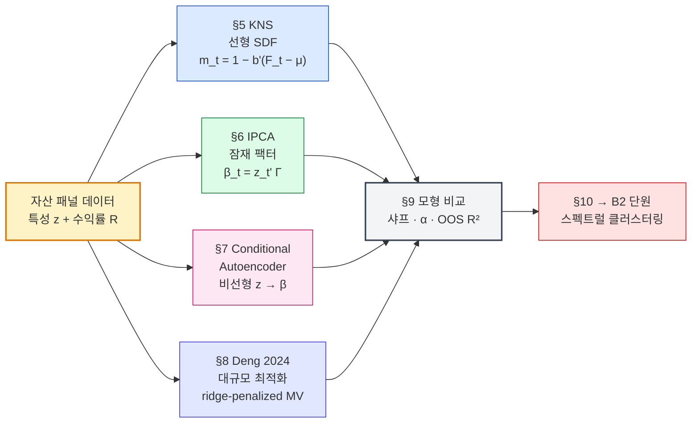
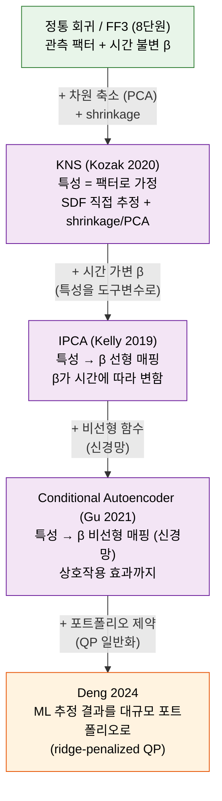

# B1단원: 머신러닝 기반 자산가격결정 — KNS · IPCA · CA · Deng

> **이 단원의 위치**: AI 수학·ML 트랙의 두 번째 단원. A1에서 닦은 선형대수와 이차최적화 도구를 자산가격결정의 머신러닝 추정에 적용한다.
>
> **작성 상태**: 강의 슬라이드 [l6.pdf]를 기반으로 한 **1차 작성본**. 강의 녹취가 들어오면 비유와 직관 설명을 추가 보강할 예정.

---

## 1. 왜? — 이 단원을 배우는 이유

### 1-1. 6~8단원에서 남은 큰 질문

자산운용 트랙의 6단원에서 우리는 **확률할인인자(SDF)** 라는 개념을 배웠다.

> **SDF의 핵심 정리:** $E[m_t R_{t,i}] = 1$, $\forall i$.
>
> 즉 **모든 자산의 기대수익률은 SDF $m_t$와의 공분산으로 결정된다.**

그리고 7단원에서는 SDF의 함수 형태를 가정함으로써 팩터 모형(CAPM, FF3 등)이 만들어진다는 것을 보았다. 8단원의 FF3는 다음과 같이 SDF를 가정한 셈이다:

$$
m_t = a + b_1 \text{MKT}_t + b_2 \text{SMB}_t + b_3 \text{HML}_t
$$

여기서 본질적인 문제가 있었다:

> **SDF의 진짜 함수 형태는 알 수 없다.** 우리는 단지 그것을 어떤 팩터들의 선형 결합으로 *가정*했을 뿐이다.

자산가격결정의 근본 문제를 다시 적으면 [l6.pdf p.2]:

> "Fundamental problem in asset pricing is explaining the differences in average returns of assets. ... Estimating the SDF has been the central problem in asset pricing."

### 1-2. SDF 추정의 세 가지 어려움

l6.pdf p.3은 SDF 추정의 본질적 난점을 명시한다.

| 난점 | 의미 |
|------|------|
| 함수 형태 미지(unknown form) | $m_t$가 어떤 함수인지 사전에 알 수 없다. 시간에 따라 형태가 변할 수도 있다 |
| 변수의 다수성(many variables) | $m_t$가 사용해야 할 변수의 개수가 매우 많을 수 있다 (수백 개의 자산 특성) |
| 낮은 신호 대 잡음 비율 | 자산 가격 움직임의 대부분은 노이즈, 진짜 신호는 작다 |

이 세 난점이 **머신러닝(ML)** 의 등장 이유다. ML은 정확히 이런 문제 — 형태를 모르고, 변수가 많고, 잡음이 많은 — 를 다루는 도구다.

### 1-3. 이 단원에서 답할 4개 질문

1. **KNS (Kozak, Nagel, Santosh 2020):** SDF를 자산 특성들의 선형 결합으로 추정하면? — 정통 회귀의 ML 일반화
2. **IPCA (Kelly, Pruitt, Su 2019):** 팩터 노출을 자산 특성에 의존시키면? — PCA의 동적 일반화
3. **CA (Gu, Kelly, Xiu 2021):** 자산 특성에서 팩터 노출로의 매핑을 비선형으로 (신경망)? — IPCA의 비선형 확장
4. **Deng et al. 2024:** 이렇게 추정한 모형으로 어떻게 포트폴리오를 만들 것인가?

핵심 자료:

> **[1] Kozak, Nagel & Santosh (2020). "Shrinking the cross-section." *Journal of Financial Economics*, 135(2), 271-292.**
>
> **[2] Kelly, Pruitt & Su (2019). "Characteristics are covariances: A unified model of risk and return." *Journal of Financial Economics*, 134(3), 501-524.**
>
> **[3] Gu, Kelly & Xiu (2021). "Autoencoder asset pricing models." *Journal of Econometrics*, 222(1), 429-450.**
>
> **[4] Deng et al. (2024). "A Unified Framework for Fast Large-Scale Portfolio Optimization." *Data Science in Science*, 3(1).**

> **이 단원은 강의 녹취가 아직 들어오지 않은 상태로 작성됐다. 슬라이드 [l6.pdf]가 본 단원의 1차 자료.**

---

## 2. 단원 흐름도

### 2-1. 큰 그림 — ML 자산가격결정 워크플로우



→ **하나의 자산 데이터**에서 **네 가지 ML 접근**으로 SDF/팩터를 추정하고,
  **공통 평가 기준**(샤프·α·아웃샘플 R²)으로 비교한 뒤, B2단원의 자산 군집화로 이어진다.

### 2-2. 자세한 단계별 흐름

```
┌──────────────────────────────────────────────────────────────────────────┐
│                         B1단원 전체 로드맵                                │
├──────────────────────────────────────────────────────────────────────────┤
│  §1  왜? → SDF 추정의 세 난점 → ML이 답이다                              │
│       │                                                                  │
│       ▼                                                                  │
│  §3~4 가정 / 기호 사전                                                    │
│       │                                                                  │
│       ▼                                                                  │
│  §5  KNS — 특성 기반 SDF                                                 │
│       ├─ m_t = 1 − b'(F_t − E[F_t])                                     │
│       ├─ b̂ = Σ⁻¹ μ (정통 추정)                                          │
│       └─ Shrinkage / PCA-based 변형                                     │
│       │                                                                  │
│       ▼                                                                  │
│  §6  IPCA — 동적 팩터 노출                                              │
│       ├─ R_{i,t+1} = α_{i,t} + β_{i,t}' f_{t+1} + ε                     │
│       ├─ β_{i,t} = z_{i,t}' Γ_β (특성에 의존)                           │
│       ├─ Γ_α = 0 가설 (특성이 알파를 만들지 않는가?)                     │
│       └─ 추정: alternating least squares                                │
│       │                                                                  │
│       ▼                                                                  │
│  §7  Conditional Autoencoder — 비선형 노출                              │
│       ├─ 신경망으로 z → β의 비선형 매핑                                  │
│       ├─ 양변 인코딩: 좌변(특성→베타), 우변(수익률→팩터)                │
│       └─ 학습: 훈련/검증/테스트 분할 + 정규화 + SGD                     │
│       │                                                                  │
│       ▼                                                                  │
│  §8  Deng 2024 — ML 자산가격모형 → 대규모 포트폴리오 최적화             │
│       ├─ ridge-penalized minimum variance                              │
│       ├─ shrinkage vs factor-based 추정                                 │
│       └─ 다양한 제약 (long-only, turnover, factor neutrality)           │
│       │                                                                  │
│       ▼                                                                  │
│  §9  네 모형의 비교와 위계                                              │
│       │                                                                  │
│       ▼                                                                  │
│  §10 그래서? → B2단원으로                                                │
│       │                                                                  │
│       ▼                                                                  │
│  §11 셀프체크                                                            │
└──────────────────────────────────────────────────────────────────────────┘
```

---

## 3. 가정과 전제

| # | 가정 | 의미 |
|---|------|------|
| 1 | 무차익(no-arbitrage) | 위험 없이 확실한 이득은 없다. 6~7단원의 가정 그대로 |
| 2 | SDF의 존재 | 어떤 형태로든 $E[m_t R_{t,i}] = 1$을 만족하는 $m_t$가 존재 |
| 3 | 자산 특성으로의 사상 가능성 | 자산을 그 특성(market cap, B/M, profitability, ...)으로 표현할 수 있다 |
| 4 | 충분한 데이터 | 시계열 길이 $T$, 자산 수 $N$, 특성 수 $L$ 모두 통계적 추정에 충분 |
| 5 | 특성의 정규화 가능 | 각 특성을 [-1, 1] 또는 [-0.5, 0.5] 범위로 변환할 수 있다 (rank normalization) |
| 6 | (CA에서 추가) 비선형 매핑 가능성 | 자산 특성 → 팩터 노출의 매핑이 신경망으로 표현될 만큼 충분히 부드럽다 |
| 7 | (CA에서 추가) 충분한 GPU/계산 자원 | 대규모 신경망 학습이 가능 |

---

## 4. 기호 사전

| 기호 | 의미 |
|------|------|
| $R_{i,t+1}$ | 자산 $i$의 $t+1$ 시점 수익률 |
| $r_{i,t+1}$ | 초과수익률 ($R_{i,t+1} - R_f$) |
| $m_t$ | 확률할인인자(SDF) — 6단원의 $m_t$와 동일 개념 |
| $F_t$ | 팩터 수익률 벡터 (길이 $K$) |
| $f_t$ | 잠재(latent) 팩터 벡터 |
| $z_{i,t}$ | 자산 $i$의 시점 $t$에서의 **특성 벡터** (길이 $L$) — market cap, B/M 등 |
| $\beta_{i,t}$ | 자산 $i$의 시점 $t$ 팩터 노출 (길이 $K$) |
| $\alpha_{i,t}$ | 자산 $i$의 알파 |
| $\Gamma_\beta$ | $L \times K$ 매핑 행렬 — 특성에서 팩터 노출로 |
| $\Gamma_\alpha$ | $L \times 1$ 매핑 벡터 — 특성에서 알파로 |
| $\Sigma$ | 팩터 또는 자산 수익률의 공분산 행렬 |
| $\hat\Sigma$ | $\Sigma$의 추정치 |
| $b$ | KNS의 SDF 계수 벡터 |
| $L, K, N, T$ | 특성 수, 팩터 수, 자산 수, 시점 수 |
| $W^{(l)}, b^{(l)}$ | 신경망의 $l$번째 층의 가중치와 편향 |
| $g(\cdot), \tilde g(\cdot)$ | 신경망의 활성함수 |
| ridge penalty | $\lambda \|w\|^2$ — L2 정규화 |
| AE | Autoencoder, 자기부호기 |

---

## 5. KNS — 특성 기반 SDF (Kozak, Nagel & Santosh 2020)

### 5-1. SDF의 매개변수화

KNS의 출발점은 SDF를 다음과 같이 표현하는 것이다.

$$
m_t = 1 - b_{t-1}'(R_t - E[R_t])
$$

각 기호의 의미:

- $R_t$ = $N$차원 초과수익률 벡터 (자산 $N$개)
- $b_{t-1}$ = 시점 $t-1$의 SDF 계수 벡터 (길이 $N$)
- $b_{t-1}' (R_t - E[R_t])$ = 평균을 뺀 수익률에 가중치 $b$를 적용한 선형 결합

> **의미:** SDF는 "1에서 평균 대비 수익률 변동분의 가중합을 뺀" 형태로 가정된다. $E[m_t] = 1/R_f$가 자동으로 성립한다.

### 5-2. 특성으로 매개변수화

$b_{t-1}$을 자산 특성으로 표현:

$$
b_{t-1} = Z_{t-1} b
$$

각 기호:

- $Z_{t-1} \in \mathbb{R}^{N \times K}$ = 시점 $t-1$의 자산 특성 행렬. 행 $i$, 열 $j$에 자산 $i$의 특성 $j$ 노출
- $b \in \mathbb{R}^K$ = 미지의 SDF 계수 (특성 차원)

이걸 (5-1) 식에 넣으면:

$$
m_t = 1 - b'(F_t - E[F_t])
$$

여기서 $F_t = Z_{t-1}' R_t$는 **특성으로 매개된 팩터 수익률** (길이 $K$).

> **핵심 가정 (l6.pdf p.5):** *"Assumes characteristic equals factor."* 즉 **자산 특성이 곧 팩터**라고 본다.

### 5-3. SDF 계수의 추정

$E[m_t F_t] = 0$을 사용하면 (식 도출은 [l6.pdf p.5]):

$$
b = \Sigma^{-1} E[F_t]
$$

여기서 $\Sigma$ = 팩터 공분산 행렬 ($K \times K$).

표본 추정:

$$
\hat\mu = \frac{1}{T}\sum_t F_t, \qquad \hat\Sigma = \frac{1}{T}\sum_t (F_t - \hat\mu)(F_t - \hat\mu)'
$$

$$
\hat b = \hat\Sigma^{-1} \hat\mu
$$

### 5-4. 정통 추정의 문제

> **결정적 난점 (l6.pdf p.6):**
>
> - $K$가 $T$에 비해 크지 않으면(즉 $K \ll T$) 추정이 매우 부정확
> - $K$가 크면 회귀가 **과적합(overfit)** → 표본 외 성능이 나쁨

이는 **shrinkage**와 **정규화(regularization)** 의 등장 이유다.

### 5-5. PCA 기반 KNS

해결책 1: **주성분 기반 팩터** [l6.pdf p.7]

$\Sigma$의 고유값 분해 (A1단원의 §7-4):

$$
\Sigma = Q D Q'
$$

여기서 $Q$는 정규직교 고유벡터 행렬, $D$는 대각 고유값 행렬.

PC 팩터 정의:

$$
P_t = Q' F_t
$$

이렇게 변환된 PC 팩터는 서로 직교 → 상위 몇 개 PC만 사용해 추정 → **차원 축소**. 이게 자산가격결정에서 PCA가 ML과 만나는 첫 지점이다.

### 5-6. KNS의 특징

> **KNS는 "특성 = 팩터"라는 가정 위에 SDF를 직접 추정**한다. 추정 잡음을 줄이려면 PCA나 ridge 같은 regularization이 필수다.

7단원의 PCA를 SDF 추정에 직접 적용한 것이라 볼 수 있다.

---

## 6. IPCA — Instrumented PCA (Kelly, Pruitt & Su 2019)

### 6-1. 동기

KNS의 결정적 한계: **특성이 곧 팩터**라는 가정. 그러나 현실에서는

> **자산 특성이 *직접* 팩터가 아니라, *팩터 노출*에 영향을 미치는 측면이 더 자연스럽다.**

예를 들어 시가총액(특성)은 그 자체가 팩터가 아니라, "사이즈 팩터에 대한 노출의 크기"를 결정하는 변수에 가깝다.

이게 IPCA의 핵심 아이디어. "Instrumented PCA"라는 이름은 자산 특성을 **도구 변수(instrument)** 로 사용한다는 뜻.

### 6-2. 모형 정식화

$$
R_{i,t+1} = \alpha_{i,t} + \beta_{i,t}' f_{t+1} + \varepsilon_{i,t+1}
$$

여기서 핵심:

$$
\alpha_{i,t} = z_{i,t}' \Gamma_\alpha + \nu_{\alpha,i,t}
$$

$$
\beta_{i,t} = z_{i,t}' \Gamma_\beta + \nu_{\beta,i,t}
$$

각 기호:

- $z_{i,t} \in \mathbb{R}^L$ = 자산 $i$의 시점 $t$ **관측 가능 특성 벡터** (instrument)
- $\Gamma_\beta \in \mathbb{R}^{L \times K}$ = 특성에서 팩터 노출로의 선형 매핑
- $\Gamma_\alpha \in \mathbb{R}^{L \times 1}$ = 특성에서 알파로의 매핑
- $\nu$ = 미설명 잡음

### 6-3. 두 가지 핵심 가설

**가설 1: $\Gamma_\alpha = 0$**

> 특성이 알파(즉, 팩터로 설명되지 않는 초과수익)에 영향을 주지 않는다. 즉 모든 알파가 팩터 노출의 차이로 환원된다.

이 경우 모형:

$$
R_{i,t+1} = z_{i,t}' \Gamma_\beta f_{t+1} + \varepsilon^*_{i,t+1}
$$

**가설 2: $\Gamma_\alpha \neq 0$**

> 특성이 알파를 만든다. 즉 "이상현상(anomaly)"이 존재한다.

가설 1이 자산가격결정 모형의 "효율성"을 뜻하고, 가설 2는 "비효율성·이상현상"을 뜻한다. IPCA는 두 가설을 비교 검증할 수 있게 해준다.

### 6-4. 추정: Alternating Least Squares

벡터 형태로 다시 쓰면:

$$
R_{t+1} = Z_t \Gamma_\beta f_{t+1} + \varepsilon^*_{t+1}
$$

여기서 $R_{t+1} \in \mathbb{R}^N$, $Z_t \in \mathbb{R}^{N \times L}$.

목적함수 (잔차제곱합 최소화):

$$
\min_{\Gamma_\beta, \, f} \sum_{t=1}^{T-1} (R_{t+1} - Z_t \Gamma_\beta f_{t+1})' (R_{t+1} - Z_t \Gamma_\beta f_{t+1})
$$

이건 **닫힌 해가 없다**. 미지수 $\Gamma_\beta$와 $f_{t+1}$이 곱해져 있기 때문.

해법: **alternating least squares** (교대 최소제곱)

1. $\Gamma_\beta$ 고정 → $f$를 최적화 (이는 일반 최소제곱)
2. $f$ 고정 → $\Gamma_\beta$를 최적화 (이도 일반 최소제곱)
3. 수렴할 때까지 반복

각 단계가 A1단원에서 본 이차 최적화 → $X^t X \beta = X^t y$ 형식의 정상방정식.

### 6-5. 관측 가능 팩터 vs IPCA 잠재 팩터

IPCA의 흥미로운 응용은 기존 알려진 팩터(MKT, SMB, HML 등)와 **잠재 팩터(latent factor)** 의 비교다 [l6.pdf p.16]:

$$
R_{i,t+1} = \beta_{i,t}' f_{t+1} + \delta_{i,t}' g_{t+1} + \varepsilon
$$

여기서 $g_t$는 관측 가능 팩터, $\delta_{i,t} = z_{i,t}'\Gamma_\delta + \nu$. 가설 검정:

$$
H_0: \Gamma_\delta = 0 \quad \text{vs} \quad H_1: \Gamma_\delta \neq 0
$$

> **만약 $H_0$을 기각할 수 없으면, 관측 가능 팩터(예: FF3)는 IPCA 잠재 팩터로 완전히 대체 가능하다.** Kelly et al.(2019)은 5개 IPCA 팩터가 거의 모든 표준 팩터보다 우수함을 보였다.

### 6-6. IPCA의 의미

> **IPCA는 7단원 PCA의 "동적 일반화"다.**

- PCA: 시간 불변 베타 ($\beta_i$가 고정)
- IPCA: 시간 가변 베타 ($\beta_{i,t} = z_{i,t}'\Gamma_\beta$)

자산 특성이 시간에 따라 변하는 만큼, 베타도 시간에 따라 변한다. 이게 더 현실적인 모형.

### 6-7. 평가: Total $R^2$ vs Predictive $R^2$

[l6.pdf p.18~19]는 두 종류의 $R^2$를 정의한다.

**Total $R^2$:**

$$
R^2_{\text{total}} = 1 - \frac{\sum_{i,t} (R_{i,t+1} - z_{i,t}'(\hat\Gamma_\alpha + \hat\Gamma_\beta \hat f_{t+1}))^2}{\sum_{i,t} R^2_{i,t+1}}
$$

이는 **현재 시점의 팩터 실현치($\hat f_{t+1}$)를 알고 나서 모형이 얼마나 잘 설명하는지**.

**Predictive $R^2$:**

$$
R^2_{\text{pred}} = 1 - \frac{\sum_{i,t} (R_{i,t+1} - z_{i,t}'(\hat\Gamma_\alpha + \hat\Gamma_\beta \hat\lambda))^2}{\sum_{i,t} R^2_{i,t+1}}
$$

여기서 $\hat\lambda$는 시점 $t$까지의 팩터 평균. 이는 **미래 수익률의 진짜 예측력**을 측정.

> **두 $R^2$의 차이는 "fitting"과 "forecasting"의 차이다.** 자산운용에서 더 중요한 것은 후자 — 사후 fitting이 아닌 사전 forecasting.

---

## 7. Conditional Autoencoder — 비선형 노출 (Gu, Kelly & Xiu 2021)

### 7-1. IPCA의 한계

IPCA는 자산 특성에서 팩터 노출로의 **선형 매핑**을 가정한다 ($\beta_{i,t} = z_{i,t}'\Gamma_\beta$).

> **현실에서 그 매핑이 비선형이라면? 예를 들어 시가총액이 매우 작을 때만 사이즈 효과가 강하고, 중간 이상에서는 효과가 거의 없다면? 또는 두 특성의 상호작용(예: 작은 시총 × 높은 모멘텀)이 별도 효과를 낸다면?**

이를 처리하는 도구가 **Conditional Autoencoder (CA)** [l6.pdf p.20].

### 7-2. Autoencoder란?

> **Autoencoder**: 입력을 저차원 공간으로 압축한 뒤(인코딩) 다시 복원(디코딩)하는 신경망. 그 압축 과정에서 가장 핵심적인 정보만 남는다.

A1단원에서 본 PCA가 선형 autoencoder의 특수 경우다.

> **비유: 사진의 극단적 축소**
>
> 1메가픽셀 사진을 100픽셀로 줄였다 다시 1메가로 복원한다고 하자. 100픽셀에 모든 정보를 넣을 수 없으니, **가장 핵심적인 윤곽만 살아남는다**. CA는 이 사상을 자산수익률에 적용한 것.

### 7-3. 베이스 케이스: 선형 1층 Autoencoder

수익률을 그 자신으로 사상:

$$
r_t = b^{(1)} + W^{(1)}\left(b^{(0)} + W^{(0)} r_t\right) + u_t
$$

여기서:
- $W^{(0)} \in \mathbb{R}^{K \times N}$ = 인코더 (수익률을 $K$차원 팩터로 압축)
- $W^{(1)} \in \mathbb{R}^{N \times K}$ = 디코더 ($K$차원 팩터를 다시 $N$ 자산으로 복원)

학습 목적함수:

$$
\min_{b, W} \sum_{t=1}^T \left\|r_t - (b^{(1)} + W^{(1)}(b^{(0)} + W^{(0)} r_t))\right\|^2
$$

이건 PCA로도 풀 수 있는 문제 — $W^{(0)}$이 $\Sigma$의 상위 $K$개 고유벡터일 때 최적.

### 7-4. Conditional Autoencoder 구조

CA는 **두 갈래 구조** [l6.pdf p.23~24]:

**왼쪽 (Beta Network):** 자산 특성 → 팩터 노출 (비선형)

$$
z^{(0)}_{i,t-1} = z_{i,t-1}
$$

$$
z^{(l)}_{i,t-1} = g\left(b^{(l-1)} + W^{(l-1)} z^{(l-1)}_{i,t-1}\right), \quad l = 1, \ldots, l_\beta
$$

$$
\beta_{i,t-1} = b^{(l_\beta)} + W^{(l_\beta)} z^{(l_\beta)}_{i,t-1}
$$

여기서 $g(\cdot)$는 비선형 활성함수 (ReLU, tanh 등).

**오른쪽 (Factor Network):** 수익률 → 팩터

$$
r^{(0)}_t = r_t
$$

$$
r^{(l)}_t = \tilde g\left(\tilde b^{(l-1)} + \tilde W^{(l-1)} r^{(l-1)}_t\right), \quad l = 1, \ldots, l_f
$$

$$
f_t = \tilde b^{(l_f)} + \tilde W^{(l_f)} r^{(l_f)}_t
$$

**최종 모형:** $r_{i,t} = \beta_{i,t-1}' f_t + u_{i,t}$

### 7-5. IPCA에서 CA로의 일반화

| 모형 | $z \to \beta$ 매핑 |
|------|------|
| IPCA | 선형 ($\beta = z'\Gamma_\beta$) |
| CA | 비선형 (신경망) |

IPCA는 CA의 특수 경우 — Beta Network에 활성함수가 없고 한 층만 있는 경우.

### 7-6. 차원 축소 트릭

CA는 $N \approx 30,000$개 기업과 $T \approx 720$개 시점이라는 데이터 비대칭 문제를 만난다 [l6.pdf p.24]. 직접 다루기 어렵다.

**해결책 [l6.pdf p.25~26]:** 자산 수익률 $r_t$를 그대로 쓰지 않고, **특성 기반 포트폴리오**로 변환.

$z'_{i,t} x_t = r_{i,t}$ 라는 방정식에 최소제곱해를 적용:

$$
x_t = (Z'_{t-1} Z_{t-1})^{-1} Z'_{t-1} r_t
$$

이때 $x_t \in \mathbb{R}^P$ (특성 수)는 **각 특성에 따라 정렬한 long-short 포트폴리오의 수익률**.

> **결과:** 데이터를 $30000 \times 720$ → $P \times 720$로 축소 (P = 약 100). 차원 문제 해결.

### 7-7. 학습 절차

[l6.pdf p.27]:

1. 시계열을 **훈련 / 검증 / 테스트** 셋으로 분할
2. 손실 함수에 정규화 추가:
   $$L(\theta) = \frac{1}{NT}\sum_t \sum_i \|r_{i,t} - \beta_{i,t-1}' f_t\|^2 + \phi(\theta)$$
3. **확률적 경사하강법(SGD)** 으로 최적화
4. 검증 셋으로 하이퍼파라미터 튜닝
5. 테스트 셋으로 표본 외 성능 평가

> **이 모든 도구(SGD, regularization, train/validation/test split)는 표준 ML 방법론.** 자산가격결정에 ML 기법이 본격 도입되는 사례.

---

## 8. Deng et al. 2024 — 대규모 포트폴리오 최적화

### 8-1. 동기

KNS, IPCA, CA로 자산수익률의 평균과 공분산을 ML로 추정했다고 하자. 이걸로 어떻게 실제 포트폴리오를 만들 것인가?

이게 Deng et al. (2024)의 주제 [l6.pdf p.29].

### 8-2. 전통적 추정법

> 전통적인 평균·공분산 추정법 두 가지:
>
> - **Shrinkage 기반:** Ledoit-Wolf, Bayesian shrinkage (5단원의 보강 부분과 연결)
> - **Factor model 기반:** 자산가격결정 모형으로 $\hat\mu, \hat\Sigma$ 추정 (KNS·IPCA·CA가 여기에 들어감)

### 8-3. 포트폴리오 제약 [l6.pdf p.30]

실제 포트폴리오는 다양한 제약을 갖는다.

| 제약 | 수학적 표현 |
|------|------|
| Long only | $w \ge 0$ |
| Turnover | $|\Delta w_i| \le U_i$ |
| Benchmark exposure | $\|w - w_B\|_1 \le U_B$ |
| 팩터 노출 한도 | $\left|\sum_i \beta_{i,k} w_i\right| \le U_k$ |
| 팩터 중립 | $\sum_i \beta_{i,k} w_i = 0$ |

이 모든 제약은 **선형(또는 L1 거리)** 형태. 따라서 이차 목적함수와 결합하면 표준 QP 또는 SOCP가 된다.

### 8-4. Ridge-Penalized 최소분산 [l6.pdf p.31]

대표적 최적화 문제:

$$
w^* = \arg\min_w w' \Sigma w + \lambda \|w\|_2^2
$$

여기서 $\lambda \ge 0$은 정규화 강도.

A1단원의 도구로 풀 수 있다. $\Sigma = P\Lambda P'$ (고유값 분해)라 두면:

$$
w' \Sigma w + \lambda \|w\|^2 = w' \tilde\Sigma w
$$

여기서 $\tilde\Sigma = P(\Lambda + \lambda I) P'$. 즉 **모든 고유값이 $\lambda$만큼 위로 이동**한 행렬.

> **핵심 관찰:** ridge penalty는 공분산 행렬의 작은 고유값(불안정한 방향)을 더 크게 만들어 추정 안정성을 높이는 효과.

이건 5단원의 Shrinkage(Ledoit-Wolf)와 본질적으로 같은 사상이다. 형태만 다르다.

### 8-5. 최대 샤프 비율 포트폴리오 [l6.pdf p.33]

$$
\arg\max_{w \in W(V)} \frac{w'\hat\mu - r_f}{\sqrt{w'\hat\Sigma w}}
$$

여기서 $V \in \mathbb{R}^{N \times K}$는 **개별 자산과 ML 팩터 사이의 매핑**.

| 모형 | $V$의 정의 |
|------|------|
| 직접 자산 | $V = I$ (단위행렬) |
| PCA | $V = $ 상위 $K$개 PCA 고유벡터 |
| IPCA | $V = (\Gamma_\beta' Z_t' Z_t \Gamma_\beta)^{-1} \Gamma_\beta' Z_t'$ — 즉 IPCA가 추정한 매핑 |

> **핵심:** ML로 $\hat\mu, \hat\Sigma$를 잘 추정하면, 그 결과로 만든 포트폴리오의 샤프 비율도 개선된다.

---

## 9. 네 모형의 비교와 위계

### 9-1. 위계 구조



> **각 단계가 추가하는 것 한 줄로:**
> - **KNS**: 자산 특성을 직접 팩터로 받아들이되 추정 잡음을 shrinkage로 다스린다
> - **IPCA**: 특성이 팩터 자체가 아니라 **팩터 노출(β)** 의 결정인자라는 시각으로 전환
> - **CA**: 그 결정인자에서 β로의 매핑을 **비선형(신경망)** 으로 일반화
> - **Deng**: 위 모형들이 추정한 평균·공분산을 받아 **실제 운용 가능한 포트폴리오**로 변환

### 9-2. 모형 간 비교표

| 모형 | 자산 특성의 역할 | 팩터의 정체 | 매핑 형태 | 추정 방법 |
|------|------|------|------|------|
| KNS | 팩터 그 자체 | 자산 특성 | 직접 | 선형 회귀 + shrinkage |
| IPCA | 팩터 노출의 결정인자 | 잠재 팩터 | 선형 ($\Gamma_\beta$) | Alternating LS |
| CA | 팩터 노출의 결정인자 | 잠재 팩터 | 비선형 (신경망) | SGD |
| Deng | (위 모형의 출력 사용) | (사용한 모형에 따름) | (사용한 모형에 따름) | QP/SOCP |

### 9-3. 어떤 모형을 쓸 것인가?

**원칙적으로:**

- 데이터가 적고 해석 가능성이 중요할 때 → **KNS** (정통 회귀에 가까움)
- 시간 가변 노출이 중요한데 비선형성은 부차적일 때 → **IPCA**
- 비선형 / 상호작용 효과가 의심될 때 + 데이터가 충분 → **CA**
- 위 모형으로 추정한 결과를 실제 포트폴리오에 적용 → **Deng**

**실증적으로:**

Kelly et al.(2019)은 IPCA가 5팩터로도 FF5보다 우수한 설명력을 보였다고 보고. Gu et al.(2021)은 CA가 IPCA보다 추가적인 설명력 향상을 보였다고 보고.

> **단, ML 모형은 "샘플 외" 성능을 항상 검증해야 한다.** 과적합의 위험이 정통 회귀보다 훨씬 크기 때문.

---

## 10. 그래서? — B2단원으로

이번 단원에서 우리가 얻은 것:

1. SDF 추정의 세 난점(미지의 함수 형태, 다수의 변수, 낮은 신호-잡음 비율)이 ML의 등장 동기
2. KNS: 특성을 팩터로 보고 SDF를 직접 추정 + shrinkage/PCA
3. IPCA: 특성으로 팩터 노출을 매개 — 7단원 PCA의 동적 일반화
4. CA: IPCA의 비선형 일반화 — 신경망으로 임의 함수형태
5. Deng 2024: ML로 추정한 모형으로 대규모 포트폴리오 최적화

이 모든 작업의 공통 기반은:

- A1단원의 선형대수 (고유값 분해, 양정부호, 이차 최적화)
- 자산을 어떤 형태의 **그래프 또는 행렬**로 표현하는 능력

마지막 도구 — 자산들의 **관계망(그래프)** 자체를 가지고 클러스터를 찾는 방법 — 이 다음 단원의 주제다.

→ **B2단원: 스펙트럴 클러스터링 — 그래프 라플라시안과 자산 분류**

---

## 11. 셀프체크

1. **SDF 추정의 세 난점을 한 문장씩 설명하라.** 이 셋이 왜 정통 회귀가 아닌 ML을 요구하는지를 연결하라.

2. **KNS에서 "특성이 곧 팩터"라는 가정의 의미는 무엇인가?** 이 가정이 왜 강한가? IPCA는 이 가정을 어떻게 완화하는가?

3. **IPCA의 추정 방정식에 닫힌 해가 없는 이유를 한 줄로 설명하라.** Alternating LS가 그것을 어떻게 우회하는가?

4. **IPCA의 가설 검정 $H_0: \Gamma_\alpha = 0$ vs $H_1: \Gamma_\alpha \neq 0$의 자산가격결정적 의미는?**

5. **CA에서 자산 수익률 $r_t$ 대신 특성 기반 포트폴리오 $x_t = (Z'_{t-1} Z_{t-1})^{-1} Z'_{t-1} r_t$를 쓰는 이유는?** 이 변환이 어떤 차원 문제를 해결하는가?

6. **Total $R^2$ 와 Predictive $R^2$의 차이를 설명하라.** 자산운용 실무에서 어느 쪽이 더 중요한가? 왜?

7. **Ridge-Penalized 최소분산에서 ridge penalty가 공분산 행렬의 고유값에 미치는 효과를 §8-4의 분해로 설명하라.** 이게 5단원의 Shrinkage(Ledoit-Wolf)와 어떤 점에서 같은 사상인가?

8. **CA의 신경망 학습에서 SGD, regularization, train/validation/test split이 모두 등장한다.** 각각이 어떤 ML의 일반적 문제를 다루는지 한 문장씩 설명하라.

9. **KNS, IPCA, CA의 위계 구조를 §9-1의 그림으로 설명하고, 각 단계마다 추가된 일반화가 무엇인지 명시하라.**

10. **자산운용 실무자가 ML 자산가격모형을 채택할 때 가장 경계해야 할 것은 무엇인가?** 왜 정통 회귀보다 더 위험한가?

---

## 출처 / 참고

- 강의 슬라이드 [l6.pdf, pages 1~34] — 본 단원의 1차 자료
- **Kozak, S., Nagel, S., & Santosh, S. (2020). Shrinking the cross-section. *Journal of Financial Economics*, 135(2), 271–292.**
- **Kelly, B. T., Pruitt, S., & Su, Y. (2019). Characteristics are covariances: A unified model of risk and return. *Journal of Financial Economics*, 134(3), 501–524.**
- **Gu, S., Kelly, B., & Xiu, D. (2021). Autoencoder asset pricing models. *Journal of Econometrics*, 222(1), 429–450.**
- **Deng et al. (2024). A Unified Framework for Fast Large-Scale Portfolio Optimization. *Data Science in Science*, 3(1), 2295539.**
- 6단원 (SDF, 자산가격결정), 7단원 (팩터 모형, PCA), 8단원 (FF3), A1단원 (선형대수와 이차최적화)

---

> **⚠ 작성 상태 노트**: 이 단원은 강의 녹취가 들어오기 전 슬라이드 [l6.pdf]만으로 작성된 1차 골격이다. 강의 녹취가 도착하면 다음 부분이 보강 예정:
>
> - 교수님의 직관적 비유 (특히 신경망의 동작)
> - 각 모형의 실증 결과 표·그래프 해석
> - "이렇게 봐야 한다"는 강의실 어조의 강조 포인트
> - 학생들이 헷갈려하는 지점에 대한 추가 설명
