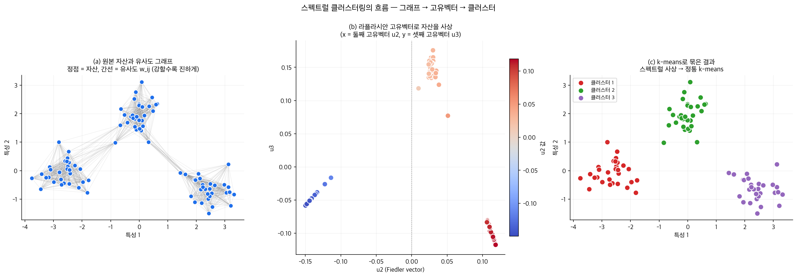
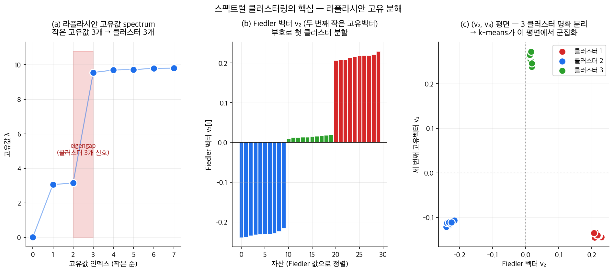

# B2단원: 스펙트럴 클러스터링 — 그래프 라플라시안과 자산 분류

> **이 단원의 위치**: AI 수학·ML 트랙의 마지막 단원. A1의 선형대수 도구로 자산들의 관계망을 분석한다.
>
> **작성 상태**: 강의 슬라이드 [l7.pdf] 기반 **1차 작성본**. 강의 녹취가 들어오면 보강 예정.

---

## 1. 왜? — 이 단원을 배우는 이유

### 1-1. 자산을 묶는다는 것

지금까지 학습서에서 우리는 자산을 어떻게 다뤘는가?

| 단원 | 자산을 본 방식 |
|------|---------|
| 1~5 | 개별 자산을 가중치로 묶어 포트폴리오 |
| 6~8 | 개별 자산의 수익률을 팩터로 분해 |
| 9~14 | 개별 자산을 특성(베타, 모멘텀, 사이즈 등)에 따라 정렬 |
| B1 | 개별 자산의 수익률을 ML로 잠재 팩터로 압축 |

이 모든 접근의 공통점은 **자산을 어떤 척도(scale)에 따라 줄세우거나 가중평균**한 것이다.

그런데 또 다른 자연스러운 질문이 있다:

> **자산들이 비슷한 것끼리 자연스럽게 묶이지 않을까? 어떤 자산들은 본질적으로 같은 그룹에 속하지 않을까?**

예를 들어:

- 한국 IT 대형주: 삼성전자, SK하이닉스, NAVER, 카카오
- 한국 금융주: KB금융, 신한지주, 하나금융, 우리금융
- 한국 자동차: 현대차, 기아, 현대모비스

이런 그룹은 **줄세우기로는 발견되지 않는다**. 대신 자산들 사이의 **관계망(그래프)** 을 분석해야 한다.

### 1-2. 클러스터링의 동기

이 그룹화는 자산운용에서 **여러 실용적 목적**을 갖는다.

| 목적 | 설명 |
|------|------|
| 분산투자 | 같은 그룹의 자산은 함께 움직이므로, 다른 그룹들에 분산해야 진짜 분산 |
| 위험 모형 | 같은 그룹은 같은 시스템 위험에 노출 |
| 페어 트레이딩 | 같은 그룹 내에서 일시적으로 격차가 벌어진 페어 발견 |
| 모멘텀·반전 분석 | 산업·국가별 모멘텀 (9단원에서 본 것처럼) |
| 이상치 탐지 | 어느 그룹에도 잘 속하지 않는 "외톨이" 자산 |

전통적 그룹화는 **외부 분류 체계**(GICS 산업분류, MSCI 국가분류 등)를 사용한다. 그러나 이는 사람이 만든 분류라 — 데이터에서 자연스럽게 드러나는 그룹과는 다를 수 있다.

> **데이터 자체가 자산들을 어떻게 묶는지 보고 싶다.** 이게 클러스터링(clustering)의 동기.

### 1-3. 스펙트럴 클러스터링이 뭐가 특별한가

전통적 클러스터링 알고리즘 중 **k-means**가 있다. 임의의 $k$개 중심을 잡고, 가까운 점들을 같은 그룹으로 묶고, 중심을 갱신하는 반복법.

문제: k-means는 **유클리드 거리**에 기반하므로, 데이터가 둥글한 모양일 때만 잘 작동한다. 길쭉하거나 휘어진 클러스터는 잘 못 잡는다.

**스펙트럴 클러스터링(Spectral Clustering)** 은 데이터의 **관계 그래프**를 만들고, 그 그래프의 **라플라시안 행렬의 고유값/고유벡터**를 사용하여 클러스터를 찾는 기법이다.

> "Spectral clustering is simple to implement, and outperforms many traditional clustering algorithms."
> [l7.pdf p.2]

핵심 도구:

- A1단원의 **고유값 분해**
- A1단원의 **양반정부호 행렬**
- 새로운 도구: **그래프 라플라시안(graph Laplacian)**

### 1-4. 이 단원에서 답할 6개 질문

1. 그래프 라플라시안 행렬은 무엇이고 왜 정의되는가?
2. 라플라시안의 고유값 0의 multiplicity가 그래프의 **연결 성분 수**와 같다는 게 무슨 뜻인가?
3. 그래프 분할 문제 (graph cut)는 왜 NP-hard인가?
4. 어떻게 그것을 고유값 문제로 **완화(relax)** 하는가?
5. 스펙트럴 클러스터링 알고리즘은 어떻게 작동하는가?
6. 자산운용에서 이 도구를 어떻게 사용할 수 있는가?

---

## 2. 단원 흐름도

```
┌──────────────────────────────────────────────────────────────────────────┐
│                         B2단원 전체 로드맵                                │
├──────────────────────────────────────────────────────────────────────────┤
│  §1  왜? → 자산을 자연스럽게 묶고 싶다                                   │
│       │                                                                  │
│       ▼                                                                  │
│  §3~4 가정 / 기호 사전                                                    │
│       │                                                                  │
│       ▼                                                                  │
│  §5  그래프와 가중치 행렬의 기초                                         │
│       │                                                                  │
│       ▼                                                                  │
│  §6  그래프 라플라시안 L = D − W 의 정의와 4가지 성질                   │
│       │                                                                  │
│       ▼                                                                  │
│  §7  Lemma 2 — 고유값 0의 multiplicity = 연결 성분의 수                  │
│       │  (스펙트럼이 그래프의 위상을 안다!)                              │
│       ▼                                                                  │
│  §8  Graph Cut 문제와 RatioCut · Ncut                                   │
│       │  (왜 NP-hard인가? 왜 완화가 필요한가?)                          │
│       ▼                                                                  │
│  §9  k=2 RatioCut의 Spectral Relaxation                                  │
│       │  (해 = L의 두 번째 작은 고유값의 고유벡터)                       │
│       ▼                                                                  │
│  §10 k>2 RatioCut의 Spectral Relaxation                                  │
│       │  (해 = L의 첫 k개 고유벡터로 만든 행렬)                          │
│       ▼                                                                  │
│  §11 Spectral Clustering 알고리즘                                       │
│       │                                                                  │
│       ▼                                                                  │
│  §12 자산운용 응용                                                       │
│       │                                                                  │
│       ▼                                                                  │
│  §13 Relaxation의 한계와 주의                                           │
│       │                                                                  │
│       ▼                                                                  │
│  §14 그래서? → 학습서 전체 회고                                         │
│       │                                                                  │
│       ▼                                                                  │
│  §15 셀프체크                                                            │
└──────────────────────────────────────────────────────────────────────────┘
```

---

## 3. 가정과 전제

| # | 가정 | 의미 |
|---|------|------|
| 1 | 자산 사이의 유사도 측정 가능 | 어떤 함수 $w_{ij} \ge 0$가 자산 $i$와 $j$의 비슷한 정도를 표현 |
| 2 | 유사도의 대칭성 | $w_{ij} = w_{ji}$ — 그래프는 무방향 |
| 3 | 무자기루프 | $w_{ii} = 0$ |
| 4 | 그래프의 클러스터 구조 존재 | 자산이 자연스럽게 몇 개의 그룹으로 나뉜다 (있다면 발견하고, 없으면 인위적 분할) |
| 5 | 클러스터 수 $k$ 사전 결정 | 보통 사용자가 지정. (자동 결정 방법도 존재) |
| 6 | A1단원의 모든 결과 | 실대칭행렬의 성질, 양반정부호, Rayleigh quotient |

---

## 4. 기호 사전

| 기호 | 의미 |
|------|------|
| $V = \{v_1, \ldots, v_n\}$ | 정점(vertex) 집합 — 자산 |
| $E$ | 간선(edge) 집합 — 자산 간 관계 |
| $G = (V, E)$ | 그래프 |
| $w_{ij}$ | 간선 $(i, j)$의 가중치 (유사도) |
| $W = (w_{ij})$ | $n \times n$ 가중치 행렬 (= 가중 인접행렬) |
| $d_i = \sum_j w_{ij}$ | 정점 $i$의 **차수(degree)** |
| $D = \text{diag}(d_1, \ldots, d_n)$ | 차수 행렬 |
| $L = D - W$ | (정규화 안 된) 그래프 라플라시안 |
| $A \subset V$ | 정점들의 부분집합 (클러스터 후보) |
| $\bar A = V \setminus A$ | $A$의 여집합 |
| $\mathbf{1}_A$ | $A$의 지시 벡터 ($v_i \in A$이면 1, 아니면 0) |
| $\mathbf{1}$ | 모든 entry가 1인 벡터 |
| $\text{cut}(A, \bar A)$ | $A$와 $\bar A$ 사이의 간선 가중치 합 |
| $|A|$ | $A$ 안의 정점 수 |
| $\text{vol}(A) = \sum_{i \in A} d_i$ | $A$의 부피(volume) — 차수 합 |
| RatioCut, Ncut | 균형 그래프 분할 목적함수 |

---

## 5. 그래프와 가중치 행렬의 기초

### 5-1. 그래프란?

> **그래프**: 정점(vertex)들의 집합 $V$와 그들 사이의 간선(edge)들의 집합 $E$로 이루어진 구조.

자산운용에 적용하면:
- 정점 = 자산
- 간선 = 두 자산이 어떤 의미에서 "관계 있음"

### 5-2. 무방향 가중 그래프

이 단원에서는 **무방향 가중 그래프**만 다룬다.

- **무방향**: 간선에 방향이 없다 ($i \to j$와 $j \to i$를 구분하지 않음)
- **가중**: 각 간선에 0 이상의 가중치가 있다

가중치는 자산 간 **유사도(similarity)** 의 강도를 나타낸다. 흔한 예시:

| 유사도 정의 | 자산운용에서의 의미 |
|------|------|
| $w_{ij} = |\rho_{ij}|$ | 수익률 상관계수의 절댓값 |
| $w_{ij} = \exp(-\|\mathbf{f}_i - \mathbf{f}_j\|^2 / 2\sigma^2)$ | 팩터 노출이 가까울수록 큰 가중치 (Gaussian kernel) |
| $w_{ij} = 1$ if same industry, else 0 | 같은 산업이면 연결 |

### 5-3. 가중치 행렬 $W$

$W$는 $n \times n$ 대칭 행렬:

$$
W = \begin{pmatrix} w_{11} & w_{12} & \cdots & w_{1n} \\ w_{21} & w_{22} & \cdots & w_{2n} \\ \vdots & \vdots & \ddots & \vdots \\ w_{n1} & w_{n2} & \cdots & w_{nn} \end{pmatrix}
$$

- 자기루프 없음: $w_{ii} = 0$
- 대칭: $w_{ij} = w_{ji}$
- 양수성: $w_{ij} \ge 0$

### 5-4. 차수와 차수 행렬

> **차수(degree):** 정점 $i$가 다른 정점들과 갖는 총 가중치 합.
>
> $$d_i = \sum_{j=1}^n w_{ij}$$

직관적으로 "자산 $i$가 얼마나 많은/강한 관계를 가지고 있는가"를 나타낸다.

> **차수 행렬:** $D = \text{diag}(d_1, d_2, \ldots, d_n)$. 대각에만 차수가 들어 있고 나머지는 0.

### 5-5. 지시 벡터

부분집합 $A \subset V$에 대해 **지시 벡터(indicator vector)** $\mathbf{1}_A$:

$$
(\mathbf{1}_A)_i = \begin{cases} 1 & v_i \in A \\ 0 & \text{otherwise} \end{cases}
$$

이건 클러스터를 수학적으로 표현하는 도구. "어떤 자산이 클러스터 $A$에 속하는가"를 0/1 벡터로 나타낸 것.

---

## 6. 그래프 라플라시안 — 정의와 핵심 성질

### 6-1. 정의

> **(정규화 안 된) 그래프 라플라시안:**
>
> $$L = D - W$$

성분으로 보면:

$$
L_{ij} = \begin{cases} d_i & i = j \\ -w_{ij} & i \neq j, \text{ 간선 있음} \\ 0 & \text{otherwise} \end{cases}
$$

### 6-2. 직관

> **비유: 흐름 보존(flow conservation)**
>
> 라플라시안을 적용한 결과 $Lf$의 $i$번째 entry는 — 정점 $i$에서 그 이웃들과의 "값 차이"를 모두 합한 것.
>
> $$
> (Lf)_i = d_i f_i - \sum_j w_{ij} f_j = \sum_{j \in N(i)} w_{ij}(f_i - f_j)
> $$
>
> 정점 $i$ 위에 함수 $f$ (예: 어떤 자산의 점수)가 있을 때, $(Lf)_i$는 **이 점수가 이웃과 얼마나 다른지**를 측정한다. 다 같으면 0, 차이가 크면 큰 값.

### 6-3. Lemma 1: 라플라시안의 4가지 성질

> **Lemma 1.** 그래프 라플라시안 $L$은 다음 성질을 만족한다.
>
> 1. 모든 $f \in \mathbb{R}^n$에 대해
>    $$f^t L f = \frac{1}{2}\sum_{i,j=1}^n w_{ij}(f_i - f_j)^2$$
>
> 2. $L$은 **대칭이고 양반정부호(symmetric and PSD)** 이다. 즉 모든 $x \neq 0$에 대해 $x^t L x \ge 0$.
>
> 3. $L$의 가장 작은 고유값은 0이고, 그에 대응하는 고유벡터는 $\mathbf{1}$ (모두 1인 벡터).
>
> 4. $L$은 음이 아닌 실수 고유값을 갖는다: $0 = \lambda_1 \le \lambda_2 \le \cdots \le \lambda_n$.

#### 증명

**성질 1의 증명.**

$f^t L f = f^t D f - f^t W f$를 펼쳐 쓴다.

첫 항:
$$
f^t D f = \sum_{i=1}^n d_i f_i^2
$$

둘째 항:
$$
f^t W f = \sum_{i,j=1}^n f_i w_{ij} f_j
$$

이제 $\sum_{i,j} w_{ij}(f_i - f_j)^2$ 를 펼쳐보자:

$$
\sum_{i,j} w_{ij}(f_i^2 - 2f_i f_j + f_j^2)
$$

$$
= \sum_{i,j} w_{ij} f_i^2 - 2\sum_{i,j}w_{ij}f_i f_j + \sum_{i,j}w_{ij}f_j^2
$$

대칭성 $w_{ij} = w_{ji}$로 첫째와 셋째 항이 같음:

$$
\sum_{i,j}w_{ij}f_i^2 = \sum_i f_i^2 \sum_j w_{ij} = \sum_i d_i f_i^2 = f^t D f
$$

따라서:

$$
\sum_{i,j} w_{ij}(f_i - f_j)^2 = 2 f^t D f - 2 f^t W f = 2(f^t L f)
$$

양변을 2로 나누면 성질 1.

**성질 2의 증명.**

대칭성: $L^t = (D - W)^t = D - W = L$ ($D$, $W$가 모두 대칭).

PSD: 성질 1에서 $f^t L f = \frac{1}{2}\sum w_{ij}(f_i-f_j)^2 \ge 0$. (모든 항이 비음수.)

**성질 3의 증명.**

$\mathbf{1}$의 모든 entry가 같으므로 $f_i = f_j = 1$ → $\sum w_{ij}(f_i - f_j)^2 = 0$ → $\mathbf{1}^t L \mathbf{1} = 0$.

또 $L\mathbf{1} = D\mathbf{1} - W\mathbf{1}$. $D\mathbf{1}$의 $i$번째 entry는 $d_i$. $W\mathbf{1}$의 $i$번째 entry는 $\sum_j w_{ij} = d_i$. 따라서 $L\mathbf{1} = 0$.

이건 $\mathbf{1}$이 고유값 0의 고유벡터임을 의미.

**성질 4의 증명.**

성질 2에서 PSD → 모든 고유값 ≥ 0 (A1단원 §10-3). 성질 3에서 0이 고유값. 따라서 가장 작은 고유값 = 0.

**증명 끝.**

### 6-4. 의미

> **라플라시안 $L$의 고유값 분해는 그래프의 구조 정보를 가장 압축적으로 담는다.**

특히 0 고유값은 항상 존재한다 ($\mathbf{1}$이 고유벡터). 그런데 0 고유값이 **여러 개**일 수도 있다. 이 multiplicity가 매우 중요한 의미를 갖는다.

---

## 7. Lemma 2 — 0 고유값의 multiplicity = 연결 성분 수

### 7-1. 정리

> **Lemma 2.** 무방향 그래프 $G$에서, 라플라시안 $L$의 고유값 0의 **multiplicity** $k$는 그래프의 **연결 성분(connected component) 의 수와 같다**.
>
> 또한 그 0 고유값의 고유공간(eigenspace)은 각 연결 성분의 지시 벡터들 $\mathbf{1}_{A_1}, \ldots, \mathbf{1}_{A_k}$ 로 생성(span)된다.

이게 스펙트럴 클러스터링의 **이론적 핵심**이다.

### 7-2. 증명 — k=1인 경우 (그래프가 연결)

$f$가 고유값 0의 고유벡터라 하자. 그러면 $L f = 0$ → $f^t L f = 0$ → 성질 1에 의해

$$
\frac{1}{2}\sum_{i,j} w_{ij}(f_i - f_j)^2 = 0
$$

모든 항이 비음수이므로, 합이 0이려면 **모든 항이 0**이어야 함.

따라서 $w_{ij} > 0$인 모든 $(i, j)$ 쌍에 대해 $f_i = f_j$.

연결된 그래프에서는 임의의 두 정점 사이에 경로가 있다 → 그 경로상의 모든 정점들의 $f$ 값이 같다 → **$f$의 모든 entry가 같다** → $f$는 $\mathbf{1}$의 상수배.

따라서 0의 고유공간은 1차원, multiplicity = 1. 이는 연결 성분 수 = 1과 일치.

### 7-3. 증명 — k>1인 경우 (여러 연결 성분)

정점들을 연결 성분 순서대로 정렬하면, 가중치 행렬 $W$는 **블록 대각 형태**가 된다:

$$
W = \begin{pmatrix} W_1 & 0 & \cdots \\ 0 & W_2 & \cdots \\ \vdots & & \ddots \end{pmatrix}
$$

따라서 라플라시안도 블록 대각:

$$
L = \begin{pmatrix} L_1 & & \\ & L_2 & \\ & & \ddots \end{pmatrix}
$$

각 $L_i$는 $i$번째 연결 성분에 해당하는 라플라시안. 각 $L_i$는 자체로 연결 그래프의 라플라시안 → 0 고유값 multiplicity = 1.

블록 대각의 스펙트럼은 각 블록 스펙트럼의 합집합 → $L$의 0 고유값 multiplicity = 연결 성분 수 $k$.

해당 고유벡터들은 **각 연결 성분의 지시 벡터** $\mathbf{1}_{A_i}$ (해당 블록은 모두 1, 다른 블록은 모두 0).

**증명 끝.**

### 7-4. 의미 — 스펙트럴 클러스터링의 핵심 통찰

> **그래프가 깔끔하게 $k$개의 분리된 클러스터(연결 성분)로 나뉘면, 라플라시안의 첫 $k$개 고유값이 모두 0이고 그 고유벡터가 각 클러스터를 가리킨다.**

실제 데이터에서 클러스터들은 완전히 분리되지 않는다 (약하게 연결됨). 그래도

> **클러스터들이 거의 분리되어 있으면, 첫 $k$개 고유값이 거의 0에 가깝고 그 고유벡터가 클러스터를 거의 가리킨다.**

이 "거의"의 정도가 클수록, 우리는 그것을 **완화(relaxation)** 라 부른다. 이게 §9, §10의 주제.

---

## 8. Graph Cut — 클러스터링의 정식 문제

### 8-1. Mincut 문제

> **Mincut**: 그래프의 정점들을 $k$개 부분집합 $A_1, \ldots, A_k$로 분할할 때, 부분집합들 사이의 간선 가중치 합을 최소화.
>
> $$\text{cut}(A_1, \ldots, A_k) = \frac{1}{2}\sum_{i=1}^k W(A_i, \bar{A_i})$$
>
> 여기서 $W(A, B) = \sum_{i \in A, j \in B} w_{ij}$.

이건 자연스러운 정의다. 클러스터들 사이의 연결을 적게 자를수록 좋은 분할.

> **Fact**: $k = 2$일 때 mincut은 다항시간 알고리즘으로 풀 수 있다.

### 8-2. Mincut의 문제

그러나 mincut에는 결정적 문제가 있다.

> "However, in practice, the solution simply separates one vertex from the rest of the graph."
> [l7.pdf p.8]

**왜 한 정점만 떼어낼까?** 그 정점과 다른 정점들 사이의 간선이 가장 적기 때문에, 그것만 떼는 것이 cut 합을 최소화한다. 결과적으로 **균형 잡힌 클러스터가 안 나온다**.

### 8-3. 균형 분할 — RatioCut과 Ncut

해결책: cut의 합에 **분모**를 추가해서 작은 클러스터를 페널티 부과.

> **RatioCut:**
>
> $$\text{RatioCut}(A_1, \ldots, A_k) = \sum_{i=1}^k \frac{\text{cut}(A_i, \bar A_i)}{|A_i|}$$
>
> 분모 $|A_i|$는 클러스터 $i$의 크기.

> **Ncut:**
>
> $$\text{Ncut}(A_1, \ldots, A_k) = \sum_{i=1}^k \frac{\text{cut}(A_i, \bar A_i)}{\text{vol}(A_i)}$$
>
> 분모 $\text{vol}(A_i) = \sum_{j \in A_i} d_j$는 클러스터의 차수 합.

작은 클러스터를 만들면 분모가 작아져서 페널티 → 균형이 강제된다.

### 8-4. 안 좋은 소식: NP-hard

> "Minimization of these new objective functions ∈ NP-hard."
> [l7.pdf p.10]

RatioCut과 Ncut은 **NP-hard** 문제. 정확한 해를 찾으려면 모든 분할을 다 시도해야 하는데, 그 수가 지수적으로 많다.

> **그래서 우리는 완화(relaxation)를 사용한다. NP-hard 문제를 다루기 쉬운 문제로 바꾸어 푸는 것.**

이게 스펙트럴 클러스터링의 정체다.

---

## 9. RatioCut의 Spectral Relaxation (k=2)

### 9-1. 핵심 변환

$k = 2$인 경우. 부분집합 $A \subset V$가 주어졌을 때, 다음 벡터 $f$를 정의한다.

$$
f_i = \begin{cases} \sqrt{|\bar A|/|A|} & v_i \in A \\ -\sqrt{|A|/|\bar A|} & v_i \in \bar A \end{cases}
$$

복잡해 보이지만 직관은 단순하다 — $A$ 안의 정점에는 양수, $\bar A$의 정점에는 음수를 할당한다. 각 부분집합의 크기에 따라 정규화.

### 9-2. RatioCut을 라플라시안 형태로

이 $f$를 사용하면 RatioCut을 라플라시안 형태로 표현할 수 있다.

**보조 계산:**

$$
f^t L f = \frac{1}{2}\sum_{i,j} w_{ij}(f_i - f_j)^2
$$

$f_i - f_j$는 $v_i \in A, v_j \in \bar A$ (또는 그 반대)일 때만 0이 아니다. 그때:

$$
f_i - f_j = \sqrt{\frac{|\bar A|}{|A|}} + \sqrt{\frac{|A|}{|\bar A|}}
$$

제곱하면:

$$
(f_i - f_j)^2 = \frac{|\bar A|}{|A|} + 2 + \frac{|A|}{|\bar A|} = \frac{|A| + |\bar A|}{|A|} + \frac{|A| + |\bar A|}{|\bar A|} = \frac{n}{|A|} + \frac{n}{|\bar A|}
$$

따라서:

$$
f^t L f = \frac{1}{2}\sum_{(i,j): v_i \in A, v_j \in \bar A \text{ or vice versa}} w_{ij} \cdot \left(\frac{n}{|A|} + \frac{n}{|\bar A|}\right)
$$

$$
= \text{cut}(A, \bar A) \cdot n \cdot \left(\frac{1}{|A|} + \frac{1}{|\bar A|}\right) = n \cdot \text{RatioCut}(A, \bar A)
$$

### 9-3. 추가 제약

이 $f$ 는 다음 두 제약을 만족한다.

**제약 1 (직교성):**

$$
\sum_{i=1}^n f_i = |A|\sqrt{\frac{|\bar A|}{|A|}} - |\bar A|\sqrt{\frac{|A|}{|\bar A|}} = \sqrt{|A| \cdot |\bar A|} - \sqrt{|A| \cdot |\bar A|} = 0
$$

즉 $f \perp \mathbf{1}$.

**제약 2 (노름):**

$$
\|f\|^2 = |A| \cdot \frac{|\bar A|}{|A|} + |\bar A| \cdot \frac{|A|}{|\bar A|} = |\bar A| + |A| = n
$$

### 9-4. 정식 변환

따라서 RatioCut 최소화는 다음과 등가다.

$$
\min_{A \subset V} \text{RatioCut}(A, \bar A) = \min_{f \in \mathcal{F}} \frac{f^t L f}{n}
$$

여기서 $\mathcal F$는 §9-1처럼 정의된 모든 $f$의 집합. 추가로 $f \perp \mathbf{1}$, $\|f\| = \sqrt n$.

이 정식은 **이산 최적화** 문제다 (NP-hard).

### 9-5. 완화

> **이산 제약을 풀어 $f$가 임의의 실수 값을 가질 수 있게 하자.** 그러면:
>
> $$\min_{f \in \mathbb{R}^n} f^t L f \quad \text{s.t.} \quad f \perp \mathbf{1}, \quad \|f\| = \sqrt n$$

이는 A1단원의 **Rayleigh quotient** 최소화 문제 ($f \perp x_1 = \mathbf{1}$, 즉 첫 고유벡터에 직교).

> **Rayleigh Theorem (A1단원 §8-2)에 의해, 이 문제의 해는 $L$의 두 번째 작은 고유값($\lambda_2$)에 대응하는 고유벡터다.**

즉 **연속 완화 문제의 해 $f^*$는 라플라시안의 두 번째 고유벡터**.

### 9-6. 클러스터로 전환

연속 해 $f^*$를 다시 이산 클러스터로 만드는 가장 단순한 방법은 **부호**를 사용:

$$
v_i \in A \iff f^*_i \ge 0, \qquad v_i \in \bar A \iff f^*_i < 0
$$

다른 방법은 $f^*$의 entries를 1차원 점들로 보고 **k-means**로 두 그룹으로 나누는 것.

### 9-7. 핵심 통찰 다시 정리

> **k=2 RatioCut의 해 ≈ 라플라시안의 두 번째 작은 고유값의 고유벡터**
>
> 이 문장이 스펙트럴 클러스터링의 본질.

---

## 10. RatioCut의 Spectral Relaxation (k>2)

### 10-1. 일반화

$k$개의 클러스터로 나누는 경우. 각 클러스터마다 지시 벡터 $h_j$ 를 정의.

$$
h_{ij} = \begin{cases} 1/\sqrt{|A_j|} & v_i \in A_j \\ 0 & \text{otherwise} \end{cases}
$$

이런 벡터 $k$개를 모아 $H \in \mathbb{R}^{n \times k}$를 만든다.

### 10-2. 핵심 보조정리

> **(보조정리)** $H^t H = I_{k \times k}$ (단위행렬).

#### 증명

$(H^t H)_{ij} = $ ($H^t$의 $i$번째 행과 $H$의 $j$번째 열의 내적). 각 $v_l$은 정확히 한 클러스터에 속하므로, $(H^t H)_{ii} = 1$이고 $i \neq j$이면 0.

> **즉 $H$의 열들은 정규직교(orthonormal).**

### 10-3. RatioCut을 trace 형태로

> **(보조정리)** $(H^t L H)_{ii} = \text{cut}(A_i, \bar A_i) / |A_i|$.

#### 증명 스케치

성질 1 적용 ($H^t L H$의 $i$번째 대각 entry):

$$
h_i^t L h_i = \frac{1}{2}\sum_{l,m} w_{lm}(h_{li} - h_{mi})^2
$$

$h_{li} - h_{mi}$가 0이 아닌 경우는 $v_l \in A_i$ 이고 $v_m \notin A_i$ (또는 그 반대). 그때 그 차의 제곱은 $1/|A_i|$.

따라서:

$$
h_i^t L h_i = \frac{\text{cut}(A_i, \bar A_i)}{|A_i|}
$$

### 10-4. 정식

이제 RatioCut 합:

$$
\text{RatioCut}(A_1, \ldots, A_k) = \sum_{i=1}^k h_i^t L h_i = \sum_{i=1}^k (H^t L H)_{ii} = \text{Tr}(H^t L H)
$$

여기서 Tr은 trace (대각합).

따라서 RatioCut 최소화 = trace 최소화:

$$
\min_{A_1, \ldots, A_k} \text{RatioCut} = \min_{H \in \text{(이산 형태)}} \text{Tr}(H^t L H), \quad H^t H = I
$$

이건 NP-hard.

### 10-5. 완화 — Trace 최소화

$H$가 §10-1의 이산 형태가 아닌 임의의 실수 행렬을 갖는 것으로 완화:

$$
\min_{H \in \mathbb{R}^{n \times k}} \text{Tr}(H^t L H) \quad \text{s.t.} \quad H^t H = I_k
$$

> **정리**: 이 문제의 해는 $L$의 첫 $k$개 고유벡터를 열로 갖는 행렬이고, 최솟값은 $\sum_{i=1}^k \lambda_i$.

### 10-6. 정리 증명

$L = U \Lambda U^t$ 분해 ($U$ 정규직교, $\Lambda = \text{diag}(\lambda_1, \ldots, \lambda_n)$).

$$
\text{Tr}(H^t L H) = \text{Tr}(H^t U \Lambda U^t H)
$$

$W = U^t H$ 라 두면 $W^t W = H^t U U^t H = H^t H = I_k$.

$$
\text{Tr}(W^t \Lambda W) = \sum_{i=1}^n \lambda_i \|w_i\|^2
$$

여기서 $w_i$는 $W$의 $i$번째 행.

제약 $W^t W = I$로부터 $\sum_{i=1}^n \|w_i\|^2 = k$ 그리고 $0 \le \|w_i\|^2 \le 1$.

$\sum \lambda_i \|w_i\|^2$를 최소화하려면 가장 작은 $\lambda_i$들에 모든 무게를 몰아주기. 즉 $\|w_i\|^2 = 1$ for $i = 1, \ldots, k$, 나머지 0.

최솟값 = $\sum_{i=1}^k \lambda_i$. 이를 달성하는 $H$ = $L$의 첫 $k$개 고유벡터.

**증명 끝.**

### 10-7. 클러스터로 전환

연속 해 $H^*$의 행을 $\mathbb{R}^k$ 의 점들로 보고, **k-means**로 $k$개 클러스터로 나눈다. 그 클러스터링이 원래 정점들의 클러스터링.

---

## 11. Spectral Clustering 알고리즘

이제 모든 도구가 모였다. 스펙트럴 클러스터링 알고리즘 [l7.pdf p.23]:

### 알고리즘 (Unnormalized Spectral Clustering)

> **입력:** 유사도 행렬 $W$, 클러스터 수 $k$
>
> **단계:**
>
> 1. 가중 인접행렬 $W$로부터 정규화 안 된 라플라시안 $L = D - W$ 계산
> 2. $L$의 처음 $k$개 작은 고유값에 대응하는 고유벡터 $u_1, \ldots, u_k$ 계산
> 3. $U \in \mathbb{R}^{n \times k}$를 $u_1, \ldots, u_k$를 열로 가진 행렬이라 하자
> 4. $i = 1, \ldots, n$에 대해 $y_i \in \mathbb{R}^k$ = $U$의 $i$번째 행
> 5. 점 $\{y_1, \ldots, y_n\}$을 k-means 알고리즘으로 $k$개 클러스터 $C_1, \ldots, C_k$로 나눔
>
> **출력:** $A_i = \{j : y_j \in C_i\}$

### 알고리즘의 의미

> **각 정점을 $\mathbb{R}^k$의 한 점으로 사상한 뒤 그 공간에서 k-means를 돌린다.**
>
> 사상: $v_i \mapsto y_i = (u_1)_i, (u_2)_i, \ldots, (u_k)_i)$

이 사상은 라플라시안 고유벡터들을 좌표로 사용하는 것. 클러스터 구조가 거의 분리되어 있다면, 이 사상에서 같은 클러스터의 정점들은 가까이 모인다.





> **고유 분해 그림 읽는 법** —
> - **(a) 좌**: 라플라시안 고유값 spectrum. 작은 3개(0~3) 다음에 큰 gap(eigengap) → **자연스러운 클러스터 수 3개** 신호.
> - **(b) 가운데**: Fiedler 벡터 v₂를 정렬. 부호로 첫 클러스터 분할이 명확히 보임 (음/양/양 구간).
> - **(c) 우**: (v₂, v₃) 평면에서 자산들이 3개 클러스터로 명확히 분리. **k-means가 이 평면에서 작동**하는 이유.
> - 즉, 위 그림(spectral_clustering)이 알고리즘 흐름이라면, 이 그림은 **왜 그것이 작동하는지의 수학적 근거**.

> **그림 읽는 법** — 알고리즘이 한 번에 작동하는 모습을 3개 패널로 분해:
> - **(a) 원본 데이터와 그래프**: 자산들(파란 점)이 원본 특성 공간에 흩어져 있고, 가까운 자산끼리 회색 간선으로 연결됨. 시각적으로 3개 그룹이 보이지만 알고리즘은 아직 모른다
> - **(b) 라플라시안 사상**: 라플라시안 $L$의 두 번째·세 번째 작은 고유벡터를 좌표로 사용해 자산을 새로운 공간에 배치. **여기서 클러스터들이 더 분명하게 분리된다**. Fiedler vector($u_2$)의 부호만 봐도 큰 그룹이 갈라짐
> - **(c) 최종 클러스터링**: (b) 공간에서 정통 k-means를 돌려 묶고, 그 결과를 원본 공간에 다시 칠함. 의도한 3개 클러스터가 깔끔히 발견됨

### 비유

> **음악으로 비유하면**
>
> 그래프는 오케스트라(여러 악기 = 정점). 라플라시안의 고유값과 고유벡터는 그 오케스트라가 만들 수 있는 **고유 진동 모드**. 가장 낮은 모드들(작은 고유값)은 가장 부드러운 패턴 — 즉 자연스러운 그룹화. 우리는 이 부드러운 패턴들을 좌표로 써서 정점들을 새로 위치시킨다.

---

## 12. 자산운용에서의 응용

### 12-1. 자산 클러스터링

| 응용 | 유사도 정의 | 결과 |
|------|------|------|
| 산업·국가 자동 분류 | $w_{ij} = \rho_{ij}$ (수익률 상관) | GICS 같은 외부 분류와 비교 검증 |
| 페어 트레이딩 후보 발견 | $w_{ij}$ = 코인테그레이션 점수 | 같은 클러스터 내 일시적 격차 발견 |
| 시스템 위험 그룹 | $w_{ij}$ = 위기 시 상관계수 | 위기에 함께 무너지는 자산군 식별 |
| 팩터 노출 클러스터 | $w_{ij}$ = 베타 벡터 거리 | 비슷한 팩터 노출의 자산 묶음 |

### 12-2. 5단원과의 연결

5단원의 리스크 패리티는 자산을 동일 위험 기여로 분배했다. 그런데 자산이 많으면 — 같은 클러스터의 자산들은 사실상 하나로 봐야 한다 → **클러스터별로 위험 패리티**를 적용하는 것이 더 나을 수 있다.

> **2단계 분산투자:**
> 1. 스펙트럴 클러스터링으로 자산을 $k$개 그룹으로 분할
> 2. 각 그룹 내에서 EW 또는 RP, 그룹 간에는 RP

### 12-3. 9~10단원과의 연결

9단원에서 산업 모멘텀(industry momentum)을 다뤘다. 산업 분류를 외부에서 받아오는 대신, 스펙트럴 클러스터링으로 데이터에서 직접 추출한 클러스터를 산업으로 사용할 수 있다. 그 클러스터들의 모멘텀을 계산하면 **데이터 기반 산업 모멘텀**.

### 12-4. B1단원과의 연결

B1의 IPCA·CA에서 **자산 특성**을 사용했다. 그 특성 공간에서 자산들이 어떤 클러스터를 이루는지를 스펙트럴 클러스터링으로 발견하면 — 같은 클러스터의 자산들은 비슷한 팩터 노출을 가진다고 볼 수 있다.

---

## 13. Relaxation의 한계

### 13-1. 보장의 부재

> "There is no guarantee on the quality of the solution of the relaxed problem compared to the exact solution."
> [l7.pdf p.24]

연속 완화의 해와 원래 이산 문제의 해 사이에는 일반적으로 큰 격차가 있을 수 있다.

### 13-2. NP-hardness의 잔존

균형 그래프 분할을 **상수 배수 안에서 근사하는 것**조차 NP-hard. 즉 스펙트럴 클러스터링은 **휴리스틱**이지 정확한 알고리즘은 아니다.

### 13-3. 실무 권고

- 결과를 항상 **다른 클러스터링(k-means, hierarchical)** 과 비교
- 외부 분류(GICS 등)와도 비교
- $k$의 선택은 **eigen-gap**(연속한 두 고유값 사이의 격차)으로 결정 가능

---

## 14. 그래서? — 학습서 전체 회고

### 14-1. AI 수학·ML 트랙의 마무리

A1 → B1 → B2로 이어진 ML 트랙을 마쳤다.

| 단원 | 핵심 도구 | 자산운용에서의 역할 |
|------|------|------|
| A1 | 선형대수 + 이차 최적화 | 자산운용 모든 최적화의 수학적 기반 |
| B1 | KNS, IPCA, CA | SDF / 자산가격 모형의 ML 추정 |
| B2 | 그래프 라플라시안, Spectral Clustering | 자산을 데이터 기반으로 그룹화 |

### 14-2. 두 트랙의 합류

자산운용 트랙(1~14)과 ML 트랙(A1~B2)은 사실 같은 문제의 다른 측면이다.

```
자산운용 문제: 어떻게 위험과 수익을 관리할 것인가?
                          │
        ┌─────────────────┴─────────────────┐
        ▼                                   ▼
  자산운용 트랙                        AI 수학·ML 트랙
  (1~14단원)                          (A1~B2단원)
  - 무엇을 운용하는가                 - 어떤 도구로 분석하는가
  - 포트폴리오, 팩터, 모멘텀         - 행렬, 최적화, ML
  - 인간 학습자의 직관 위주          - 알고리즘과 데이터 위주
```

이 둘이 합쳐진 게 바로 **"자산운용을 위한 인공지능"** — 이 학습서의 제목.

### 14-3. 11단원·12단원과의 연결

12단원에서 "왜 이 모든 것을 배우는가"의 5층 프레임워크를 봤다. 그 메타 시각에서 본다면:

- 1~10단원: "무엇을 어떻게 운용하는가" (1~3층)
- 11단원: "이 모든 것이 어디서 왔는가" (논문이라는 출처)
- 13~14단원: 추가된 운용 도구
- A1~B2단원: "그 운용을 가능케 하는 수학·ML 도구" (4층 — 사고방식)
- 12단원: "왜 이 모든 것을 배우는가" (5층 — 마음가짐)

### 14-4. 앞으로

이 학습서는 살아있는 문서다. 새 강의 녹취·논문이 들어오면:

1. `00_자료맵.md` 업데이트
2. 단원 추가 또는 보강
3. 두 트랙의 합류 단원이 추가될 가능성 (예: "AI 기반 팩터 투자")

---

## 15. 셀프체크

1. **그래프 라플라시안 $L = D - W$의 4가지 성질을 한 줄씩 말해보라.** 왜 $L\mathbf{1} = 0$인가?

2. **Lemma 2의 의미를 한 문장으로 설명하라.** "라플라시안의 스펙트럼이 그래프의 위상을 안다"는 게 무슨 뜻인가?

3. **Mincut 문제는 다항시간에 풀리는데 왜 실용적이지 않은가?** RatioCut과 Ncut이 그것을 어떻게 보완하는가?

4. **k=2 RatioCut의 spectral relaxation의 해가 라플라시안의 두 번째 고유벡터인 이유를 §9의 단계로 설명하라.** 어디에서 Rayleigh quotient가 등장하는가?

5. **k>2의 일반 경우에 trace 최소화 정리($\min \text{Tr}(H^t L H) = \sum_{i=1}^k \lambda_i$)를 증명의 핵심 단계와 함께 설명하라.**

6. **Spectral Clustering 알고리즘에서 마지막 단계가 k-means인 이유는?** 왜 그냥 첫 $k$ 고유벡터의 부호로 안 나누는가?

7. **자산운용에서 스펙트럴 클러스터링을 사용할 때, 유사도 $w_{ij}$를 정의하는 흔한 방법 세 가지를 들어보라.** 각각이 어떤 자산운용 응용과 매칭되는지 설명하라.

8. **5단원의 리스크 패리티를 스펙트럴 클러스터링과 결합하면 어떤 2단계 분산투자가 가능한가?**

9. **Relaxation의 보장 부재(no guarantee)가 의미하는 바를 자산운용 실무자의 시각에서 설명하라.** 어떻게 결과를 검증해야 하는가?

10. **자산운용 트랙(1~14)과 AI 수학·ML 트랙(A1~B2)이 어떻게 한 학습서로 통합되는지를 자기 말로 설명하라.** 왜 두 트랙이 모두 필요한가?

---

## 출처 / 참고

- 강의 슬라이드 [l7.pdf, pages 1~24] — 본 단원의 1차 자료
- **Standard reference**: von Luxburg, U. (2007). "A tutorial on spectral clustering." *Statistics and Computing*, 17, 395–416.
- A1단원 (선형대수와 이차최적화), B1단원 (ML 자산가격결정), 5단원 (포트폴리오 전략), 9단원 (산업 모멘텀)

---

> **⚠ 작성 상태 노트**: 이 단원은 강의 녹취가 들어오기 전 슬라이드 [l7.pdf]만으로 작성된 1차 골격이다. 강의 녹취가 도착하면 다음 부분이 보강 예정:
>
> - 교수님의 직관적 설명과 학생 질문에 대한 답변
> - 자산운용 응용 사례의 구체적 데이터·결과
> - 다른 클러스터링 기법과의 비교
> - 정규화된 라플라시안 ($L_{\text{sym}}$, $L_{\text{rw}}$) 의 변형 (필요시)
